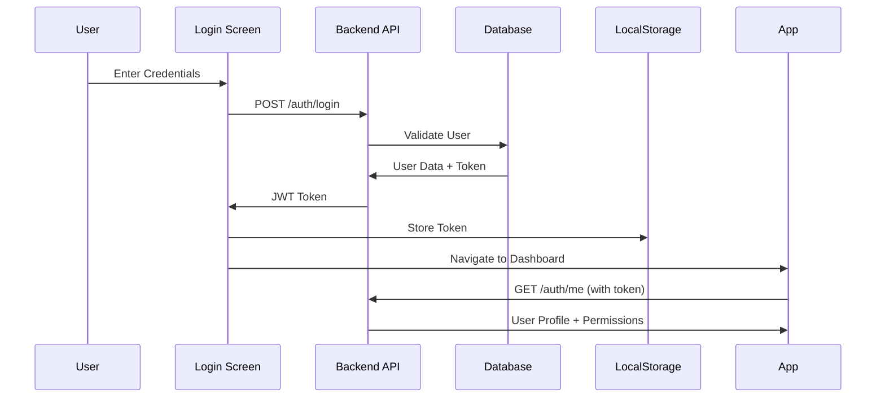
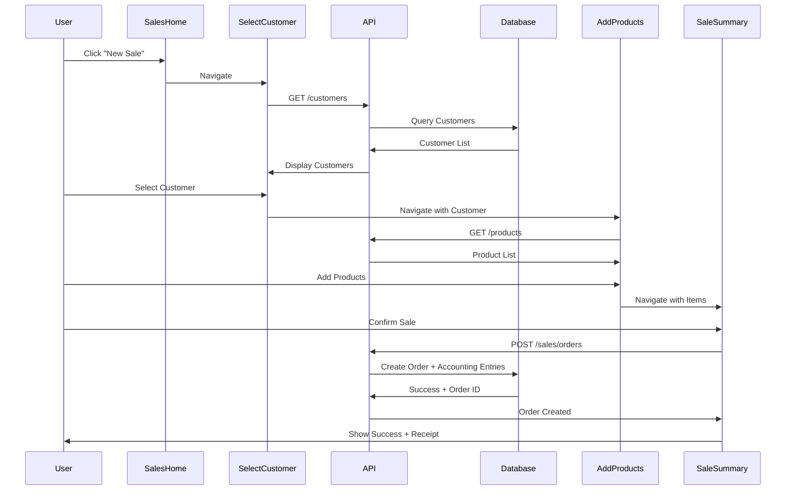

# 🤖 CURSOR AI AGENT SETUP GUIDE
## Main Din Collection - Mobile ERP Integration

---

## 📋 PROJECT OVERVIEW

**Project Name**: Main Din Collection Mobile ERP  
**Version**: 2.0 (Production Ready)  
**Architecture**: React + TypeScript + Tailwind v4  
**Backend Ready**: Yes (API Integration Required)  
**Modules**: 12 Complete Modules (100% Functional)

---

## 🎯 YOUR MISSION (CURSOR AI AGENT)

You are tasked with **connecting this mobile ERP frontend to the existing Main Din Collection backend ERP system**. This is a **production-ready mobile application** that needs to be integrated with the company's live database and API endpoints.

---

## 🏗️ CURRENT ARCHITECTURE

### Frontend (THIS APPLICATION)
```
Mobile ERP App (React + TypeScript)
├── 12 Modules (All Complete)
│   ├── Sales (6-step workflow)
│   ├── Purchase (supplier management)
│   ├── Rental (booking system)
│   ├── Studio (production pipeline)
│   ├── Accounts (double-entry bookkeeping)
│   ├── Expenses (expense tracking)
│   ├── Reports (24+ report types)
│   ├── Contacts (multi-role support)
│   ├── Products (inventory management)
│   ├── Dashboard (analytics)
│   ├── Settings (permissions)
│   └── Profile (user management)
│
├── Mock Data (Currently Used)
│   └── All modules use mock/dummy data
│
└── API Integration Points (Ready)
    └── Need to connect to backend
```

### Backend (MAIN DIN COLLECTION ERP)
```
Existing ERP System
├── Database (SQL/PostgreSQL/MySQL)
├── API Server (Node.js/PHP/Python)
├── Authentication System
├── Business Logic
└── Data Models
```

---

## 🔌 INTEGRATION STRATEGY

### Phase 1: Setup & Configuration (Day 1)
1. **Understand Backend Structure**
   - Get API documentation from Main Din Collection
   - Identify base URL and authentication method
   - Map existing database schema to frontend models

2. **Create API Client**
   - Setup Axios/Fetch configuration
   - Implement authentication headers
   - Create error handling middleware

3. **Environment Variables**
   - Setup `.env` file with backend URL
   - Configure API keys/tokens
   - Set environment-specific settings

### Phase 2: Authentication Integration (Day 1-2)
1. **Replace Mock Login**
   - Connect `/components/LoginScreen.tsx` to backend auth API
   - Implement token storage (localStorage/sessionStorage)
   - Add token refresh logic

2. **User Session Management**
   - Implement role-based access control
   - Store user permissions
   - Handle session expiry

### Phase 3: Data Layer Integration (Day 2-5)
1. **Create API Service Layer**
   - `/services/api/` directory structure
   - Individual service files per module
   - Type-safe API calls

2. **Replace Mock Data**
   - Sales Module → Connect to sales API
   - Purchase Module → Connect to purchase API
   - Rental Module → Connect to rental API
   - Contacts Module → Connect to contacts API
   - Products Module → Connect to inventory API
   - Accounts Module → Connect to accounting API
   - Reports Module → Connect to reports API

3. **Implement Real-time Sync**
   - WebSocket for live updates (if needed)
   - Polling for dashboard data
   - Optimistic UI updates

### Phase 4: Testing & Deployment (Day 5-7)
1. **Integration Testing**
2. **User Acceptance Testing**
3. **Performance Optimization**
4. **Deployment Setup**

---

## 📂 KEY FILES TO MODIFY

### 1. Environment Configuration
```bash
# Create .env file
VITE_API_BASE_URL=https://api.maindincollection.com
VITE_API_VERSION=v1
VITE_AUTH_TOKEN_KEY=mdc_auth_token
```

### 2. API Client Setup
**File**: `/src/services/api/client.ts` (Create this)
```typescript
import axios from 'axios';

const apiClient = axios.create({
  baseURL: import.meta.env.VITE_API_BASE_URL,
  headers: {
    'Content-Type': 'application/json',
  },
});

// Add auth token to requests
apiClient.interceptors.request.use((config) => {
  const token = localStorage.getItem(import.meta.env.VITE_AUTH_TOKEN_KEY);
  if (token) {
    config.headers.Authorization = `Bearer ${token}`;
  }
  return config;
});

export default apiClient;
```

### 3. Authentication Service
**File**: `/src/services/api/auth.service.ts` (Create this)
```typescript
import apiClient from './client';

export const authService = {
  login: async (username: string, password: string) => {
    const response = await apiClient.post('/auth/login', { username, password });
    return response.data;
  },
  
  logout: async () => {
    await apiClient.post('/auth/logout');
    localStorage.removeItem(import.meta.env.VITE_AUTH_TOKEN_KEY);
  },
  
  getCurrentUser: async () => {
    const response = await apiClient.get('/auth/me');
    return response.data;
  },
};
```

### 4. Sales Service
**File**: `/src/services/api/sales.service.ts` (Create this)
```typescript
import apiClient from './client';

export const salesService = {
  getOrders: async (filters?: any) => {
    const response = await apiClient.get('/sales/orders', { params: filters });
    return response.data;
  },
  
  createOrder: async (orderData: any) => {
    const response = await apiClient.post('/sales/orders', orderData);
    return response.data;
  },
  
  getOrderById: async (id: string) => {
    const response = await apiClient.get(`/sales/orders/${id}`);
    return response.data;
  },
  
  updateOrder: async (id: string, data: any) => {
    const response = await apiClient.put(`/sales/orders/${id}`, data);
    return response.data;
  },
};
```

### 5. Update Components to Use API
**Example**: `/components/sales/SalesModule.tsx`

**BEFORE** (Mock Data):
```typescript
const [orders, setOrders] = useState(mockOrders);
```

**AFTER** (API Integration):
```typescript
const [orders, setOrders] = useState([]);
const [loading, setLoading] = useState(true);

useEffect(() => {
  const fetchOrders = async () => {
    try {
      setLoading(true);
      const data = await salesService.getOrders();
      setOrders(data);
    } catch (error) {
      console.error('Failed to fetch orders:', error);
    } finally {
      setLoading(false);
    }
  };
  
  fetchOrders();
}, []);
```

---

## 🗺️ API ENDPOINTS MAPPING

See detailed mapping in `/API_ENDPOINTS.md`

### Expected Backend API Structure:

```
Authentication
├── POST   /api/v1/auth/login
├── POST   /api/v1/auth/logout
├── GET    /api/v1/auth/me
└── POST   /api/v1/auth/refresh

Sales
├── GET    /api/v1/sales/orders
├── POST   /api/v1/sales/orders
├── GET    /api/v1/sales/orders/:id
├── PUT    /api/v1/sales/orders/:id
└── DELETE /api/v1/sales/orders/:id

Purchases
├── GET    /api/v1/purchases/orders
├── POST   /api/v1/purchases/orders
└── ...

Customers
├── GET    /api/v1/customers
├── POST   /api/v1/customers
├── GET    /api/v1/customers/:id
└── PUT    /api/v1/customers/:id

Products
├── GET    /api/v1/products
├── POST   /api/v1/products
├── GET    /api/v1/products/:id
└── PUT    /api/v1/products/:id

Accounts
├── GET    /api/v1/accounts
├── POST   /api/v1/accounts/entries
└── GET    /api/v1/accounts/ledger

Reports
├── GET    /api/v1/reports/sales-summary
├── GET    /api/v1/reports/inventory
├── POST   /api/v1/reports/generate-pdf
└── ...
```

---

## 🔐 AUTHENTICATION FLOW



---

## 📊 DATA FLOW EXAMPLE (Sales Module)



---

## 🛠️ IMPLEMENTATION CHECKLIST

### Step 1: Backend Discovery
- [ ] Get backend API documentation
- [ ] Get API base URL
- [ ] Get authentication mechanism (JWT/Session/API Key)
- [ ] Get sample API responses
- [ ] Map database schema to frontend types

### Step 2: Environment Setup
- [ ] Create `.env` file
- [ ] Add `VITE_API_BASE_URL`
- [ ] Add `VITE_API_VERSION`
- [ ] Add authentication token key
- [ ] Test API connectivity

### Step 3: Create API Layer
- [ ] Create `/services/api/` directory
- [ ] Create `client.ts` (Axios setup)
- [ ] Create `auth.service.ts`
- [ ] Create `sales.service.ts`
- [ ] Create `purchase.service.ts`
- [ ] Create `rental.service.ts`
- [ ] Create `contacts.service.ts`
- [ ] Create `products.service.ts`
- [ ] Create `accounts.service.ts`
- [ ] Create `reports.service.ts`

### Step 4: Update Components
- [ ] Update `LoginScreen.tsx` with real auth
- [ ] Update `Dashboard.tsx` with real data
- [ ] Update `SalesModule.tsx` with API calls
- [ ] Update `PurchaseModule.tsx` with API calls
- [ ] Update `RentalModule.tsx` with API calls
- [ ] Update `ContactsModule.tsx` with API calls
- [ ] Update `ProductsModule.tsx` with API calls
- [ ] Update `AccountsModule.tsx` with API calls
- [ ] Update `ReportsModule.tsx` with API calls

### Step 5: Error Handling
- [ ] Add global error handler
- [ ] Add network error handling
- [ ] Add validation error display
- [ ] Add loading states
- [ ] Add retry logic

### Step 6: Testing
- [ ] Test authentication flow
- [ ] Test each module's CRUD operations
- [ ] Test offline handling
- [ ] Test error scenarios
- [ ] Test on mobile devices
- [ ] Test on tablets

### Step 7: Optimization
- [ ] Add request caching
- [ ] Add optimistic updates
- [ ] Add pagination
- [ ] Add lazy loading
- [ ] Optimize bundle size

### Step 8: Deployment
- [ ] Build production bundle
- [ ] Setup hosting (Vercel/Netlify/Server)
- [ ] Configure environment variables
- [ ] Setup SSL certificate
- [ ] Test production build

---

## 🔍 DEBUGGING TIPS

### Check API Connection
```typescript
// Test in browser console
fetch('https://api.maindincollection.com/health')
  .then(res => res.json())
  .then(data => console.log(data));
```

### Check Authentication
```typescript
// Check if token is stored
console.log(localStorage.getItem('mdc_auth_token'));

// Test authenticated request
fetch('https://api.maindincollection.com/auth/me', {
  headers: {
    'Authorization': `Bearer ${localStorage.getItem('mdc_auth_token')}`
  }
})
.then(res => res.json())
.then(data => console.log(data));
```

### Monitor Network Requests
- Open DevTools → Network tab
- Filter by "Fetch/XHR"
- Check request/response details
- Look for 401/403 (auth errors)
- Look for 500 (server errors)

---

## 📞 SUPPORT & CONTACTS

### For Backend API Questions:
- Contact: Main Din Collection Backend Team
- Documentation: Request API docs
- Postman Collection: Request test collection

### For Frontend Issues:
- Check `/COMPLETE_SYSTEM_DOCUMENTATION.md`
- Check `/BACKEND_INTEGRATION_EXAMPLE.md`
- Check `/API_ENDPOINTS.md`

---

## 🚀 QUICK START (First Steps)

1. **Get Backend URL**
   ```bash
   # Ask: What is the backend API URL?
   # Example: https://api.maindincollection.com
   ```

2. **Test API Connection**
   ```bash
   curl https://api.maindincollection.com/health
   ```

3. **Create .env File**
   ```bash
   VITE_API_BASE_URL=https://api.maindincollection.com
   VITE_API_VERSION=v1
   ```

4. **Install Dependencies** (if not already)
   ```bash
   npm install axios
   ```

5. **Create API Client**
   - Follow structure in this document
   - Start with authentication
   - Test login flow

6. **Integrate One Module First**
   - Start with Sales or Customers
   - Replace mock data with API calls
   - Test thoroughly
   - Repeat for other modules

---

## ⚠️ IMPORTANT NOTES

### Data Consistency
- This app uses **double-entry bookkeeping**
- Every sale/purchase creates accounting entries
- Backend must handle transaction atomicity
- Use database transactions for data integrity

### Permission System
- App has role-based permissions
- Backend should validate permissions
- Frontend shows/hides based on user role
- Backend enforces on API level

### Mobile First
- App is designed for mobile/tablet
- API responses should be optimized
- Consider pagination for large datasets
- Use compression for API responses

### Real-time Updates
- Dashboard shows live data
- Consider WebSocket for real-time updates
- Or implement polling (every 30s)
- Show loading states during refresh

---

## 📦 DELIVERABLES

After integration, you should have:

1. ✅ Working authentication with backend
2. ✅ All 12 modules connected to real data
3. ✅ Reports generating from live database
4. ✅ Dashboard showing real analytics
5. ✅ PDF export working with real data
6. ✅ Multi-branch support (if applicable)
7. ✅ Role-based permissions enforced
8. ✅ Error handling and user feedback
9. ✅ Production-ready deployment
10. ✅ Documentation updated

---

## 🎓 LEARNING RESOURCES

### TypeScript + React
- [React TypeScript Cheatsheet](https://react-typescript-cheatsheet.netlify.app/)

### API Integration
- [Axios Documentation](https://axios-http.com/)
- [React Query](https://tanstack.com/query) (for advanced data fetching)

### Authentication
- [JWT.io](https://jwt.io/) - Understand JWT tokens
- [OAuth 2.0](https://oauth.net/2/) - If using OAuth

---

## 🏁 SUCCESS CRITERIA

Your integration is complete when:

1. ✅ User can login with backend credentials
2. ✅ Dashboard shows real company data
3. ✅ Sales orders save to database
4. ✅ Purchases reflect in inventory
5. ✅ Reports show accurate data
6. ✅ Accounting entries are created correctly
7. ✅ Multi-user support works
8. ✅ Permissions are enforced
9. ✅ App works on mobile devices
10. ✅ Production deployment successful

---

**Good Luck! You're building something amazing for Main Din Collection! 🚀**

---

*Last Updated: February 13, 2026*  
*Version: 2.0*  
*Status: Production Ready - Backend Integration Needed*
