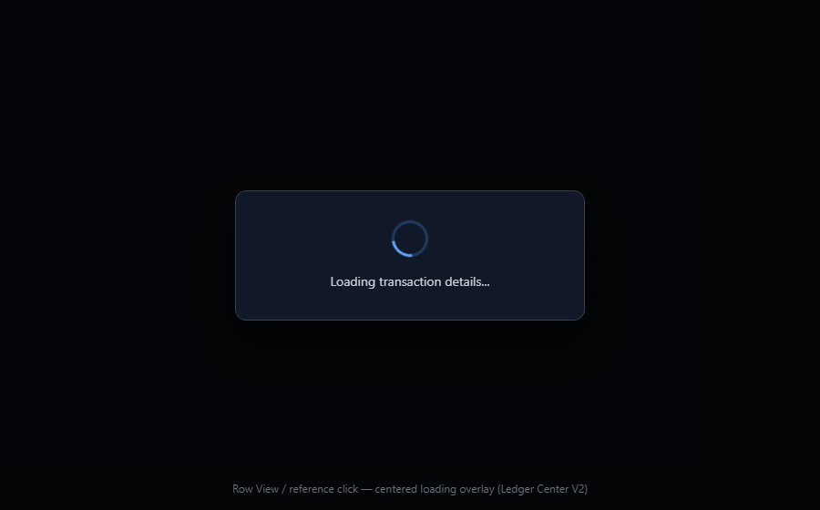
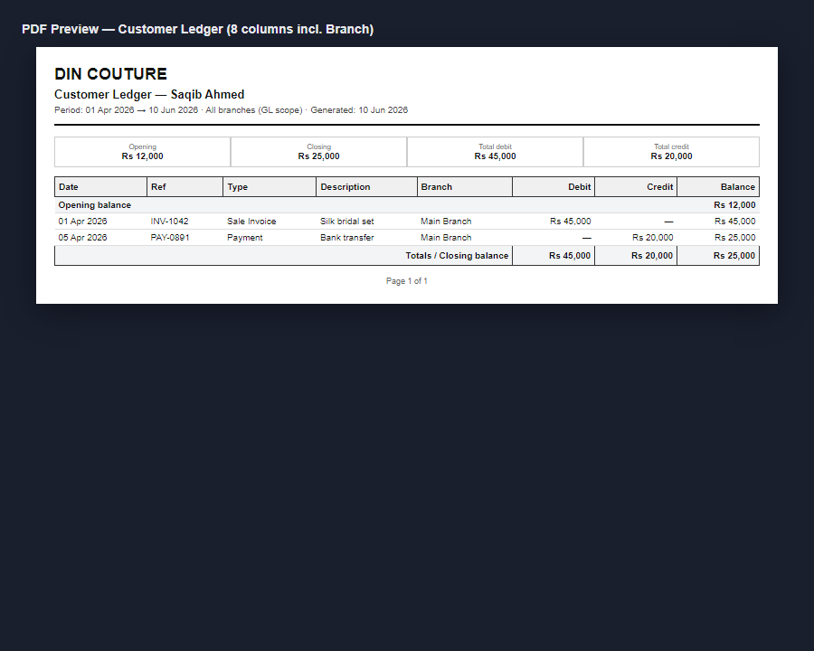

# Ledger Center V2 — Row Actions, WhatsApp, Print Report

**Date:** 2026-06-09  
**Scope:** Reports → Ledger Center V2 only (row interactions + statement print/PDF layout).

---

## Summary

- **Loading overlay:** All row opens (View, reference click, attachments) show a centered “Loading transaction details…” dialog while prefetching; actions are disabled until complete. No blank `TransactionDetailModal` flash.
- **Row actions:** Print removed from row Actions column; duplicate attachment button removed from Actions (attachments stay in **Att.** column). Actions = View + WhatsApp only.
- **WhatsApp:** Rich multi-line message from GL row fields plus optional read-only enrichment (sale, payment, rental, journal).
- **Print/PDF:** Portrait default, **8 columns** (Date, Ref, Type, Description, **Branch**, Debit, Credit, Balance) with opening/closing summary. Payment Method and Created By appear only in landscape optional columns or CSV/Excel export — not in default portrait PDF.

**Official GL balance logic unchanged** — `getLedgerStatementV2` and `accountingService` contracts were not modified.

---

## Files changed

| File | Action |
|------|--------|
| `src/app/services/ledgerStatementCenterV2TransactionOpen.ts` | **New** — `prefetchLedgerRowTransaction()` |
| `src/app/services/ledgerStatementCenterV2WhatsApp.ts` | **New** — `buildLedgerRowWhatsAppMessage()`, `shareLedgerRowViaWhatsApp()` |
| `src/app/features/ledger-statement-center-v2/LedgerRowLoadingOverlay.tsx` | **New** — centered loading dialog |
| `src/app/features/ledger-statement-center-v2/LedgerStatementCenterV2Page.tsx` | Row orchestration, overlay, portrait PDF default |
| `src/app/features/ledger-statement-center-v2/TransactionShareActions.tsx` | Removed Print + duplicate attachment; callbacks only |
| `src/app/features/ledger-statement-center-v2/LedgerTable.tsx` | `rowActionsDisabled`, `onWhatsAppRow` wiring |
| `src/app/features/ledger-statement-center-v2/LedgerReferenceCell.tsx` | `disabled` on reference + attachment buttons |
| `src/app/components/reports/shared/LedgerStatementReportPreview.tsx` | 8-column portrait print layout (Branch included); landscape adds Payment + Created By |
| `src/app/components/settings/printing/ReportExportPreviewPanel.tsx` | Sample preview matches new layout |
| `src/app/components/settings/PrintingSettingsPanel.tsx` | Ledger Statement (V2) default → Portrait (recommended) |
| `src/app/types/printingSettings.ts` | `ledgerReportOrientation` default → `'portrait'` |
| `src/app/components/reports/shared/reportPrintConfig.ts` | `ledger: 'portrait'` |

### NOT touched

- `AccountLedgerReportPage.tsx`
- `accountingService.ts` (contracts)
- `TransactionDetailModal.tsx` (opened only after successful prefetch)
- Migrations, GL posting, triggers, RLS

---

## Sample WhatsApp message (payment row)

```
DIN COUTURE

Transaction Detail
Type: Payment
Ref: PAY-2026-0042
Date: 15 May 2026
Party/Account: Saqib Ahmed
Debit: —
Credit: Rs 25,000.00
Running balance: Rs 1,75,000.00
Payment method: Bank Transfer
Branch: Main
Created by: Admin User
Description: Partial settlement against invoice

Receipt/payment number: PAY-2026-0042
Payment date: 2026-05-15
Amount: 25000
Payment method: bank_transfer
Paid into / from account: HBL Current Account
Related party: Saqib Ahmed
Notes: Received via online transfer

Shared from Ledger Center V2
```

---

## Build / TypeScript

```bash
npx tsc --noEmit
```

- **V2-related files:** No TypeScript errors in `ledger-statement-center-v2/*`, `ledgerStatementCenterV2TransactionOpen.ts`, `ledgerStatementCenterV2WhatsApp.ts`, or `LedgerStatementReportPreview.tsx`.
- **Full project:** Pre-existing errors in unrelated modules (e.g. `settingsService.ts`, `studioProductionService.ts`) — not introduced by this change.

---

## Manual QA checklist

| # | Test | Expected | Result |
|---|------|----------|--------|
| 1 | Click reference number on a row | Centered loader → detail modal with data (no empty flash) | _pending_ |
| 2 | Double-click row actions while loading | Second click ignored (disabled / lock) | _pending_ |
| 3 | Actions column | View + WhatsApp only (no Print) | _pending_ |
| 4 | Att. column | Attachment icon only (no duplicate in Actions) | _pending_ |
| 5 | WhatsApp on payment row | Full message with payment enrichment | _pending_ |
| 6 | Print / PDF preview | Portrait, **8 columns** (incl. Branch), opening + closing rows; no Actions/icons | _code verified — capture screenshot_ |
| 7 | Top ReportActions Print/PDF | Still works (unchanged) | _pending_ |
| 8 | Account Statements page | Unchanged behavior | _pending_ |

---

## Screenshots (placeholders — capture during QA)

### Loading overlay



### Actions column (View + WhatsApp)


### Print preview (portrait 8-column)



> **Note (2026-06-10):** Phase 1 Reports Export Formatting Patch standardized portrait PDF to **8 columns including Branch**. An earlier version of this doc referenced 7 columns without Branch; that spec is superseded.

---

## Graphify

```bash
graphify update .
```

Completed successfully (exit 0) — `graphify-out/` refreshed.
