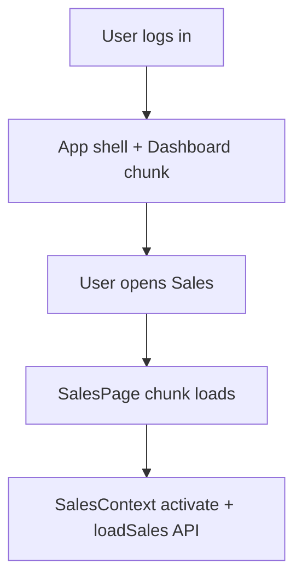

# Web ERP Performance Optimization (June 2026)

**Project:** NEW POSV3 / DIN COUTURE ERP  
**Date:** 2026-06-03  
**Site:** https://erp.dincouture.pk  
**Code commit:** `3736b1be` — `perf(web): aggressive code splitting + lazy loading for fast initial load`

---

## Summary

The mobile ERP app was already fast (save and navigation felt instant). The **web** app felt slow because it downloaded a **single ~3.8 MB JavaScript bundle** on first load and **four large contexts** (Sales, Purchases, Rentals, Expenses) all fetched data from Supabase as soon as the user logged in, even when those modules were not open.

This pass fixes **frontend load time** via code splitting, lazy routes, deferred context loading, and a lighter layout drawer — without changing database schema, RPCs, or business logic.

**موبائل ERP پہلے سے تیز تھا۔ ویب سست تھی کیونکہ ایک بہت بڑا JS bundle اور لاگ اِن کے ساتھ ہی ساری modules کا data load ہو رہا تھا۔ اب صفحات اور data صرف ضرورت پر load ہوتے ہیں۔**

---

## Goals

| Goal | Status |
|------|--------|
| Fast first paint / smaller initial download | Done — main entry ~59 KB |
| No production chunk over 600 KB (Rollup warning limit) | Done |
| Smooth UX while lazy chunks load | Done — global `Suspense` + spinner |
| Defer Sales / Purchases / Rentals / Expenses API until module used | Done — activate-on-first-hook |
| Push to GitHub and deploy VPS | Done (code); this doc completes GitHub documentation |

---

## Before / after metrics

| Metric | Before | After |
|--------|--------|-------|
| Main `index-*.js` chunk | ~3,800 KB | ~59 KB |
| Lazy-loaded route chunks | Few | ~40 pages + drawer forms |
| Context data on login | Sales + Purchases + Rentals + Expenses all fetch | Fetch only when hook first used |
| Build warning “chunk larger than 600 kB” | Yes (monolith) | No |
| Approx. split assets after build | 1 dominant chunk | ~169 chunks |

Largest chunks after optimization (loaded on demand, not on dashboard):

- `vendor-pdf` ~592 KB — PDF export only
- `svc-core` ~548 KB — shared services
- `vendor-recharts` ~432 KB — charts/reports
- `index` layout shell ~309 KB — sidebar/header when app shell loads

---

## Phase 1 — Lazy route imports

**File:** [`src/app/App.tsx`](../src/app/App.tsx)

- Converted remaining **static** page imports to `React.lazy()`.
- Added `GlobalSuspenseFallback` (spinner + “Loading…”).
- Wrapped `<AppContent />` in a global `<Suspense fallback={...}>`.
- POS and pathname-based test/admin routes still work; lazy pages load when navigated.

**Effect:** Dashboard and shell load without pulling Sales, Purchases, Studio, Settings, Reports, etc. into the first download.

---

## Phase 2 — Vendor and app chunk splitting

**File:** [`vite.config.ts`](../vite.config.ts)

`manualChunks` splits:

| Chunk prefix | Contents |
|--------------|----------|
| `vendor-supabase` | `@supabase/*` |
| `vendor-icons` | `lucide-react` |
| `vendor-date` | `date-fns`, `dayjs` |
| `vendor-react` | `react`, `react-dom`, `scheduler` (must stay in one chunk) |
| `vendor-recharts` | `recharts`, `d3-*` |
| `vendor-pdf` | `jspdf`, `html2canvas` |
| `vendor-ui` | `sonner`, `next-themes`, `cmdk` |
| `vendor-state` | `zod`, `zustand` |
| `svc-sales`, `svc-purchases`, `svc-accounting`, … | Large service modules |
| `ctx-sales`, `ctx-accounting`, … | Context providers |
| `app-core` | `lib/`, `hooks/`, `utils/` |
| `app-shared` | Shared UI under `components/shared/` |

`chunkSizeWarningLimit: 600` — build fails the warning threshold if any chunk exceeds 600 KB minified.

---

## Phase 3 — Deferred context data loading

**Files:**

- [`src/app/context/SalesContext.tsx`](../src/app/context/SalesContext.tsx)
- [`src/app/context/PurchaseContext.tsx`](../src/app/context/PurchaseContext.tsx)
- [`src/app/context/RentalContext.tsx`](../src/app/context/RentalContext.tsx)
- [`src/app/context/ExpenseContext.tsx`](../src/app/context/ExpenseContext.tsx)

**Pattern:**

1. `activated` state starts `false`; `loadSales` / `loadPurchases` / `loadRentals` / `loadExpenses` run only when `activated` is true.
2. `activate()` flips activation once.
3. Context value exposes `__activate`; `useSales()`, `usePurchases()`, `useRentals()`, `useExpenses()` call it on first access.

**Accounting:** [`AccountingContext`](../src/app/context/AccountingContext.tsx) still loads when needed for accounting/expense flows (`useAccountingOptional` in Expense). Expense does not need a separate accounting “activate” call because accounting is above Expense in the provider tree and is loaded for settings/GL when required.

**Effect:** Opening the dashboard no longer triggers four heavy list queries in parallel.

---

## Phase 4 — GlobalDrawer lazy forms

**File:** [`src/app/components/layout/GlobalDrawer.tsx`](../src/app/components/layout/GlobalDrawer.tsx)

Lazy-loaded (were static imports, ~750 KB layout chunk before):

- `SaleForm`
- `PurchaseForm`
- `EnhancedProductForm`
- `TransactionForm`
- `PackingEntryModal`

**Effect:** Opening “Add sale” / “Add purchase” from the drawer loads the form chunk only then.

---

## Phase 5 — Build verify, GitHub, VPS deploy

### Local verify

```bash
npm run build
```

Check main entry size:

```bash
npm run build 2>&1 | grep "dist/assets/index-.*\.js"
```

Expect the primary entry around **50–65 KB** (hash in filename changes each build).

### Deploy (already run for `3736b1be`)

On VPS (`dincouture-vps`):

```bash
cd /root/NEWPOSV3 && git pull && bash deploy/deploy.sh
```

Health check:

```bash
curl -s -o /dev/null -w '%{http_code}' https://erp.dincouture.pk/
# Expect: 200
```

Docs-only commits do **not** require redeploy.

---

## Files changed (optimization commit)

| File | Change |
|------|--------|
| `src/app/App.tsx` | Lazy imports, global Suspense |
| `vite.config.ts` | `manualChunks`, 600 KB limit, `vendor-react` + `resolve.dedupe` |
| `src/app/components/layout/GlobalDrawer.tsx` | Lazy drawer forms |
| `src/app/context/SalesContext.tsx` | Activate-on-first-use |
| `src/app/context/PurchaseContext.tsx` | Activate-on-first-use |
| `src/app/context/RentalContext.tsx` | Activate-on-first-use |
| `src/app/context/ExpenseContext.tsx` | Activate-on-first-use |

---

## Office checklist (after deploy)

1. **Hard refresh** on `erp.dincouture.pk` (Ctrl+Shift+R / Cmd+Shift+R) or clear site data once — old service worker may cache mismatched chunks (e.g. old `index` + new `vendor-react-dom` → white screen / `Children` error).
2. Login → **Dashboard** should appear faster; brief spinner when opening Sales / Purchases / Expenses first time is normal.
3. Smoke test: create/view **sale**, **purchase**, **expense**; confirm saves still work.
4. Mobile app unchanged — no APK/IPA update required for this web-only change.

### If you see `Cannot set properties of undefined (setting 'Children')`

Two copies of React loaded (often after deploy with a stale PWA cache):

1. Hard refresh or clear site data for the ERP origin.
2. DevTools → Application → unregister **service worker**, then reload.
3. Confirm production build has **`vendor-react-*.js`** only (no `vendor-react-dom-*.js` in `dist/assets/`). [`vite.config.ts`](../vite.config.ts) uses `resolve.dedupe` for `react` / `react-dom` and keeps both in the `vendor-react` chunk.

---

## کیوں سست تھا / کیا فکس ہوا (office staff)

| مسئلہ | حل |
|--------|-----|
| پہلی بار سائٹ کھولنے پر بہت دیر | اب چھوٹا پہلا bundle؛ باقی صفحات بعد میں load |
| لاگ اِن کے فوراً بعد ہی سستی | اب Sales/Purchase/Rental/Expense data صرف جب وہ module کھولیں |
| ہر کلک پر “Loading” زیادہ | پہلی بار module کھولنے پر ایک بار؛ پھر عام رفتار |

---

## Related documentation

| Doc | Scope |
|-----|--------|
| [FINAL_PERFORMANCE_OPTIMIZATION_REPORT.md](./FINAL_PERFORMANCE_OPTIMIZATION_REPORT.md) | March 2026: permissions cache, pagination, dashboard staged load, DB indexes |
| [ERP_PERFORMANCE_OPTIMIZATION.md](./ERP_PERFORMANCE_OPTIMIZATION.md) | Phase 4 DB indexes |
| [ERP_UI_PERFORMANCE_VALIDATION.md](./ERP_UI_PERFORMANCE_VALIDATION.md) | UI validation notes |

**Mobile:** Capacitor app (`erp-mobile-app/`) — separate bundle; not modified by this web pass.

---

## Architecture (high level)



---

*Document added: 2026-06-03. For questions in office, refer to commit `3736b1be` on `main`.*
