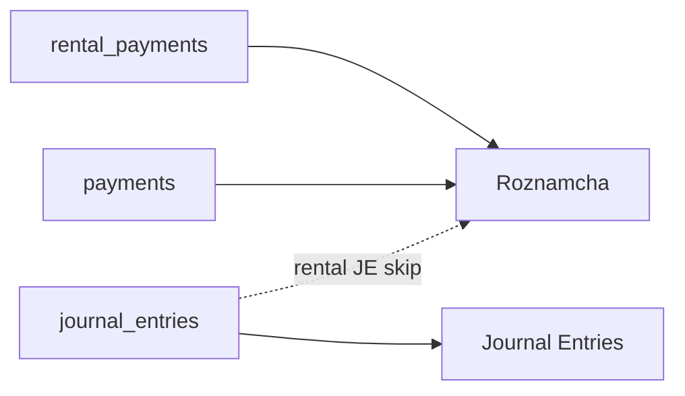

# Rental Payment + Roznamcha Fix — 4 June 2026

**Date:** 2026-06-04  
**Repo:** NEWPOSV3 (`main`)  
**Production:** `erp.dincouture.pk`  
**Commits:** `5e3f056`, `0a634f0`  
**Case:** REN-0002 remaining payment Rs 10,000 — Journal Entries mein **JE-0011** dikhta tha, Roznamcha mein line missing

---

## 1. Masla kya tha (sada alfaz)

ERP ek rental payment ko **teen alag tables** mein rakhta hai:

| Table | Screen |
|-------|--------|
| `journal_entries` | **Journal Entries** (JE-0011) |
| `rental_payments` | **Roznamcha** + Customer Ledger |
| `payments` (optional) | **Roznamcha** (RCV/PAY rows) |

**Roznamcha** sirf **cash / bank / wallet movement** dikhata hai — rental `reference_type=rental` wale JE **jan boojh kar hide** hote hain (duplicate cash line na bane).

Purani payment **Rental screen se delete** karne par:

- `rental_payments` row **hard delete** ho jati thi
- Linked **JE reh jata tha** → Journal Entries mein dikhai deta, Roznamcha khali

Nayi payment (JE-0011) post hone ke baad **do parallel postings** thi:

| Path | Ref | Account | Amount | Date |
|------|-----|---------|--------|------|
| Sahi (canonical) | `REN-0002-PAY` | CASH G140 (`1002`) | 10,000 | 2026-06-04 |
| Duplicate (orphan) | `RCV-0007` | Cash (`1000`) | 10,000 | 2026-06-04 |

Duplicate Roznamcha ko confuse karti thi (alag account, dedupe, branch filter).

---

## 2. Production diagnostic (JE-0011 / REN-0002)

Scripts: [`scripts/oneoff/`](../../scripts/oneoff/)

| Check | Result |
|-------|--------|
| Rental JE-0011 linked to `rental_payments` | Yes — `cc341b16-…` |
| `payment_account_id` | `1c6ee483-…` (CASH G140) |
| `journal_entry_id` | `2655a04a-…` (JE-0011) |
| Rental branch | Main Branch (`cc920703-…`) |
| Orphan `RCV-0007` | Voided + linked JE void |

**Note:** Do alag **JE-0011** numbers company mein maujood hain (inventory opening + rental) — rental wala `reference_type=rental`, `REN-0002` se linked hai.

---

## 3. Production data repair (apply ho chuka)

File: [`scripts/oneoff/repair_je_0011_rental_payment.sql`](../../scripts/oneoff/repair_je_0011_rental_payment.sql)

| Action | Detail |
|--------|--------|
| `rental_payments.reference` | → `REN-0002-PAY` |
| `journal_entries.branch_id` | → rental document branch (JE-0011) |
| Void orphan | `payments` RCV-0007 + us ka JE |

Verify query output (4 Jun 2026):

```
REN-0002-PAY | 10000 | CASH G140 | voided_at NULL
RCV-0007     | voided_at set
```

Migrations (pehle se prod par):

- [`migrations/20260604150000_backfill_rental_payment_reference.sql`](../../migrations/20260604150000_backfill_rental_payment_reference.sql)
- [`migrations/20260604160000_rental_payment_branch_and_link_repair.sql`](../../migrations/20260604160000_rental_payment_branch_and_link_repair.sql)

---

## 4. Code changes

| File | Change |
|------|--------|
| [`src/app/services/rentalService.ts`](../../src/app/services/rentalService.ts) | `deletePayment`: void linked JE + orphan `payments`; soft `voided_at` on `rental_payments`. `syncRentalPaymentGlLink`: JE link + `payment_account_id` + `REN-*-PAY` ref. `addPayment`: canonical ref over free-text notes. |
| [`src/app/context/AccountingContext.tsx`](../../src/app/context/AccountingContext.tsx) | After rental GL post → `syncRentalPaymentGlLink` |
| [`src/app/components/shared/UnifiedPaymentDialog.tsx`](../../src/app/components/shared/UnifiedPaymentDialog.tsx) | Same sync after payment |
| [`src/app/services/roznamchaService.ts`](../../src/app/services/roznamchaService.ts) | Branch inherit, dedupe safety, `REN-*-PAY` canonical ref |
| [`src/app/lib/rentalPaymentRef.ts`](../../src/app/lib/rentalPaymentRef.ts) | Shared `REN-{booking}-PAY` helper |
| [`docs/infra/ROZNAMCHA_CASH_BOOK.md`](../../docs/infra/ROZNAMCHA_CASH_BOOK.md) | Roznamcha read-path rules |

---

## 5. Deploy

| Step | Status |
|------|--------|
| `git push origin main` | Done |
| VPS `bash deploy/deploy.sh` | Done — **ERP running** |
| Build fix (`unifiedTransactionEdit.ts` export) | Commit `0a634f0` |

---

## 6. Roznamcha mein 10,000 ab bhi na dikhe — checklist

Database mein row **maujood hai** (repair ke baad verify). Agar UI mein nahi dikhe:

1. **Hard refresh:** Ctrl+F5 (purana JS cache)
2. **Header date filter:** Range mein **2026-06-04** hona chahiye  
   - Accounting → Roznamcha → Filters → dekhein: `Header: YYYY-MM-DD → YYYY-MM-DD (active)`  
   - Agar galat range ho → **Custom start / end (override)** ON karein → **4 Jun 2026** select karein
3. **Branch:** Top header → **All Branches** (ya **Main Branch**)
4. **Liquidity:** **All** (sirf Cash/Bank filter na lagayein)
5. **Ledger account filter:** **All accounts** (agar sirf `Cash 1000` select hai to **CASH G140** line hide ho sakti hai)
6. Dikhna chahiye: **REN-0002-PAY**, Cash In **10,000**, Account **CASH G140**, Customer **Inayat**

**Journal Entries** mein JE-0011 rehna normal hai — Roznamcha mein **REN-0002-PAY** dekhein, JE primary ref nahi.

---

## 7. Architecture (yaad rakhein)



---

## 8. Agla step (agar ab bhi missing ho)

1. Screenshot bhejein: Roznamcha filters (date, branch, account) + table
2. Browser console (F12) → Network → koi `rental_payments` query error?
3. Agent run kare: `scripts/oneoff/verify_ren_0002_roznamcha.sql` on VPS

---

## Related docs

- [`docs/infra/ROZNAMCHA_CASH_BOOK.md`](../infra/ROZNAMCHA_CASH_BOOK.md)
- [`GIT_WORKFLOW_RULES.txt`](../../GIT_WORKFLOW_RULES.txt) — GL/migration lockdown
