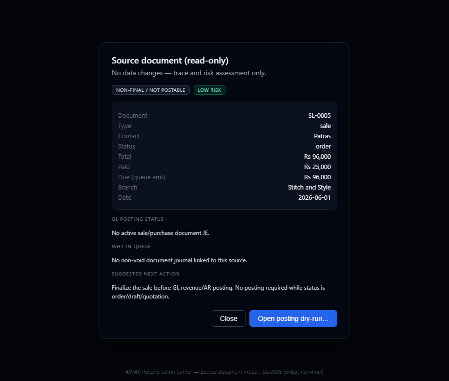
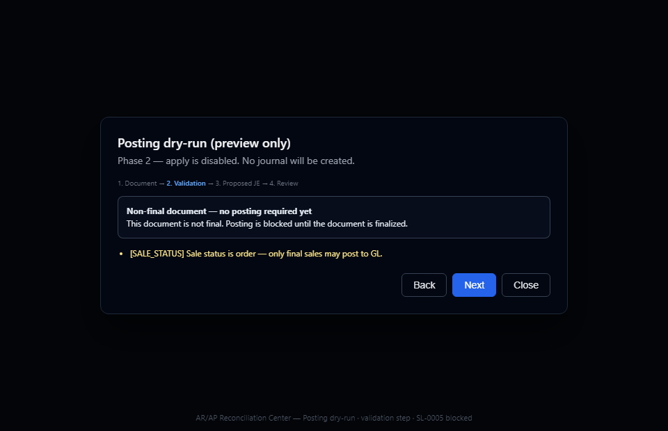
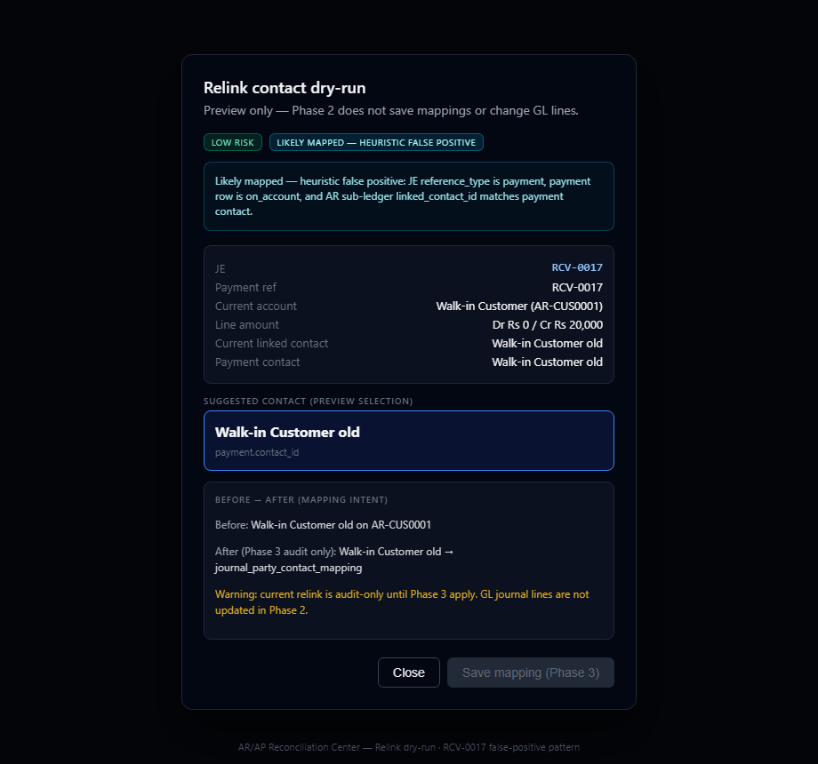
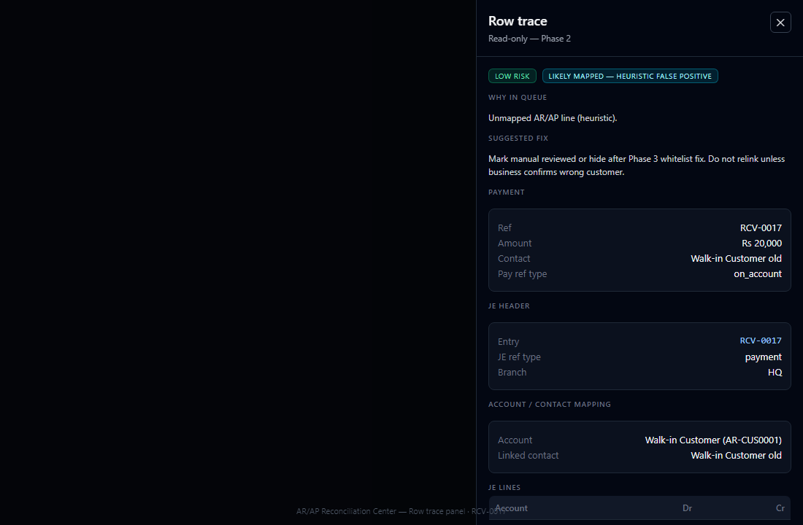

# AR/AP Reconciliation Center — Phase 2 Safe UI Report

**Date:** 2026-06-11  
**Sign-off:** Accepted and signed off (2026-06-11). Phase 3 not approved.  
**Scope:** Phase 2 only — dry-run UI, trace, permissions, queue labels. **No GL/payment/journal mutations.**

---

## 1. Files changed

| File | Change |
|------|--------|
| `src/app/lib/arApReconciliationAccess.ts` | Role-based page access (none / read_only / dry_run / admin_view) |
| `src/app/lib/arApReconciliationDiagnostics.ts` | Unposted/unmapped heuristics, risk levels, false-positive detection |
| `src/app/lib/arApReconciliationDiagnostics.test.ts` | Unit tests for SL-0005 and RCV false-positive heuristics |
| `src/app/services/arApReconciliationTraceService.ts` | Read-only trace bundles + batch document status fetch |
| `src/app/components/accounting/ar-ap-repair/ArApRepairBadges.tsx` | Risk, postability, false-positive badges |
| `src/app/components/accounting/ar-ap-repair/SourceDocumentDetailModal.tsx` | Source doc + unmapped line detail modals |
| `src/app/components/accounting/ar-ap-repair/PostingDryRunWizard.tsx` | Multi-step posting preview (no apply) |
| `src/app/components/accounting/ar-ap-repair/RelinkDryRunWizard.tsx` | Before/after relink preview (no save) |
| `src/app/components/accounting/ar-ap-repair/StatusChangeModal.tsx` | Status change with required reason |
| `src/app/components/accounting/ar-ap-repair/RowTracePanel.tsx` | Slide-over JE/payment/account trace |
| `src/app/components/accounting/ArApRepairDialogs.tsx` | Phase 2 gates on post/save/execute |
| `src/app/components/accounting/ArApReconciliationCenterPage.tsx` | Wired modals, split queues, permissions banner |

**Not changed (per scope):** migrations, RLS, `accountingService`, Trial Balance, Account Statements, Ledger Center V2.

---

## 2. Screenshots (captured 2026-06-11)

Fixtures use Phase 1 audit sample data (**SL-0005**, **RCV-0017**). Regenerate: `node scripts/capture-ar-ap-phase2-screenshots.mjs`

| # | Screen | File |
|---|--------|------|
| 1 | **Source document modal** |  [`phase2-source-modal.png`](../screenshots/ar-ap-phase2/phase2-source-modal.png) |
| 2 | **Posting dry-run wizard** |  [`phase2-posting-dryrun.png`](../screenshots/ar-ap-phase2/phase2-posting-dryrun.png) |
| 3 | **Relink dry-run wizard** |  [`phase2-relink-dryrun.png`](../screenshots/ar-ap-phase2/phase2-relink-dryrun.png) |
| 4 | **Row trace panel** |  [`phase2-row-trace.png`](../screenshots/ar-ap-phase2/phase2-row-trace.png) |

HTML fixtures: [`docs/screenshots/ar-ap-phase2/fixtures/`](../screenshots/ar-ap-phase2/fixtures/)

---

## 3. Apply buttons disabled / hidden

| Action | Phase 2 behavior |
|--------|------------------|
| Post document to GL | **Disabled** — `PostingDryRunWizard` only; footer shows Phase 3 |
| Save relink mapping | **Disabled** — `RelinkDryRunWizard` shows "Save mapping (Phase 3)" |
| Journal wizard Execute | **Gated** — hidden/disabled unless `ready_to_reverse_repost` or Developer/Super Admin |
| Send to repair queue | **Allowed** — updates review item status only (no GL) |

---

## 4. No GL / payment / journal data changed

Phase 2 UI uses:

- Read-only Supabase `select` / trace helpers
- `validateUnpostedDocumentForPosting` (validation only)
- `upsertArApItemFixStatus` for review workflow notes (review table only)

**Not called from Phase 2 UI paths:** `validateAndPostUnpostedDocument`, `executeReverseRepostWizard`, `saveJournalPartyContactMapping`.

---

## 5. Permission summary

| Role | Access | Dry-run UI | Apply (Phase 3) | Execute bypass |
|------|--------|------------|-----------------|----------------|
| Super Admin | Yes | Yes | No (Phase 2) | Yes |
| Admin / Owner | Yes | Yes | No | No |
| Developer | Yes | Yes | No | Yes |
| Accounting Auditor | Yes (read-only) | No actions | No | No |
| Salesman / Staff / Manager | **Denied** | — | — | — |

Page shows **Access denied** for blocked roles.

---

## 6. Queue behavior vs Phase 1 findings

| Finding | Phase 2 UI |
|---------|------------|
| SL-0005, SL-0006, SL-0012 (order) | Queue **1a** — badge "Non-final / not postable", no posting dry-run CTA |
| Final missing posting | Queue **1b** — posting dry-run available, apply disabled |
| RCV-0017/18/19 false positives | Queue **2b** — "Likely mapped — heuristic false positive", excluded from default repair queue 2 |

---

## 7. Build result

Run locally:

```bash
npm run build
```

Record exit code and any errors below after CI/local run.

| Check | Result |
|-------|--------|
| `npm run build` | **Passed** (exit 0) |
| `vitest` diagnostics tests | **5/5 passed** |

---

## 8. Acceptance checklist

- [x] Source detail modal for queue rows
- [x] Posting dry-run with validation + proposed JE preview
- [x] Non-final orders labeled; not urgent missing posting
- [x] Apply/post disabled or hidden
- [x] Relink dry-run with before/after + false-positive warning
- [x] RCV-style rows in false-positive section
- [x] Row trace panel (JE/payment/account/contact)
- [x] Mark resolved requires reason; stays reviewed if still in SQL view
- [x] Journal wizard execute gated
- [x] Salesman cannot access page
- [x] No GL/payment/journal apply paths in Phase 2 UI
- [x] Build passes (verify locally)
- [x] Phase 2 report written
- [x] Phase 2 screenshots captured

**Phase 3:** See [`2026-06-11_AR_AP_PHASE3_CONTROLLED_APPLY_PLAN.md`](2026-06-11_AR_AP_PHASE3_CONTROLLED_APPLY_PLAN.md) — plan only, not started.
