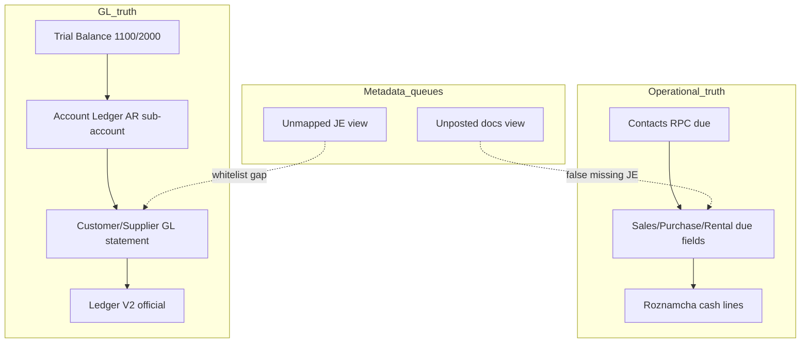

# Financial Trace Center — Phase 1 Diagnostic Plan (Read-Only)

**Date:** 2026-06-12  
**Status:** Phase 1 — diagnosis only  
**Branch baseline:** `483255e7` (AR/AP Phase 2.1 safe state on VPS)  
**Local note:** `main` may be ahead of VPS baseline — confirm deploy SHA before comparing production SQL output.

---

## 1. Purpose

Trace **why numbers differ** across financial surfaces without changing GL, payments, journals, rentals, contacts, or mappings.

| Allowed | Forbidden |
|---------|-----------|
| Read-only SQL (`SELECT`, views, RPCs that only read) | `INSERT` / `UPDATE` / `DELETE` |
| Code-path documentation | AR/AP Phase 3 apply / relink / reverse |
| UI comparison on test company | Audit migration, apply tokens, `begin_apply` / `commit_apply` |
| Marking rows as “explained” in this doc | Typed confirmation apply buttons |
| | `developer_repair_audit` writes |

---

## 2. Surfaces to trace (one company, one as-of date)

Use a **single anchor**:

- **Company:** DIN Collection (`597a5292-14c8-4cd8-96bd-c61b5a0d8c92` unless office uses another)
- **As-of:** `CURRENT_DATE` or fiscal year end under review
- **Branch:** run **all branches** first; repeat per branch only when variance is branch-scoped

| # | Surface | UI path | Canonical service / RPC | Basis |
|---|---------|---------|-------------------------|--------|
| A | **Trial Balance** | Accounting → Trial Balance | `accountingReportsService.getTrialBalance` | GL — `journal_entry_lines` + `journal_entries` (void excluded) |
| B | **Account Ledger** | Accounting → Account Statements → Account | `accountingService.getAccountLedger` | GL — same journal lines, running balance |
| C | **Customer statement** | Accounting → Account Statements → Customer | `accountingService.getCustomerLedger` | GL primary (AR subtree lines) + document enrichment |
| D | **Supplier statement** | Accounting → Account Statements → Supplier | `accountingService.getSupplierApGlJournalLedger` | GL — `get_supplier_ap_gl_ledger_for_contact` RPC |
| E | **Worker statement** | Accounting → Account Statements → Worker | `accountingService.getWorkerPartyGlJournalLedger` | GL — WP/WA accounts |
| F | **Ledger Center V2** | Reports → Ledger Center V2 | `ledgerStatementCenterV2Service.getLedgerStatementV2` | **Official balance = same as C–E** (post 2026-06-09 alignment) |
| G | **Contacts operational** | Contacts list / summary | `get_contact_balances_summary` RPC | Operational due — sales/purchases/rentals/openings |
| H | **AR/AP Integrity Lab** | AR/AP Reconciliation Center | `ar_ap_integrity_lab_snapshot` + views | GL snapshot + exception queues (heuristic) |
| I | **Roznamcha** | Accounting → Roznamcha | `roznamchaService` | Cash/bank **flow** — `payments` + rental cash legs (rental JE headers hidden by design) |
| J | **Source documents** | Sales / Rentals / Purchases detail | `sales`, `purchases`, `rentals`, `payments`, `rental_payments` | Operational truth + links to JEs |

**Policy reference:** [`BALANCE_SOURCE_POLICY.md`](./BALANCE_SOURCE_POLICY.md), [`REPORTING_RECONCILIATION.md`](./REPORTING_RECONCILIATION.md), [`DASHBOARD_BASIS_MAP.md`](./DASHBOARD_BASIS_MAP.md).

---

## 3. Trace workflow (per party or control account)

### Step 1 — Control totals

1. TB row **1100** (AR) and **2000** (AP): `totalDebit`, `totalCredit`, net Dr−Cr.
2. `ar_ap_integrity_lab_snapshot(company, NULL, as_of)` — compare `gl_ar_net`, `gl_ap_net_credit`, queue counts.
3. `get_contact_balances_summary` sum of receivables / payables (operational).

**Expected:** Operational ≠ GL is **informational** until posting is complete; TB and Account Ledger AR sub-totals must agree with party GL statements when scoped the same (all branches, same date).

### Step 2 — Party slice

For one contact (e.g. Inayat, Saqib):

1. Resolve `contacts.id`, `accounts` row where `linked_contact_id = contact` (AR-CUSxxxx).
2. **GL closing balance:** sum `(debit − credit)` on that AR account through as-of (void excluded).
3. **Customer statement closing** from UI or `getCustomerLedger` (same filters: all branches).
4. **Operational due:** row from `get_contact_balances_summary` for that contact.
5. List **source rows:** final sales due, rental `due_amount`, on-account payments not allocated.

### Step 3 — Journal chain

For each payment/receipt in the period:

| Check | Tables |
|-------|--------|
| Payment row | `payments` — `reference_type`, `reference_id`, `contact_id`, `voided_at` |
| Rental parallel | `rental_payments` — `journal_entry_id`, `reference`, `voided_at` |
| JE header | `journal_entries` — `reference_type`, `reference_id`, `payment_id`, `is_void`, `branch_id` |
| JE lines | `journal_entry_lines` — AR leg account, cash leg account |
| AR sub-ledger | `accounts.linked_contact_id` on AR-CUS account |

### Step 4 — Roznamcha vs JE

Roznamcha is **not** a GL reconciliation surface. Trace only:

- Does cash movement appear for the receipt ref (`RCV-*`, `HQ-RCV-*`, `{booking}-PAY`)?
- Is a duplicate `payments` row voided while `rental_payments` remains canonical?
- Branch filter: Roznamcha branch vs JE `branch_id` vs rental `branch_id`.

### Step 5 — Queue explanation (no repair)

| Queue row type | Likely explanation | Repair in Phase 1? |
|----------------|-------------------|-------------------|
| Unposted + `status = order` | No sale JE by design | No — document workflow |
| Unmapped + `on_account` + Walk-in | JE `reference_type=payment` whitelist gap | No — false positive |
| Unmapped + rental payment | JE `payment` vs payment `rental` (RCV-0008 class) | No — metadata review |
| Missing Roznamcha line | Orphan JE / voided `rental_payments` / dedupe | Diagnose only; repairs are separate runbooks |

Use UI heuristics: `src/app/lib/arApReconciliationDiagnostics.ts` (6 unit tests in `arApReconciliationDiagnostics.test.ts`).

---

## 4. Known cases (mandatory Phase 1 workbook)

### Case 1 — Inayat rental / AR issue (REN-0002)

**Symptoms historically:**

- Rs 10,000 rental remaining payment: **JE visible** (Journal Entries) but **Roznamcha** line missing or duplicate cash rows.
- Customer AR / statement vs operational due confusion for Inayat.

**Read-only scripts:**

- [`scripts/sql/diag_sale_payment_ren_0002_crosslink.sql`](../../scripts/sql/diag_sale_payment_ren_0002_crosslink.sql)
- [`scripts/oneoff/diag_ren_0002.sql`](../../scripts/oneoff/diag_ren_0002.sql)
- [`scripts/oneoff/diag_roznamcha_ren_0002_jun4.sql`](../../scripts/oneoff/diag_roznamcha_ren_0002_jun4.sql)

**Doc:** [`2026-06-04_RENTAL_PAYMENT_ROZNAMCHA_FIX.md`](./2026-06-04_RENTAL_PAYMENT_ROZNAMCHA_FIX.md)

**Phase 1 questions to answer:**

| Question | Surfaces |
|----------|----------|
| Canonical cash leg account (CASH G140 vs 1000)? | payments, rental_payments, JE lines |
| Is `rental_payments.voided_at` null for active row? | rental_payments |
| Does AR-CUS for Inayat net to expected after all receipts? | Account Ledger, getCustomerLedger |
| Does Roznamcha show HQ-RCV-0006 / JE-0012 separately from REN-0002-PAY? | Roznamcha UI + payments table |
| Duplicate orphan `RCV-0007` still voided? | payments |

**Do not re-run** [`apply_ren_0002_rental_paid_reconcile.sql`](../../scripts/sql/apply_ren_0002_rental_paid_reconcile.sql) or [`repair_je_0011_rental_payment.sql`](../../scripts/oneoff/repair_je_0011_rental_payment.sql) in Phase 1.

---

### Case 2 — Saqib RCV-0008 metadata review

**Classification:** B — mapped financially; metadata only ([`2026-06-11_AR_AP_SAQIB_RCV0008_DIAGNOSTIC.md`](./2026-06-11_AR_AP_SAQIB_RCV0008_DIAGNOSTIC.md)).

**Script:** [`scripts/sql/diag_ar_ap_saqib_rcv0008.sql`](../../scripts/sql/diag_ar_ap_saqib_rcv0008.sql)

**Phase 1 questions:**

| Field | Expected finding |
|-------|------------------|
| Payment `reference_type` | `rental` → REN-0004 |
| JE `reference_type` | `payment` → unmapped heuristic |
| AR-CUS0060 net | 0 after penalties |
| `payments.contact_id` | NULL (metadata gap) |
| Phase 3 relink | **Not recommended** |

UI: Phase 2.1 queue **2c metadata review** — `isLikelyRentalPaymentMetadataReview()` in diagnostics module.

---

### Case 3 — Walk-in payment false-positive rows (RCV-0017/18/19)

**Baseline audit:** [`2026-06-11_AR_AP_CENTER_BASELINE_AUDIT.md`](./2026-06-11_AR_AP_CENTER_BASELINE_AUDIT.md) §3.

**Script section:** [`diag_ar_ap_center_baseline_audit.sql`](../../scripts/sql/diag_ar_ap_center_baseline_audit.sql) sections F–H.

**Pattern:**

- `payments.reference_type = on_account`
- JE `reference_type = payment` (not on AR whitelist)
- AR posted to **AR-CUS0001 Walk-in** correctly via sub-ledger `linked_contact_id`
- Queue shows **unmapped** — heuristic false positive

**UI:** `isLikelyPaymentOnAccountFalsePositive()` → risk **low**, suggest mark reviewed / whitelist fix later.

---

### Case 4 — Non-final sale orders in AR/AP unposted queue (SL-0005, SL-0006, SL-0012)

**Pattern:**

- `sales.status = order` (not `final`)
- Partial payments may exist; **no sale document JE**
- `v_ar_ap_unposted_documents` flags “no sale JE” regardless of status
- Posting wizard **blocks** via `canPostAccountingForSaleStatus('order')` === false

**Phase 1 conclusion template:** “Queue label misleading — root cause is **commercial status**, not missing GL repair.”

**UI:** `diagnoseUnpostedRow()` → **Non-final / not postable**, risk **low**.

---

## 5. Divergence taxonomy (label every gap)

| Code | Name | Example | Phase 1 action |
|------|------|---------|----------------|
| **D1** | Basis mix | Compare TB AR to Contacts operational without label | Document; fix labels only in later UX phase |
| **D2** | Non-final document | Order sale in unposted queue | Explain; finalize sale is business workflow |
| **D3** | Metadata whitelist | JE `payment` vs `on_account` / `rental` | Explain; no GL change |
| **D4** | Dual-stream rental | `rental_payments` + `payments` same JE | Trace canonical ref; Roznamcha dedupe |
| **D5** | Orphan / void chain | JE alive, rental_payments deleted/voided | Diagnose; separate repair runbook |
| **D6** | Branch scope | Single-branch TB vs all-branch statement | Re-run with `STATEMENT_ALL_BRANCHES_SCOPE` |
| **D7** | True GL mismatch | Wrong AR account or unbalanced JE | Escalate — still no Phase 1 repair; flag for controlled Phase 3+ |

---

## 6. Code map (read-only reference)

| Module | File |
|--------|------|
| Trial Balance | `src/app/services/accountingReportsService.ts` → `getTrialBalance`, `getArApGlSnapshot` |
| Account / party GL | `src/app/services/accountingService.ts` → `getAccountLedger`, `getCustomerLedger`, supplier/worker GL helpers |
| Ledger V2 | `src/app/services/ledgerStatementCenterV2Service.ts` |
| Operational contacts | `src/app/services/contactService.ts` → `getContactBalancesSummary` |
| Customer operational API | `src/app/services/customerLedgerApi.ts` (V2 diagnostic toggle only) |
| AR/AP queues | `src/app/services/arApReconciliationCenterService.ts` |
| Queue heuristics | `src/app/lib/arApReconciliationDiagnostics.ts` |
| Roznamcha | `src/app/services/roznamchaService.ts` |
| Posting gates | `src/app/lib/postingStatusGate.ts` |
| V2 vs Statements doc | [`LEDGER_V2_VS_ACCOUNT_STATEMENTS_DATA_SOURCES.md`](./LEDGER_V2_VS_ACCOUNT_STATEMENTS_DATA_SOURCES.md) |

---

## 7. Phase 1 deliverables checklist

| Item | Path | Status |
|------|------|--------|
| Diagnostic plan (this doc) | `docs/accounting/2026-06-12_FINANCIAL_TRACE_PHASE1_DIAGNOSTIC_PLAN.md` | Done |
| Read-only SQL workbook | `scripts/sql/diag_financial_trace_phase1.sql` | Done |
| Case 1 workbook rows filled | Inayat / REN-0002 SQL output pasted in office log | Office |
| Case 2 Saqib confirm still class B | Re-run diag script on prod | Office |
| Case 3–4 queue rows classified D2/D3 | AR/AP baseline counts unchanged | Office |
| TB vs AR-CUS subledger tie-out | Section A of SQL script | Office |
| Sign-off: no Phase 3 started | QA / office note | Office |

---

## 8. Phase 2 boundary (explicitly out of scope)

Do **not** start until Phase 1 sign-off and separate approval:

- Financial Trace Center **UI** (unified trace panel)
- Automated cross-surface diff RPC
- AR/AP Phase 3 apply flows ([`2026-06-11_AR_AP_PHASE3_CONTROLLED_APPLY_PLAN.md`](./2026-06-11_AR_AP_PHASE3_CONTROLLED_APPLY_PLAN.md))
- Any migration touching `journal_party_contact_mapping`, `developer_repair_audit`, or apply tokens

---

## 9. Suggested office session order (~90 min)

1. Run `scripts/sql/diag_financial_trace_phase1.sql` on VPS (read-only).
2. Record TB AR/AP nets + operational sums (Section 1).
3. Run Inayat block (Section 2) — compare to Roznamcha UI same date range.
4. Re-run Saqib block (Section 3) — confirm still metadata-only.
5. Walk-in block (Section 4) — confirm false-positive class.
6. Order-sale block (Section 5) — confirm non-final class.
7. Web UI: Account Statements vs Ledger V2 for **one** customer (Saqib) — closing balance must match.
8. File findings in `docs/flutter-migration/QA_SESSION_LOG.md` or new `FINANCIAL_TRACE_PHASE1_RESULTS.md` (optional, office).

---

*Phase 1 complete when every known case has a taxonomy code (D1–D7) and no unexplained GL mismatch remains — repairs are a later phase.*
