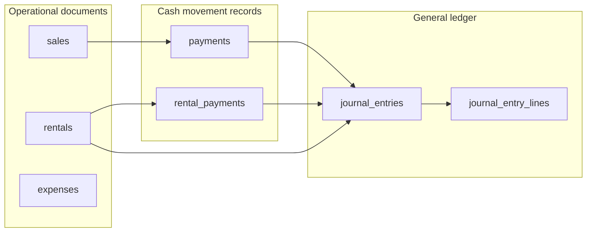
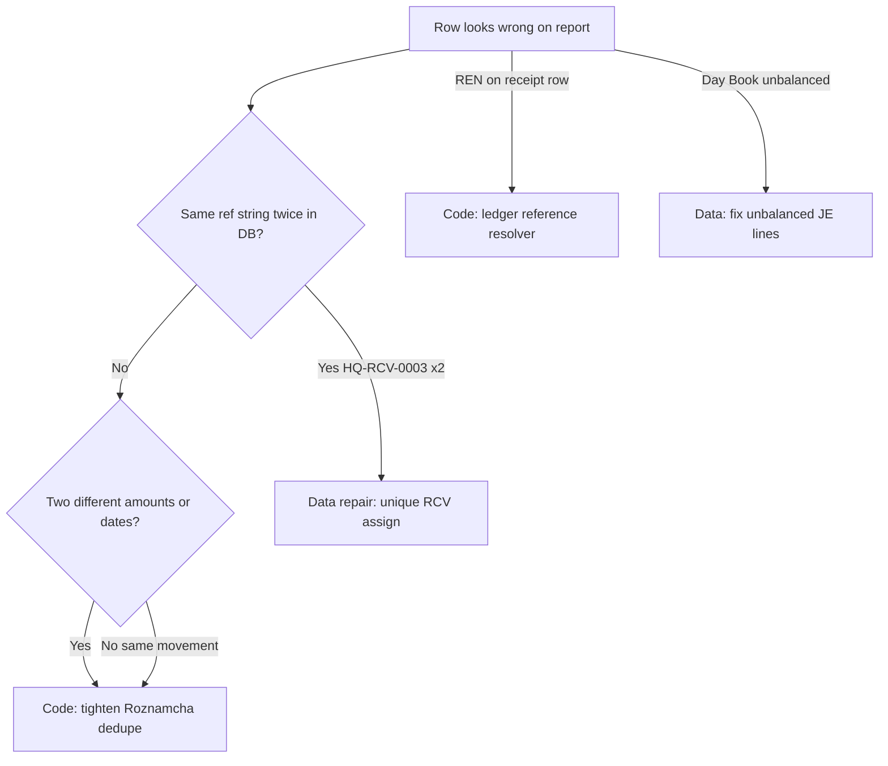

# Accounting reports — study index

Deep-dive documentation for three reports in **Accounting Dashboard** (`AccountingDashboard.tsx`). Use these files to understand **where data comes from**, **why rows duplicate or disappear**, and **what to fix in Phase 2** — without changing GL posting rules in this documentation pass.

---

## Reports map

| Report | UI tab | Component | Service / loader | Primary tables |
|--------|--------|-----------|------------------|----------------|
| **Roznamcha** (Daily Cash Book) | Roznamcha | [`RoznamchaReport.tsx`](../../src/app/components/reports/RoznamchaReport.tsx) | [`getRoznamcha`](../../src/app/services/roznamchaService.ts) | `payments`, `rental_payments`, `journal_entries` (liquidity only) |
| **Day Book** (Journal) | Day Book | [`DayBookReport.tsx`](../../src/app/components/reports/DayBookReport.tsx) | Direct Supabase query in component | `journal_entries`, `journal_entry_lines`, `accounts` |
| **Account Statement** | Account Statements / Ledger | [`AccountLedgerReportPage.tsx`](../../src/app/components/reports/AccountLedgerReportPage.tsx) | [`accountingService.getCustomerLedger`](../../src/app/services/accountingService.ts) (+ GL paths) | `journal_entry_lines`, `payments`, `sales`, `rentals`, `rental_payments` |

### Deep-dive documents

1. [**Roznamcha — data sources & duplicates**](ROZNAMCHA_DATA_SOURCES_AND_DUPLICATES.md) — cash in/out only; duplicate row root causes
2. [**Day Book — data sources & unbalanced JEs**](DAY_BOOK_DATA_SOURCES_AND_UNBALANCED.md) — full GL lines; JE-0188 / JE-0189 ₨2,000 banner
3. [**Account Ledger — references & missing payments**](ACCOUNT_LEDGER_DATA_SOURCES_AND_REFERENCES.md) — REN vs RCV ref column; advance receipts not showing
4. [**Customer vs Account — import gap**](CUSTOMER_STATEMENT_VS_ACCOUNT_IMPORT_GAP.md) — Customer empty / Account full after journal imports; no matcher widen; repair audit SQL
5. [**List pagination — shipped vs remaining**](LIST_PAGINATION_REMAINING_TASKS_2026-07-15.md) — Ledger V2 / shared pager default 50; next waves for other statement lists

---

## Shared data model

| Table | Role | Typical ref on row |
|-------|------|-------------------|
| `payments` | Canonical payment row (sale, purchase, rental mirror, manual receipt) | `RCV-*` (received), `PAY-*` (paid) |
| `rental_payments` | Rental customer collections (may exist without `payments` row) | `RCV-*` / `HQ-RCV-*` or legacy `REN-*-PAY` |
| `journal_entries` | Posted GL voucher | `entry_no` = `JE-*`, `JV-*`, `FT-*`, or mirrors `RCV-*` / `PAY-*` on payment posting |
| `rentals` | Rental booking document | `booking_no` = `REN-*` (invoice/charge — **not** receipt ref) |

**Rule of thumb**

- **Receipt ref** (customer paid cash) → `RCV-*` / `HQ-RCV-*` from `payments.reference_number` or `rental_payments.reference`
- **Rental booking ref** (customer owes for rental) → `REN-*` on **debit/charge** lines only
- **Journal audit ref** → `JE-*` subtitle when linked; not the primary receipt label on Roznamcha

---

## Glossary

| Term | Meaning |
|------|---------|
| **Roznamcha** | Daily cash book — one row per **actual** cash/bank/wallet movement (receive or pay). Not full GL. |
| **Day Book** | Journal day book — one row per **journal line** (debit or credit on any account). |
| **Account Statement** | Party or GL account ledger — running balance of debits/credits for customer, supplier, worker, or COA account. |
| **Liquidity account** | Cash, bank, or wallet COA used for physical money movement (codes ~1000, bank types, etc.). |
| **Synthetic row** | Statement line built from `sales` / `payments` / `rentals` when no matching journal line exists in range. |
| **Effective max (numbering)** | Company-wide numeric suffix for RCV/PAY/EXP — prefix change must not reset. See [`UNIFIED_NUMBERING_ARCHITECTURE.md`](../UNIFIED_NUMBERING_ARCHITECTURE.md). |
| **Entity dedupe** | Roznamcha pass that collapses rows sharing same `rental_payment_id` or `journal_entry_id`. |
| **Loose dedupe** | Roznamcha pass that merges same `date + direction + amount` even if accounts differ — can hide real rows. |

---

## Roznamcha vs Day Book vs Account Statement

| Question | Roznamcha | Day Book | Account Statement |
|----------|-----------|----------|-------------------|
| What does one row mean? | One cash movement | One GL line | One ledger line (often AR/AP line) |
| Rental Rs 10k received | One Cash In (RCV ref) | May show cash line + AR line + linked JE lines | Credit on customer AR (payment) |
| Shows invoice total? | No — payment amount only | Yes — revenue/AR lines | Yes — sale/rental charge debits |
| Duplicate risk | payments + rental_payments + orphan JE recovery | Same JE appears as multiple lines | GL line + synthetic payment row |
| Date filter field | `payment_date` (+ JE `entry_date` fallback for rentals) | `journal_entries.entry_date` | `entry_date` + synthetic `payment_date` / `booking_date` |
| Voided rows | Optional toggle | **Not filtered** in main query | Filtered via `is_void` on nested JE |

---

## When to fix data vs code

| Symptom | Likely layer | First action |
|---------|--------------|--------------|
| Same RCV ref on two Roznamcha rows, same amount/date | DB duplicate refs or two sources | SQL: duplicate refs; then dedupe logic |
| Roznamcha missing Rs 10k rental | Date/branch filter or loose dedupe | Check `rental_payments` + filters in Roznamcha doc |
| Day Book ₨2,000 difference | Unbalanced `journal_entry_lines` | SQL per voucher; Integrity Lab |
| Statement shows `REN-0001` on payment | `getCustomerLedger` preferredRef | Ledger doc — use `RCV-*` for credits |
| Advance on draft sale not on statement | Sales RPC `final` only | Ledger doc — synthetic payment path |

---

## Related SQL & docs

| Resource | Purpose |
|----------|---------|
| [`scripts/sql/repair_branch_prefix_sequence_reset.sql`](../../scripts/sql/repair_branch_prefix_sequence_reset.sql) | Manual repair duplicate RCV refs after branch-prefix sequence reset |
| [`docs/audit/manual_entry_roznamcha_gap.sql`](../audit/manual_entry_roznamcha_gap.sql) | Roznamcha gaps for manual entries |
| [`docs/audit/roznamcha_worker_payment_gap.sql`](../audit/roznamcha_worker_payment_gap.sql) | Worker payment visibility |
| [`docs/audit/report_source_reconciliation.sql`](../audit/report_source_reconciliation.sql) | Cross-report reconciliation |
| [`docs/infra/ROZNAMCHA_CASH_BOOK.md`](../infra/ROZNAMCHA_CASH_BOOK.md) | Short Roznamcha policy |
| [`docs/accounting/2026-06-04_RENTAL_PAYMENT_ROZNAMCHA_FIX.md`](2026-06-04_RENTAL_PAYMENT_ROZNAMCHA_FIX.md) | Rental RCV Roznamcha fix history |

---

## User-reported symptoms (summary)

Collected from production review — details in each report:

- **Roznamcha:** duplicate lines for same rental receipt; missing Rs 10,000 line
- **Day Book:** unbalanced banner ₨2,000 — vouchers JE-0188, JE-0189
- **Account Statement:** reference `REN-0001` on payment row (should be `RCV-*`); some received payments not visible; advance on non-final orders should still show receipt

---

## Out of scope (all reports)

- Changing GL double-entry posting rules
- Changing void/delete semantics
- Blind mass rewrite of `payments.reference_number`
- Stripping `HQ-` from historical refs without collision analysis

Phase 2 implementation should be scoped per report after you review these study files.
