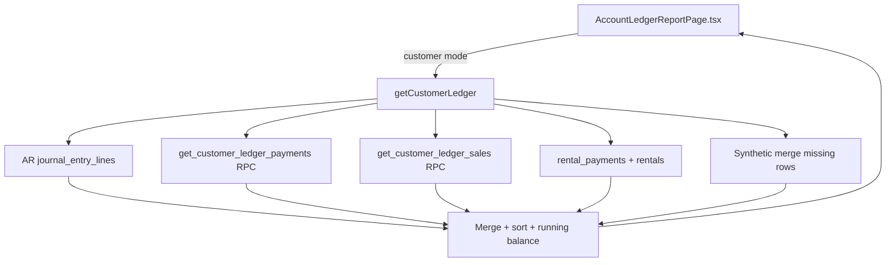

# Account Ledger — data sources, references & missing payments

**UI:** Accounting → **Account Statements** / **Account Ledger**  
**Component:** [`AccountLedgerReportPage.tsx`](../../src/app/components/reports/AccountLedgerReportPage.tsx)  
**Service:** [`accountingService.getCustomerLedger`](../../src/app/services/accountingService.ts) (~2509+); GL mode via `getAccountLedger`

See also: [index](ACCOUNTING_REPORTS_INDEX.md) · [Roznamcha RCV fix](2026-06-04_RENTAL_PAYMENT_ROZNAMCHA_FIX.md) · [`rentalPaymentRef.ts`](../../src/app/lib/rentalPaymentRef.ts)

---

## 1. Purpose

Account Statement shows a **running ledger** for a customer, supplier, worker, or GL account: debits (charges) and credits (payments) with reference, module, and balance.

This document explains **why Reference shows `REN-0001` instead of `RCV-0006`**, **why some received payments are missing**, and **how advance receipts on non-final sales fall through the cracks**.

---

## 2. User-reported symptoms

- Reference column shows **`REN-0001`** on a payment row; should show **`RCV-0006`** (or `HQ-RCV-*`)
- **`RCV-0006`** displays correctly on some rows — inconsistent ref resolution
- **Payments received** not appearing on customer statement
- **Advance on unfinalized order** — customer paid but sale not `final`; receipt should still show

---

## 3. UI → service → database flow



**GL account mode** uses `getAccountLedger` / journal lines on selected COA account — different path, same JE line grain.

---

## 4. Tables & columns

| Source | Tables | Statement role |
|--------|--------|----------------|
| Journal AR lines | `journal_entries`, `journal_entry_lines`, `accounts` | Primary debits/credits on AR subtree |
| Sales | `sales` | Invoice debits; drives payment RPC scope |
| Payments | `payments` | Receipt credits via RPC + synthetic merge |
| Rentals | `rentals` | Rental charge debits (`REN-*`) |
| Rental payments | `rental_payments` | Rental receipt credits |
| Manual / on-account | `payments` (`manual_receipt`, on_account) | Extra queries |

**UI Reference column** maps to `AccountLedgerEntry.reference_number` (~3080), rendered in `AccountLedgerReportPage.tsx`.

---

## 5. Filters

| Filter | Effect |
|--------|--------|
| Date range | `entry_date` on journal lines; synthetic rows use `invoice_date` / `payment_date` / rental dates |
| Branch | `ledgerBranch` passed to sales/rental RPCs |
| View mode | Effective vs Audit — reversals / presentation (~AccountLedgerReportPage) |
| `glJournalOnly` | Skips synthetic sales/payment/rental merge |
| Customer | AR account subtree + `customer_id` linkage on sales/payments |

---

## 6. Reference / display rules

### Journal-built rows — `preferredRef` order

```3027:3035:src/app/services/accountingService.ts
        const preferredRef =
          (normalizedRefType === 'sale' && sale?.invoice_no ? String(sale.invoice_no) : '') ||
          ((normalizedRefType === 'manual_receipt' || normalizedRefType === 'manual_payment') && paymentMeta
            ? paymentMeta.bankTraceId || paymentMeta.referenceNumber
            : '') ||
          (paymentMeta?.referenceNumber || '') ||
          (normalizedRefType === 'rental' && rental?.booking_no ? String(rental.booking_no) : '');
        if (preferredRef) {
          referenceNumber = preferredRef;
        }
```

**Problem pattern:** For `reference_type = rental`, when building from **journal lines**, `rental.booking_no` (`REN-*`) is used in `preferredRef` **even when** `paymentMeta.referenceNumber` would be `RCV-*` — because payment meta is checked **before** rental booking only when `paymentMeta?.referenceNumber` is truthy on the third line, but rental booking overwrites on the fourth line when ref type is rental.

Actually reading again:
- Line 3032: `(paymentMeta?.referenceNumber || '')` — if payment linked, RCV should win
- Line 3033: rental booking only if previous parts empty

**Bug case:** JE has `reference_type = rental` but **no `payment_id`** on header — `paymentMeta` empty → falls through to `rental.booking_no` → **REN-0001 on receipt line**.

Or: credit line from rental payment JE where `payment_id` not set on JE but payment exists separately.

### Synthetic rental payment rows — legacy ref

```3172:3174:src/app/services/accountingService.ts
          items.push({
            date: d,
            reference_number: (rentalsMap.get(p.rental_id)?.booking_no || `RN-${p.rental_id?.slice(0, 8)}`) + `-PAY`,
```

Same pattern in merge path (~3286–3288). Uses **`REN-*-PAY`**, not `rental_payments.reference` (`RCV-*`).

### Correct rule (Phase 2)

| Row type | Reference column |
|----------|------------------|
| **Receipt / credit** | `rental_payments.reference` or `payments.reference_number` → `RCV-*` / `HQ-RCV-*` |
| **Rental charge / debit** | `rentals.booking_no` → `REN-*` |
| **Sale invoice / debit** | `sales.invoice_no` |

Roznamcha already uses `resolveCanonicalRoznamchaRef` + `resolveRentalPaymentDisplay` — ledger not aligned.

---

## 7. Inclusion paths for payments

| Source | Included when |
|--------|----------------|
| Journal AR/cash lines | `arJournalLineMatchesCustomer` + payment_id / reference match |
| `get_customer_ledger_payments` RPC | Payment linked to sale in **customer sales set** |
| On-account / `manual_receipt` | Additional payment queries |
| Rental payments | `rental_payments` query + synthetic if **no** `journal_entry_id` |
| Synthetic `missingPayments` merge | Payment id not already in journal-derived set (~3222–3255) |

### Gap 1 — Advance on non-final sale

[`fetchCustomerLedgerSalesForRange`](../../src/app/services/customerLedgerApi.ts) filters to **`status = final`** in multiple fallbacks (~324, 405, 421, 515).

Flow:

1. Sale is draft / confirmed — not in `saleIds`
2. `get_customer_ledger_payments` RPC scopes to sales in that set
3. Advance payment **not returned**
4. Unless caught by on_account / manual_receipt / direct journal line — **missing on statement**

### Gap 2 — Rental payment with `journal_entry_id`

Synthetic rental credits **skipped**:

```3165:3166:src/app/services/accountingService.ts
        customerRentalPayments.forEach((p: any) => {
          if (p.journal_entry_id) return;
```

Must appear via **GL AR lines**. If line filtered by date/branch, or ref wrong, user thinks payment missing.

### Gap 3 — Payment without JE

`missingPayments` merge (~3242–3255) should add row with `p.reference_number` — works when payment in RPC batch.

### Gap 4 — UI filters

Effective vs Audit, reversal toggles on `AccountLedgerReportPage.tsx` may hide rows without deleting data.

---

## 8. Known failure modes (numbered)

| # | Symptom | Root cause | Code |
|---|---------|------------|------|
| 1 | `REN-*` on payment row | `preferredRef` uses `rental.booking_no` when JE lacks `payment_id` | ~3027–3035 |
| 2 | `REN-*-PAY` on synthetic rental credit | Hardcoded `booking_no + '-PAY'` | ~3174, ~3288 |
| 3 | Payment missing | Sale not `final` → excluded from sales RPC set | `customerLedgerApi.ts` |
| 4 | Rental payment missing | Has `journal_entry_id` — synthetic skipped; GL line not matched to customer | ~3166, ~3280 |
| 5 | Duplicate charge + payment | Journal line + synthetic merge for same economic event | merge logic ~3217+ |
| 6 | `RCV-0006` correct row | Payment path used `paymentMeta.referenceNumber` or synthetic `missingPayments` | ~3248 |

---

## 9. Diagnostic queries

### A — Customer payments vs sales status

```sql
SELECT p.id, p.payment_date, p.amount, p.reference_number, p.reference_type,
       p.reference_id, s.invoice_no, s.status AS sale_status
FROM payments p
LEFT JOIN sales s ON s.id = p.reference_id AND p.reference_type = 'sale'
WHERE p.company_id = :company_id
  AND p.contact_id = :customer_id  -- or customer link column used in your schema
  AND p.payment_date BETWEEN :date_from AND :date_to
  AND p.voided_at IS NULL
ORDER BY p.payment_date;
```

**Look for:** `status != 'final'` on linked sale — explains RPC exclusion.

### B — Rental refs: booking vs receipt

```sql
SELECT r.booking_no, rp.payment_date, rp.amount, rp.reference AS rp_ref,
       rp.journal_entry_id, p.reference_number AS pay_ref
FROM rental_payments rp
JOIN rentals r ON r.id = rp.rental_id
LEFT JOIN payments p ON p.reference_type = 'rental' AND p.reference_id = r.id
  AND p.payment_date = rp.payment_date AND p.amount = rp.amount
WHERE r.company_id = :company_id
  AND r.customer_id = :customer_id
  AND rp.voided_at IS NULL;
```

### C — JE lines for customer AR (rental)

```sql
SELECT je.entry_no, je.entry_date, je.reference_type, je.reference_id,
       je.payment_id, l.debit, l.credit, a.code, a.name
FROM journal_entries je
JOIN journal_entry_lines l ON l.journal_entry_id = je.id
JOIN accounts a ON a.id = l.account_id
WHERE je.company_id = :company_id
  AND je.reference_type = 'rental'
  AND je.entry_date BETWEEN :date_from AND :date_to
  -- narrow by customer via rentals.reference_id join as needed
ORDER BY je.entry_date;
```

### D — Compare statement ref to canonical RCV

```sql
SELECT rp.id, rp.reference, r.booking_no,
       je.entry_no, je.payment_id
FROM rental_payments rp
JOIN rentals r ON r.id = rp.rental_id
LEFT JOIN journal_entries je ON je.id = rp.journal_entry_id
WHERE r.customer_id = :customer_id
  AND rp.reference LIKE '%RCV%';
```

---

## 10. UI column mapping

| UI column | Field | Set by |
|-----------|-------|--------|
| Date | `date` | `entry_date` or synthetic payment/invoice date |
| Reference | `reference_number` | `preferredRef` / synthetic builders |
| Description | `description` | JE description + module merge |
| Debit / Credit | `debit`, `credit` | Line amounts |
| Balance | `running_balance` | Computed after sort |
| Module | `source_module` | sale / Payment / Rental / Accounting |
| Document type | `document_type` | Sale Invoice, Rental Payment, etc. |
| JE link | `journal_entry_id`, `entry_no` | From JE header |
| Settlement account | `account_name` | Payment account or line account |
| Branch | `branch_name` | JE branch or rental/sale fallback |

---

## 11. Roznamcha vs Ledger (reference alignment)

| Report | Rental receipt ref | Status |
|--------|-------------------|--------|
| Roznamcha | `RCV-*` / `HQ-RCV-*` first | Fixed (2026-06-04) |
| Account Statement | Often `REN-*` or `REN-*-PAY` | **Not aligned** |
| Day Book | `JE-*` voucher | Correct for GL audit |

---

## 12. Recommended fix direction (Phase 2)

1. **`preferredRef` for rental credits:** prefer `rental_payments.reference` / linked `payments.reference_number` over `rental.booking_no` on **credit** lines
2. **Synthetic rental payments:** use `rp.reference` or `resolveRentalPaymentDisplay()` — not `booking_no + '-PAY'`
3. **Advance payments:** include payments linked to non-final sales in RPC scope or add explicit on-account/advance query in `getCustomerLedger`
4. **Rental with JE:** ensure AR credit line matches customer filter; or emit synthetic with RCV when journal line exists but ref wrong
5. **Data:** backfill `rental_payments.reference` / `payments.reference_number` where still `REN-*-PAY`

---

## 13. Out of scope

- GL posting rule changes
- Void/delete semantics
- Stripping `HQ-` prefix from historical refs without collision check
