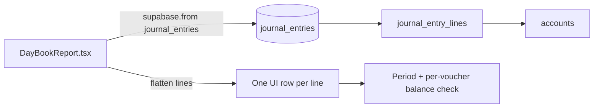

# Day Book — data sources & unbalanced vouchers

**UI:** Accounting → **Day Book** tab  
**Component:** [`DayBookReport.tsx`](../../src/app/components/reports/DayBookReport.tsx)  
**Loader:** Direct Supabase query in component (not `accountingService`)

See also: [index](ACCOUNTING_REPORTS_INDEX.md) · [Roznamcha doc](ROZNAMCHA_DATA_SOURCES_AND_DUPLICATES.md)

---

## 1. Purpose

Day Book is the **journal day book**: every **debit and credit line** posted to the general ledger in the selected period. Unlike Roznamcha, it shows AR, revenue, expense, and all accounts — not only cash movements.

This document explains **where rows come from**, **how balance checks work**, and **how to diagnose JE-0188 / JE-0189** (reported ₨2,000 difference).

---

## 2. User-reported symptoms

- Red banner: **Unbalanced! Difference: ₨ 2,000**
- Listed vouchers: **JE-0188**, **JE-0189**
- Footer row: “Rounding / Unbalanced difference — display-only”

---

## 3. UI → service → database flow



**No intermediate service** — query runs in `useEffect` (~132–156).

---

## 4. Tables & columns

| Table | Role in Day Book |
|-------|------------------|
| `journal_entries` | Voucher header: `entry_no`, `entry_date`, `description`, `reference_type`, `payment_id`, `branch_id`, `is_void` |
| `journal_entry_lines` | One Day Book row per line: `debit`, `credit`, `account_id`, `description` |
| `accounts` | Account name/code on each line |

**Row model:** One UI row = one `journal_entry_lines` row (not one voucher). A balanced JE with 2 lines appears as **2 rows** sharing the same voucher (`entry_no`).

---

## 5. Filters

| Filter | Implementation | Risk |
|--------|----------------|------|
| Date range | `entry_date` between `dateFrom` and `dateTo` | Global header dates or local picker |
| Branch | `journalEntriesBranchOrFilter` — selected branch **or** `branch_id IS NULL` (company-wide JEs) | Same rule as `getAccountLedger` |
| **Limit** | `.limit(500)` on journal **headers** | Large periods may **truncate** — missing lines affect totals |
| Voided | **No `is_void` filter** on main query | Voided vouchers can appear and affect balance banner |
| Audit mode | UI toggle only — same data, different emphasis | Does not change query |

Query excerpt:

```141:156:src/app/components/reports/DayBookReport.tsx
      let q = supabase
        .from('journal_entries')
        .select(`
          id, entry_no, entry_date, description, reference_type, created_at, payment_id, action_fingerprint, economic_event_id,
          lines:journal_entry_lines(id, debit, credit, description, account:accounts(name, code))
        `)
        .eq('company_id', companyId)
        .gte('entry_date', dateFrom)
        .lte('entry_date', dateTo);
      if (branchOrFilter) {
        q = q.or(branchOrFilter);
      }
      const { data, error } = await q
        .order('entry_date', { ascending: true })
        .order('created_at', { ascending: true })
        .limit(500);
```

---

## 6. Reference / display rules

| Column | Source |
|--------|--------|
| **Voucher** | `journal_entries.entry_no` (e.g. `JE-0188`) — clickable when handler provided |
| **Account** | `journal_entry_lines` → `accounts.name` |
| **Description** | JE `description` + line `description`; sale/payment adjustment suffix |
| **Type** | Mapped from `reference_type` (`sale`, `payment`, `rental`, `journal`, etc.) |
| **Debit / Credit** | Direct from line — no `Math.abs()` |

Roznamcha uses operational refs (`RCV-*`); Day Book uses **voucher numbers** (`JE-*`) as primary identifier.

---

## 7. Unbalanced banner — two levels

### Level 1 — Period totals

```329:331:src/app/components/reports/DayBookReport.tsx
  const difference = totalDebit - totalCredit;
  const ROUNDING_TOLERANCE = 0.02;
  const isBalanced = Math.abs(difference) < ROUNDING_TOLERANCE;
```

Sums **all displayed lines** in the period. If `|difference| ≥ 0.02`, red banner shows **Difference: ₨ X**.

### Level 2 — Per voucher

Groups lines by `entry_no` (voucher). Flags vouchers where `|sum(debit) − sum(credit)| ≥ 0.02`:

```347:355:src/app/components/reports/DayBookReport.tsx
  // Analyse: which vouchers are unbalanced (sum of debit - sum of credit per voucher)
  const byVoucher = new Map<string, { debit: number; credit: number }>();
  ...
  const unbalancedVouchers = [...byVoucher.entries()]
```

User sees: `Unbalanced voucher(s): JE-0188, JE-0189`.

### Display-only rounding row ⚠️

```360:361:src/app/components/reports/DayBookReport.tsx
  const adjustmentDebit = difference < -ROUNDING_TOLERANCE ? Math.abs(difference) : 0;
  const adjustmentCredit = difference > ROUNDING_TOLERANCE ? difference : 0;
```

Footer row **“Rounding / Unbalanced difference — display-only”** (~625) makes **footer totals look balanced**. It does **not** fix the database. Underlying JE lines remain wrong until corrected in Journal Entries or Integrity Lab.

---

## 8. Known failure modes

| # | Cause | What user sees |
|---|-------|----------------|
| 1 | **Unbalanced JE in DB** | Period difference + named vouchers (JE-0188, JE-0189) |
| 2 | **Truncation at 500 headers** | Totals wrong or vouchers missing for busy periods |
| 3 | **Voided JE included** | Lines from voided entries still in list (no filter) |
| 4 | **Branch filter** | Company-wide JE (`branch_id` null) still included; branch-only JEs excluded when wrong branch selected |
| 5 | **Partial line load** | Nested `journal_entry_lines` — if RLS or join fails silently, voucher may look unbalanced in UI only |

**JE-0188 / JE-0189 pattern:** Typically one voucher has ₨2,000 more debit than credit (or reverse), or two related vouchers each off by ₨1,000 summing to ₨2,000 in period view.

---

## 9. Diagnostic queries

### A — Voucher balance (primary for JE-0188 / JE-0189)

```sql
SELECT je.entry_no, je.entry_date, je.reference_type, je.is_void,
       SUM(l.debit) AS dr, SUM(l.credit) AS cr,
       SUM(l.debit) - SUM(l.credit) AS diff
FROM journal_entries je
JOIN journal_entry_lines l ON l.journal_entry_id = je.id
WHERE je.company_id = :company_id
  AND je.entry_no IN ('JE-0188', 'JE-0189')
GROUP BY je.id, je.entry_no, je.entry_date, je.reference_type, je.is_void;
```

**Look for:** `diff` ≠ 0; `is_void = true` (should exclude from economic reports in future).

### B — Line detail

```sql
SELECT je.entry_no, l.id AS line_id, a.code, a.name,
       l.debit, l.credit, l.description
FROM journal_entries je
JOIN journal_entry_lines l ON l.journal_entry_id = je.id
JOIN accounts a ON a.id = l.account_id
WHERE je.company_id = :company_id
  AND je.entry_no IN ('JE-0188', 'JE-0189')
ORDER BY je.entry_no, l.debit DESC, l.credit DESC;
```

### C — Period-wide imbalance (matches Day Book banner)

```sql
SELECT SUM(l.debit) AS total_dr, SUM(l.credit) AS total_cr,
       SUM(l.debit) - SUM(l.credit) AS diff
FROM journal_entries je
JOIN journal_entry_lines l ON l.journal_entry_id = je.id
WHERE je.company_id = :company_id
  AND je.entry_date BETWEEN :date_from AND :date_to;
```

Add branch predicate if testing branch-scoped view.

### D — All unbalanced vouchers in range

```sql
SELECT je.entry_no, je.entry_date,
       SUM(l.debit) - SUM(l.credit) AS diff
FROM journal_entries je
JOIN journal_entry_lines l ON l.journal_entry_id = je.id
WHERE je.company_id = :company_id
  AND je.entry_date BETWEEN :date_from AND :date_to
GROUP BY je.id, je.entry_no, je.entry_date
HAVING ABS(SUM(l.debit) - SUM(l.credit)) >= 0.02
ORDER BY je.entry_date;
```

### E — App tooling

- [`getUnbalancedJournalEntries`](../../src/app/services/liveDataRepairService.ts) — Accounting Integrity Lab
- [`docs/audit/report_source_reconciliation.sql`](../audit/report_source_reconciliation.sql)

---

## 10. Roznamcha vs Day Book

| | Roznamcha | Day Book |
|---|-----------|----------|
| Purpose | Cash/bank/wallet in-out | Full GL |
| Grain | One cash movement | One JE line |
| Rental Rs 10k | One row (`RCV-*`) | Cash debit line + AR credit line (+ headers) |
| Balance check | Opening + cash in − cash out = closing | Σ debits = Σ credits (per period and per voucher) |
| JE-0188 issue | Unlikely visible unless liquidity line | **Shows all lines** — imbalance visible |

---

## 11. Recommended fix direction (Phase 2)

1. **Fix data:** correct `journal_entry_lines` for JE-0188 / JE-0189 via Journal Entries editor or repair RPC
2. **Query:** add optional `is_void = false` filter; paginate beyond 500 headers
3. **UI:** distinguish “display rounding” from real balance more clearly (or remove adjustment row when vouchers are named)
4. **Do not** treat footer rounding row as posted GL

---

## 12. Out of scope

- Changing double-entry posting rules
- Auto-posting balancing lines from Day Book UI
- Roznamcha dedupe (separate doc)
