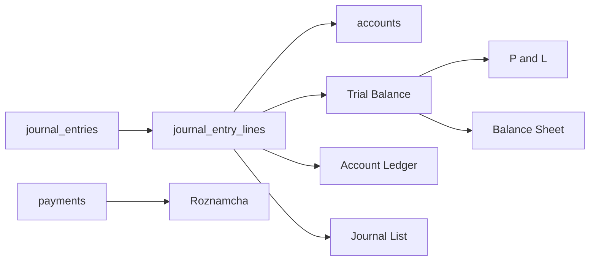

# ERP Reports Module — Execution Blueprint

**Project:** NEWPOSV3  
**Last updated:** 2026-03-27  
**Scope:** Report-by-report behavior, data sources, effective vs audit views, double-count safety, UI expectations.  
**Primary code:** `src/app/services/accountingReportsService.ts`, `accountingService.ts`, report pages under `src/app/components/reports/`.

---

## 1. Global reporting principles

### 1.1 Source of truth (non-negotiable)

| Truth | Tables | Exclusions |
|-------|--------|------------|
| **General ledger balances** | `journal_entry_lines` → `journal_entries` → `accounts` | Rows where `journal_entries.is_void === true` |
| **Roznamcha / cash movement (policy)** | Often `payments` + journal mirror | Per `ROZNAMCHA_POLICY_LOCK.md` |
| **Operational open items** | `sales`, `purchases`, `rentals`, `worker_ledger_entries`, etc. | **Not** the same as GL without reconciliation |

See also: `docs/accounting/REPORTING_RECONCILIATION.md`.

### 1.2 Effective vs audit (definitions)

| Mode | Audience | What it shows |
|------|----------|----------------|
| **Effective** | Operations, AR/AP clerks, owners | Net economic result: voided JEs excluded from TB/BS/P&L; statements show **cleared** business picture |
| **Audit** | Finance, compliance, developers | Full chain: original + adjustment + `sale_adjustment` / `payment_adjustment` / `correction_reversal`; void flags visible |

**Journal list** may surface `root_reference_type` / `root_reference_id` (PF-14.3B) to group payment rows under a sale — effective **grouping** without double-counting money.

### 1.3 Branch scope

`journalEntryMatchesBranchFilter`: company-wide rows (`branch_id` NULL) remain visible when filtering a branch (openings/legacy). Document this on every “as of branch” report.

---

## 2. Trial Balance

### 2.1 Source of truth

- **Query path:** Load active `accounts` → load all `journal_entry_lines` with embedded `journal_entries` → filter by company, date range `[start,end]`, branch, `is_void !== true` → sum `debit`/`credit` per `account_id`.
- **Implementation:** `accountingReportsService.getTrialBalance`.

### 2.2 Modes: `flat` | `summary` | `expanded` (AR/AP)

| Mode | Behavior | Double-count risk |
|------|----------|-------------------|
| **flat** | One row per account with non-zero activity | If **both** `1100` and `AR-*` (or `2000` and `AP-*`) were posted for the same flow, **totals are wrong** — fix in posting, not TB math |
| **summary** | Removes all rows in AR family / AP family; inserts **one** row per family labeled “(subledger total)” using control meta | **Totals unchanged** vs flat (same debits/credits rolled into one display row per family) |
| **expanded** | Non-AR/AP rows sorted by code; then AR block (control first, then children); then AP block; `presentationIndent` for children | **Grand totals** still equal raw journal sums; indentation is **visual only** |

**Engineering rule:** TB **never** adds parent + child into a second total line — summary **replaces** rows; expanded **lists** both without duplicating aggregate.

### 2.3 Effective vs audit

- **Effective:** Default TB for ops — voided excluded (same query).
- **Audit:** Optional column pack: `entry_no`, link to JE list, filter **include void** (requires separate query / not implemented in standard `getTrialBalance` — document as **gap** if product needs void-inclusive TB).

### 2.4 Frontend expectation

- Mode selector: **Flat / Summary / Expanded** (AR/AP). Roadmap: extend to **2010 worker family** and **liquidity** (`1050`/`1060`/`1070` children).
- Show `difference = totalDebit - totalCredit`; must be **0** when data is balanced.

---

## 3. Balance Sheet

### 3.1 Source of truth

- **Path:** `getTrialBalance(companyId, '1900-01-01', asOfDate)` → map balances by account → **exclude** `COA_HEADER_CODES` and `is_group === true` → **exclude** AR/AP **child** rows from line list → **roll** child balances into `1100` / `2000` lines.

### 3.2 AR/AP roll-up (double-count prevention)

- `rolledArBalance` / `rolledApBalance`: sum balances for `[control_id, ...child_ids]`.
- Child rows **do not** appear as separate lines — **one** line per control with rolled amount.

### 3.3 Net income in equity

- Cumulative P&L from **revenue + expense** account types in TB → `netIncome = -revenueExpenseBalanceSum` → appended as **“Net Income (to date)”** to equity section (no formal period close in current model).

### 3.4 Grouping fields

- **Assets:** `classifyBalanceSheetAsset` → `cash_bank` | `inventory` | `receivables` | `advances` | `other` (`accountHierarchy.ts`).
- **Liabilities:** `classifyBalanceSheetLiability` → `trade_payables` | `payroll_related` | `deposits_and_advances` | `courier` | `other`.

### 3.5 Effective vs audit

- **Effective:** Single page view; drilldown to party list from `drilldownControl: 'ar' | 'ap'` where implemented.
- **Audit:** Drilldown should expose **which GL accounts** compose the roll-up (control + children).

### 3.6 Frontend expectation

- BS **summary** line for AR/AP; **drilldown** opens breakdown service (`controlAccountBreakdownService`) — not raw duplicate lines.

---

## 4. Profit & Loss (P&L)

### 4.1 Source of truth

- **Path:** `getTrialBalance` for **period** `[startDate, endDate]` → classify rows by `accountTypeCategory(account_type)`.

### 4.2 Buckets

- **Revenue:** `credit − debit` for accounts typed as revenue.
- **Cost of sales:** subset of expense rows where code ∈ `COST_OF_PRODUCTION_CODES` **or** type string hints COGS/cost (**implementation risk** — see remediation plan).
- **Operating expenses:** remaining expense rows in period.

### 4.3 P&L cost bucket (2026-03 fix)

- **`5200` / `5300`** are **not** in `COST_OF_PRODUCTION_CODES` — Discount Allowed and Extra Expense flow to **operating expenses** on P&L.

### 4.4 Effective vs audit

- **Effective:** One P&L screen with revenue / COGS / opex / net profit.
- **Audit:** Line detail from TB; optional comparison period already supported via `compareStartDate` / `compareEndDate`.

---

## 5. General ledger / account statement (account ledger)

### 5.1 Source of truth

- **Journal lines** for one `account_id` (and running balance), void handling per `accountingService` / ledger loaders.

### 5.2 Party resolution

- For AR/AP, lines may hit **child** accounts — statement shows **that** account’s lines; party name from account name / `linked_contact_id`.

### 5.3 Effective vs audit

- **Effective:** Chronological lines, voided excluded from balance rollforward.
- **Audit:** Show void markers; link to reversal JEs; `correction_reversal` visible.

---

## 6. Customer statement

### 6.1 Two engines (must stay distinct)

| Engine | Data | Label in UI |
|--------|------|-------------|
| **Operational** | `customerLedgerAPI` / sales / payments / rentals mix | “Customer — open items” or equivalent |
| **GL (journal)** | `journal_entry_lines` filtered by party resolution | “Customer — GL (AR)” |

**Rule:** Never title two different screens **“Customer Ledger”** without qualifier (`docs/accounting/PARTY_LEDGER_UNIFICATION_PLAN.md`).

### 6.2 `accountingService` behavior notes

- `reference_type === 'rental'` may be **excluded** from certain journal paths for customer ledger composition — rentals sometimes **synthetic** in operational merge. Reconcile AR vs operational explicitly in **Reconciliation** view.

### 6.3 Effective vs audit

- **Effective printable:** Open invoices, payments, running balance (operational).
- **Audit:** Full JE list for contact’s AR subledger account.

---

## 7. Supplier statement

- Same **dual-engine** pattern: operational (purchases/payments / legacy `ledger_master`) vs **GL** on `2000` / `AP-*`.
- Supplier payment JE: `supplierPaymentService` — Dr AP, Cr bank; resolve AP via `resolvePayablePostingAccountId` (child preferred).

---

## 8. Worker statement

- **Operational:** `worker_ledger_entries` + studio flows.
- **GL:** `1180` (advance), `2010` (payable), `5000` (stage cost), `worker_payment` / `worker_advance_settlement` reference types.
- **Reconciliation:** `controlAccountBreakdownService` documents that **2010 net ≠ sum of party nets** in edge cases — do not compare blindly.

---

## 9. Cash / bank statement

### 9.1 GL view

- Account ledger for `1000` / `1010` / `1020` / additional bank children.

### 9.2 Roznamcha

- Policy-locked; often **`payments`**-centric — must align with payment JEs (`AccountingContext` creates `payments` row for expense payments so Roznamcha shows them).

---

## 10. Receivables / payables summary

- **GL:** TB line for `1100` (rolled) or AR family summary mode; `2000` for AP.
- **Operational:** Contacts dashboard / sales dues / purchase dues — **tie-out** vs GL in reconciliation snapshot (`getArApGlSnapshot`, `partyBalanceTieOutService`).

---

## 11. Aging

- **If implemented:** Typically operational (invoice `due_date` + open amount) — **not** purely GL unless driven from subledger open items + journal dates.
- **Execution:** Define whether aging is **document-based** (recommended for collections) with a **footnote** reconciling to AR control.

---

## 12. Journal entries (list)

### 12.1 Source

- `journal_entries` + lines + enrichment (sale invoice no, rental booking no, etc.).

### 12.2 Effective vs audit

- **Effective:** Group by `root_reference_*` where present; hide technical duplicates where product policy allows.
- **Audit:** Full list; void filter toggle; `correction_reversal` rows visible.

---

## 13. Day book

- Journal-based list filtered by date; same void rules as TB.
- May align with Roznamcha differently — **document** any second sort key (time vs `entry_date`).

---

## 14. Roznamcha

- **Policy:** `docs/ROZNAMCHA_POLICY_LOCK.md`.
- **Often** payment-table-driven; must stay consistent with payment JEs for GL.

---

## 15. Report dependency graph (implementation)

---

## 16. Acceptance questions (reports)

| Question | Answer location |
|----------|-----------------|
| Where does TB get amounts? | Sum of lines per account, void excluded |
| Why might P&L gross profit look wrong? | `5200`/`5300` in COGS code set vs sale discount/extra accounts |
| Does BS double-count AR children? | No — children rolled into `1100` line |
| What is “effective” customer view? | Operational open-items engine; not raw JE |
| What is “audit” customer view? | Journal lines on party AR account |

---

*End of Reports execution blueprint.*
