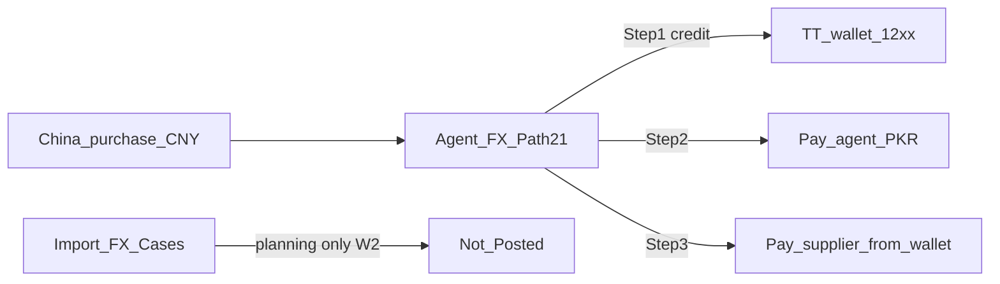

# Import FX Cases vs Agent FX — operator workflow (RMB / CNY supplier pay)

**Audience:** Ops / accounts (Purchases screen pe dono buttons)  
**Role:** **Subordinate operator quick guide** (Path 21 how-to). Deep gap analysis + W2.1 fixes: [`IMPORT_FX_OPERATOR_WORKFLOW_AND_GAP_ANALYSIS.md`](IMPORT_FX_OPERATOR_WORKFLOW_AND_GAP_ANALYSIS.md) · [`IMPORT_FX_CASE_W2_1_OPERATOR_CLARITY_AND_ASSIGNMENT.md`](IMPORT_FX_CASE_W2_1_OPERATOR_CLARITY_AND_ASSIGNMENT.md)  
**Product:** China import / wholesaler purchasing FX (NEW POSV3)  
**Prerequisite:** Settings → **Multi Currency Enabled** = ON (Agent FX button is flag-gated)  
**Base books:** PKR (`companies.currency`) — UI pe RMB dikhe to DB mein ISO **CNY** store hota hai  

**Related**
- Payment matrix Path 21 / 21b: [`PAYMENT_ENTRY_PATHS.md`](PAYMENT_ENTRY_PATHS.md)
- Import FX Case W2 (planning only): [`IMPORT_FX_CASE_W2_ARRANGEMENT_ENRICHMENT.md`](IMPORT_FX_CASE_W2_ARRANGEMENT_ENRICHMENT.md)
- W2.1 clarity + assignment: [`IMPORT_FX_CASE_W2_1_OPERATOR_CLARITY_AND_ASSIGNMENT.md`](IMPORT_FX_CASE_W2_1_OPERATOR_CLARITY_AND_ASSIGNMENT.md)
- Deep operator workflow + gap analysis: [`IMPORT_FX_OPERATOR_WORKFLOW_AND_GAP_ANALYSIS.md`](IMPORT_FX_OPERATOR_WORKFLOW_AND_GAP_ANALYSIS.md)
- Workflow + COA overview: [`MULTI_CURRENCY_IMPORT_FX_WORKFLOW_AND_COA.md`](MULTI_CURRENCY_IMPORT_FX_WORKFLOW_AND_COA.md)
- Pooled USD→RMB design (not shipped money): [`POOLED_USD_RMB_MULTI_SUPPLIER_SETTLEMENT_WORKFLOW.md`](POOLED_USD_RMB_MULTI_SUPPLIER_SETTLEMENT_WORKFLOW.md)

---

## 1. Do buttons — short answer

Purchases header pe:

| Button | Kya hai | Paisa / journal? |
|--------|---------|------------------|
| **Import FX Cases** | Multi-day **planning** case (Arrangement): agent intention, expected USD/CNY/rates/dates, links | **Nahi** — W2 tak Accounting = **Not Posted** |
| **Agent FX** | **Path 21** money wizard: FC buy on credit → pay agent PKR → pay China supplier from TT wallet | **Haan** — JE + payments |

**Supplier ko RMB (CNY) settle karna hai aaj?** → **Agent FX** use karo (neeche Step-by-step).  
**Import FX Cases** sirf pehle se plan / case number / expected rates rakhta hai; confirm Arrangement ke baad bhi **payment nahi** hoti.

---

## 2. Roles — ghalat mix mat karo

| Role | Contact type | Kaam |
|------|--------------|------|
| **Money exchange agent** | `money_exchange` | Se FC (USD/CNY) credit pe milti hai; Agent AP |
| **China / merchandise supplier** | normal supplier | Purchase bill + AP; **Agent FX Step 3** pe pay |

Agent ≠ supplier. Agent select karte waqt China supplier mat choose karo.

---

## 3. Agar supplier ko RMB payment karni hai — recommended path (aaj shipped)

Yeh **Path 21 — Agent dual credit** hai. Books hamesha **PKR** post karti hain; foreign amount + rate planning / credit row pe rehte hain.

### 3.1 Pehle purchase banao (RMB bill)

1. **Purchases → Add Purchase**
2. Document currency **RMB / CNY** (active currencies mein hona chahiye)
3. Line prices foreign (RMB); system `FC × rate` se PKR AP post karega finalize pe
4. Purchase **finalize** karo taake due / AP clear ho (Step 3 “China purchase (due)” list mein aaye)

Paper pe RMB total + rate note kar lo — party ledger screens abhi official **PKR** dikhati hain.

### 3.2 Agent FX wizard — 3 steps

**Open:** Purchases → **Agent FX**  
**Title:** `Import FX — Agent dual credit`  
**Footer:** Cancel / Back / primary action

#### Step 1 — Buy FC on credit (`Record credit`)

1. **Money exchange agent** select (`money_exchange`)
2. **TT wallet account (12xx)** — e.g. named RMB wallet (`HAMID IK RMB` style)
3. **Currency** — RMB/CNY (jo supplier settle karna hai; USD bhi ho sakta hai agar wallet USD hai)
4. **Rate → PKR** + **Foreign amount** (kitni FC agent se credit pe li)
5. Preview: PKR credit = foreign × rate → **Dr TT wallet / Cr Agent AP**
6. **Record credit**

Result: wallet “funded on credit”; Agent AP open.  
RPC: `record_fx_currency_purchase_on_credit` → table `fx_currency_purchases` + journal.

#### Step 2 — Pay agent PKR (`Pay agent`)

1. Open FX credit select
2. **Pay from** bank/cash (company PKR liquidity)
3. **Amount PKR** (partial OK)
4. **Pay agent**

Result: Agent AP kam; bank/cash out.  
Uses `createSupplierPayment` (on-account to agent) + settlement link RPCs (`claim` / `apply_fx_currency_purchase_settlement` / `finalize`).

#### Step 3 — Pay China supplier (`Pay supplier`)

1. **China purchase (due)** select (wahi CNY/RMB purchase)
2. **Pay from TT wallet** (Step 1 wala wallet)
3. **Amount PKR** — suggested from credit, purchase due se capped
4. **Pay supplier**

Result: Supplier AP kam; wallet balance kam. Yeh operational “RMB supplier settle” hai — books mein **PKR** payment from wallet.

Toast style: `Supplier settled …`

### 3.3 Cancel / void order (agar galat post ho)

Safe order (Path 21):

1. Void **China settle** payment  
2. Void **agent settle** payment  
3. Void FX **credit** (or journal reverse on credit JE)

Settlement links soft-inactive; rows DELETE mat karo.

---

## 4. Import FX Cases kab use karein

**Open:** Purchases → **Import FX Cases**  
**Workspace:** `Import FX — Arrangement`

### Kya capture hota hai (W2)

- Agent (+ optional third-party money_exchange)
- Funding intention (Advance / Credit / Mixed) — **intention only**
- Planned purchase currency (USD vs RMB) + settle/convert intention
- Expected amounts + online indicative rates (editable)
- Expected dates, references, purchase/supplier **planning links**, attachment **metadata**
- **Save Draft** → **Confirm Arrangement** → stage **Completed**, case **Arranged**

### Kya **nahi** hota

- Advance pay, Buy USD, Convert, Settle Supplier buttons (timeline pe **Available in W3+**)
- Koi journal / `posts_journal: false`
- Agent FX credit / China PAY automatic nahi banta

Confirm ke baad case **planning record** hai. Paisa chalana ho to alag se **Agent FX** (ya normal Purchase → Add Payment agar seedha PKR bank se pay kar rahe ho — Path 21 wallet flow nahi).

### Cases ↔ Agent FX link (aaj)

| | Import FX Cases | Agent FX |
|--|-----------------|----------|
| Shared payment pipeline? | **No** | Money path |
| Case confirm → auto Step 1? | **No** | Manual wizard |
| Arrangement type “Path 21 … (planned)” | Intention label only | Actual dual-credit wizard |

Future **W3+** design: case pe money stages — alag approval; Path 21 tab bhi preserve rehna hai.

---

## 5. Do scenarios — kaunsa button

### A) “Supplier ko RMB dena hai, agent se RMB wallet pe credit liya”

1. CNY purchase finalize  
2. **Agent FX** Step 1 (CNY + rate + wallet) → Step 2 (agent PKR) → Step 3 (supplier from wallet)  
3. Optional: pehle **Import FX Cases** mein plan case bana lo (rates/dates) — payment phir bhi Agent FX se

### B) “Pehle USD lena hai, baad mein RMB / multi-supplier pool”

- **Aaj money:** Path 21 se **direct** us currency ka credit jo settle currency hai (e.g. seedha CNY credit), phir Step 3.  
- **USD→CNY pooled multi-supplier:** design docs only — Cases pe W3+ / pooled workflow **shipped money nahi**. Planning Cases mein capture kar sakte ho; execute Agent FX / future W3 se.

### C) “Sirf PKR bank se supplier pay — FC wallet nahi”

Path 21 zaroori nahi. Purchase → **Add Payment** (normal supplier pay) — books PKR. RMB bill phir bhi purchase pe FC + rate se AP PKR thi.

---

## 6. Checklist — RMB supplier settle (Path 21)

- [ ] Multi Currency ON; CNY/RMB in active currencies  
- [ ] Agent contact = `money_exchange` (supplier alag)  
- [ ] TT wallet (12xx) ready for that FC  
- [ ] China purchase created + finalized (due > 0)  
- [ ] Agent FX Step 1 credit recorded  
- [ ] Step 2 agent paid (jitna chahiye)  
- [ ] Step 3 pay from **same** TT wallet against that purchase  
- [ ] Verify: Supplier AP down; wallet balance; Agent AP as expected  
- [ ] Import FX Case (agar banaya) Accounting ab bhi **Not Posted** — normal

---

## 7. UI map (code)

| UI | File |
|----|------|
| Buttons | [`PurchasesPage.tsx`](../../src/app/components/purchases/PurchasesPage.tsx) |
| Agent FX wizard | [`ImportFxAgentWizard.tsx`](../../src/app/components/purchases/ImportFxAgentWizard.tsx) |
| Agent FX service | [`importFxAgentService.ts`](../../src/app/services/importFxAgentService.ts) |
| Import FX Cases | [`ImportFxCaseWorkspace.tsx`](../../src/app/features/import-fx-case/ImportFxCaseWorkspace.tsx) |

---

## 8. Status stamp

| Item | Truth |
|------|--------|
| Path 21 Agent FX money | **Shipped** (flag-gated) |
| Import FX Cases Arrangement W1/W2 | **Shipped** planning; production W2 RPCs applied where deployed |
| Case money stages W3–W6 | **Not shipped** — design / future approval |
| Phase-3 FX gain/loss P&amp;L | **Off** (`fxSettlementAccountingEnabled` default false) |

**Operator one-liner:** Cases = plan; Agent FX = pay. RMB supplier settle aaj = purchase (CNY) + Agent FX Steps 1→2→3.
