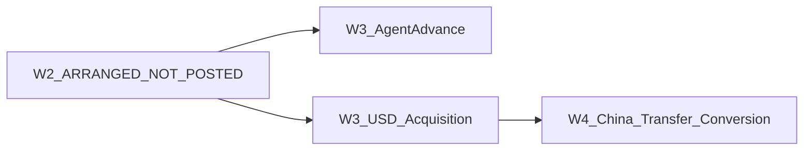

# Import FX Case — W3 Agent Advance & USD/TT Acquisition Design

**Status:** **DESIGN ONLY — NOT SHIPPED**  
**Branch:** `docs/import-fx-w3-advance-usd-acquisition-design` (stacked on W2.1)  
**Base HEAD:** `0d9d274e` (`feat/import-fx-w2-arrangement-enrichment` / Draft PR #23)  
**Rule:** **No W3 implementation PR may merge before W2/W2.1.** This document posts **no** accounting.

**Companions**
- [`IMPORT_FX_CASE_W2_ARRANGEMENT_ENRICHMENT.md`](./IMPORT_FX_CASE_W2_ARRANGEMENT_ENRICHMENT.md)
- [`IMPORT_FX_CASE_W2_1_OPERATOR_CLARITY_AND_ASSIGNMENT.md`](./IMPORT_FX_CASE_W2_1_OPERATOR_CLARITY_AND_ASSIGNMENT.md)
- [`IMPORT_FX_OPERATOR_WORKFLOW_AND_GAP_ANALYSIS.md`](./IMPORT_FX_OPERATOR_WORKFLOW_AND_GAP_ANALYSIS.md)
- [`IMPORT_FX_CASES_VS_AGENT_FX_OPERATOR_WORKFLOW.md`](./IMPORT_FX_CASES_VS_AGENT_FX_OPERATOR_WORKFLOW.md)
- [`MULTI_CURRENCY_SUPPLIER_SETTLEMENT_DATABASE_ACCOUNTING_DESIGN.md`](./MULTI_CURRENCY_SUPPLIER_SETTLEMENT_DATABASE_ACCOUNTING_DESIGN.md)
- [`POOLED_USD_RMB_MULTI_SUPPLIER_SETTLEMENT_WORKFLOW.md`](./POOLED_USD_RMB_MULTI_SUPPLIER_SETTLEMENT_WORKFLOW.md)
- [`PAYMENT_ENTRY_PATHS.md`](./PAYMENT_ENTRY_PATHS.md)
- [`.cursor/rules/multi-currency-import-fx.mdc`](../../.cursor/rules/multi-currency-import-fx.mdc)

**Gates:** `multiCurrencyEnabled` (ops) · `fxSettlementAccountingEnabled = false` (Profile A — no FX P&L / Pending FX journals in W3)

---

## 1. Executive summary

W3 turns an **ARRANGED** Import FX Case into a **money-capable** shell for two **separate** postable events:

1. **Actual Agent Advance** — company pays PKR to a `money_exchange` agent **before** (or independently of) receiving USD/TT.
2. **Actual USD/TT Acquisition** — company receives USD quantity into an approved TT wallet at a **PKR carrying cost**, funded by **advance**, **agent credit**, or **mixed**.

These events may occur on **different dates**, **multiple times**, and in **either order** (advance-first or credit-first), within one case.

| Today (W2/W2.1) | W3 (this design) |
|-----------------|------------------|
| Planning / assignment only | Posts PKR journals for advance + USD acquisition |
| `posts_journal: false` | Money RPCs post journals; drafts remain non-posting |
| Path 21 separate money wizard | Path 21 **preserved**; W3 is case-scoped alternative surface |

**Hard exclusions:** China USD transfer, USD→CNY conversion, CNY pool, supplier allocation/payment, Supplier AP movement for FX conversion benefit, Phase-3 FX gain/loss accounts (`1395`/`2295`/`6100`/`7100`).

**Critical CoA finding:** No shipped **Agent Advance / Prepaid FX clearing** account exists in live migrations/seed. Design docs suggest **`1230` Agent Settlement Clearing/Advance**. Creating or mapping that account is **`OWNER ACCOUNTING APPROVAL REQUIRED`**. Do not invent it in code without approval. Do not reuse Worker Advance **`1180`**. Do not use Phase-3 accounts for advance.

---

## 2. Business scenarios

### 2.1 Advance first

1. Arrangement confirmed (W2).
2. Company pays PKR 2,000,000 to agent from bank (advance posted).
3. Days later, agent delivers USD 5,000 at 287.50 → carrying 1,437,500 PKR applied from advance.
4. Remaining unapplied advance 562,500 PKR stays available for later acquisitions.

### 2.2 USD on credit first

1. Arrangement confirmed.
2. Agent delivers USD 10,000 at 287.50 → Dr TT wallet 2,875,000 / Cr Agent AP 2,875,000 (no bank movement yet).
3. Later agent payment uses **existing approved payment path** (Path 21 Step 2 / `createSupplierPayment`) — referenced by W3, not redesigned here.

### 2.3 Mixed funding

1. Unapplied advance 1,000,000 PKR exists.
2. Acquire USD 10,000 at 287.50 → carrying 2,875,000.
3. Apply 1,000,000 from advance; create Agent AP 1,875,000 for remainder.

### 2.4 Multiple events

One case may have many advances and many USD acquisitions (partial lots). Case accounting becomes `PARTIALLY_POSTED` until settlement design / later waves close the commercial story (W3 does not require “fully complete”).

---

## 3. W2 → W3 handoff

| Prerequisite | Rule |
|--------------|------|
| Case `operational_status` | Must be `ARRANGED` (or later W3-derived money statuses), not `DRAFT`/`CANCELLED` |
| `arrangement_confirmed_at` | Required |
| `agent_contact_id` | Required, active `money_exchange`, same company (W2.1). Historical NULL-agent ARRANGED cases **ineligible** until corrected |
| Accounting | Starts `NOT_POSTED`; W3 money posts move toward `PARTIALLY_POSTED` / `POSTED` for **case money scope** only |
| Planned fields | W2 `expected_advance_amount_pkr`, planned USD/rates remain **plan**; W3 posts **actuals** |
| Assignment | Remains operational; never posts journals |
| Multi Currency | Must be ON for mutations |



---

## 4. Event model

Two first-class event types (multiple rows per case):

| Event type | Meaning | Posts journal? |
|------------|---------|----------------|
| `AGENT_ADVANCE` | PKR paid to agent; increases unapplied advance balance | Yes (on confirm-post) |
| `USD_ACQUISITION` | USD qty into TT wallet at PKR carrying cost | Yes (on confirm-post) |

Lifecycle per event: `DRAFT` → `POSTED` → (`REVERSED` via compensating event). **No DELETE** of posted rows.

Application of advance to a USD acquisition is either:

- embedded in the USD acquisition posting (funding mode ADVANCE/MIXED), or
- a linked `ADVANCE_APPLICATION` sub-record for audit (recommended).

W3 does **not** invent a third money event for “pay Agent AP” beyond referencing existing supplier-payment / Path 21 Step 2 patterns.

---

## 5. Proposed tables and relationships (design only — not implemented)

Additive proposals (names illustrative):

| Table | Purpose |
|-------|---------|
| `import_fx_case_advances` | Draft/posted advances: amounts, bank account, dates, JE id, status, `client_operation_id` |
| `import_fx_case_usd_acquisitions` | Draft/posted USD lots: qty, rate, carrying PKR, wallet, funding split, JE id, status |
| `import_fx_case_advance_applications` | Links advance ↔ acquisition with applied PKR (immutable when posted) |

Relationships:

- All FK → `import_fx_cases(id)`, `company_id`, optional `branch_id`
- `agent_contact_id` must match case agent (or approved override policy — default: must match)
- `journal_entry_id` on posted rows
- Events also mirrored into `import_fx_case_events` for timeline

Stage rows `ADVANCE` / `USD_ACQUISITION` update to `IN_PROGRESS` / `PARTIALLY_COMPLETED` / `COMPLETED` from **posted event aggregates**, not from W2 planning alone.

---

## 6. Reusable existing tables

| Artifact | Reuse |
|----------|-------|
| `import_fx_cases` / stages / events / links / attachments | Case shell + audit |
| `import_fx_client_operations` | Idempotency receipts (extend event_type enum) |
| `accounts` 12xx TT wallets | Destination for USD carrying (`_is_tt_agent_wallet_account`) |
| Agent AP under **2000** via `_ensure_ap_subaccount_for_contact` | Credit / mixed remainder |
| `payments` + `record_payment_with_accounting` | **Later** agent AP settle (reference only; Path 21 Step 2) |
| `fx_currency_purchases` | Path 21 credit lots; optional `import_fx_case_id` **pointer** — do not force W3 to write Path 21 rows unless owner chooses interoperability wave |
| Cash/Bank liquidity accounts | Credit side of advance |

---

## 7. Journal matrix

Official books remain **PKR**. USD quantity is operational metadata on the acquisition + wallet policy.

| # | Event | Debit | Credit | Notes |
|---|-------|-------|--------|-------|
| A1 | Agent advance | **Agent Advance / Clearing** (owner-approved) | Cash/Bank | PKR amount paid |
| U1 | USD on credit | TT wallet 12xx | Agent AP (2000 child) | Same polarity as Path 21 Step 1 |
| U2 | USD from advance | TT wallet 12xx | Agent Advance / Clearing | Releases prepaid |
| U3 | USD mixed | TT wallet 12xx (total carrying) | Advance (applied) + Agent AP (remainder) | Must balance |
| R* | Reversal | Invert original lines via compensating JE | — | Soft-void; no DELETE |

**Fees:** If collected in W3 UI, post as **separate** approved expense/fee legs only when owner approves fee account mapping; otherwise show fees as **non-posting display** until approved. Default design: fees **visible separately**, posting deferred unless mapped.

**Never in W3:** Supplier AP, inventory, CNY wallet, FX P&L, Pending FX.

---

## 8. Advance / Credit / Mixed examples

Assume agent Hamid, bank 1010, TT wallet 1205, approved clearing **1230** (pending owner approval), rate **287.50 PKR per 1 USD**.

### 8.1 Fully advance-funded acquisition

1. Advance post: Dr 1230 2,875,000 / Cr 1010 2,875,000  
2. Acquire USD 10,000: Dr 1205 2,875,000 / Cr 1230 2,875,000  
3. Unapplied advance after = 0  

### 8.2 Fully credit-funded acquisition

1. Acquire USD 10,000: Dr 1205 2,875,000 / Cr Agent AP 2,875,000  
2. No bank movement; Agent Payment Pending  

### 8.3 Mixed acquisition

1. Prior unapplied advance 1,000,000  
2. Acquire USD 10,000 carrying 2,875,000:  
   - Dr 1205 2,875,000  
   - Cr 1230 1,000,000  
   - Cr Agent AP 1,875,000  

### Formulas

```text
carrying_pkr          = usd_qty × pkr_per_usd
advance_applied_pkr   = min(requested_apply, unapplied_advance_balance, carrying_pkr)
agent_ap_created_pkr  = carrying_pkr − advance_applied_pkr   # CREDIT or MIXED remainder
unapplied_advance'    = unapplied_advance − advance_applied_pkr
```

CREDIT mode: `advance_applied_pkr = 0`, `agent_ap_created_pkr = carrying_pkr`.  
ADVANCE mode: `advance_applied_pkr = carrying_pkr` (reject if insufficient advance).  
MIXED: both may be > 0; reject if `advance_applied + ap != carrying`.

---

## 9. Partial and multiple-event examples

### 9.1 Multiple advances

| Date | Advance PKR | Unapplied after |
|------|-------------|-----------------|
| D1 | 1,000,000 | 1,000,000 |
| D2 | 500,000 | 1,500,000 |

Application policy default: **FIFO by advance posting date** against unapplied balance (owner may choose explicit advance selection UI). Distinct from **wallet lot valuation** (WA vs FIFO) — see open decisions.

### 9.2 Partial USD acquisition

Plan: 30,000 USD. First lot: 10,000 USD @ 287.50 → carrying 2,875,000. Case status: **USD Partially Acquired**; stage `USD_ACQUISITION` = `PARTIALLY_COMPLETED`.

### 9.3 Reversal of a posted advance (no USD applied yet)

Compensating JE: Dr Bank / Cr Clearing for original PKR; advance status `REVERSED`; unapplied reduced. If applications exist, reverse applications first (or block reverse until applications reversed).

### 9.4 Reversal of USD acquisition

Invert Dr/Cr of U1/U2/U3; restore advance unapplied and/or Agent AP; wallet qty/carrying reduced; status `REVERSED`. Never delete.

---

## 10. Status model

### 10.1 Case-level operational (derived)

Avoid bare `Completed`. Prefer explicit labels:

| Label | Meaning |
|-------|---------|
| Arrangement Confirmed | W2 ARRANGED |
| Advance Not Posted | No posted advances |
| Advance Partially Posted | Some advances posted; planned/target not met (optional target) |
| Advance Posted | At least one advance; or all planned advance covered (policy) |
| USD Pending | No posted acquisitions |
| USD Partially Acquired | Some USD qty posted |
| USD Acquired | Target qty met or operator marks acquisition complete for handoff |
| Agent Payment Pending | Open Agent AP from credit/mixed remains |
| Partially Reversed | Some events reversed |
| Reversed | All W3 money events reversed |

### 10.2 Accounting status

| Status | Meaning |
|--------|---------|
| `NOT_POSTED` | No W3 money JE |
| `PARTIALLY_POSTED` | Some advances and/or USD acquisitions posted |
| `POSTED` | Reserved for later “case money closed” policy — **do not auto-set** on first acquisition |
| `REVERSED` | All W3 money reversed |

### 10.3 Stage rows

Update `ADVANCE` and `USD_ACQUISITION` stage statuses from aggregates. Do **not** auto-complete W4+ stages.

### 10.4 Assignment (unchanged contract)

Example valid concurrent state:

- Case: ARRANGED / Advance Partially Posted  
- Accounting: PARTIALLY_POSTED  
- Stage: USD Acquisition Pending  
- Task: Obtain TT transfer reference · Assigned · Due date  
- Task status ≠ accounting status  

---

## 11. RPC contracts (design)

All SECURITY DEFINER, fail-closed company/branch, Multi Currency ON for mutations.

| RPC (proposed) | Role | posts_journal |
|----------------|------|---------------|
| `create_import_fx_case_advance_draft` | Draft advance | false |
| `update_import_fx_case_advance_draft` | Edit draft | false |
| `confirm_post_import_fx_case_advance` | Atomic post | **true** |
| `create_import_fx_case_usd_acquisition_draft` | Draft USD | false |
| `update_import_fx_case_usd_acquisition_draft` | Edit draft | false |
| `confirm_post_import_fx_case_usd_acquisition` | Atomic post (includes mix split) | **true** |
| `reverse_import_fx_case_advance` | Compensating reverse | **true** |
| `reverse_import_fx_case_usd_acquisition` | Compensating reverse | **true** |
| `get_import_fx_case_money_overview` | Read balances/history | false |

Each post RPC requires `p_client_operation_id` UNIQUE `(company_id, event_type, client_operation_id)`.

---

## 12. Idempotency and locking

- `client_operation_id` required on confirm-post; retry returns original result (`idempotent_replay: true`).
- `SELECT … FOR UPDATE` on case row, advance row, and (when applying) advance balance aggregates.
- Duplicate payment/agent reference → **warning** (soft) or hard reject if exact open duplicate within company+agent+amount+date (policy).
- Stale UI balance: compare `assignment_updated_at` / money overview etag; reject with `IMPORT_FX_CASE_STALE_BALANCE`.
- Insufficient unapplied advance → `IMPORT_FX_CASE_INSUFFICIENT_ADVANCE`.
- Wallet must pass TT-agent wallet heuristic / currency policy for USD destination.
- Agent must be `money_exchange`, active, same company; must match case agent by default.

---

## 13. Reversal model

- Posted events immutable in-place.
- Reverse creates new event + compensating JE linked via `reversal_of_event_id` / `reversal_of_journal_id`.
- Order: reverse USD applications/acquisitions that consume an advance **before** reversing that advance.
- UI: posted receipt is read-only; Reverse action opens confirm dialog with preview of compensating lines.

---

## 14. UI screen specifications

| # | Screen | Purpose |
|---|--------|---------|
| 1 | W3 case money overview | Planned vs actual advance/USD; unapplied advance; open Agent AP; links to Path 21 warning |
| 2 | Agent Advance entry | Form §15 fields; Save Draft / Confirm & Post |
| 3 | USD/TT Acquisition entry | Qty, rate, wallet, funding mode |
| 4 | Advance application | Explicit apply when not embedded (optional) |
| 5 | Mixed funding allocation | Split editor: advance vs AP; live remaining |
| 6 | Destination USD wallet selector | TT wallet search; currency validation |
| 7 | Agent balance summary | Unapplied advance, open AP, recent events |
| 8 | Accounting preview | Balanced PKR lines before post |
| 9 | Confirm-and-post dialog | Idempotency token; “posts journal” explicit |
| 10 | Posted receipt/detail | JE ref, amounts, immutable |
| 11 | Partial/multiple-event history | Chronological advances + acquisitions |
| 12 | Reversal/void workflow | Compensating preview |
| 13 | Audit timeline | Case events + money events |
| 14 | Responsive layouts | Desktop 3-col; tablet 2-col; mobile stack |

**Distinguish clearly in UI**

| Concept | Source |
|---------|--------|
| W2 Planned Advance | `expected_advance_amount_pkr` — not posted |
| W3 Actual Posted Advance | Sum of posted advances |
| Remaining unapplied advance | Posted advances − applications |

---

## 15. Accounting previews

Every Confirm & Post dialog shows:

```text
Dr  <account name>    PKR xxx
Cr  <account name>    PKR xxx
Balanced: yes
posts_journal: true
client_operation_id: …
```

Mixed shows three lines. If clearing account not configured → block post with `OWNER ACCOUNTING APPROVAL REQUIRED` / `IMPORT_FX_CASE_ADVANCE_ACCOUNT_NOT_CONFIGURED`.

---

## 16. Validation / error messages (stable codes)

| Code | When |
|------|------|
| `IMPORT_FX_CASE_NOT_ARRANGED` | Money post before arrangement confirm |
| `IMPORT_FX_CASE_AGENT_REQUIRED` | Missing/invalid agent |
| `IMPORT_FX_CASE_AGENT_ROLE_REQUIRED` | Not money_exchange |
| `IMPORT_FX_CASE_INSUFFICIENT_ADVANCE` | ADVANCE/MIXED apply too high |
| `IMPORT_FX_CASE_ADVANCE_ACCOUNT_NOT_CONFIGURED` | No owner-approved clearing |
| `IMPORT_FX_CASE_WALLET_NOT_TT` | Destination fails TT rules |
| `IMPORT_FX_CASE_STALE_BALANCE` | Concurrent update |
| `IMPORT_FX_CASE_DUPLICATE_CLIENT_OPERATION` | Handled as idempotent replay |
| `MULTI_CURRENCY_DISABLED` | Flag off |
| `IMPORT_FX_CASE_BRANCH_ACCESS_DENIED` | Branch fail-closed |

---

## 17. Task-assignment interaction

W2.1 assignment panel remains the follow-up surface. W3 posting **must not** auto-change assignment status. Suggested operator pattern: after posting advance, set task to `WAITING_AGENT` / “Obtain TT reference” manually or via optional soft-suggest UI (non-blocking).

---

## 18. Path 21 coexistence

### What Path 21 posts today

1. Dr TT wallet / Cr Agent AP (`record_fx_currency_purchase_on_credit`)  
2. Dr Agent AP / Cr Bank (`createSupplierPayment` + settlement apply)  
3. Dr Supplier AP / Cr TT wallet (China settle)

### What W3 posts

- Advance: Dr Clearing / Cr Bank  
- USD: Dr TT / Cr Clearing and/or Agent AP  

### Duplicate prevention

| Rule | Detail |
|------|--------|
| Operator | Path clarity: do not post the same commercial FC credit in **both** Agent FX wizard and W3 USD-on-credit |
| System (future) | Warn/block if open Path 21 credit exists for same company+agent+wallet+amount within N hours without explicit link |
| Link | Optional `import_fx_case_id` on Path 21 credit is pointer-only; W3 may later offer “Import Path 21 credit into case” **without** rewriting Path 21 |

### Transition strategy

- Keep Path 21 for same-day RMB/USD agent dual-credit settle.  
- Prefer W3 when multi-day advance, mixed funding, or case audit trail is required.  
- Do not auto-migrate historical Path 21 rows.

---

## 19. Desktop / tablet / mobile UX

- **Desktop:** Overview + form + preview three columns.  
- **Tablet:** Overview top; form/preview stacked.  
- **Mobile:** Single column; sticky Confirm bar; searchable selects full-screen.  
- Touch targets ≥ 44px; duplicate-submit guards on Confirm & Post.

---

## 20. Security model

- Fail-closed `_import_fx_case_assert_company_access` + branch helpers.  
- Agent `money_exchange` + active.  
- Wallet TT validation.  
- RPC-only writes; revoke helper EXECUTE from anon/authenticated.  
- Attachment metadata remains non-exposing of raw `storage_path` (W1/W2 pattern).  
- Profile A: no FX P&L auto journals.

---

## 21. W3 exclusions

| Excluded | Wave |
|----------|------|
| China USD transfer | W4 |
| USD→CNY conversion / CNY pool | W4 |
| Supplier allocation / payment | W5 |
| FX gain/loss / Pending FX accounts | Phase-3 |
| Redesign/replace Path 21 | Never in W3 |
| Paying Agent AP (beyond referencing existing payment path) | Out of core W3; document pointer only |
| Silent CoA creation of 1230/1395/… | Owner approval |

---

## 22. W3 → W4 handoff

W4 may begin when:

- At least one **posted** USD acquisition with remaining USD quantity and PKR carrying exists on a TT wallet, and  
- Operator confirms handoff (or stage `USD_ACQUISITION` marked complete for case policy).

W4 consumes wallet qty/carrying for China transfer and conversion — **not designed here**.

---

## 23. Open owner decisions

| ID | Decision | Recommendation |
|----|----------|----------------|
| OD-1 | Approve additive Agent Advance/Clearing account (suggested **1230**, settings-mapped) | **Required before prepaid W3 money** |
| OD-2 | Fee posting account vs display-only fees in W3 | Display-only until mapped |
| OD-3 | Wallet multi-lot valuation: weighted average vs FIFO | Docs default **WA**; FIFO optional setting |
| OD-4 | Advance application order when multiple advances | FIFO by post date or explicit pick UI |
| OD-5 | Whether W3 USD-on-credit should also insert `fx_currency_purchases` for Path 21 parity | Prefer **case-native** table first; optional bridge later |
| OD-6 | When case `accounting_status` becomes `POSTED` | Not on first event; define close policy later |
| OD-7 | Hard vs soft duplicate Path 21 / W3 guard | Soft warn v1; hard block v2 |

**`OWNER ACCOUNTING APPROVAL REQUIRED`** applies to OD-1 before any advance-funding implementation.

---

## 24. Proposed implementation waves (future — not this task)

| Wave | Work | Gate |
|------|------|------|
| W3-D0 | This design + owner CoA decision | Docs |
| W3-A | Additive clearing account config (no Phase-3) | Owner OD-1 |
| W3-B | Schema tables + idempotency | After W2/W2.1 merge |
| W3-C | Post RPCs + JE | Separate money approval |
| W3-D | UI screens 1–14 | After C |
| W3-E | Path 21 coexistence guards | After D |

**No W3 PR merges before W2/W2.1.**

---

## 25. Acceptance checklist (for a future implementation PR)

- [ ] Advance post balances; increases unapplied  
- [ ] USD credit / advance / mixed journals balance in PKR  
- [ ] Insufficient advance rejected  
- [ ] Idempotent client_operation_id replay  
- [ ] Reverse restores balances; no DELETE  
- [ ] NULL-agent historical cases blocked  
- [ ] No Supplier AP / CNY / FX P&L writes  
- [ ] Path 21 wizard still works unchanged  
- [ ] Assignment unchanged by posting  
- [ ] Clearing account missing → clear error  
- [ ] Multi Currency OFF rejects mutations  

---

## 26. Files inspected

- Path 21 RPCs/schema: `migrations/20260801190000_fx_currency_purchase_schema.sql`, `20260801190100_fx_currency_purchase_rpcs.sql`, `20260811170000_import_fx_path21_agent_role_guards.sql`, `20260811171000_import_fx_tt_wallet_include_party_tt.sql`, `20260811200000_import_fx_wave0_path21_idempotency_settlement_lifecycle.sql`
- Client: `src/app/services/importFxAgentService.ts`, `src/app/lib/liquidityPaymentAccount.ts`
- W2/W2.1 case: `ImportFxCaseWorkspace.tsx`, W2/W2.1 migrations, `importFxCaseW21Helpers.ts`
- Docs: settlement design, pooled B–F, PAYMENT_ENTRY_PATHS, gap analysis, W2.1 record, operator Cases vs Agent, multi-currency rule

---

## 27. Confirmation — this document posts no accounting

This file is **design documentation only**. It does **not**:

- create or alter database objects  
- post or reverse journals or payments  
- create COA accounts  
- change Path 21 behavior  
- deploy to VPS/production  
- modify Draft PR #23 implementation commits  

Expected live financial delta from publishing this markdown: **none**.

---

## Document control

| Field | Value |
|-------|-------|
| Path | `docs/accounting/IMPORT_FX_CASE_W3_AGENT_ADVANCE_USD_ACQUISITION_DESIGN.md` |
| Stacked branch | `docs/import-fx-w3-advance-usd-acquisition-design` |
| Depends on | W2.1 HEAD `0d9d274e` / PR #23 |
| Date | 2026-08-13 |
