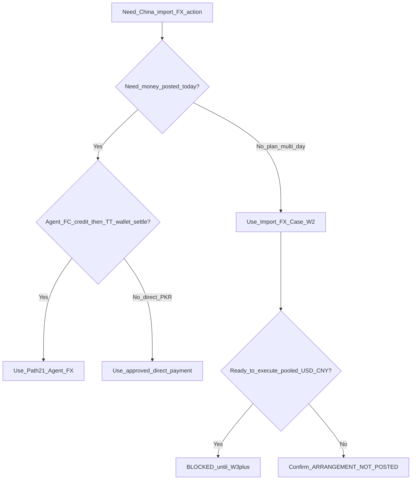

# Import FX — Operator Workflow & Gap Analysis

**Audience:** Owner / ops / accounts / future agents  
**Status:** Canonical operator + gap analysis (documentation only)  
**Branch (authored):** `feat/import-fx-w2-arrangement-enrichment`  
**Commit (authored against):** `84548f77`  
**Date:** 2026-08-13  
**Gates:** `multiCurrencyEnabled` (ops) · `fxSettlementAccountingEnabled = false` (Profile A — no FX P&L journals)

**Companions (do not rewrite their historical meaning):**
- [`IMPORT_FX_CASE_W2_ARRANGEMENT_ENRICHMENT.md`](./IMPORT_FX_CASE_W2_ARRANGEMENT_ENRICHMENT.md) — W2 shipped planning contract
- [`IMPORT_FX_CASE_W1_HOLD_AND_VERIFY.md`](./IMPORT_FX_CASE_W1_HOLD_AND_VERIFY.md) — W1 shell + security
- [`IMPORT_FX_CASES_VS_AGENT_FX_OPERATOR_WORKFLOW.md`](./IMPORT_FX_CASES_VS_AGENT_FX_OPERATOR_WORKFLOW.md) — short ops Path 21 how-to
- [`PAYMENT_ENTRY_PATHS.md`](./PAYMENT_ENTRY_PATHS.md) — Path 21 / 21b matrix
- [`IMPORT_FX_ASYNC_RESUMABLE_WORKFLOW_UX_DESIGN.md`](./IMPORT_FX_ASYNC_RESUMABLE_WORKFLOW_UX_DESIGN.md) — target case UX
- [`MULTI_CURRENCY_SUPPLIER_SETTLEMENT_DATABASE_ACCOUNTING_DESIGN.md`](./MULTI_CURRENCY_SUPPLIER_SETTLEMENT_DATABASE_ACCOUNTING_DESIGN.md) — next DB/settlement spec
- [`POOLED_USD_RMB_MULTI_SUPPLIER_SETTLEMENT_WORKFLOW.md`](./POOLED_USD_RMB_MULTI_SUPPLIER_SETTLEMENT_WORKFLOW.md) — Events B–F design only
- [`.cursor/rules/multi-currency-import-fx.mdc`](../../.cursor/rules/multi-currency-import-fx.mdc)

---

## 1. Executive summary

Import FX today is **two separate workflows**:

| Workflow | UI entry | Posts money? | Use when |
|----------|----------|--------------|----------|
| **Path 21 — Agent FX** | Purchases → **Agent FX** | **Yes** (PKR journals + payments) | Same-currency agent FC credit → pay agent → settle China from TT wallet **now** |
| **Import FX Case W1/W2** | Purchases → **Import FX Cases** | **No** (`posts_journal: false`) | Multi-day planning: pooled USD→CNY intention, expected amounts/rates/dates, links, resume later |

A case that shows **Operational: ARRANGED** and **Accounting: Not Posted** has **only confirmed the ARRANGEMENT planning stage**. It has **not**:

- credited/debited any wallet (including USD/TT 12xx)
- posted Agent AP or Supplier AP
- created a payment or journal entry
- bought USD, converted USD→CNY, pooled CNY, or allocated to suppliers

Those money events are **W3+ / design-only** (or, for immediate agent dual-credit, **Path 21**).

**This document posts no accounting.** It analyzes code, migrations, and docs only.

---

## 2. Meaning of the current screenshot (example case)

Owner example (operator-reported):

| Field shown | Example value | What it means in shipped code |
|-------------|---------------|--------------------------------|
| Case number | `IMPORT_FX_CASE-0001` | Durable planning case (`import_fx_cases.case_no`) |
| Operational status | `ARRANGED` | ARRANGEMENT stage reached `COMPLETED`; set in `confirm_import_fx_case_stage` |
| Accounting status | `NOT_POSTED` / “Not Posted” | Default and **unchanged** by W2 confirm; no JE posted |
| Arrangement type | Pooled USD→CNY planned | Intention label (`arrangement_type`, e.g. `POOLED_USD_CNY`) — not a money engine |
| Funding intention | `CREDIT` | `funding_mode` intention only — does **not** create Agent AP |
| Planned source / settlement | USD → CNY | Planning currencies only |
| Expected USD / CNY / rates | e.g. 30,000 USD; ~202,383 CNY; PKR/USD ~287.50; CNY/USD ~6.7461 | Stored planning numbers / indicative rates — **not** wallet quantity |
| Planned / expected PKR | ~8,625,000 | Derived or entered planning cost — **not** a journal amount |
| Money Exchange Agent | blank | `agent_contact_id` may be NULL; confirm does **not** require agent (see §14A) |
| Later stages | `NOT_STARTED` | Money stages blocked: `isMoneyStageBlockedInW2` / server `IMPORT_FX_CASE_STAGE_W2_ARRANGEMENT_ONLY` |

### What confirming ARRANGEMENT actually does

Evidence: [`migrations/20260812140000_import_fx_case_arrangement_enrichment_w2.sql`](../../migrations/20260812140000_import_fx_case_arrangement_enrichment_w2.sql) (`confirm_import_fx_case_stage`), [`src/app/services/importFxCaseService.ts`](../../src/app/services/importFxCaseService.ts) (`confirmImportFxCaseStage` + `assertW2MutationDoesNotPost`):

1. Updates `import_fx_case_stages` for **ARRANGEMENT** → `COMPLETED` (or intermediate `AWAITING_CONFIRMATION` path)
2. Inserts `import_fx_case_events` with `posts_journal = false`, planning payload
3. Sets `operational_status = 'ARRANGED'`, `arrangement_confirmed_at`
4. Returns `accounting_status: 'NOT_POSTED'`, `posts_journal: false`

### What it does **not** write

| Artifact | Written by W2 confirm? |
|----------|-------------------------|
| `journal_entries` / `journal_entry_lines` | No |
| `payments` | No |
| Agent AP / Supplier AP balances | No |
| TT / USD wallet GL movements | No |
| `fx_currency_purchases` rows (as a credit buy) | No |
| `fx_currency_purchase_settlements` | No |
| Supplier settlement / CNY pool / conversion | No |

**Therefore:** any amount visible on a USD/TT wallet ledger **cannot** have originated from this W2 case confirmation. See §9 for real sources (especially Path 21).

`posts_journal: false` is enforced on create/update/confirm/cancel/link RPCs and re-asserted client-side via `assertW2MutationDoesNotPost` / `assertPlanningEventDoesNotPost`.

---

## 3. Current shipped capabilities

### 3.1 Import FX Case (W1 shell + W2 enrichment)

| Capability | Evidence |
|------------|----------|
| Create draft case + 8 stage rows | `create_import_fx_case` |
| Save/resume draft planning fields | `update_import_fx_case_draft` |
| Confirm **ARRANGEMENT only** | `confirm_import_fx_case_stage` + `isW2ConfirmableStage` |
| Cancel while `accounting_status = NOT_POSTED` | `cancel_import_fx_case_unposted` |
| Planning links (purchase / supplier / optional FX credit pointer) | `link_import_fx_case_target` — still `posts_journal: false` |
| Attachment **metadata** RPC | `register_import_fx_case_attachment_metadata` |
| Agent / third-party selectors (`money_exchange`) | UI + `_import_fx_w2_assert_party_contacts` when IDs set |
| Funding mode ADVANCE/CREDIT/MIXED | Intention columns only |
| Indicative rates (OpenER → PKR/USD, CNY/USD, base/CNY display) | `importFxIndicativeRates.ts` |
| Multi Currency OFF historical read (authorized) | `list_import_fx_cases` / `get_import_fx_case` read path |
| Fail-closed company/branch auth | `_import_fx_case_assert_company_access` / branch helpers |

Primary UI: [`ImportFxCaseWorkspace.tsx`](../../src/app/features/import-fx-case/ImportFxCaseWorkspace.tsx).

### 3.2 Path 21 — Agent FX (money)

| Step | Operator action | Backend |
|------|-----------------|---------|
| 1 | Buy FC on agent credit into TT wallet | `record_fx_currency_purchase_on_credit` → `fx_currency_purchases` + JE |
| 2 | Pay agent PKR | `createSupplierPayment` → `record_payment_with_accounting` + `apply_fx_currency_purchase_settlement` |
| 3 | Pay China supplier from same TT wallet | `createSupplierPayment` purchase-linked (`payment_account_id` = wallet) |

UI: [`ImportFxAgentWizard.tsx`](../../src/app/components/purchases/ImportFxAgentWizard.tsx). Service: [`importFxAgentService.ts`](../../src/app/services/importFxAgentService.ts). Matrix: Path **21** in [`PAYMENT_ENTRY_PATHS.md`](./PAYMENT_ENTRY_PATHS.md).

### 3.3 Direct / existing payment paths

Ordinary purchase payments (e.g. PKR bank → supplier) remain on existing approved payment paths (see payment matrix). They are **not** Import FX Case stages and **not** Path 21 unless the operator uses Agent FX / TT wallet settlement deliberately.

---

## 4. Current unsupported capabilities (do not post)

| Capability | Status |
|------------|--------|
| Confirm ADVANCE / USD_ACQUISITION / China transfer / conversion / pool / allocation / reconciliation stages | **Blocked** — W3+; UI copy `W2_MONEY_STAGE_BLOCKED_COPY` |
| Pooled USD→CNY multi-supplier money (Events B–F) | Design only — [`POOLED_USD_RMB_MULTI_SUPPLIER_SETTLEMENT_WORKFLOW.md`](./POOLED_USD_RMB_MULTI_SUPPLIER_SETTLEMENT_WORKFLOW.md) |
| Automatic FX gain/loss / Pending FX journals (`1395`/`2295`/`6100`/`7100`) | Requires `fxSettlementAccountingEnabled = true` after Phase-3 approval; default **false** |
| Case → auto-run Path 21 Steps 1–3 | **Not shipped** — Cases and Agent FX are separate screens |
| Real task assignment (assignee / due / priority / reminders) | **Not on** `import_fx_cases` (see §10–11) |
| Reopen ARRANGED → DRAFT after confirm | **No RPC** |
| Claiming a W2 case created a wallet balance | **False** — see §9 |

---

## 5. W2 operator guide (exact current workflow)

**Prerequisite:** Settings → **Multi Currency Enabled** = ON (mutations). Opens: Purchases → **Import FX Cases**.

For every step: **Accounting affected = No** unless noted (it is never Yes in W2).

### Step 1 — Open Import FX Cases

| | |
|--|--|
| Required | Multi Currency ON for mutations; company/branch session |
| Optional | Search / status filter (`list_import_fx_cases`) |
| Validation | Fail-closed company/branch auth |
| Result | Case list |
| Correction | N/A |

### Step 2 — Create draft

| | |
|--|--|
| Required | Branch context; create via `create_import_fx_case` |
| Optional | Initial arrangement type (default often `POOLED_USD_CNY`) |
| Validation | Multi Currency enabled server-side |
| Result | `operational_status = DRAFT`; accounting `NOT_POSTED`; 8 stages created (`ARRANGEMENT` actionable; others `NOT_STARTED`) |
| Correction | Edit draft / cancel unposted |

### Step 3 — Choose arrangement family

| | |
|--|--|
| Required | `arrangement_type` when creating/updating (enum-constrained) |
| Optional | Change while still DRAFT and arrangement not confirmed (`canEditArrangementType`) |
| Validation | Server locks type after confirm / stage COMPLETED (`IMPORT_FX_CASE_ARRANGEMENT_TYPE_LOCKED`) |
| Result | Planning label only |
| Correction | Before confirm: edit; after confirm: cancel unposted + new case (no reopen) |

### Step 4 — Select agent and third party (where applicable)

| | |
|--|--|
| Required | **Neither required** for confirm today (see §14A) |
| Optional | `agent_contact_id`, `third_party_contact_id` (`money_exchange`) |
| Validation | If set: must exist, same company, `money_exchange`; agent ≠ third party (`_import_fx_w2_assert_party_contacts`, UI `validateArrangementPlanning`) |
| Result | Planning parties stored |
| Correction | Before lock: clear/change selectors; after UI lock: cancel unposted or (RPC-only) draft update while NOT_POSTED — UI/server mismatch §14E |

### Step 5 — Select funding intention

| | |
|--|--|
| Required | Not strictly required (nullable) |
| Optional | `ADVANCE` / `CREDIT` / `MIXED` |
| Validation | CHECK / normalize enum |
| Result | Intention only — **no AP** |
| Correction | Edit before confirm; mode switch does **not** clear advance PKR (§14B) |

### Step 6 — Enter planned currencies / amounts / rates

| | |
|--|--|
| Required | None mandatory for confirm |
| Optional | Source/settlement currencies; `planned_usd_amount`; `expected_cny_amount`; `expected_pkr_per_usd`; `expected_cny_per_usd`; fees PKR; advance PKR |
| Validation | If filled: finite, non-negative |
| Result | Planning numbers; indicative labels via `formatIndicativeRateLabel` / `expected_cny_per_usd` = **CNY per 1 USD** |
| Correction | Edit before confirm |

### Step 7 — Expected dates / reference / notes

| | |
|--|--|
| Required | None |
| Optional | Arrangement/advance/completion dates; `agent_reference`; notes |
| Validation | Soft |
| Result | Follow-up hints only (not task assignment) |
| Correction | Edit before confirm |

### Step 8 — Link supplier / purchase (planning context)

| | |
|--|--|
| Required | None |
| Optional | Supplier / purchase links via `link_import_fx_case_target` |
| Validation | Agent cannot be linked as supplier; planning-only |
| Result | Context links; optional `FX_CURRENCY_PURCHASE` pointer sets `fx_currency_purchases.import_fx_case_id` **without** posting |
| Correction | Re-link / document; no GL reversal needed for W2 |

### Step 9 — Save draft

| | |
|--|--|
| Required | Valid planning payload for update RPC |
| Optional | Partial fills |
| Validation | Same party/amount rules; blocked if CANCELLED/REVERSED/COMPLETED or accounting ≠ NOT_POSTED |
| Result | Draft persisted; still NOT_POSTED |
| Correction | Save again |

### Step 10 — Assign / follow up (what is supported today)

| | |
|--|--|
| Required | N/A |
| Optional | **Notes**, expected dates, agent reference only |
| Validation | N/A |
| Result | **No** assignee, due, priority, reminder, or task status columns |
| Correction | Update notes/dates before lock; after lock use cancel+recreate or out-of-band communication |

### Step 11 — Confirm ARRANGEMENT

| | |
|--|--|
| Required | Stage = ARRANGEMENT; Multi Currency ON; auth |
| Optional | Prior save (UI typically save-then-confirm) |
| Validation | Server rejects non-ARRANGEMENT stages; UI `validateArrangementPlanning` (agent optional) |
| Result | Stage COMPLETED; case `ARRANGED`; `arrangement_confirmed_at`; event `posts_journal: false`; accounting **NOT_POSTED** |
| Correction | No unconfirm; **Cancel Unposted Case** if still NOT_POSTED |

### Step 12 — What becomes locked

UI (`isArrangementLocked` / `workspaceActions` mode `confirmed`):

- Fields locked; Save Draft + Confirm hidden
- Agent/selectors disabled
- Cancel Unposted still available while NOT_POSTED and not cancelled

Server:

- `arrangement_type` locked after confirm
- Draft update still allowed for ARRANGED while NOT_POSTED (**UI does not expose this**)

### Step 13 — What is still not financially posted

Everything money-related: ADVANCE, USD acquisition, China transfer, USD→CNY, pool, supplier allocation, reconciliation, Path 21 Steps 1–3, wallets, AP, payments, journals.

### Step 14 — What the operator can / cannot do next

| Can | Cannot |
|-----|--------|
| Read case; cancel unposted; use notes/dates as soft follow-up | Confirm money stages in W2 |
| Separately run **Path 21 Agent FX** if immediate money needed | Expect wallet/ledger movement from this case |
| Create a **new** case if arrangement was wrong | Reopen ARRANGED → DRAFT in UI |
| Link Path 21 credit later (pointer only) | Treat Cases button as payment |

---

## 6. Path 21 operator guide (money)

**Use when:** Multi Currency ON; China purchase finalized (for Step 3); need to **post** FC credit → agent pay → supplier pay from TT wallet.

Full short ops guide: [`IMPORT_FX_CASES_VS_AGENT_FX_OPERATOR_WORKFLOW.md`](./IMPORT_FX_CASES_VS_AGENT_FX_OPERATOR_WORKFLOW.md).

### Roles

| Role | Contact type | Must not confuse with |
|------|--------------|------------------------|
| Money exchange agent | `money_exchange` | Merchandise supplier |
| China supplier | normal supplier | Agent |

### Three events (actual Dr/Cr — PKR books)

Official GL amounts are **PKR** (`round(foreign × rate)` or payment PKR). FC lives as metadata on `fx_currency_purchases`.

| # | Event | Debit | Credit | Fingerprint |
|---|-------|-------|--------|-------------|
| 1 | FC purchased from agent on credit | **TT-agent wallet** (12xx, must pass `_is_tt_agent_wallet_account`) | **Agent AP** child under **2000** (`_ensure_ap_subaccount_for_contact`) | JE `reference_type = 'fx_currency_purchase'`; row in `fx_currency_purchases` |
| 2 | Agent paid from Cash/Bank | **Agent AP** | **Bank/cash** liquidity | `payments` paid + `on_account`; link in `fx_currency_purchase_settlements` (`status=active`) |
| 3 | Supplier settled from TT wallet | **Supplier AP** | **Same TT wallet** | `payments` `reference_type=purchase`; **no** settlement-table link to FX credit |

**Do not** use `record_payment_with_accounting` for Step 1 credit funding (wrong polarity: that RPC is Dr AP / Cr liquidity).

Cancel order (docs/matrix): void China PAY → void agent PAY → `voidFxCurrencyPurchaseCredit` (or reverse credit JE). Settlement links soft-`inactive`.

---

## 7. W2 versus Path 21 decision table

| Situation | Use | Why |
|-----------|-----|-----|
| Need money posted today: buy FC on agent credit, pay agent, settle China from TT wallet | **Path 21 Agent FX** | Only shipped money path for this pattern |
| Multi-day plan: USD first, later China transfer, later USD→CNY, pooled CNY, many suppliers | **W2 Import FX Case** (planning) | Captures intention; **does not execute** |
| Execute pooled conversion + multi-supplier allocation | **HOLD — W3+** | Not shipped; do not invent journals |
| Direct PKR bank/cash → supplier (no agent FC) | **Existing direct payment path** | Not Import FX Case; not Path 21 |
| Case shows ARRANGED / NOT_POSTED and operator expects wallet movement | **Misunderstanding** | Run Path 21 separately or wait for W3+ |
| Arrangement type labeled “Path 21 (planned)” on a Case | **Still planning** | Label ≠ Agent FX wizard |

### Decision tree

Verify: Path 21 / 21b rows in [`PAYMENT_ENTRY_PATHS.md`](./PAYMENT_ENTRY_PATHS.md); W2 money block in `isMoneyStageBlockedInW2` and migration header “No COA / JE / payment writes”.

---

## 8. Expected accounting entries by supported path

### Path 21 (supported)

See §6 table. Books: PKR only. Tables: `fx_currency_purchases`, `fx_currency_purchase_settlements`, `payments`, `journal_entries`.

### W2 Import FX Case (supported non-posting)

| Action | JE / payment | Expected entry |
|--------|--------------|----------------|
| Create / draft / confirm ARRANGEMENT / cancel unposted / link / attachment metadata | None | Event rows with `posts_journal: false` only |

### Purchase finalize (related, not Path 21 Step 1)

Foreign purchase finalize posts inventory / Supplier AP in PKR (existing purchase accounting). That is **purchase** accounting, not W2 case confirm.

### Unsupported (do not invent)

Pooled conversion benefit to Supplier AP; Pending FX / FX P&L while Profile A; W3–W6 stage journals.

---

## 9. USD / TT wallet source-tracing guide

**Rule:** A W2 case **cannot** be the source of a wallet GL movement.

### Sources that **can** move a 12xx TT wallet (PKR GL)

| Source | How to identify |
|--------|-----------------|
| **Path 21 Step 1** | JE `reference_type = 'fx_currency_purchase'`; `reference_id` = `fx_currency_purchases.id`; description like FX credit purchase; credit header has `wallet_account_id`, `agent_contact_id`, `foreign_amount` |
| **Path 21 Step 3** | Payment `reference_type = purchase`; `payment_account_id` = TT wallet; notes often supplier settle from FC wallet |
| **Other payments / transfers / manual JE** using same 12xx account | Same CoA account without `fx_currency_purchases` credit linkage |
| **Design-only pooled quantity ledger** | Not shipped — do not attribute live balances to it |

### Path 21 vs Case linkage

| Artifact | Meaning |
|----------|---------|
| `fx_currency_purchases.import_fx_case_id` | Optional **pointer** from `link_import_fx_case_target` — does **not** mean the case posted the credit |
| `import_fx_client_operations.event_type` | Path 21 idempotency: `fx_credit` / `agent_settle` / `china_settle` |
| Case `case_no` / `import_fx_case_events` | Planning audit only unless a future W3+ money event posts |

### Operator checklist when “wallet increased”

1. Open journal/payment for the wallet line.
2. If `fx_currency_purchase` → Path 21 Step 1 (or void/reverse of it).
3. If purchase payment from wallet → Path 21 Step 3 or other TT payment.
4. If only an Import FX Case is ARRANGED → **not** the cause; look elsewhere.

**Do not claim duplicate/incorrect journals without database evidence** for the specific company.

---

## 10. Task-assignment current state

| Feature | Present on Import FX Case? |
|---------|----------------------------|
| Case owner (dedicated) | No (only `created_by` / `updated_by`) |
| Assigned user | No |
| Current responsible user | No |
| Due date (task) | No (only planning `expected_*` dates) |
| Priority | No |
| Reminder | No |
| Task status | No |
| Assignment audit | No (only general case events) |

**Operational limitation:** Follow-up is **notes + expected dates + tribal knowledge**. Employees cannot be formally tasked inside the case UI.

**Existing ERP patterns inspected (not reusable for Import FX):**

| Candidate | Why not |
|-----------|---------|
| `studio_tasks` / stage assignments | Bound to studio production / workers |
| `contacts.assigned_to` | CRM-style contact owner; not a case task engine |
| Generic company `tasks` table | **Does not exist** |

---

## 11. Proposed task-assignment UX (design only — do not implement here)

**Recommendation (locked):** additive columns on `import_fx_cases` + assignment payloads on existing `import_fx_case_events`.

**Do not** reuse Studio tasks. **Do not** invent a company-wide generic tasks product in this wave. Defer `import_fx_case_tasks` child table unless multi-checklist owners are later required.

### Proposed fields (owner approval)

| Field | Purpose |
|-------|---------|
| Case Owner | Optional accountability (may default to `created_by`) |
| Assigned To | `assigned_to_user_id` |
| Current Action Required | Short text (e.g. “Obtain agent USD transfer reference”) |
| Due Date | `due_at` |
| Priority | enum / small int |
| Reminder Date | `reminder_at` optional |
| Assignment Notes | Free text |
| Status | `OPEN` / `IN_PROGRESS` / `WAITING_AGENT` / `WAITING_THIRD_PARTY` / `DONE` / `CANCELLED` |
| Reassignment history | Via `import_fx_case_events` payloads (not silent UPDATE) |
| Completion timestamp | When status → DONE |

### Relation to FX / accounting status

Example (valid):

- FX operational status: **ARRANGED**
- Accounting status: **NOT_POSTED**
- Task: Obtain agent USD transfer reference → Assigned to employee → Due date set

Assignment **never** replaces accounting status and **must not** post journals.

---

## 12. Future W2→W6 workflow (target — not shipped money)

| Wave | Intent | Accounting | Status |
|------|--------|------------|--------|
| **W2 Arrangement** | Plan agent/third party, funding intention, expected values, links, confirm | **None** | **Shipped** (code/UI; live migrate per W2 doc may still be deferred) |
| **W3 Agent funding & USD acquisition** | Advance / credit / mixed USD acquisition; later agent payment; wallet quantity + PKR carrying | Money events + idempotency | **Planned / unsupported now** |
| **W4 China transfer & USD→CNY** | Move USD; convert; create CNY pool; fees; carrying value; Profile A no FX P&L JE | Money | **Planned** |
| **W5 Supplier allocation** | Pool → many suppliers/purchases; partials; outstanding CNY; book PKR vs pool cost | Money; Profile A restrictions | **Planned** |
| **W6 Reconciliation & reporting** | Agent / USD / China USD / CNY pool / supplier ledgers; role separation; reversals | Reporting + audit | **Planned** |

Mark clearly: **Path 21 remains shipped money** alongside future pooled workflow; pooled must not silently replace Path 21 ([`.cursor/rules/multi-currency-import-fx.mdc`](../../.cursor/rules/multi-currency-import-fx.mdc)).

---

## 13. State / status glossary

| Term | Meaning |
|------|---------|
| `DRAFT` | Case editable planning shell |
| `ARRANGED` | ARRANGEMENT stage COMPLETED; still may be NOT_POSTED |
| `CANCELLED` | Cancelled via unposted cancel path |
| `NOT_POSTED` | No Import FX Case money journals for this case |
| `posts_journal: false` | Mutation must not create JE; client asserts |
| Stage `NOT_STARTED` | Default for non-arrangement stages in W2 |
| Stage `COMPLETED` (ARRANGEMENT) | Planning confirmed |
| `funding_mode` | ADVANCE/CREDIT/MIXED **intention** |
| `arrangement_type` | Planning family (e.g. pooled USD→CNY) |
| Path 21 | Agent FX money wizard |
| Path 21b | Import FX Cases non-posting shell (payment matrix label) |
| Profile A | `fxSettlementAccountingEnabled = false` — no FX P&L auto journals |
| TT wallet 12xx | Named foreign/TT liquidity accounts used by Path 21 |

---

## 14. Validation findings

### A. Arrangement confirmed without agent

| Question | Evidence-based answer |
|----------|----------------------|
| Is `agent_contact_id` optional in schema/RPC? | **Yes** — `DEFAULT NULL` on create/update; confirm has **no** agent-required check |
| Required only for some `arrangement_type`? | **No** type-specific require in W2 confirm |
| Can UI confirm pooled/agent arrangement with blank agent? | **Yes** — `validateArrangementPlanning` does not require agent |
| Server validate agent role on confirm? | Only if non-null on create/update (`money_exchange`) |
| Old case / agent later removed? | **Possible** — needs live `get_import_fx_case` for that `case_no` |
| Screenshot state | Can be a **valid stored state** under current rules |

**Verdict:** **VALIDATION DEFECT** (and **UX ISSUE** — label reads like a required party) for agent-based/pooled arrangements that operators expect to include an agent. Also **NEEDS LIVE DATA VERIFICATION** for whether `IMPORT_FX_CASE-0001` specifically has NULL `agent_contact_id` vs display/projection bug.

### B. CREDIT mode showing planned advance PKR

| Question | Answer |
|----------|--------|
| Source of PKR amount | Stored `expected_advance_amount_pkr` and summary “Planned advance PKR” in workspace; also used as optional driver for reverse-calc |
| Explicit advance vs expected total cost | Advance field is **explicit stored planning advance**; expected total cost may be derived from USD × PKR/USD |
| Stale across funding mode? | **Yes risk** — switching `fundingMode` does not clear advance |
| Mislabeled? | Label says advance; on CREDIT this is **confusing** |

**Correct display rules (target):**

| Funding mode | Required summary |
|--------------|------------------|
| ADVANCE | Planned advance PKR + expected total cost |
| CREDIT | Expected total PKR cost + expected agent credit; advance hidden/zero |
| MIXED | Planned advance + expected credit + expected total |

**Verdict:** **UX ISSUE** (server allows storing advance under CREDIT; UI always shows the field).

### C. Currency / rate labels

| Field / label | Meaning in code |
|---------------|-----------------|
| Indicative PKR per USD / `expected_pkr_per_usd` | PKR per 1 USD |
| Indicative PKR per CNY | Display-only derived; not a separate stored column |
| Indicative CNY per USD / `expected_cny_per_usd` / summary CNY/USD | **CNY per 1 USD** (`rates.CNY / rates.USD` when base PKR) |

Screenshot **~6.7461** matches **CNY per USD**, not USD/CNY (~0.148) and not PKR/CNY.

**Verdict:** Orientation in helpers is **correct**. **UX ISSUE** (Low): slash form `CNY/USD` can be read ambiguously by operators.

### D. Task assignment

**Verdict:** **Documentation / product gap** — not a live accounting defect. See §10–11.

### E. Confirmation locking

| Topic | Evidence |
|-------|----------|
| UI lock | `isArrangementLocked` → mode `confirmed`; fields disabled |
| Correct missing agent after confirm in UI? | **No** |
| Supported actions | Cancel Unposted (NOT_POSTED); create replacement case |
| Cancel requires financial reversal? | **No** — cancel keeps `posts_journal: false` |
| Server draft update on ARRANGED? | Still allowed while NOT_POSTED — **UI/server mismatch** |
| Reopen? | **No** |

**Safe operator correction today:** Cancel Unposted Case → create new draft with correct agent/funding → confirm again. Do not expect GL reversal.

**Verdict:** **UX ISSUE** (+ Medium product gap for reopen/edit-after-confirm). Server/UI lock mismatch is a **VALIDATION / consistency defect** for future fix.

---

## 15. Issue register

| ID | Finding | Evidence | Severity | Accounting risk | Recommended fix | Suggested wave | **Final status (W2.1)** |
|----|---------|----------|----------|-----------------|-----------------|----------------|------------------------|
| IFX-GAP-01 | Confirm ARRANGEMENT allowed with blank agent for pooled/agent-style types | Was optional in UI+RPC | **High** | Low (no post) | Require agent on confirm | Pre-W3 UX | **Fixed in W2.1 code** (live apply deferred) — see [`IMPORT_FX_CASE_W2_1_OPERATOR_CLARITY_AND_ASSIGNMENT.md`](./IMPORT_FX_CASE_W2_1_OPERATOR_CLARITY_AND_ASSIGNMENT.md) |
| IFX-GAP-02 | CREDIT still shows/stores Planned advance PKR; mode switch does not clear | Workspace always showed advance | **Medium** | None | Mode-conditional summary + clear on CREDIT | Pre-W3 UX | **Fixed in W2.1 code** (live apply deferred) |
| IFX-GAP-03 | `CNY/USD` slash ambiguity | Summary slash label | **Low** | None | Explicit “CNY received per 1 USD” | Docs/UX | **Fixed** |
| IFX-GAP-04 | No task assignment on cases | Schema/UI gap | **Medium** | None | Additive columns + events | UX wave | **Fixed in W2.1 code** (live apply deferred) |
| IFX-GAP-05 | After confirm, UI locks; server still allowed draft update | UI/RPC mismatch | **Medium** | Low if abused via RPC | `IMPORT_FX_CASE_ARRANGEMENT_LOCKED` | Pre-W3 | **Fixed in W2.1 code** (live apply deferred) |
| IFX-GAP-06 | Operators conflate Cases (plan) with Agent FX (pay) | Dual buttons | **High** | Medium if skip Path 21 | Path clarity card | Docs + UX | **Fixed (UI copy)** |
| IFX-GAP-07 | Wallet balance mis-attributed to W2 case | W2 non-posting | **High** (misdiagnosis) | High if wrong JE “fixed” | Wallet guidance in Cases UI | Docs | **Fixed (guidance)**; ledger source UI still later |
| IFX-GAP-08 | Agent vs supplier role mix risk | Link/Path 21 guards | **Medium** | High if mis-paid | Keep guards | Ongoing | Unchanged / monitored |
| IFX-GAP-09 | List search case/status oriented | list RPC | **Low** | None | Document | UX polish | Unchanged |
| IFX-GAP-10 | Downstream stages NOT_STARTED + W3+ copy | Stage list | **Low** | None | Strengthen empty-state | UX | Partially addressed via Path clarity |
| IFX-GAP-11 | Screenshot agent blank — NULL vs projection | Needs live get | **Needs live verification** | Unknown | Read-only verify | Verify | **Still needs live verification** |
| IFX-GAP-12 | Path 21 Step 3 weakly fingerprinted | Settlements link Step 2 only | **Medium** | Medium for audits | Stronger notes/reporting | Follow-up | Open (out of W2.1) |

Classifications used: Critical / High / Medium / Low / Documentation only / Needs live verification.

---

## 16. Recommended fix order (later — not this task)

1. **Documentation / operator clarity** — this file + ARRANGED banner copy (IFX-GAP-06, 07, 10).
2. **Confirm-time agent requirement** for pooled/agent arrangement types (IFX-GAP-01) — UI + RPC together.
3. **CREDIT/ADVANCE/MIXED summary rules** + clear incompatible fields (IFX-GAP-02).
4. **Post-confirm correction policy** — align UI lock with RPC; document cancel+replace (IFX-GAP-05).
5. **Rate label wording** (IFX-GAP-03).
6. **Task assignment columns** after owner approval (IFX-GAP-04) — non-posting.
7. **Live verify** blank-agent case data (IFX-GAP-11) before migration theories.
8. **Do not start W3–W6 money** until owner approval; do not “fix” wallets based on W2 cases.

---

## 17. Acceptance criteria for later fixes

| Fix | Done when |
|-----|-----------|
| Agent required on confirm (selected types) | UI blocks confirm; RPC raises explicit error; tests cover blank agent |
| Funding summary rules | CREDIT hides/zeros advance in summary; MIXED/ADVANCE show advance; mode switch clears incompatible values; tests |
| Lock alignment | Documented single policy; either both UI+RPC allow controlled edit or both deny; cancel still non-posting |
| Operator banner | ARRANGED screen states Not Posted + next action (Path 21 vs wait W3+) |
| Assignment v1 | Columns + event audit; list filter by assignee; no JE |
| Wallet tracing doc | Ops can distinguish Path 21 Step 1 JE from unrelated TT payments using §9 |

All fixes remain **additive**; no destructive money-table changes; no Phase-3 FX P&L without flag approval.

---

## 18. Source files / RPCs / migrations inspected

### UI / lib / services

- `src/app/features/import-fx-case/ImportFxCaseWorkspace.tsx`
- `src/app/features/import-fx-case/ImportFxCaseArrangementPanels.tsx`
- `src/app/lib/importFxCaseWorkspaceView.ts` (`isArrangementLocked`, `validateArrangementPlanning`, `assertW2MutationDoesNotPost`, `workspaceActions`)
- `src/app/lib/importFxCaseHelpers.ts` (`isMoneyStageBlockedInW2`, `W2_MONEY_STAGE_BLOCKED_COPY`, stage constants)
- `src/app/lib/importFxIndicativeRates.ts` (`mapOpenErRatesToIndicativeBundle`, `formatIndicativeRateLabel`)
- `src/app/services/importFxCaseService.ts`
- `src/app/components/purchases/ImportFxAgentWizard.tsx`
- `src/app/services/importFxAgentService.ts`
- `src/app/services/supplierPaymentService.ts` (`createSupplierPayment` → `record_payment_with_accounting`)

### RPCs / SQL helpers

- `create_import_fx_case`
- `update_import_fx_case_draft`
- `confirm_import_fx_case_stage`
- `cancel_import_fx_case_unposted`
- `link_import_fx_case_target`
- `list_import_fx_cases` / `get_import_fx_case`
- `register_import_fx_case_attachment_metadata`
- `_import_fx_w2_assert_party_contacts`
- `record_fx_currency_purchase_on_credit`
- `apply_fx_currency_purchase_settlement`
- `claim_import_fx_client_operation` / `finalize_import_fx_client_operation` / `release_import_fx_client_operation`
- `_is_tt_agent_wallet_account` / `_ensure_ap_subaccount_for_contact`

### Migrations (representative)

- `migrations/20260812140000_import_fx_case_arrangement_enrichment_w2.sql`
- `migrations/20260812140100_import_fx_case_attachment_metadata_rpc_w2.sql`
- W1 case shell / auth migrations (Import FX Case foundation)
- `migrations/20260801190000_fx_currency_purchase_schema.sql`
- `migrations/20260801190100_fx_currency_purchase_rpcs.sql`
- `migrations/20260811160000_import_fx_wave_a_server_off_checks.sql`
- `migrations/20260811200000_import_fx_wave0_path21_idempotency_settlement_lifecycle.sql`
- `migrations/20260812120000_import_fx_wave0_claim_before_pay.sql`

### Docs / rules

- All companions listed in the header
- `.cursor/rules/multi-currency-import-fx.mdc`
- `.cursor/rules/system-lockdown-safety.mdc` (additive / no silent money rewrites)

---

## 19. Explicit non-posting statement

**This analysis is documentation only.** It does **not**:

- post or reverse journals
- create or void payments
- move Agent AP, Supplier AP, or wallet balances
- apply migrations
- access production/VPS databases for writes
- implement W3–W6 money paths

No accounting records are changed by publishing this file.

---

## 20. Document control

| Field | Value |
|-------|-------|
| Title | Import FX — Operator Workflow & Gap Analysis |
| Path | `docs/accounting/IMPORT_FX_OPERATOR_WORKFLOW_AND_GAP_ANALYSIS.md` |
| Branch | `feat/import-fx-w2-arrangement-enrichment` |
| Authored against commit | `84548f77` (analysis baseline) |
| Published in commit | `70004bc5` |
| Date | 2026-08-13 |
| Draft PR (W2 feature) | https://github.com/NDM0313/NEWPOSV3/pull/23 (do not merge solely for this doc) |
| Change type | Documentation / analysis only |
