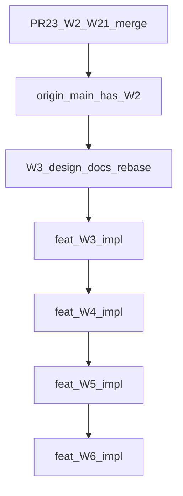

# Import FX — W3→W6 Master Implementation Plan (A-to-Z)

**Status:** **PERMANENT SOURCE OF TRUTH** — documentation only; **no money posted by this file**  
**Branch:** `docs/import-fx-w3-to-w6-master-implementation-plan`  
**Stacked on:** W3 design tip (`docs/import-fx-w3-advance-usd-acquisition-design` / `b141c754`)  
**Gates:** `multiCurrencyEnabled` (ops) · `fxSettlementAccountingEnabled = false` (Profile A)

**Companions (subordinate — do not compete with this sequencing SoT)**
- [`IMPORT_FX_CASE_W2_ARRANGEMENT_ENRICHMENT.md`](./IMPORT_FX_CASE_W2_ARRANGEMENT_ENRICHMENT.md)
- [`IMPORT_FX_CASE_W2_1_OPERATOR_CLARITY_AND_ASSIGNMENT.md`](./IMPORT_FX_CASE_W2_1_OPERATOR_CLARITY_AND_ASSIGNMENT.md)
- [`IMPORT_FX_CASE_W3_AGENT_ADVANCE_USD_ACQUISITION_DESIGN.md`](./IMPORT_FX_CASE_W3_AGENT_ADVANCE_USD_ACQUISITION_DESIGN.md) — OD-1–OD-7 locked
- [`IMPORT_FX_W3_1_CUSTODY_ROUTING_AND_DISTRIBUTION_DESIGN.md`](./IMPORT_FX_W3_1_CUSTODY_ROUTING_AND_DISTRIBUTION_DESIGN.md) — custody/routing amendment (local)
- [`IMPORT_FX_CASE_W3_W6_MONEY_EXECUTION_UX_DESIGN.md`](./IMPORT_FX_CASE_W3_W6_MONEY_EXECUTION_UX_DESIGN.md) (branch `docs/import-fx-w3-w6-money-ux-design`)
- [`MULTI_CURRENCY_SUPPLIER_SETTLEMENT_DATABASE_ACCOUNTING_DESIGN.md`](./MULTI_CURRENCY_SUPPLIER_SETTLEMENT_DATABASE_ACCOUNTING_DESIGN.md)
- [`POOLED_USD_RMB_MULTI_SUPPLIER_SETTLEMENT_WORKFLOW.md`](./POOLED_USD_RMB_MULTI_SUPPLIER_SETTLEMENT_WORKFLOW.md)
- [`IMPORT_FX_OPERATOR_WORKFLOW_AND_GAP_ANALYSIS.md`](./IMPORT_FX_OPERATOR_WORKFLOW_AND_GAP_ANALYSIS.md)
- [`IMPORT_FX_CASES_VS_AGENT_FX_OPERATOR_WORKFLOW.md`](./IMPORT_FX_CASES_VS_AGENT_FX_OPERATOR_WORKFLOW.md)
- [`.cursor/rules/multi-currency-import-fx.mdc`](../../.cursor/rules/multi-currency-import-fx.mdc)

**Wave numbering (canonical — overrides ASYNC §26):**

| Wave | Scope |
|------|--------|
| W1 | Case shell (shipped) |
| W2 / W2.1 | Arrangement planning + assignment (repo complete; live DB apply / PR #23 merge gates) |
| **W3** | Agent advance + USD/TT acquisition |
| **W3.1** | Custody & routing (company wallet / agent / third party / direct / split); operational distribution instructions; no W4/W5 money completion |
| **W4** | China USD transfer **and** USD→CNY conversion + CNY pool |
| **W5** | CNY pool → multi-supplier / multi-purchase allocation |
| **W6** | Reconciliation, role-separated reports, case closure → final `POSTED` |

[`IMPORT_FX_ASYNC_RESUMABLE_WORKFLOW_UX_DESIGN.md`](./IMPORT_FX_ASYNC_RESUMABLE_WORKFLOW_UX_DESIGN.md) older split (W4=transfer only / W5=conversion / W6=allocation) is **superseded for sequencing** by this document.

---

## 1. Current shipped state

| Layer | State |
|-------|--------|
| W1 case shell | Shipped (migrations + RPCs + UI) |
| Path 21 Agent FX | Shipped money wizard (separate screen) |
| W2 ARRANGEMENT | **Merged to `main`** via PR #23 (`8a1d57bc`, 2026-08-13); planning only; `posts_journal: false` |
| W2.1 assignment + validation | **On `main`** (tip ancestry includes `0d9d274e`); RPCs `update_import_fx_case_assignment` / `complete_import_fx_case_assignment`; agent required on confirm |
| Live DB apply (W2/W2.1) | **Environment-dependent** — auto-deploy workflow may run on `main` push; treat production migrate as separately verified |
| PR #23 → `main` | **Merged** — proven on `origin/main` |
| W3–W6 money | **Not implemented** — design only |
| Phase-3 FX P&L | **Not authorized** (`fxSettlementAccountingEnabled` stays `false`) |

**What W2/W2.1 provides today:** Import FX case; ARRANGEMENT planning; agent/third-party; ADVANCE/CREDIT/MIXED intention; expected USD/CNY/rates; purchase links; employee assignment; ARRANGEMENT confirm; accounting `NOT_POSTED`; **no financial posting**.

---

## 2. Remaining development scope

1. Phase 0: Merge PR #23; prove artifacts on `main`; rebase W3 design docs; docs-only alignment.  
2. W3: Clearing account provision (settings-mapped role); advance + USD acquisition tables/RPCs/UI; Agent AP pay via **existing** payment path (pointer, not redesign).  
3. W4: USD wallet transfer; USD→CNY conversion; CNY pool lots; equal-carrying PKR journals.  
4. W5: Settlement batches; allocations; open items; Profile-A equal-value post / unequal block.  
5. W6: Reconciliation board; role-separated ledgers; closure → `POSTED`.  
6. Controlled non-prod then production migrate/deploy **per wave** with separate approvals.

---

## 3. Dependency order



| Gate | Prerequisite |
|------|----------------|
| W3 implementation branch | PR #23 merged + W2/W2.1 on `origin/main` + live CoA code pick for clearing (OD-1) |
| W4 | W3 money merged + at least one posted USD lot with remaining qty |
| W5 | W4 conversion produced CNY pool with remaining qty |
| W6 closure | W5 allocations + reviews resolved per closure rules |
| Phase-3 FX JE | Separate owner approval + `fxSettlementAccountingEnabled=true` — **out of this roadmap’s ship path** |

**No wave may be implemented before its dependency is merged.**

---

## 4. W3 implementation plan — Agent Advance & USD Acquisition

**Canonical detail:** [`IMPORT_FX_CASE_W3_AGENT_ADVANCE_USD_ACQUISITION_DESIGN.md`](./IMPORT_FX_CASE_W3_AGENT_ADVANCE_USD_ACQUISITION_DESIGN.md) (OD-1–OD-7 **LOCKED**).

### 4.1 Events

| ID | Event | Dr | Cr |
|----|-------|----|----|
| A | Agent Advance | `AGENT_FX_ADVANCE_CLEARING` | Cash/Bank |
| B | USD on credit | USD/TT wallet | Agent AP (2000 child) |
| C | USD from advance | USD/TT wallet | Clearing |
| D | Mixed | USD/TT wallet (full carrying) | Clearing (applied) + Agent AP (remainder) |

### 4.2 Requirements

- Multiple advances per case; unapplied balance; FIFO default (OD-4); authorized manual allocate before post.  
- Immutable posted rows; full-event reverse only; fee NULL/0 (OD-2).  
- Immutable USD lots: qty + PKR carrying (OD-3); wallet WA reporting derived.  
- No Supplier AP, CNY, conversion, Phase-3 accounts, Worker Advance `1180`.  
- Accounting → `PARTIALLY_POSTED` on first money; **never** final `POSTED` in W3 (OD-6).  
- Hard `client_operation_id` + locks (OD-7). Path 21 separate (OD-5).  
- Clearing: settings-mapped; **never hardcode `1230`** (OD-1).

### 4.3 Agent AP clearance (not a new W3 USD event)

Later pay Agent AP with **existing** `createSupplierPayment` / Path 21 Step-2 patterns (Dr Agent AP / Cr Bank). Do **not** duplicate USD acquisition. W3 UI links “Pay agent AP” to approved payment entry with agent contact + open AP context.

### 4.4 W3 UI actions

Post Agent Advance · Record USD Acquisition · Apply Advance · Use Agent Credit · Mixed Funding · Preview Accounting · View Posted Receipt · Reverse Event.

### 4.5 Branch

`feat/import-fx-w3-agent-advance-usd-acquisition`

---

## 5. W4 implementation plan — China transfer & USD→CNY

### 5.1 Event E — USD wallet-to-wallet transfer

Move USD qty + **same** PKR carrying: Dr China USD wallet / Cr source TT wallet.  
No gain/loss; partial lot transfer; currency validation; locks; immutable; full-event reverse.

### 5.2 Event F — USD→CNY conversion

Consume China USD → produce CNY pool lot. Store: source wallet, USD qty/carrying, CNY received, CNY/USD, effective PKR/CNY, converter, refs, source lot links, destination pool, status.

**Profile A PKR JE:** Dr CNY Pool/Wallet / Cr China USD Wallet for **equal carrying PKR**.  
No FX P&L; fee unsupported/zero until separate approval; no Supplier AP; do not hide differences.

CNY pool lot: CNY qty, PKR carrying, effective PKR/CNY, conversion batch, remaining qty/carrying. WA reporting; immutable source lots.

### 5.3 W4 UI

Transfer USD to China · Select wallets · Select USD lots · Enter conversion · Preview qty+PKR · Confirm transfer · Confirm conversion · Receipt · Reverse.

### 5.4 Branch

`feat/import-fx-w4-china-transfer-usd-cny-conversion`

---

## 6. W5 implementation plan — CNY pool → suppliers

### 6.1 Capability

One pool → one/many suppliers; many purchases; partials over dates. Records: settlement batch, allocation rows, supplier FX open item, purchase link, allocated CNY, outstanding CNY before/after, book PKR reduction, pool carrying PKR, computed difference, review reason, source pool/lot, JE/payment link, reversal link.

### 6.2 Validation

Total alloc ≤ pool remaining; alloc ≤ invoice outstanding CNY; purchase↔supplier valid; company/branch; currency CNY; no duplicate; row locks; atomic batch; no DELETE of posted.

### 6.3 Profile A critical rule

When `supplier_book_pkr ≠ allocated_pool_carrying_pkr`:

- Compute + display difference; store metadata; return `FX_REVIEW_REQUIRED`.  
- **Block posting** if equal PKR JE cannot be produced.  
- Do **not**: add difference to Supplier AP; hide in CNY wallet; post `1395`/`2295`/`6100`/`7100`; force unbalanced JE.

**Equal-value post allowed only when** book PKR == pool carrying PKR (and qty validations pass): Dr Supplier AP / Cr CNY Pool for that PKR; reduce FC outstanding metadata.

Phase-3 behavior: document only; gated by `fxSettlementAccountingEnabled` — **do not activate**.

### 6.4 W5 UI

Select pool · Search suppliers/purchases · Outstanding CNY · Allocate · Pool remaining · Book PKR · Carrying PKR · Difference · Block/review · Preview · Confirm batch · Receipt · Reverse batch.

### 6.5 Branch

`feat/import-fx-w5-cny-supplier-allocation`

---

## 7. W6 implementation plan — Reconciliation & closure

### 7.1 Views

Case summary; agent advance; Agent AP; source USD; China USD; CNY pool; allocations; unallocated CNY; unconsumed USD; outstanding advance/AP; blocked FX reviews; reversals; assignment history; audit timeline.

### 7.2 Role-separated ledgers

| Ledger | Include | Exclude |
|--------|---------|---------|
| Supplier | Purchases, returns, supplier AP settlements, W5 allocations | Agent AP / advances merely by shared contact_id |
| Agent | Advances, Agent AP credit, agent payments, applications, reversals | Supplier merchandise |
| Wallet | Actual wallet movements only | — |
| Bank/Cash | Actual payment journals only | — |

### 7.3 Closure → final `POSTED`

Allowed only when: no pending reverse of posted money; no unresolved allocation batch; no unallocated amount requiring action (or owner-approved remainder); no invalid negative wallet/pool; quantities reconcile; journals balance; required reviews resolved; audit complete. **Do not** close because one supplier is paid.

### 7.4 Branch

`feat/import-fx-w6-reconciliation-reporting`

---

## 8. Database entities and relationships

Prefer **additive** migrations. Reuse case shell, `import_fx_client_operations`, TT accounts, Agent AP under 2000, Path 21 tables **unchanged** for Path 21 path.

### 8.1 Existing (keep)

`import_fx_cases`, stages, events, links, attachments; `import_fx_client_operations`; `fx_currency_purchases` / settlements (Path 21 only); `accounts` 12xx TT; `payments` / journals for Agent AP pay.

### 8.2 Proposed (illustrative names — finalize at migration)

| Entity | Wave | Purpose |
|--------|------|---------|
| `import_fx_case_advances` | W3 | Draft/posted PKR advances |
| `import_fx_case_usd_acquisitions` | W3 | Immutable USD lots |
| `import_fx_case_advance_applications` | W3 | Advance↔acquisition applied PKR |
| `import_fx_case_wallet_transfers` | W4 | USD wallet→wallet movements |
| `import_fx_case_conversions` | W4 | USD→CNY conversion batches |
| `import_fx_case_conversion_lot_links` | W4 | Source USD lot consumption |
| `import_fx_cny_pool_lots` | W4 | CNY qty + PKR carrying |
| `supplier_fx_open_items` | W5 | FC outstanding per purchase (if not already modeled) |
| `import_fx_settlement_batches` | W5 | Allocation batch header |
| `import_fx_settlement_allocations` | W5 | Per supplier/purchase lines |
| `import_fx_fx_difference_reviews` | W5 | Profile-A difference metadata |
| Settings map | W3 | `agentFxAdvanceClearingAccountId` → role `AGENT_FX_ADVANCE_CLEARING` |

### 8.3 Per-entity contract (all money tables)

- Keys: `id uuid PK`, `company_id`, optional `branch_id`, `import_fx_case_id`  
- Status: `DRAFT` | `POSTED` | `REVERSED` (no DELETE of posted)  
- Financial: PKR amounts + FC qty columns as applicable  
- `client_operation_id` UNIQUE `(company_id, event_type, client_operation_id)` when posted via RPC  
- `journal_entry_id` on posted money rows  
- `reversal_of_*` / compensating JE links  
- Immutable posted payload; derived WA not stored as mutable truth  
- Indexes: `(company_id, case_id, status)`, wallet/lot FKs, open-item FKs  
- RLS: deny direct client writes; **RPC-only** SECURITY DEFINER

Settlement design’s `wallet_movements` / `foreign_currency_wallets` may be adopted if introduced company-wide; otherwise case-scoped tables above remain valid.

---

## 9. Complete journal-entry matrix (Profile A)

Role names — **not** hardcoded codes. Clearing = Agent FX Advance / Settlement Clearing.

| # | Event | Debit | Credit | FC metadata | Agent L | Supplier L | Wallet | Bank |
|---|-------|-------|--------|-------------|---------|------------|--------|------|
| 1 | Agent advance | Clearing | Cash/Bank | — | ↑ unapplied | — | — | ↓ |
| 2 | Advance reverse | Cash/Bank | Clearing | — | restore | — | — | ↑ |
| 3 | USD credit acq | USD TT | Agent AP | +USD lot | ↑ AP | — | +USD | — |
| 4 | USD from advance | USD TT | Clearing | +USD lot | ↓ unapplied | — | +USD | — |
| 5 | Mixed acq | USD TT | Clearing + Agent AP | +USD lot | both | — | +USD | — |
| 6 | USD acq reverse | Invert | Invert | −lot | restore | — | −USD | — |
| 7 | Agent AP pay | Agent AP | Cash/Bank | — | ↓ AP | — | — | ↓ |
| 8 | USD transfer | China USD | Source USD | move qty+carry | — | — | move | — |
| 9 | Transfer reverse | Invert | Invert | restore | — | — | restore | — |
| 10 | USD→CNY | CNY pool | China USD | −USD +CNY | — | — | both | — |
| 11 | Conversion reverse | Invert | Invert | restore | — | — | restore | — |
| 12 | Equal-value supplier alloc | Supplier AP | CNY pool | −CNY | — | ↓ AP | −CNY | — |
| 13 | Unequal book≠carry | **BLOCKED** | — | store review | — | — | — | — |
| 14 | Phase-3 FX P&L example | *NOT AUTHORIZED* | — | — | — | — | — | — |

Row 7 uses **existing** payment RPCs — not a new Import FX money invent.

---

## 10. Operational quantity ledger

| Layer | Truth |
|-------|--------|
| USD acquisition lot | Immutable qty + PKR carrying |
| Wallet WA | Derived Σcarry/Σqty active lots |
| Transfer/conversion | Consume lot qty/carrying; write destination lot/pool |
| CNY pool lot | Immutable CNY + carrying; remaining after allocations |
| Allocation | Reduce pool remaining + supplier FC outstanding |

Never rewrite posted lots; reverse by compensating events.

---

## 11. Status / state transitions

| Accounting | Rule |
|------------|------|
| `NOT_POSTED` | No active case money JE |
| `PARTIALLY_POSTED` | First W3+ money; stays through W3–W5 |
| `POSTED` | **W6 closure only** after approved rules |
| Recompute | After reverse: `NOT_POSTED` if no active money else `PARTIALLY_POSTED` |

Operational stage labels and **assignment status** never drive accounting status.

---

## 12. Idempotency and locking

- Require `client_operation_id` on confirm-post.  
- UNIQUE `(company_id, event_type, client_operation_id)`.  
- `SELECT … FOR UPDATE` on case, lots, pool, open items as needed.  
- Atomic RPC; retry → original result (`idempotent_replay`).  
- Soft similarity warn (agent/date/ref/qty/Path21) does **not** replace hard controls (OD-7).

---

## 13. Reversal model

- Posted immutable; reverse = full compensating JE + new reverse event.  
- Partial amount correction = reverse whole event + repost.  
- Dependency order: reverse dependents before parents (e.g. allocation before pool conversion; USD acq applications before advance).  
- No DELETE of posted financial rows.

---

## 14. Path 21 coexistence

- Path 21 remains separate money wizard (credit FC + settle agent + China settle).  
- W3–W6 case workflow is alternative pooled path.  
- One commercial event must not post both paths.  
- No `import_fx_case_id` on Path 21 in W3 v1; no auto-migration.  
- Soft duplicate warnings only. UI path badge required.

---

## 15. UI screen inventory

**Single case workspace** (not disconnected dialogs):

| Section | Wave |
|---------|------|
| Overview | All |
| Arrangement | W2 |
| Tasks / Assignment | W2.1 |
| Agent Funding | W3 |
| USD Acquisition | W3 |
| China Transfer | W4 |
| USD→CNY Conversion | W4 |
| CNY Pool | W4/W5 |
| Supplier Allocation | W5 |
| Reconciliation | W6 |
| Audit | All |

Always visible chrome: stage, accounting status, assignment status, agent, source→settlement currencies, planned vs posted, next action, blocked reason, reversal status.

Responsive: desktop multi-column; tablet stacked panes; mobile single column + sticky confirm.

---

## 16. Search and selection behavior

Selectors must search: case no; agent name/code/phone; employee; bank/cash; wallet code/name/currency; third party; supplier name/code; purchase no; invoice/ref; journal/payment ref; settlement batch.  
**Server validates selected IDs** independently of UI filter lists.

---

## 17. Task-assignment interaction

W2.1 assignment remains operational. Money posts **must not** auto-change assignment status. Soft-suggest next task after post is non-blocking. Assignment ≠ accounting.

---

## 18. Role-separated reporting

Same filtered dataset for cards, grids, exports (Wave 0 principle). Filter by **business role/source**, not only `contact_id`. Account Ledger remains full GL history.

---

## 19. Multi Currency ON/OFF gates

| Flag | Behavior |
|------|----------|
| OFF | Historical case reads (fail-closed auth); **no** new FX money mutations |
| ON | Ops FX allowed; W3–W6 only if that wave is deployed; **server re-checks** |

---

## 20. FX settlement-accounting flag

| `fxSettlementAccountingEnabled` | Behavior |
|----------------------------------|----------|
| `false` (Profile A — current) | No realized FX JE; differences calculated/displayed; unequal supplier post **blocked** |
| `true` | Future Phase-3 only — document; **do not implement/enable** in W3–W6 ship path |

Turning Multi Currency ON must **never** auto-enable Profile B.

---

## 21. Test strategy

Per wave: static QA; unit; authorized DB RPC; company/branch isolation; role checks; idempotent retry; double-click; atomic rollback; reverse; zero unintended JE; raw journal-line inspect; ledger role separation; responsive smoke; build; targeted tsc; canonical `.md` evidence.

**Numeric cases:** full advance; full credit; mixed; multi-advance; multi USD lots; partial China transfer; partial conversion; one pool → ten suppliers; partial supplier pay; duplicate submit; cross-company; invalid wallet currency; reverse after dependent; unequal book vs carrying (must block).

---

## 22. Migration order

1. W2 / W2.1 (already authored) — apply before W3 money.  
2. W3: settings mapping + advance/acquisition/application tables + RPCs.  
3. W4: transfer + conversion + pool tables + RPCs.  
4. W5: open items (if needed) + batches/allocations/reviews + RPCs.  
5. W6: reporting views/RPCs (additive; may be read models).  

Additive only; no destructive money-table ALTER without separate lockdown lift.

---

## 23. Branch / PR strategy

| Branch | Role |
|--------|------|
| `feat/import-fx-w2-arrangement-enrichment` | PR #23 — planning only |
| `docs/import-fx-w3-advance-usd-acquisition-design` | W3 OD design |
| `docs/import-fx-w3-w6-money-ux-design` | Money UX design |
| `docs/import-fx-w3-to-w6-master-implementation-plan` | **This SoT** |
| `feat/import-fx-w3-agent-advance-usd-acquisition` | W3 money impl |
| `feat/import-fx-w4-china-transfer-usd-cny-conversion` | W4 impl |
| `feat/import-fx-w5-cny-supplier-allocation` | W5 impl |
| `feat/import-fx-w6-reconciliation-reporting` | W6 impl |

One Draft PR per wave. No mixing W3+ into PR #23.

---

## 24. Deployment gates (per wave)

1. Design approved  
2. Implementation branch  
3. Additive migrations  
4. Code/UI  
5. Static/unit/build  
6. Canonical `.md` evidence update  
7. Draft PR  
8. Human review  
9. Merge code  
10. Controlled non-prod migrate + RPC/UI QA  
11. Explicit production approval  
12. Production migrate/deploy  
13. Post-deploy smoke  
14. **Separate** next-wave approval  

One wave never silently authorizes the next.

---

## 25. Rollback strategy

- Prefer **compensating reverse** of posted events (no DELETE).  
- Deactivate settlement links (Path 21 pattern) rather than hard delete.  
- Feature flag / Multi Currency OFF stops new mutations; historical reads remain fail-closed.  
- Deploy rollback of UI alone does not erase journals — plan reverse RPCs before production.

---

## 26. Owner approvals (register)

| ID | Decision | Status |
|----|----------|--------|
| OD-1–OD-7 | W3 accounting locks | **LOCKED** |
| Live CoA code for clearing | Assign `1230` iff free else next asset code | **Open at provision** |
| PR #23 merge | Merge W2/W2.1 to main | Owner action |
| Each W3–W6 money PR | Explicit approve | Per wave |
| W5 unequal residual policy beyond block | Phase-3 only | Not authorized |
| Fee CoA / fee posting | Beyond W3 v1 | Not authorized |
| Production migrate/deploy | Explicit per wave | Required |

---

## 27. Exact proposed files (per wave — illustrative)

### W3
- `migrations/YYYYMMDDHHMMSS_import_fx_case_w3_advance_usd_acquisition.sql`
- `src/app/services/importFxCaseMoneyService.ts` (or extend case service)
- Workspace panels: AgentFunding, UsdAcquisition, AccountingPreview, PostedReceipt
- Unit tests under `src/app/lib/` / services tests
- Evidence: update W3 design doc “shipped” stamp + this master plan §28

### W4–W6
- Parallel migration + service + workspace section components + tests + evidence md

Exact filenames finalized in each wave’s implementation PR description.

---

## 28. Wave-by-wave acceptance criteria

### W2/W2.1
Arrangement confirm; assignment save; no JE; money stages blocked; Path 21 intact.

### W3
A1/U1/U2/U3 balance; FIFO/manual; fee reject; status never auto-`POSTED`; reverse whole event; hard idempotency; clearing via settings; Path 21 unchanged; no Supplier/CNY/FX P&L.

### W4
Transfer equal carrying; conversion equal carrying; pool remaining correct; reverse order; no Supplier AP.

### W5
Partial/multi alloc; equal-value JE; unequal → `FX_REVIEW_REQUIRED` block; Supplier AP once; ledgers role-separated.

### W6
Recon board complete; closure rules enforced; reports match raw journals; no premature `POSTED`.

---

## 29. Definition of A-to-Z completion

Import FX is complete only when:

- W2 arrangement + assignment work  
- Agent advance posts correctly  
- USD acquisition posts correctly  
- USD qty + PKR carrying reconcile  
- Agent AP clears correctly via approved payment path  
- USD transfers to China correctly  
- USD converts to CNY correctly  
- CNY pools reconcile  
- Multi-supplier allocations work  
- Supplier AP reduces once  
- Agent and Supplier ledgers do not mix  
- Partial payments work  
- Reversals work  
- Duplicate submit cannot double-post  
- Differences do not bypass accounting flags  
- Reports/exports match raw journals  
- Canonical docs hold final evidence  
- Controlled deployment separately approved  

---

## 30. Copy-paste implementation prompts

Each prompt is **standalone**. Do not combine waves. Every prompt requires authorization boundary + mandatory `.md` evidence.

### Prompt 1 — W2/W2.1 PR merge verification & W3 docs alignment

```text
AUTHORIZATION: Docs/git verification only. No VPS, no production migrate, no CoA, no W3 money code.
TASK: Fetch origin. Prove PR #23 merged into origin/main (W2/W2.1 migrations, UI, tests, docs present).
Rebase docs/import-fx-w3-advance-usd-acquisition-design (and this master-plan branch if needed) onto origin/main;
resolve docs/rule conflicts only; verify docs-only diff; push safely; provide compare link.
EVIDENCE: Update this master plan §1 shipped state + short alignment note in W3 design Document control.
FORBIDDEN: Implement W3; apply migrations; merge W3 to main automatically.
```

### Prompt 2 — W3 implementation

```text
AUTHORIZATION: Explicit owner approval for W3 money implementation on feat/import-fx-w3-agent-advance-usd-acquisition after PR #23 on main.
Follow IMPORT_FX_CASE_W3_AGENT_ADVANCE_USD_ACQUISITION_DESIGN.md OD-1–OD-7 and this master plan §§4,8,9,12,13.
Additive migration + RPCs + UI only. Settings-mapped AGENT_FX_ADVANCE_CLEARING; never hardcode 1230.
No Path 21 rewrite; no Supplier AP; no CNY; no Phase-3; fee NULL/0; accounting PARTIALLY_POSTED only.
EVIDENCE: Canonical W3 shipped section + master plan §28 W3 checklist.
```

### Prompt 3 — W3 live QA

```text
AUTHORIZATION: Non-production / explicitly approved DB only. No production deploy unless separately approved.
Run W3 numeric cases (advance/credit/mixed/FIFO/idempotent/reverse). Inspect raw journal lines.
EVIDENCE: QA md with pass/fail + JE samples. Stop if any unintended Supplier/CNY/FX P&L write.
```

### Prompt 4 — W4 design validation

```text
AUTHORIZATION: Docs only. Confirm Event E/F journals, lot consumption, Profile A equal carrying, UI sections.
Update design docs if gaps; no code. EVIDENCE: Design validation note linked from this master plan.
```

### Prompt 5 — W4 implementation

```text
AUTHORIZATION: Owner approval after W3 merged. Branch feat/import-fx-w4-china-transfer-usd-cny-conversion.
Implement transfer + conversion + CNY pool per master plan §5. No FX P&L; no Supplier AP; fee unsupported.
EVIDENCE: W4 acceptance §28 + JE matrix rows 8–11 verified in tests.
```

### Prompt 6 — W4 live QA

```text
AUTHORIZATION: Non-prod / approved DB. Partial transfer/conversion; reverse-after-dependent blocked correctly.
EVIDENCE: QA md. No production.
```

### Prompt 7 — W5 design validation

```text
AUTHORIZATION: Docs only. Lock equal-value vs FX_REVIEW_REQUIRED block; multi-supplier partial rules.
EVIDENCE: Design validation note. Do not enable fxSettlementAccountingEnabled.
```

### Prompt 8 — W5 implementation

```text
AUTHORIZATION: Owner approval after W4 merged. Branch feat/import-fx-w5-cny-supplier-allocation.
Profile A: block unequal book vs carrying; never credit difference to Supplier AP; never Phase-3 accounts.
EVIDENCE: §28 W5 + difference-block tests.
```

### Prompt 9 — W5 live QA

```text
AUTHORIZATION: Non-prod / approved DB. One pool → many suppliers; partials; unequal must block.
EVIDENCE: QA md with raw JE and blocked cases.
```

### Prompt 10 — W6 implementation

```text
AUTHORIZATION: Owner approval after W5 merged. Branch feat/import-fx-w6-reconciliation-reporting.
Role-separated ledgers; closure rules; final POSTED only when §7.3 satisfied.
EVIDENCE: §28 W6 + recon board screenshots/notes.
```

### Prompt 11 — W6 reconciliation QA

```text
AUTHORIZATION: Non-prod / approved DB. Prove ledgers do not mix roles; reports match journals; premature close rejected.
EVIDENCE: Recon QA md.
```

### Prompt 12 — Production release preflight

```text
AUTHORIZATION: Explicit production approval text required in the same message for the named wave only.
Preflight: migrations list, rollback reverses, smoke checklist, Multi Currency / Profile A flags, Path 21 regression.
Do not deploy without owner sign-off. EVIDENCE: Preflight md + post-deploy smoke md.
```

---

## Operator A-to-Z workflow (summary)

| Step | Screen / action | Accounting | Ops | Correction | Next |
|------|-----------------|------------|-----|------------|------|
| 1 | Book supplier purchase | Existing purchase JE | FC purchase open | Existing purchase reverse/void policy | Open case |
| 2 | Open Import FX case | None | DRAFT | Cancel unposted | Arrangement |
| 3 | Confirm arrangement | Still NOT_POSTED | ARRANGED | Lock; no silent reopen in v1 | Assign |
| 4 | Assign employee | None | Assignment status | Update/complete assignment | W3 money |
| 5–6 | Post advance / USD acq | W3 journals; PARTIALLY_POSTED | Lots/advance balances | Full reverse | Pay Agent AP / W4 |
| 7 | Pay Agent AP | Existing payment | AP ↓ | Existing payment reverse | W4 |
| 8–9 | Transfer + convert | Equal carrying | China USD / CNY pool | Full reverse (order) | Allocate |
| 10–11 | Allocate (partial OK) | Equal-value JE or BLOCK | Pool/open items | Reverse batch | Review |
| 12 | Review differences | No unauthorized JE | FX_REVIEW_REQUIRED | Resolve or leave blocked | Recon |
| 13 | Reverse mistakes | Compensating JE | Statuses recompute | — | Continue |
| 14 | Reconcile & close | May set POSTED | Closed | Reopen policy = future approval | Done |

---

## Security and integrity (all money RPCs)

SECURITY DEFINER; fixed search_path; EXECUTE authenticated only; revoke PUBLIC/anon; fail-closed `get_user_company_id` + branch helpers; agent `money_exchange`; Multi Currency ON; clearing/wallet currency validation; row locks; atomic post; idempotency; unique journal per event; **no client-supplied journal lines**; immutable posted; reverse≠delete; audit event; `created_by`; `approved_by` only if existing governance requires.

---

## Document control

| Field | Value |
|-------|-------|
| Path | `docs/accounting/IMPORT_FX_W3_TO_W6_MASTER_IMPLEMENTATION_PLAN.md` |
| Branch | `docs/import-fx-w3-to-w6-master-implementation-plan` |
| Base | W3 design `b141c754` |
| Date | 2026-08-13 |
| Commit | 206a2eec |

**This document posts no accounting.** It does not create migrations, journals, CoA accounts, or production changes.
