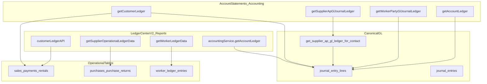

# Ledger Center V2 vs Account Statements — Data Source Analysis

**Date:** 2026-06-09  
**Updated:** 2026-06-09 — V2 now uses posted GL (aligned with Account Statements)  
**Purpose:** Document where each statement screen pulls data, which tables/RPCs are used, and why amounts could differ (historical) or should now match (post-alignment).

**Related docs:**
- [LEDGER_V2_GL_ALIGNMENT_REPORT.md](../LEDGER_V2_GL_ALIGNMENT_REPORT.md) — GL switch report + Saqib test checklist
- [STATEMENT_ENGINE_SIGNOFF.md](./STATEMENT_ENGINE_SIGNOFF.md) — Account Statements is the canonical GL workbench
- [AP_SUPPLIER_STATEMENT_RECONCILIATION.md](./AP_SUPPLIER_STATEMENT_RECONCILIATION.md) — supplier GL tie-out SQL
- [LEDGER_STATEMENT_CENTER_V2_TECH_NOTE.md](../LEDGER_STATEMENT_CENTER_V2_TECH_NOTE.md) — V2 implementation summary

---

## Status (post GL alignment)

**As of 2026-06-09, Ledger Center V2 official balance uses the same posted-GL engine as Account Statements.**

| Statement type | V2 (official) | Account Statements | Should match? |
|----------------|---------------|-------------------|---------------|
| Customer | `getCustomerLedger` | `getCustomerLedger` | Yes |
| Supplier | `getSupplierApGlJournalLedger` | `getSupplierApGlJournalLedger` | Yes |
| Worker | `getWorkerPartyGlJournalLedger` | `getWorkerPartyGlJournalLedger` | Yes |
| Account | `getAccountLedger` | `getAccountLedger` | Yes |

Both use `STATEMENT_ALL_BRANCHES_SCOPE` (`undefined` branchId) for party/account statements. Operational document adapters remain available **only** via the developer diagnostic toggle in V2.

---

## خلاصہ (Urdu summary)

**اب V2 اور Account Statements دونوں posted GL / journal basis پر ہیں — amounts match ہونے چاہئیں.**

| Screen | Location | Data basis (current) |
|--------|----------|----------------------|
| **Ledger Center V2** | Reports → Ledger Center V2 | **Posted GL** — same `accountingService` methods |
| **Account Statements** | Accounting → Account Statements | **Posted GL / journal** |

**پurana فرق (pre-alignment):** V2 operational documents استعمال کرتا تھا؛ اب نہیں۔

**Diagnostic toggle:** Developer role پر "Show document comparison" operational vs GL diff دکھاتا ہے — official balance affect نہیں کرتا۔

اگلا کام: Saqib customer پر manual compare — [LEDGER_V2_GL_ALIGNMENT_REPORT.md](../LEDGER_V2_GL_ALIGNMENT_REPORT.md)

---

## Historical note (pre-alignment)

Previously V2 used operational/document sources for customer/supplier/worker while Account Statements used posted GL. Sections below retain that analysis for reference; current V2 routing matches Account Statements.

---

## 1. UI location map

| Screen | React component | Navigation | Service entry |
|--------|-----------------|------------|---------------|
| **Ledger Center V2** | `src/app/features/ledger-statement-center-v2/LedgerStatementCenterV2Page.tsx` | Reports → **Ledger Center V2** (یا Financial → Statements / Ledgers V2) | `getLedgerStatementV2()` in `src/app/services/ledgerStatementCenterV2Service.ts` |
| **Account Statements** | `src/app/components/reports/AccountLedgerReportPage.tsx` | Accounting → **Account Statements** tab | Inline `useEffect` (~L563–696) calling `accountingService.*` |

**Third surface (legacy, not compared in detail here):** Accounting → LedgerHub + GenericLedgerView — operational party ledgers similar to V2 customer/supplier paths.

---

## 2. Architecture overview



### Quick comparison

| Statement type | Ledger Center V2 | Account Statements | Same amounts? |
|----------------|------------------|-------------------|---------------|
| Customer | Operational (`customerLedgerAPI`) | GL + document merge (`getCustomerLedger`) | Often **no** |
| Supplier | Operational (`ledgerDataAdapters`) | GL RPC (`getSupplierApGlJournalLedger`) | Often **no** |
| Worker | `worker_ledger_entries` | GL WP/WA (`getWorkerPartyGlJournalLedger`) | Often **no** |
| Account / COA | `getAccountLedger` | `getAccountLedger` | **Yes** (same service, same filters) |

---

## 3. Ledger Center V2 — data paths

**Entry:** `getLedgerStatementV2()` in `src/app/services/ledgerStatementCenterV2Service.ts`

### 3.1 Customer statement

| Item | Detail |
|------|--------|
| **Services** | `customerLedgerAPI.getLedgerSummary()` + `customerLedgerAPI.getTransactions()` |
| **Wrapper** | `buildTransactionsWithOpeningBalance()` from `customerLedgerTypes.ts` |
| **Basis** | **Operational** — business documents, not primary journal lines |

**Tables & RPCs:**

| Source | Purpose |
|--------|---------|
| `contacts.opening_balance` | Receivable opening seed (`getContactReceivableOpeningSeed`) |
| RPC `get_customer_ledger_sales` | Final sales for customer (branch-aware via `ledgerSalesRpcBranchId`) |
| RPC `get_customer_ledger_payments` | Payments linked to customer sales |
| `payments` (direct) | On-account (`reference_type = on_account`), manual receipts (`manual_receipt`) |
| `sale_returns` | Final returns (credit) |
| `payments` | Return payments (`reference_type = sale_return`) |
| RPC `get_customer_ledger_rentals` | Rental bookings/charges |
| `rental_payments` / rental payment rows | Rental payments |
| `payment_allocations` | Enrichment for payment → invoice links |
| `studio_production_stages` | Studio production costs added to studio sales (via `getLedgerSummary` / sales enrichment) |
| `accounts` | Payment account display names |

**Amount fields used:**

- `sales.total` (+ shipment/studio charges where applicable) → **debit** (customer owes)
- `payments.amount` → **credit** (customer paid)
- `sale_returns.total` → **credit**
- Rental charges / rental payments → debit/credit per rental logic

**Opening balance:** `contacts.opening_balance` + net document activity **before** `fromDate` (sales, returns, payments, rentals — computed in API).

**Running balance:** Sequential sum from opening + period transactions.

**Branch:** Filter passed to sales RPC via `ledgerSalesRpcBranchId(branchId)`. “All branches” when filter is `all`.

**Includes manual journal entries?** **No** (unless also recorded as a payment document).

**Voided documents:** Payments with `voided_at` excluded when `paymentScope = live` (default).

---

### 3.2 Supplier statement

| Item | Detail |
|------|--------|
| **Service** | `getSupplierOperationalLedgerData()` in `src/app/services/ledgerDataAdapters.ts` |
| **Basis** | **Operational** — purchase documents + payments |

**Tables:**

| Table | Filter / field |
|-------|----------------|
| `contacts` | `supplier_opening_balance` or `opening_balance` |
| `purchases` | `status IN ('final', 'received')` → credit = `total` |
| `purchase_returns` | `status = final` → debit = `total` |
| `payments` | `payment_type = 'paid'`, linked by `contact_id` or `reference_type = purchase` + `reference_id` |

**Opening balance:** Contact supplier opening + net purchases/returns/payments before `fromDate`.

**Debit/credit (payable perspective):** Purchase = credit (we owe); payment = debit (we paid); return = debit.

**Branch:** Not consistently filtered on operational supplier path (company-wide document query).

**Includes manual journal entries?** **No**.

---

### 3.3 Worker statement

| Item | Detail |
|------|--------|
| **Service** | `getWorkerLedgerData()` in `src/app/services/ledgerDataAdapters.ts` |
| **Basis** | **`worker_ledger_entries`** table (operational subledger) |

**Tables:**

| Table | Purpose |
|-------|---------|
| `contacts.opening_balance` | Optional seed (max with 0) |
| `worker_ledger_entries` | Work charges, salary, payments — primary rows |
| `studio_production_stages` | Enrich stage_type / production_no for studio rows |
| `studio_productions` | Production number, sale link |

**Not used:** GL lines on account codes **2010** (Worker Payable) or **1180** (Worker Advance).

**Branch:** Worker ledger entries query is company + worker scoped; limited branch filtering.

---

### 3.4 Account / Chart of Accounts ledger

| Item | Detail |
|------|--------|
| **Service** | `accountingService.getAccountLedger(accountId, companyId, fromDate, toDate, branchId, search)` |
| **Basis** | **Canonical GL** — same path as Account Statements GL mode |

**Tables:**

| Table | Role |
|-------|------|
| `journal_entry_lines` | Debit/credit per line |
| `journal_entries` | Header: date, reference_type, payment_id, branch, is_void |
| `accounts` | Account name/code on line |
| `branches` | Branch name per JE |
| `payments` | Batch lookup for reference numbers |

**Void handling:** Lines from voided JEs excluded from balance.

**Running balance:** Sum of `(debit - credit)` on viewed account, ordered by `created_at`.

**Branch:** Optional `branchId` filter when not `all`.

---

## 4. Account Statements — data paths

**Entry:** `AccountLedgerReportPage.tsx` fetch effect when user applies filters.

**Scope constant:** `STATEMENT_ALL_BRANCHES_SCOPE = undefined` — party statements always **all branches**; branch shown in row column. Header branch selector does **not** limit party statements.

### 4.1 Customer statement

| Item | Detail |
|------|--------|
| **Service** | `accountingService.getCustomerLedger(customerId, companyId, allBranches, startDate, endDate)` |
| **Basis** | **GL primary** with **document merge/synthetic fallback** |

**Phases (from `accountingService.ts`):**

1. **Phase 1 — Journal lines:** `journal_entry_lines` on **AR 1100 subtree** (control + all descendant receivable subledgers per contact).
2. **Phase 2 — RPC documents:** `get_customer_ledger_sales`, payments RPC — to filter which journal lines belong to this customer and to find gaps.
3. **Phase 3 — Filter:** Match lines to customer via sale_id, payment contact, rental, party resolver on JE.
4. **Phase 4 — Build entries:** Map lines to `AccountLedgerEntry` with running balance.
5. **Synthetic merge:** If sale/payment exists but **no matching journal line**, synthetic rows are merged in (customer path only).

**Tables / RPCs:** `journal_entry_lines`, `journal_entries`, `accounts` (1100 tree), `sales`, `payments`, `sale_returns`, `rentals`, RPCs same family as operational API.

**Includes manual journal entries?** **Yes** — any JE posting to AR for this party.

**Void handling:** `is_void = true` JEs excluded.

**Opening balance:** Derived from first row running balance minus first period movement (GL period logic).

---

### 4.2 Supplier statement

| Item | Detail |
|------|--------|
| **Service** | `accountingService.getSupplierApGlJournalLedger()` |
| **Primary RPC** | `get_supplier_ap_gl_ledger_for_contact(p_company_id, p_supplier_id, p_branch_id, p_start_date, p_end_date)` |
| **Basis** | **GL on AP control 2000** with party resolver (G-PAR-02 / 02b) |

**Fallback:** Legacy client filter if RPC missing (`fetchSupplierApGlJournalLedgerLegacy`).

**Amount fields:** `journal_entry_lines.debit` / `credit` on AP lines attributed to supplier.

**Convention:** Credit − debit on AP liability; running balance from RPC payload + period opening.

**See:** [AP_SUPPLIER_STATEMENT_RECONCILIATION.md](./AP_SUPPLIER_STATEMENT_RECONCILIATION.md) for SQL tie-out to Contacts AP balance.

**Includes manual journal entries?** **Yes** — manual AP journals with resolved party.

**Operational purchases without GL post:** May appear in V2 but **not** in GL statement until posted.

---

### 4.3 Worker statement (WP / WA GL)

| Item | Detail |
|------|--------|
| **Service** | `accountingService.getWorkerPartyGlJournalLedger()` |
| **Accounts** | **2010** Worker Payable, **1180** Worker Advance |
| **Basis** | **GL journal lines only** — explicitly **no** `worker_ledger_entries` merge |

**Filter:** Lines matched to worker via `contact_id` on payments, `assigned_worker_id` on production stages, party resolver on JE reference.

**Running balance:** Net GL exposure (WP liability minus WA asset), aligned with `get_contact_party_gl_balances` worker slice.

**Diff vs V2:** V2 reads `worker_ledger_entries`; Account Statements reads posted GL on 2010/1180.

---

### 4.4 General Ledger / Cash-Bank / Account+Contact

| Statement type (UI label) | Service |
|---------------------------|---------|
| General Ledger Statement | `getAccountLedger(selectedAccountId)` |
| Cash / Bank Statement | Same — account picker restricted to cash/bank category |
| Account + Contact Statement | Same + contact filter on payment-linked rows in UI |

**Party subledger leaf accounts:** If selected account is under 1100/2000/2010/1180 with `linked_contact_id`, fetch redirects to:

- 1100 → `getCustomerLedger`
- 2000 → `getSupplierApGlJournalLedger`
- 2010/1180 → `getWorkerPartyGlJournalLedger`

Modes defined in `src/app/lib/accounting/statementEngineTypes.ts`.

---

## 5. Side-by-side comparison matrix

| Dimension | V2 Customer | AS Customer | V2 Supplier | AS Supplier | V2 Worker | AS Worker | V2 / AS Account |
|-----------|-------------|-------------|-------------|-------------|-----------|-----------|-----------------|
| **Primary source** | Operational docs | GL + merge | Operational docs | GL RPC | worker_ledger_entries | GL 2010/1180 | journal_entry_lines |
| **Key service** | customerLedgerAPI | getCustomerLedger | ledgerDataAdapters | getSupplierApGlJournalLedger | getWorkerLedgerData | getWorkerPartyGlJournalLedger | getAccountLedger |
| **Sale / purchase amount** | Document total | JE line debit/credit | Document total | JE line | N/A | JE line | JE line |
| **Payment amount** | payments.amount | JE + payment_id | payments.amount | JE + party resolver | worker_ledger row | JE on WP/WA | JE line |
| **Opening balance** | contacts.opening_balance + doc history | GL period opening | supplier_opening_balance + docs | RPC period_opening_balance | contacts + worker_ledger | GL net opening | First row back-calc |
| **Manual JE** | No | Yes | No | Yes | No | Yes | Yes |
| **Void / reversal** | payment voided_at | JE is_void | payment voided_at | JE is_void | status on rows | JE is_void | JE is_void |
| **Draft / unposted docs** | Only if in operational scope | Synthetic if finalized doc exists | final/received purchases only | GL posted only | worker_ledger status | GL posted only | N/A |
| **Branch filter** | Yes (customer sales RPC) | All branches always | Weak / none | RPC param (UI sends all) | Weak | All branches | Optional on account |
| **Synthetic merge** | No | Yes (missing JE) | No | No | No | No | No |

### Debit / credit conventions

**Customer (receivable):**

- V2 operational: Sale/invoice → **debit**; Payment/return → **credit**
- GL customer: AR line debit increases receivable; credit decreases

**Supplier (payable):**

- V2 operational: Purchase → **credit**; Payment/return → **debit**
- GL supplier: AP credit increases payable; debit decreases

---

## 6. Why amounts differ — scenarios

| # | Scenario | Ledger Center V2 | Account Statements |
|---|----------|------------------|-------------------|
| 1 | Sale finalized, GL not posted | Shows invoice row | May show **synthetic** row after merge, or gap until merge runs |
| 2 | Manual JE on AR/AP (adjustment, opening) | **Not shown** | **Shown** as journal line |
| 3 | correction_reversal / voided JE | N/A unless doc voided | Excluded from GL (`is_void`) |
| 4 | Payment missing `contact_id` (legacy) | May miss if not linked to sale | Supplier GL RPC resolves party via purchase/JE resolver |
| 5 | Worker studio charge | `worker_ledger_entries` row | GL line on 2010/1180 when posted |
| 6 | Studio charges on customer sale | Added in customerLedgerAPI totals | AR journal lines when posted |
| 7 | Different branch scope | Customer filtered by branch | Party statements = **all branches** |
| 8 | Rental penalty / extra charges | Rental RPC + payment rows | Matching JE lines on AR |
| 9 | Commission / salary expense to worker | May be in worker_ledger | GL when posted to WP/WA |
| 10 | Same COA account + date range | `getAccountLedger` | `getAccountLedger` → **should match** |

---

## 7. Reconciliation checklist

Use one party (example: customer **Saqib**) and one date range.

### Step 1 — Align scope

- [ ] Set **same From / To dates** on both screens.
- [ ] On V2, set branch to **All branches** (to match Account Statements party scope).
- [ ] Note Account Statements banner: “all branches — per-row Branch column”.

### Step 2 — Compare opening balance

| Screen | Opening source |
|--------|----------------|
| V2 | `contacts.opening_balance` + document net before fromDate |
| Account Statements | GL period opening (first row running balance − first movement) |

If opening differs, check:

- Opening balance JE on AR (AS yes, V2 no)
- Contact `opening_balance` vs GL opening seed mismatch

### Step 3 — Row-level diff

Export or screenshot both tables. Classify rows:

| Only on V2 | Only on Account Statements |
|------------|----------------------------|
| Draft/final sale not in GL | Manual journal adjustment |
| Document payment | correction_reversal pair |
| worker_ledger operational row | Unmapped AP/AR line with party resolved in GL |
| Operational purchase | JE for expense coded to AP without purchase doc |

### Step 4 — Closing balance tie-out

**Customer:**

- Contacts card / `get_contact_party_gl_balances` AR slice → compare to **Account Statements closing** (GL basis).
- V2 closing → operational due basis; may differ from GL.

**Supplier:**

- Contacts AP (Khuram GL) → compare to **Supplier Statement closing**.
- See [AP_SUPPLIER_STATEMENT_RECONCILIATION.md](./AP_SUPPLIER_STATEMENT_RECONCILIATION.md).

**Worker:**

- Compare V2 `worker_ledger_entries` net vs AS WP/WA GL net — expect differences until posting aligns.

**Account:**

- Both use `getAccountLedger` — closing should match if same account, dates, branch.

### Step 5 — SQL pointers (read-only diagnostics)

**AP control vs supplier statement:**

```sql
-- Per-supplier AP from contacts RPC (same basis as Contacts UI)
SELECT * FROM get_contact_party_gl_balances('<company_id>', NULL);

-- Supplier statement rows (same basis as Account Statements)
SELECT * FROM get_supplier_ap_gl_ledger_for_contact(
  '<company_id>', '<supplier_id>', NULL, '<start_date>', '<end_date>'
);
```

**Unmapped AP on 2000:**

```sql
SELECT * FROM get_control_unmapped_party_gl_buckets('<company_id>', NULL, '2000');
```

**Customer AR lines (manual check):**

```sql
SELECT jel.debit, jel.credit, je.entry_no, je.reference_type, je.reference_id
FROM journal_entry_lines jel
JOIN journal_entries je ON je.id = jel.journal_entry_id
JOIN accounts a ON a.id = jel.account_id
WHERE je.company_id = '<company_id>'
  AND je.is_void IS NOT TRUE
  AND (a.code LIKE '1100%' OR a.name ILIKE '%Receivable%')
ORDER BY je.created_at;
```

(Filter by customer party in app layer or via sale/payment joins — same logic as `getCustomerLedger`.)

### Step 6 — Decision tree (amount mismatch)

```
Closing balances differ?
├─ Yes → Opening differs?
│   ├─ Yes → Check contacts.opening_balance vs opening JE on AR/AP
│   └─ No → List rows only on one screen (section 6 table)
└─ Same account COA type?
    ├─ Yes → Should match; check branch filter + void JEs
    └─ No → Expected: operational (V2) vs GL (Account Statements)
```

---

## 8. Code map

| Role | File |
|------|------|
| V2 page UI | `src/app/features/ledger-statement-center-v2/LedgerStatementCenterV2Page.tsx` |
| V2 data wrapper | `src/app/services/ledgerStatementCenterV2Service.ts` |
| V2 customer operational | `src/app/services/customerLedgerApi.ts` |
| V2 supplier/worker operational | `src/app/services/ledgerDataAdapters.ts` |
| Account Statements UI | `src/app/components/reports/AccountLedgerReportPage.tsx` |
| GL engine | `src/app/services/accountingService.ts` |
| Statement mode types | `src/app/lib/accounting/statementEngineTypes.ts` |
| Legacy LedgerHub | `src/app/components/accounting/LedgerHub.tsx` |
| Operational party view | `src/app/components/accounting/GenericLedgerView.tsx` |

### Service routing summary

**`getLedgerStatementV2()` branches:**

```typescript
customer  → customerLedgerAPI.getLedgerSummary + getTransactions
supplier  → getSupplierOperationalLedgerData
worker    → getWorkerLedgerData
account   → accountingService.getAccountLedger
```

**`AccountLedgerReportPage` branches:**

```typescript
customer         → getCustomerLedger
supplier         → getSupplierApGlJournalLedger
worker           → getWorkerPartyGlJournalLedger
gl/cash_bank/... → getAccountLedger (or party redirect for subledger leaves)
```

---

## 9. Recommended next steps (unification options)

These are **documentation-only recommendations** — no code change in this doc.

| Option | Description | Effort | Outcome |
|--------|-------------|--------|---------|
| **A — Canonical GL** | V2 customer/supplier/worker call same services as Account Statements | Medium | One truth; V2 matches Accounting |
| **B — Dual basis toggle** | V2 adds “Operational / GL” switch; GL mode calls `getCustomerLedger`, etc. | Medium | User chooses view; both visible |
| **C — Scope alignment first** | Unify branch + opening formulas before merging engines | Low | Reduces false diffs |
| **D — Deprecate triple surface** | LedgerHub operational vs AS GL vs V2 — pick two max | High | Less confusion long-term |

**Suggested order:** C → B → A (if single canonical statement is the goal).

---

## 10. Changelog

| Date | Change |
|------|--------|
| 2026-06-09 | Initial analysis: V2 vs Account Statements data sources |
