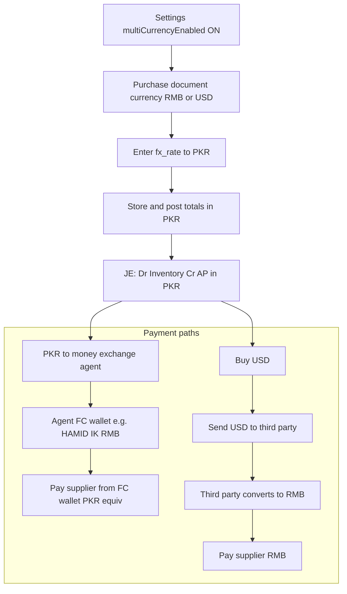

# Multi-Currency Import FX — Roadmap

**Product:** DIN Collection / NEW POSV3 ERP (import purchasing FX)  
**Rule:** [`.cursor/rules/multi-currency-import-fx.mdc`](../../.cursor/rules/multi-currency-import-fx.mdc)  
**Status:** Design roadmap only — no schema/UI/GL shipped from this doc until a phase is explicitly approved  
**Base books currency:** PKR (company `companies.currency`)  
**Document currencies (target):** RMB (CNY), USD (and PKR when single-currency)

---

## Roman Urdu — product summary

Yeh multi-currency **China import / wholesaler purchasing** ke liye hai, retail POS multi-price currency nahi.

- Purchase document aksar **RMB** ya **USD** mein hota hai.
- Company books / inventory / AP / reporting **PKR** rehte hain.
- Payment path 1: PKR → money-exchange **agent** → USD/RMB wallet → supplier ko FC pay (books mein PKR equivalent).
- Payment path 2: pehle **USD buy** → third-party account pe USD → woh USD→RMB convert → supplier ko RMB.
- Settings **Multi Currency Enabled** OFF = aaj jaisa sirf PKR.
- Settings ON = wholesale + purchase/payment screens pe FC entry; GL debit/credit meaning change nahi — amounts PKR post.

**Alag product:** Single Core Ledger docs mein jo “FX / multi-currency **app**” OUT_OF_SCOPE hai woh exchange trading app hai — yahan import purchasing FX intended hai.

---

## English — product summary

Import FX stores foreign document amounts and rates for China/wholesale purchases while posting inventory, AP, and cash in **base PKR** through existing purchase and payment engines. It reuses TT-agent CoA wallets (e.g. `HAMID IK RMB`) as operational FC wallets. It is **not** a dual-currency GL rewrite and **not** a separate FX trading application.

---

## Current state (truth)

| Item | Today |
|------|--------|
| `accounting_settings.multiCurrencyEnabled` | Saved from Settings UI; **no** purchase/payment/wholesale consumer |
| Purchase money columns | PKR only (`subtotal`, `total`, `unit_price`, …) — no `document_currency` / `fx_rate` |
| Display | [`useFormatCurrency`](../../src/app/hooks/useFormatCurrency.ts) formats `companies.currency` — no conversion |
| TT-agent wallets | Named `12xx` accounts + liquidity exclude; amounts still PKR books units |
| OCR `RMB 7000x42.8` | Notes overlay only ([`parsePakBankReceipt.ts`](../../src/app/lib/ocr/parsePakBankReceipt.ts)) |
| `sale_shipments` USD rate | Studio shipping only — not purchase FX |

---

## Target end-to-end flow

| Layer | Behavior when flag ON |
|-------|------------------------|
| Flag OFF | Same as today: PKR-only UI and storage |
| Document | Lines entered in RMB/USD; user enters rate; system computes PKR totals |
| Books / GL | Inventory, AP, cash **PKR only** — same debit/credit meaning as [`PURCHASE_ACCOUNTING_CONTRACT.md`](./PURCHASE_ACCOUNTING_CONTRACT.md) |
| Agent path | PKR → agent → named `12xx` TT wallet → supplier pay (wallet = payment account, amount = PKR) |
| Third-party path | USD buy + transfer journals → convert → supplier settle; rates in metadata until payment FX columns exist |
| Retail POS | Out of scope — no multi-currency retail prices |

---

## Phases (lockdown-safe)

Hard stops: follow [`.cursor/rules/system-lockdown-safety.mdc`](../../.cursor/rules/system-lockdown-safety.mdc). Additive columns only; no DROP / destructive ALTER on money tables; no dual-entry rewrite without explicit user approval.

### Phase 0 — Wire the flag + UX helpers (no migration)

**Goal:** Toggle stops being cosmetic; UI helps enter FC × rate → PKR; GL still driven by existing PKR fields.

Checklist:

- [ ] Read `accountingSettings.multiCurrencyEnabled` from [`SettingsContext.tsx`](../../src/app/context/SettingsContext.tsx) in purchase/payment/wholesale UIs
- [ ] [`PurchaseForm.tsx`](../../src/app/components/purchases/PurchaseForm.tsx): when ON — currency (RMB/USD/PKR) + rate + FC amount; computed PKR writes existing `unit_price` / totals
- [ ] [`UnifiedPaymentDialog.tsx`](../../src/app/components/payments/UnifiedPaymentDialog.tsx): include TT-agent wallets via [`isPartyTtAgentWalletAccount`](../../src/app/lib/liquidityPaymentAccount.ts) (today 100/101/102 filters may hide them)
- [ ] [`WholesaleImportClearanceWorkflow.tsx`](../../src/app/wholesale/WholesaleImportClearanceWorkflow.tsx): FC/rate helpers next to supplier vs courier due
- [ ] Settings help text: do not claim “FX enabled” until consumers read the flag; update copy when Phase 0 ships

**Key files:** `SettingsPageNew.tsx`, `PurchaseForm.tsx`, `PurchaseItemsSection.tsx`, `UnifiedPaymentDialog.tsx`, `WholesaleImportClearanceWorkflow.tsx`, `liquidityPaymentAccount.ts`

### Phase 1 — Additive persistence (still PKR GL)

**Goal:** Persist document currency and foreign amounts; posting engines still use PKR amounts.

Forward migration under [`migrations/`](../../migrations/) only (nullable, no DROP):

| Table | Additive columns |
|-------|------------------|
| `purchases` | `document_currency`, `fx_rate_to_base`, `foreign_subtotal`, `foreign_total` |
| `purchase_items` (optional) | `foreign_unit_price`, `foreign_line_total` |
| `payments` (optional) | `foreign_amount`, `fx_rate` |

Checklist:

- [ ] Migration + `purchaseService` / insert keys / update RPCs aware of new nullable columns
- [ ] JE builders unchanged in debit/credit meaning — PKR drives [`purchaseAccountingService`](../../src/app/services/purchaseAccountingService.ts) / [`documentPostingEngine`](../../src/app/services/documentPostingEngine.ts)
- [ ] Pattern precedent: wholesale clearance additive columns ([`20260708120000_wholesale_import_freight_settlement.sql`](../../migrations/20260708120000_wholesale_import_freight_settlement.sql))

### Phase 2 — Codify payment wizards

**Goal:** First-class agent and third-party convert paths (process UI), still one PKR JE per payment.

Checklist:

- [ ] **Agent wizard:** fund TT wallet (PKR out) → pay supplier from wallet (`createSupplierPayment` / `record_payment_with_accounting`, Dr AP / Cr wallet PKR)
- [ ] **Third-party convert wizard:** USD buy → third-party account → RMB settle; reuse CoA naming; no dual-currency subledger
- [ ] Mobile: same flag gate in [`erp-mobile-app`](../../erp-mobile-app/) purchase/pay when web Phase 1–2 ships (parallel client contract)

**Key files:** `supplierPaymentService.ts`, `recordPaymentWithAccountingRpc.ts`, `purchaseService.recordPayment`, mobile `MobilePaySupplier` / purchase create flows

### Phase 3 — Explicit later approval only

Out of this roadmap unless lockdown is lifted for GL meaning changes:

- FX gain/loss accounts
- Rate revaluation / dual-currency subledgers
- True multi-currency trial balance

---

## File map (implementation touch list)

| Area | Paths |
|------|--------|
| Flag persist/load | `src/app/context/SettingsContext.tsx`, `src/app/services/settingsService.ts`, `src/app/components/settings/SettingsPageNew.tsx` |
| Purchase UI | `src/app/components/purchases/PurchaseForm.tsx`, `PurchaseItemsSection.tsx`, `PurchasesPage.tsx` |
| Purchase write/post | `src/app/services/purchaseService.ts`, `purchaseAccountingService.ts`, `documentPostingEngine.ts` |
| Payments | `UnifiedPaymentDialog.tsx`, `supplierPaymentService.ts`, `recordPaymentWithAccountingRpc.ts` |
| Wholesale clearance | `src/app/wholesale/WholesaleImportClearanceWorkflow.tsx`, `wholesaleImportPurchaseCalc.ts` |
| TT-agent detection | `src/app/lib/liquidityPaymentAccount.ts`, `migrations/20260707140000_unified_ledger_party_tt_agent_wallet.sql` |
| Mobile (Phase 2) | `erp-mobile-app/src/components/purchase/`, pay-supplier flows |
| Contracts | `docs/accounting/PURCHASE_ACCOUNTING_CONTRACT.md`, `PAYMENT_ENTRY_PATHS.md` |

---

## Explicit non-goals

1. **Not** an FX / multi-currency **exchange app** (separate product in Single Core Ledger governance).
2. **GL stays PKR** for inventory, AP, and cash through Phases 0–2 — no dual-book FC ledger.
3. **No** retail POS multi-currency pricing.
4. **No** Phase 0–2 work without explicit phase approval (this doc alone does not authorize migrations or money-path edits).

---

## Approval gate

| Phase | Needs before coding |
|-------|---------------------|
| 0 | User approve UI-only work |
| 1 | User approve additive migration on `purchases` (+ optional items/payments) |
| 2 | User approve payment wizard UX + mobile scope |
| 3 | Explicit lockdown lift for GL meaning / FX P&amp;L |
