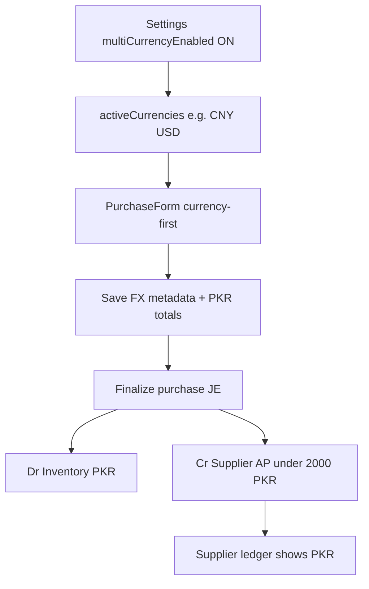
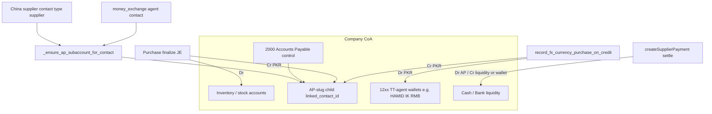

# Multi-Currency Import FX — Workflow + Chart of Accounts

**Product:** DIN Collection / NEW POSV3 ERP (China import / wholesaler purchasing FX)  
**Audience:** Ops + accounting + agents discussing further changes  
**Related:**
- Roadmap (phases 0–3): [`MULTI_CURRENCY_IMPORT_FX_ROADMAP.md`](./MULTI_CURRENCY_IMPORT_FX_ROADMAP.md)
- Ops howto (Abu Ilyas paper statement): [`ABU_ILYAS_SUPPLIER_LEDGER_HOWTO.md`](./ABU_ILYAS_SUPPLIER_LEDGER_HOWTO.md)
- Payment Path 21 (Agent FX): [`PAYMENT_ENTRY_PATHS.md`](./PAYMENT_ENTRY_PATHS.md)
- Cursor rule: [`.cursor/rules/multi-currency-import-fx.mdc`](../../.cursor/rules/multi-currency-import-fx.mdc)
- Purchase GL contract: [`PURCHASE_ACCOUNTING_CONTRACT.md`](./PURCHASE_ACCOUNTING_CONTRACT.md)

**Base books currency:** PKR (`companies.currency`)  
**Document currencies (flag ON):** PKR + `activeCurrencies` (typically CNY/RMB, USD)  
**Status:** Phases 0–2 agent dual-credit path shipped (flag-gated). Phase 3 (dual-currency ledger / FX gain-loss) **approved nahi**.

---

## 1. Purpose / scope (Roman Urdu)

Yeh module **China import aur wholesaler purchasing** ke liye hai:

- Purchase bill aksar **RMB (CNY)** ya **USD** mein aati hai.
- Company ki books, inventory value, AP, cash, reports **PKR** rehte hain.
- Settings **Multi Currency Enabled** OFF = pehle jaisa sirf PKR.
- Settings ON = purchase pe foreign currency + rate; GL amounts `FC × rate` se PKR ban kar post.

**Scope mein nahi:**

- Retail POS multi-currency pricing
- Alag FX trading / exchange **app** (Single Core Ledger docs mein OUT_OF_SCOPE wala product)
- Dual-currency trial balance / FX gain-loss (Phase 3 — alag approval)

---

## 2. Observed case — “RMB purchase, supplier ledger PKR”

**Verdict: yeh bug nahi, current design hai.**

| Step | Kya hota hai |
|------|----------------|
| 1 | Settings → Multi Currency ON + Active foreign currencies mein CNY (UI “RMB” likho to code **CNY** store hota hai) |
| 2 | Purchase create → document currency **CNY**, `fx_rate_to_base` enter |
| 3 | Lines Price/Total **foreign** (RMB); system PKR `unit_price` / `total` = FC × rate |
| 4 | Finalize → journal: Dr Inventory / Cr Supplier AP — **sirf PKR amounts** |
| 5 | Supplier / party ledger AP rows `journal_entry_lines` se aati hain → format **company PKR** |

**Formula (books):**

```text
PKR_amount = foreign_total × fx_rate_to_base
```

Paper pe RMB reconcile karna ho to: purchase form / print pe FC fields dekho, ya notes mein RMB + rate likho. Ledger screen abhi **FC column nahi** dikhati.

---

## 3. End-to-end workflow



### 3.1 Settings layer

| Item | Detail |
|------|--------|
| Storage | Company settings JSON key `accounting_settings` (dedicated FX table nahi) |
| Flags | `multiCurrencyEnabled`, `activeCurrencies` |
| Load / save | [`SettingsContext.tsx`](../../src/app/context/SettingsContext.tsx), [`settingsService.ts`](../../src/app/services/settingsService.ts) |
| UI | [`SettingsPageNew.tsx`](../../src/app/components/settings/SettingsPageNew.tsx) — “Active foreign currencies”; `RMB` → `CNY` normalize |
| Helpers | [`importFxHelpers.ts`](../../src/app/lib/importFxHelpers.ts) — `resolveActiveImportCurrencies`, `foreignToBasePkr`, … |

**Flag OFF:** PKR-only UI; FX columns null chhoro; Agent FX wizard / FC RPCs use mat karo.

### 3.2 Purchase document (currency-first)

**UI:** [`PurchaseForm.tsx`](../../src/app/components/purchases/PurchaseForm.tsx), [`PurchaseItemsSection.tsx`](../../src/app/components/purchases/PurchaseItemsSection.tsx)  
**Write path:** [`purchaseService.ts`](../../src/app/services/purchaseService.ts) / PurchaseContext mapping  
**Schema:** [`migrations/20260801190000_fx_currency_purchase_schema.sql`](../../migrations/20260801190000_fx_currency_purchase_schema.sql)

| Table | PKR (GL drivers) | FX metadata (nullable) |
|-------|------------------|-------------------------|
| `purchases` | `subtotal`, `total`, `paid_amount`, `due_amount`, … | `document_currency`, `fx_rate_to_base`, `foreign_subtotal`, `foreign_total` |
| `purchase_items` | `unit_price`, `total` | `foreign_unit_price`, `foreign_line_total` |
| `payments` | payment amount PKR | optional `foreign_amount`, `fx_rate`, `document_currency` (dialog aksar abhi fill nahi karta) |

**Rule:** JE / inventory / due books columns = PKR. Foreign columns = document audit / paper reconciliation.

### 3.3 Finalize → GL posting

Posting engine **FX columns read nahi karta**. PKR `total` / `subtotal` se existing purchase accounting chalti hai:

- [`documentPostingEngine`](../../src/app/services/documentPostingEngine.ts) → `postPurchaseDocumentAccounting`
- [`purchaseAccountingService`](../../src/app/services/purchaseAccountingService.ts) → `createPurchaseJournalEntry` / `buildPurchaseDocumentJournalLines`

Typical China credit purchase JE (meaning same as PKR-only era):

| Side | Account family | Amount |
|------|----------------|--------|
| Debit | Inventory / stock (purchase contract ke mutabiq) | PKR |
| Credit | Supplier AP child under control **2000** | PKR |

Debit/credit **meaning** change nahi — sirf amount source FC × rate se aaya.

### 3.4 Supplier ledger path (kyun PKR dikhta hai)

Ledger **purchases.foreign_*** se amount nahi uthati. Woh AP journal lines sum karti hai.

| Layer | Path |
|-------|------|
| RPC | `get_supplier_ap_gl_ledger_for_contact`, `get_contact_party_gl_balances` |
| Service | [`accountingService.getSupplierApGlJournalLedger`](../../src/app/services/accountingService.ts), party / statement center services |
| UI | Effective Party Ledger, Ledger Statement Center V2, Generic/Unified ledger, Account Ledger report |
| Format | [`useFormatCurrency`](../../src/app/hooks/useFormatCurrency.ts) → `companies.currency` (PKR) |

Is liye RMB purchase ke baad bhi party ledger row **PKR** mein correct hai: woh books ki zabaan hai.

---

## 4. Chart of Accounts linking



### 4.1 Supplier / agent AP under 2000

Function: `_ensure_ap_subaccount_for_contact` (schema migration + RPCs)

| Contact type | AP child? |
|--------------|-----------|
| `supplier` / `both` | Haan — `AP-{slug}`, `linked_contact_id` |
| `money_exchange` | Haan — agent ka AP bhi 2000 ke neeche |
| Other | Control 2000 pe fallback (party child nahi) |

Purchase finalize China supplier ko **us ke AP child** pe credit karti hai (PKR).

### 4.2 TT-agent wallets (12xx)

- Named liquidity accounts (misal: `HAMID IK RMB`) — operational FC wallet **label**, books amount ab bhi **PKR**.
- Detection: `_is_tt_agent_wallet_account` / [`liquidityPaymentAccount.ts`](../../src/app/lib/liquidityPaymentAccount.ts) `isPartyTtAgentWalletAccount`
- Flag ON: payment dialog Bank section mein yeh wallets dikh sakte hain ([`UnifiedPaymentDialog.tsx`](../../src/app/components/shared/UnifiedPaymentDialog.tsx))

### 4.3 Agent dual-credit path (Path 21)

**Mat use karo** `record_payment_with_accounting` FC credit ke liye — woh hamesha Dr AP / Cr liquidity pattern hai.

| Step | Mechanism | JE meaning (PKR) |
|------|-----------|------------------|
| 1. Credit buy FC | RPC `record_fx_currency_purchase_on_credit` | Dr TT wallet / Cr Agent AP; `amount_pkr = round(foreign × rate)` |
| 2. Agent settle | `createSupplierPayment` + `apply_fx_currency_purchase_settlement` | Agent AP down; liquidity / path per payment |
| 3. China settle from wallet | `createSupplierPayment` purchase-linked | Supplier AP down; wallet / bank credit side |

**Cancel / void order (important):** Payment cancel alone does **not** unwind the Step‑1 FX credit JE (`fx_currency_purchase`). Correct unwind:

1. Void/cancel **China settle** payment (if any)  
2. Void/cancel **agent settle** payment (if any)  
3. Void the **FX credit** via `voidFxCurrencyPurchaseCredit` (or Journal Reverse on the credit JE — finalize voids original + `correction_reversal` and sets `fx_currency_purchases.status = void`)

Otherwise the wallet/Agent AP credit JV stays visible (or shows as `JV‑…(+1)` with its reversal) even after payments are voided.

**UI / service:** [`ImportFxAgentWizard.tsx`](../../src/app/components/purchases/ImportFxAgentWizard.tsx), [`importFxAgentService.ts`](../../src/app/services/importFxAgentService.ts) (`voidFxCurrencyPurchaseCredit`)  
**Tables:** `fx_currency_purchases`, `fx_currency_purchase_settlements`  
**RPC migration:** [`migrations/20260801190100_fx_currency_purchase_rpcs.sql`](../../migrations/20260801190100_fx_currency_purchase_rpcs.sql)

Detail table: Payment Entry Paths **Path 21**.

### 4.4 Payment path summary (ops)

1. **Seedha PKR pay** supplier ko — ordinary Make Payment; notes mein RMB + rate.
2. **Agent path** — PKR → money-exchange agent → wallet → China supplier (upar Path 21).
3. **Third-party USD→RMB convert wizard** — roadmap Phase 2 incomplete; abhi manual / notes.

---

## 5. Key files map (quick)

| Area | Paths |
|------|--------|
| Settings | `SettingsContext.tsx`, `settingsService.ts`, `SettingsPageNew.tsx` |
| FX helpers | `importFxHelpers.ts` |
| Purchase UI | `PurchaseForm.tsx`, `PurchaseItemsSection.tsx`, `PurchasesPage.tsx` |
| Purchase write/post | `purchaseService.ts`, `purchaseAccountingService.ts`, `documentPostingEngine.ts` |
| Agent FX | `ImportFxAgentWizard.tsx`, `importFxAgentService.ts` |
| Payments | `UnifiedPaymentDialog.tsx`, `supplierPaymentService.ts` |
| Ledger | `GenericLedgerView.tsx`, `UnifiedLedgerView.tsx`, Ledger Statement Center V2, `EffectivePartyLedgerPage.tsx` |
| Migrations | `20260801190000_fx_currency_purchase_schema.sql`, `20260801190100_fx_currency_purchase_rpcs.sql` |

---

## 6. Abhi kya shipped nahi (expectations)

| Expectation | Reality aaj |
|-------------|-------------|
| Supplier ledger rows RMB mein | Nahi — AP GL **PKR only** |
| Open due FC mein party balance | `due_amount` / GL = PKR; FC due sirf purchase UI estimate |
| Pay dialog `payments.foreign_*` auto-fill | Columns hain; dialog aksar null chhorta hai — notes use karo |
| Dual-currency TB / FX gain-loss | Phase 3 — lockdown + explicit approval |
| Third-party convert wizard | Phase 2 incomplete |
| Mobile full parity | Baad / parallel client contract |

Paper China statement (CT/PC/METRE, REC PAY): ops steps [`ABU_ILYAS_SUPPLIER_LEDGER_HOWTO.md`](./ABU_ILYAS_SUPPLIER_LEDGER_HOWTO.md).

---

## 7. Further changes — discussion checklist

Jab aap agent se change discuss karo, pehle yeh clear karo **kaunsi layer**:

| Aap ka request (misal) | Likely layer | Lockdown / approval |
|------------------------|--------------|---------------------|
| Ledger pe RMB / CNY column dikhao (display only, GL same) | UI + optional join purchase FX metadata | Relatively safe if amounts still PKR books |
| Party due / balance foreign currency mein “official” | RPC + possibly dual amounts | Phase 3 territory — confirm blast radius |
| Payment dialog pe foreign amount + rate save | UI + fill `payments.foreign_*` | Additive; GL still PKR |
| FX gain/loss jab rate settle pe change ho | New accounts + JE meaning | **Hard stop** — Phase 3 + explicit approval |
| Dual-currency trial balance | GL rewrite class | **Hard stop** |
| Sirf Settings currency list / labels | Settings UI | Low risk |
| Agent / CoA wallet naming | CoA + contact `money_exchange` | Careful; AP ensure already supports |

**System lockdown:** money tables pe destructive ALTER / dual-entry rewrite bina explicit confirmation ke nahi. Prefer additive columns + existing RPCs.

---

## 8. One-line summary

**Import FX = document pe foreign currency + rate; books aur supplier ledger = PKR equivalent (`FC × rate`) under same CoA (Inventory + AP-2000 + optional 12xx wallets).** RMB bill aur PKR ledger dono “sahi” hain — alag zubanein: paper vs books.
