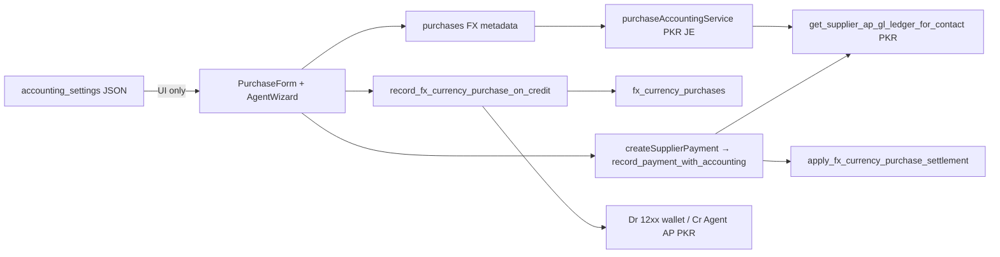

# Multi-Currency Supplier Settlement — Read-Only Implementation Audit

**Document status:** Audit and planning only — does **not** authorize implementation  
**Date:** 2026-08-11  
**Branch audited:** `main` (dirty worktree present at audit time)  
**Canonical next-spec:** [`MULTI_CURRENCY_SUPPLIER_SETTLEMENT_DATABASE_ACCOUNTING_DESIGN.md`](./MULTI_CURRENCY_SUPPLIER_SETTLEMENT_DATABASE_ACCOUNTING_DESIGN.md)  
**Cursor rule:** [`.cursor/rules/multi-currency-import-fx.mdc`](../../.cursor/rules/multi-currency-import-fx.mdc)  
**Lockdown:** [`.cursor/rules/system-lockdown-safety.mdc`](../../.cursor/rules/system-lockdown-safety.mdc)

**Historical shipped references (not rewrite targets):**
- [`MULTI_CURRENCY_IMPORT_FX_ROADMAP.md`](./MULTI_CURRENCY_IMPORT_FX_ROADMAP.md)
- [`MULTI_CURRENCY_IMPORT_FX_WORKFLOW_AND_COA.md`](./MULTI_CURRENCY_IMPORT_FX_WORKFLOW_AND_COA.md)
- [`PAYMENT_ENTRY_PATHS.md`](./PAYMENT_ENTRY_PATHS.md)
- [`PURCHASE_ACCOUNTING_CONTRACT.md`](./PURCHASE_ACCOUNTING_CONTRACT.md)

**Approved audit scope (three areas only):**
1. Additive supplier-settlement tables and allocation model
2. Operational dual-view supplier ledger (FC operational + PKR official GL/AP)
3. Server-side `multiCurrencyEnabled` OFF enforcement

---

## Mandatory accounting boundaries (preserved)

- `accounting_settings.multiCurrencyEnabled` = operational Import FX gate only
- `accounting_settings.fxSettlementAccountingEnabled` remains internal, default `false`
- Multi Currency ON must **not** enable Phase-3 FX gain/loss accounting
- Do **not** create or post pending FX/P&L accounts `1395`, `2295`, `6100`, or `7100`
- Do **not** change GL debit/credit meanings
- Inventory, AP, cash, bank and standard financial reporting remain **PKR**
- Preserve AP control **2000** and supplier/agent AP child behavior
- Preserve named **12xx** TT-agent wallets
- Preserve shipped Agent Credit **Path 21**
- Do **not** overload `record_payment_with_accounting` for FC credit purchase
- Preserve: `record_fx_currency_purchase_on_credit`, `createSupplierPayment`, `apply_fx_currency_purchase_settlement`
- UI may display RMB; database/API must store ISO **CNY**
- Future schema changes must be **additive only** (no destructive ALTER/DROP, historical rewrite, or parallel accounting engine)

---

## 1. Executive verdict

Shipped baseline (Phases 0–2: currency-first purchase FX metadata + Agent Credit **Path 21**) is **compatible** with the canonical design as the live/historical baseline. The canonical settlement layer (`supplier_settlements`, allocations, wallet movements, open items, prepaid funding) **does not exist in the database yet**.

Largest gap: **`multiCurrencyEnabled` is enforced mainly in UI/client code**. `record_fx_currency_purchase_on_credit` / `apply_fx_currency_purchase_settlement` do **not** read company settings. Purchase FX columns are passthrough in `PurchaseContext` / `purchaseService`.

| Wave | Recommendation |
|------|----------------|
| **A — Server OFF checks** | **GO** (narrow) after separate user approval |
| **B–E** | **NO-GO** until each wave gets explicit approval |

Stay on **Profile A** (`fxSettlementAccountingEnabled = false`). Do not provision Phase-3 FX P&L accounts.

---

## 2. Current shipped architecture (code-confirmed)

| Layer | Behavior |
|-------|----------|
| Flag ON | Currency-first purchase; FC × rate → PKR GL drivers; Path 21 wizard; TT wallets in payment Bank filter |
| Flag OFF | UI hides FX; PurchaseForm nulls FX on save; **server does not reject** |
| Books | Inventory / AP / cash / JE lines = **PKR** |
| CoA | AP under **2000** via `_ensure_ap_subaccount_for_contact` (incl. `money_exchange`); named **12xx** TT wallets via `_is_tt_agent_wallet_account` |
| Phase-3 gate | `fxSettlementAccountingEnabled` typed/default `false`; **no runtime journal consumer** |

---

## 3. File-by-file and RPC-by-RPC findings

### 3.1 Repository and migration truth

- **Branch:** `main` (tracks `origin/main`)
- **Dirty worktree:** yes at audit time — Import FX docs/rule/settings + purchase FX UI files modified/untracked; large `graphify-out` noise. Prefer a clean feature branch before any implementation wave.

#### FX migrations

| File | Role |
|------|------|
| [`migrations/20260801190000_fx_currency_purchase_schema.sql`](../../migrations/20260801190000_fx_currency_purchase_schema.sql) | `money_exchange`; AP ensure; TT helper; FX columns; `fx_currency_*` + RLS |
| [`migrations/20260801190100_fx_currency_purchase_rpcs.sql`](../../migrations/20260801190100_fx_currency_purchase_rpcs.sql) | Credit + settle RPCs |
| [`migrations/20260707140000_unified_ledger_party_tt_agent_wallet.sql`](../../migrations/20260707140000_unified_ledger_party_tt_agent_wallet.sql) | TT wallet liquidity exclude |

Order is correct: schema `…190000` then RPCs `…190100`. Neighbors: `20260801130000_settings_modules_rls…` → FX pair → non-timestamped accounting scripts.

**Note:** `supabase-schema.sql` / extract dumps may predate these FX migrations. Deploy truth = applied `migrations/` order.

#### Live FX schema (additive)

| Table | Columns / notes |
|-------|-----------------|
| `purchases` | `document_currency`, `fx_rate_to_base`, `foreign_subtotal`, `foreign_total` (nullable; no FX-specific indexes in migration) |
| `purchase_items` | `foreign_unit_price`, `foreign_line_total` |
| `payments` | `foreign_amount`, `fx_rate`, `document_currency` (rarely populated by pay path) |
| `fx_currency_purchases` | company/branch/agent/wallet/FC/PKR/status/JE/linked_purchase; indexes `(company,status,created_at)`, `(company,agent)`; RLS company via `get_user_company_id()` |
| `fx_currency_purchase_settlements` | `(fx_currency_purchase_id, payment_id)` UNIQUE; `amount_pkr`; RLS same |

#### Canonical design table names — existence

| Design name | Exists in DB/migrations/types? |
|-------------|-------------------------------|
| `supplier_settlements` | **No** |
| `supplier_settlement_allocations` | **No** |
| `agent_fundings` / `agent_funding_allocations` | **No** |
| `currency_conversions` | **No** |
| `wallet_movements` | **No** |
| `supplier_fx_open_items` / `supplier_open_items` | **No** |
| `foreign_currency_wallets` | **No** (12xx CoA accounts are the live wallet identity) |
| FX review / reconciliation exception tables | **No** |

Only shipped FX tables: `fx_currency_purchases`, `fx_currency_purchase_settlements`.

### 3.2 Key RPCs / services

| Asset | Gate on `multiCurrencyEnabled`? |
|-------|----------------------------------|
| `record_fx_currency_purchase_on_credit` | **No** (hardcodes CNY\|USD allowlist) |
| `apply_fx_currency_purchase_settlement` | **No** |
| `createSupplierPayment` → `record_payment_with_accounting` | **No** (PKR only — correct for GL) |
| `importFxAgentService.assertMultiCurrencyEnabled` | Client boolean argument only |
| `PurchaseContext` / `purchaseService` FX columns | **No** server/settings check |
| `purchaseAccountingService` / `documentPostingEngine` | Ignore FX; use PKR totals |
| `get_supplier_ap_gl_ledger_for_contact` / `get_unified_party_ledger` | PKR JE only; no FC fields |
| `_ensure_ap_subaccount_for_contact` | Includes `money_exchange` |
| `_is_tt_agent_wallet_account` | 12xx + name heuristics |

### 3.3 Module gating matrix

| Surface | UI gate? | Service gate? | RPC gate? |
|---------|----------|---------------|-----------|
| SettingsContext / settingsService / SettingsPageNew | Toggle | Persist | N/A |
| PurchaseForm / PurchaseItemsSection / PurchasesPage wizard | Yes | Form nulls FX when OFF | No |
| ImportFxAgentWizard | Yes | Passes literal `true` to service | No |
| UnifiedPaymentDialog TT wallets | Yes | No | No |
| WholesaleImportClearanceWorkflow | Display only | No FX writes | — |
| erp-mobile-app / POS | No Import FX consumers | — | — |

#### Bypass paths (UI gated, server open)

1. Direct RPC `record_fx_currency_purchase_on_credit` / `apply_fx_currency_purchase_settlement`
2. Direct table writes to FX columns / `fx_currency_*` (RLS = company membership, not flag)
3. `PurchaseContext` / `purchaseService` if any caller supplies FX fields while flag OFF
4. `importFxAgentService` assert trusts caller boolean — can pass `true` while company setting is OFF
5. `createSupplierPayment` with known TT wallet `paymentAccountId` (UI hides wallets; service open)
6. Settings can switch OFF while open agent FX credits exist (no blocker)

### 3.4 Supplier ledger path (official PKR)

| Layer | Path |
|-------|------|
| RPC | `get_supplier_ap_gl_ledger_for_contact`, `get_unified_party_ledger`, `get_contact_party_gl_balances` |
| Math | AP liability style: `credit − debit` on control **2000** subtree |
| Service | `accountingService.getSupplierApGlJournalLedger`; unified loaders for Effective Party / Statement Center V2 |
| UI | GenericLedgerView, UnifiedLedgerView, EffectivePartyLedgerPage, LedgerStatementCenterV2, AccountLedgerReportPage |
| Mobile | `PartyLedgerReport` → same supplier AP GL RPC |
| FC in ledger | **None** in RPC or `AccountLedgerEntry` |

`createSupplierPayment` never writes `payments.foreign_*`; Import FX settle uses PKR amounts only.

### 3.5 `fxSettlementAccountingEnabled`

Persisted in `SettingsContext` / `settingsService` / accounting save coerce (`=== true` only). **No** Settings Phase-3 toggle. **No** SQL/journal consumers. Correct for Profile A.

---

## 4. Canonical-design compatibility matrix

| Canonical concept | Live asset | Status |
|-------------------|------------|--------|
| `multiCurrencyEnabled` | `accounting_settings` JSON | **Reuse** |
| `activeCurrencies` + RMB→CNY | Settings + PurchaseForm normalize | **Reuse** |
| `fxSettlementAccountingEnabled=false` | JSON default false, unused | **Wired; keep false** |
| Purchase FX metadata | `purchases` / `purchase_items` columns | **Reuse** (not a new `purchase_invoices` table) |
| Parties | `contacts` + AP-2000 children | **Reuse** (not a new `parties` master) |
| 12xx TT wallets | CoA + heuristic | **Reuse**; optional metadata keyed to `accounts.id` |
| Path 21 | `fx_currency_*` + RPCs | **Preserve / extend** |
| `payments.foreign_*` | Columns exist; usually null | **Extend** (populate additively) |
| Settlement header / allocations / open items / funding / conversion / movements | Missing | **New additive** (Waves B/D/E) |
| Dual-view ledger | GL RPCs PKR-only | **Additive UI + read model** (Wave C) |
| Phase-3 CoA 1395/2295/6100/7100 | Must not provision from toggle | **Blocked** |

**Naming conflict risk:** design names `purchase_invoices`, `parties`, `foreign_currency_wallets` must map to existing masters — do not create parallel sources of truth.

---

## 5. Exact gaps

1. Server/RPC does not read `multiCurrencyEnabled` or `activeCurrencies`.
2. No safe-OFF blocker (open `fx_currency_purchases`, future wallet qty, allocations, exceptions).
3. No settlement orchestration tables; Path 21 is credit-buy only, not a full settlement schedule.
4. No operational supplier FC open-item / allocation ledger.
5. No wallet **quantity** subledger (`wallet_movements`).
6. No prepaid-agent funding (Path 21 ≠ prepaid).
7. No third-party conversion legs.
8. Official supplier ledger = PKR only; no dual-view.
9. `payments.foreign_*` unused by `createSupplierPayment`.
10. No `FX_REVIEW_REQUIRED` exception store (Profile A difference handling).
11. No dedicated FX RBAC roles (`CREATE_FX_PURCHASE`, etc.).
12. Mobile has no Import FX parity.
13. Schema dumps may be stale vs FX migrations.
14. Dirty `main` worktree — hygiene before coding waves.

---

## 6. Proposed additive migration plan (filenames only — not authorized)

Suggested order after live DB re-audit that `20260801190000` / `190100` are applied:

| Wave | Suggested migration filenames |
|------|-------------------------------|
| A | `migrations/20260812XXXXXX_import_fx_require_multi_currency_enabled.sql` — helper `_company_import_fx_enabled(company_id)`; patch credit/settle RPCs; optional `assert_can_disable_import_fx` |
| A | `migrations/20260812XXXXXX_purchases_fx_write_guard.sql` — trigger/RPC reject non-null FX writes when OFF |
| B | `…_supplier_fx_open_items.sql`, `…_supplier_settlements.sql`, `…_supplier_settlement_allocations.sql`, `…_fx_reconciliation_exceptions.sql` |
| B | Extend `fx_currency_purchase_settlements` with nullable links **or** a bridge table — **do not replace** Path 21 |
| C | Views/RPCs read-only: e.g. `get_supplier_fx_operational_summary` (no JE rewrite) |
| D | `…_agent_fundings.sql`, `…_agent_funding_allocations.sql` (+ clearing account config, not hard-coded) |
| E | `…_currency_conversions.sql`, `…_wallet_movements.sql`, optional `foreign_currency_wallet_meta` |

All migrations: `CREATE … IF NOT EXISTS` / nullable columns only. **No DROP**. No Phase-3 accounts.

---

## 7. Proposed service / API / RPC changes

| Area | Proposal |
|------|----------|
| FX RPCs | Require `multiCurrencyEnabled`; currency ∈ `activeCurrencies`; normalize RMB→CNY |
| `importFxAgentService` | Re-read settings from DB; do not trust caller boolean alone |
| Purchase write | Server reject FX metadata when OFF (trigger or create RPC) |
| `createSupplierPayment` | Optionally populate `payments.foreign_*` when module ON; **GL amounts stay PKR**; never use `record_payment_with_accounting` for FC credit buy |
| New settlement service | Separate commands; Path 21 remains; prepaid/settlement modes additive |
| Settings save | Call `assert_can_disable_import_fx` when turning OFF |

---

## 8. Proposed dual-view ledger changes

**Keep official truth:** `get_supplier_ap_gl_ledger_for_contact` / `get_unified_party_ledger` → `credit − debit` on AP-2000 (PKR).

**Add sibling operational layer (Wave C):**

- Source: `purchases.foreign_*` + rate; later `supplier_fx_open_items` + `supplier_settlement_allocations`
- UI: Effective Party / Statement Center / GenericLedger GL tab / mobile — toggle “Operational FC”
- Per invoice math:
  - Original FC amount
  - FC paid (sum allocations)
  - FC remaining
  - Allocated book PKR = `original_book × alloc_fc / original_fc`
  - Actual PKR settlement cost
  - `fx_difference_pkr` = actual − allocated book (store/display; **no auto JE** while Phase-3 OFF)
- Avoid double-count: one open-item per posted foreign purchase; allocations reference open_item; Path 21 agent credit ≠ China supplier open-item (separate parties)
- Indexes: `(company_id, supplier_id, status)` on open items; `(settlement_id)`, `(open_item_id)` on allocations

**Files likely later:** `accountingService.ts`, ledger V2 / EffectiveParty / GenericLedgerView, new `supplierFxOperationalService.ts`; mobile only after shared contract.

---

## 9. Proposed server OFF-check locations

| Location | Check |
|----------|--------|
| SQL `record_fx_currency_purchase_on_credit` | Company must have Import FX enabled |
| SQL `apply_fx_currency_purchase_settlement` | Same |
| Future settlement/funding/conversion RPCs | Same |
| Purchase insert/update FX columns | Reject non-null FX when OFF |
| `updateAccountingSettings` when `multiCurrencyEnabled` true→false | Block if open agent FX (`fx_currency_purchases` open/partial); later non-zero wallet qty; unsettled allocations; open `FX_REVIEW_REQUIRED` |
| Prefer SQL function for OFF assert | Cannot bypass from another client |

UI should explain blockers; **UI alone is not security**.

---

## 10. RLS, permissions, concurrency, idempotency risks

- Current FX RLS = company membership only — **not** feature flag / fine-grained FX roles
- SECURITY DEFINER FX RPCs callable by authenticated company users with grants
- Path 21 has `(credit, payment)` unique; full settlement needs idempotency keys + row locks on open-item FC remaining
- Concurrent partial pays (design Scenario G): need `SELECT … FOR UPDATE` on open items
- Reversal: no full FX reversal engine yet; payment void must not orphan future allocations
- `fxSettlementAccountingEnabled` must never flip true merely because Multi Currency turns ON (already coerced)

---

## 11. Backward-compatibility risks

- Historical FX purchases/credits must remain readable when flag OFF
- Tightening RPCs may break scripts that called RPCs while flag OFF (**correct** break)
- Purchase write guard when OFF could break bad clients — return clear errors
- Dual-view mis-join could confuse users into treating FC as GL — copy must say “operational”
- Extending `fx_currency_purchase_settlements` vs a new bridge — wrong choice could couple China allocations to agent credit incorrectly

---

## 12. Test plan

### Wave A
- OFF + direct credit RPC fails
- ON + credit succeeds
- Settle fails when OFF
- Purchase FX insert fails when OFF
- OFF blocked with open credit; allowed when all closed
- Phase-3 flag stays false
- UI RMB stores as CNY

### Wave B+
- Design §12 scenarios 0A–0D, A–H under Profile A (difference stored/displayed; **no** pending FX JE)

### Ledger
- PKR running balance unchanged with FC panel on
- No duplicate rows across purchases + payments + allocations

### Regression
- Path 21 three steps unchanged
- PKR-only purchase finalize JE unchanged
- Trial balance still PKR

---

## 13. Recommended implementation waves

### Wave A — Server-side OFF checks — **GO (narrow)**

| Item | Detail |
|------|--------|
| Likely files | Successor migration to patch FX RPCs; `importFxAgentService.ts`; Settings OFF path; optional purchase FX write guard |
| Migrations/RPCs | `_company_import_fx_enabled`; patch credit/settle; `assert_can_disable_import_fx` |
| Dependencies | None on settlement tables |
| Risks | Breaks unauthorized bypass callers (intended); settings JSON key must match live `settings` table |
| Acceptance | Bypass paths rejected; Path 21 ON still works; no new CoA; no Phase-3 |
| Separate user approval | **Required before coding** |

### Wave B — Core settlement + allocation persistence — **NO-GO now**

| Item | Detail |
|------|--------|
| Scope | Open items / settlements / allocations / exceptions; populate `payments.foreign_*`; preserve Path 21 |
| Dependencies | Wave A strongly recommended first |
| Risks | Double AP; allocation rounding; lockdown money-path surface |
| Separate user approval | **Required** + migration review |

### Wave C — Dual-view supplier ledger — **NO-GO now**

| Item | Detail |
|------|--------|
| Scope | Sibling FC UI + read RPC/view; **do not** change AP JE math |
| Dependencies | Wave B open items ideal; interim view from `purchases.foreign_*` incomplete for partials |
| Separate user approval | **Required** (UI contract for all clients) |

### Wave D — Prepaid-agent workflow — **NO-GO now**

| Item | Detail |
|------|--------|
| Scope | `agent_fundings` + clearing; **additional** to Path 21 (not a replacement) |
| Dependencies | Waves A + B |
| Separate user approval | **Required** (new clearing JE meaning vs agent-credit AP) |

### Wave E — Third-party PKR → USD → RMB — **NO-GO now**

| Item | Detail |
|------|--------|
| Scope | `currency_conversions` + `wallet_movements` |
| Dependencies | B/D + wallet quantity model |
| Separate user approval | **Required**; still Profile A |

---

## GO / NO-GO — Wave A only

### **GO — Wave A only**, with conditions:

1. Explicit user approval to implement Wave A (this audit document does **not** authorize code).
2. Scope limited to: settings-aware RPC/purchase guards + safe OFF assert; **no** settlement tables; **no** dual-view UI; **no** Phase-3 accounts; Path 21 semantics unchanged.
3. Live DB re-audit that `20260801190000` / `190100` are applied before patching functions.
4. Work on a clean feature branch off an agreed baseline (current `main` was dirty at audit time).

**Waves B–E: NO-GO** until Wave A ships (or is consciously waived) and each wave receives its own approval under Profile A (`fxSettlementAccountingEnabled = false`).

---

## Related canvas (optional UI summary)

IDE canvas (if present): `fx-settlement-readonly-audit.canvas.tsx` in the Cursor project canvases folder — summary board only; this markdown file is the durable repo record.
