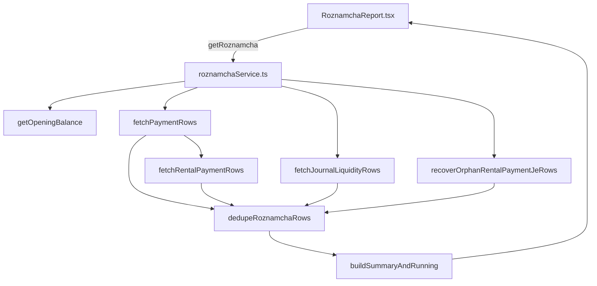

# Roznamcha — data sources & duplicate rows

**UI:** Accounting → **Roznamcha** tab  
**Component:** [`RoznamchaReport.tsx`](../../src/app/components/reports/RoznamchaReport.tsx)  
**Service:** [`getRoznamcha`](../../src/app/services/roznamchaService.ts)

See also: [index](ACCOUNTING_REPORTS_INDEX.md) · [short policy doc](../infra/ROZNAMCHA_CASH_BOOK.md) · [2026-06-04 rental RCV fix](2026-06-04_RENTAL_PAYMENT_ROZNAMCHA_FIX.md)

---

## 1. Purpose

Roznamcha is the **daily cash book**: one row per **actual** cash, bank, or wallet movement (money in or out). It is **not** the full general ledger — invoice totals, AR/AP balances, and non-liquidity journal lines are excluded by design.

This document explains **where each row comes from**, **how deduplication works**, and **why duplicates or missing lines still appear** — for study before Phase 2 fixes.

---

## 2. User-reported symptoms

- **Duplicate Roznamcha lines** for the same rental receipt (same ref and/or same amount on the same date)
- **Missing Rs 10,000 rental receipt** — payment exists in operations but not visible in Roznamcha for the selected period/branch

---

## 3. UI → service → database flow



**Entry point** (`getRoznamcha`, lines ~2225–2277):

1. Opening balance from movements before `dateFrom`
2. `fetchPaymentRows` — `payments` table (+ embedded `fetchRentalPaymentRows`)
3. `fetchJournalLiquidityRows` — liquidity lines on JEs with `payment_id IS NULL`
4. `recoverOrphanRentalPaymentJeRows` — rental_party_payment JEs not already represented
5. `dedupeRoznamchaRows` — three-pass collapse
6. Running balance + summary

---

## 4. Tables & columns

| Stream | Function | Tables | Key columns |
|--------|----------|--------|-------------|
| **A — Payments** | `fetchPaymentRows` | `payments` | `payment_date`, `amount`, `payment_type`, `reference_type`, `reference_id`, `reference_number`, `payment_account_id`, `branch_id`, `voided_at` |
| **B — Rental payments** | `fetchRentalPaymentRows` (inside A path) | `rental_payments` + `rentals` | `payment_date`, `amount`, `reference`, `journal_entry_id`, `payment_account_id`; rental `booking_no`, `branch_id` |
| **C — Journal liquidity** | `fetchJournalLiquidityRows` | `journal_entries` + `journal_entry_lines` + `accounts` | `entry_date`, `payment_id` (must be null), liquidity debit/credit on cash/bank/wallet |
| **D — Orphan recovery** | `recoverOrphanRentalPaymentJeRows` | `journal_entries` (rental_party_payment fingerprint) | Cash debit on liquidity account; skips if movement key already in payment + journal rows |

**Not in Roznamcha** (by design):

- Full AR/AP invoice amounts
- Non-liquidity GL lines (revenue, expense without cash leg)
- Journal entries that already have a matching `payments` or `rental_payments` cash row (when skip logic works)

---

## 5. Filters

| Filter | Field used | Notes |
|--------|------------|-------|
| Date range | `payments.payment_date`; `rental_payments.payment_date` (with JE `entry_date` fallback); JE `entry_date` for journal/orphan paths | Rental row can use JE date when `payment_date` outside range but JE in range |
| Branch | `payments.branch_id` + rental `branch_id` via `paymentMatchesRoznamchaBranch` / `rentalMatchesRoznamchaBranch` | HQ vs branch mismatch can hide rows |
| Account type | `accountFilter`: all / cash / bank / wallet | Via `classifyRoznamchaLiquidity` |
| Ledger account | `paymentLedgerAccountId` | Sub-account filter (e.g. one bank account) |
| Voided | `includeVoidedReversed` (default **false**) | `voided_at IS NULL` on payments/rental_payments |

---

## 6. Reference / display rules

Canonical resolver: `resolveCanonicalRoznamchaRef` (~229–265 in `roznamchaService.ts`).

| Priority | Ref shown | Subtitle |
|----------|-----------|----------|
| 1 | `RCV-*` / `HQ-RCV-*` from `payments.reference_number` or `rental_payments.reference` | `JE-*` when different |
| 2 | `PAY-*`, `WPY-*`, `EXP-*` | `JE-*` when different |
| 3 | Legacy `REN-*-PAY` | `JE-*` |
| 4 | `REN-*` booking (charge context only — **not** preferred for receipts) | `JE-*` |
| 5 | `JE-*` / `JV-*` fallback | — |

**Booking number** (`REN-0002`) belongs in **description / partyLine** (`Rental: REN-0002`), not as the primary receipt ref when `RCV-*` exists.

UI ref column: `roznamchaRefDisplay` — never duplicates JE in ref and subtitle.

---

## 7. Deduplication (three passes)

`dedupeRoznamchaRows` (~313–341):

### Pass 1 — Entity key (strictest)

```298:310:src/app/services/roznamchaService.ts
function roznamchaEntityKey(row: RoznamchaRow): string | null {
  const rpId = String(row.sourceRentalPaymentId || '').trim();
  if (rpId) return `rp:${rpId}`;
  if (row.id.startsWith('rp-')) return `rp:${row.id.slice(3)}`;
  const jeId = String(row.sourceJournalEntryId || '').trim();
  if (jeId) return `je:${jeId}`;
  const orphan = row.id.match(
    /^orphan-rp-([0-9a-f]{8}-[0-9a-f]{4}-[0-9a-f]{4}-[0-9a-f]{4}-[0-9a-f]{12})/i
  );
  if (orphan) return `je:${orphan[1]}`;
  return null;
}
```

Collapses rows sharing the same `rental_payment_id` or `journal_entry_id`. Winner chosen by source priority: **payments > rental_payments > journal** (`roznamchaRowSourcePriority`).

### Pass 2 — Strict movement key

`date|direction|amount|payment_account_id` (`roznamchaMovementKey`, ~150–152)

### Pass 3 — Loose movement key ⚠️

`date|direction|amount` **without account** (`roznamchaLooseMovementKey`, ~155–157)

Two **distinct** receipts same day, same amount, different accounts → **one row hidden**. This is a known risk for “missing Rs 10,000” when another Rs 10,000 exists that day.

### Rental skip (before dedupe)

`fetchRentalPaymentRows` skips a `rental_payments` row only when **both**:

```1515:1519:src/app/services/roznamchaService.ts
    if (
      rentalPaymentsInPaymentsTable.has(matchKey) &&
      rentalPaymentsCoveredByPaymentRows.has(matchKey)
    ) {
      continue;
```

- `rentalPaymentsInPaymentsTable` — a `payments` row exists with `reference_type = rental` and same `rental_id|date|amount|account` key
- `rentalPaymentsCoveredByPaymentRows` — a payment row was **actually emitted** in `fetchPaymentRows` for that key

Partial mirror (payments row exists but filtered out by branch/account) → rental row may still show → duplicate after orphan recovery.

### Orphan recovery gate

`recoverOrphanRentalPaymentJeRows` skips only if **strict movement key** already represented (~2071, 2215–2217), **not** entity key. Different account id or date between payment row and JE → orphan row re-added → duplicate.

---

## 8. Known failure modes (numbered)

| # | Mechanism | When it happens | Code pointer |
|---|-----------|-----------------|--------------|
| 1 | **Same cash movement, two sources** | `payments` (rental) + `rental_payments` for same receipt; entity dedupe fails if orphan uses different JE id than `rental_payments.journal_entry_id` | `dedupeRoznamchaRows`, `recoverOrphanRentalPaymentJeRows` |
| 2 | **Loose movement dedupe** | Two real receipts same day, same amount, different accounts | `roznamchaLooseMovementKey` ~155–157, pass 3 ~334–338 |
| 3 | **`rentalPaymentsCoveredByPaymentRows` gap** | `payments` mirror exists but payment row not emitted (branch/account filter) → rental row not skipped | ~1317–1331, ~1515–1519 |
| 4 | **Orphan recovery vs payment row** | Movement keys differ (account id, date `payment_date` vs `entry_date`) | ~2071, ~2215–2217 |
| 5 | **Historical duplicate refs** | `HQ-RCV-0003` assigned twice after sequence reset — **two real DB movements**, not UI bug | [`repair_branch_prefix_sequence_reset.sql`](../../scripts/sql/repair_branch_prefix_sequence_reset.sql) |
| 6 | **Date / branch filter** | Rs 10k on `rental_payments` with `payment_date` outside range but JE `entry_date` in range (or reverse) | `fetchRentalPaymentRows` date logic ~1524–1528 |
| 7 | **Voided payment** | Row excluded when `includeVoidedReversed` is off | `fetchPaymentRows` ~895 |

---

## 9. Diagnostic queries

Run on VPS: `ssh dincouture-vps` then `docker exec supabase-db psql -U postgres -d postgres` (replace `:company_id`, dates).

### A — Rental receipt: payments vs rental_payments vs JE

```sql
-- Replace IDs/dates for your case (e.g. REN-0002, Rs 10000)
SELECT 'payments' AS src, p.id, p.payment_date, p.amount, p.reference_number,
       p.reference_type, p.reference_id, p.payment_account_id, p.branch_id, p.voided_at
FROM payments p
WHERE p.company_id = :company_id
  AND p.reference_type = 'rental'
  AND p.payment_date BETWEEN :date_from AND :date_to
UNION ALL
SELECT 'rental_payments', rp.id, rp.payment_date, rp.amount, rp.reference,
       'rental', rp.rental_id, rp.payment_account_id, r.branch_id, rp.voided_at
FROM rental_payments rp
JOIN rentals r ON r.id = rp.rental_id
WHERE r.company_id = :company_id
  AND rp.payment_date BETWEEN :date_from AND :date_to;
```

**Look for:** same `rental_id + payment_date + amount` in both tables; mismatched `payment_account_id` or `journal_entry_id`.

### B — Linked journal entries

```sql
SELECT je.id, je.entry_no, je.entry_date, je.reference_type, je.reference_id,
       je.payment_id, je.is_void, je.branch_id
FROM journal_entries je
WHERE je.company_id = :company_id
  AND je.reference_type = 'rental'
  AND je.entry_date BETWEEN :date_from AND :date_to
ORDER BY je.entry_date;
```

### C — Duplicate RCV refs (data, not dedupe)

```sql
SELECT reference_number, COUNT(*), array_agg(id) AS payment_ids
FROM payments
WHERE company_id = :company_id
  AND reference_number LIKE '%RCV%'
GROUP BY reference_number
HAVING COUNT(*) > 1;
```

### D — Same-day same-amount pairs (loose dedupe risk)

```sql
SELECT payment_date, amount, COUNT(*) AS cnt,
       array_agg(reference_number) AS refs
FROM payments
WHERE company_id = :company_id
  AND payment_type = 'received'
  AND voided_at IS NULL
  AND payment_date BETWEEN :date_from AND :date_to
GROUP BY payment_date, amount
HAVING COUNT(*) > 1;
```

### E — Audit scripts in repo

- [`docs/audit/manual_entry_roznamcha_gap.sql`](../audit/manual_entry_roznamcha_gap.sql)
- [`docs/audit/roznamcha_worker_payment_gap.sql`](../audit/roznamcha_worker_payment_gap.sql)

---

## 10. Roznamcha vs Day Book vs Ledger

| | Roznamcha | Day Book | Account Statement |
|---|-----------|----------|-------------------|
| Grain | One cash movement | One JE **line** | One AR/ledger line |
| Rental Rs 10k received | One Cash In (`RCV-*`) | Cash line + AR line + possibly payment-linked lines | Credit on customer AR |
| Duplicate pattern | payments + rental_payments + orphan JE | Same voucher, multiple lines (expected) | GL line + wrong synthetic ref |

Full comparison: [ACCOUNTING_REPORTS_INDEX.md](ACCOUNTING_REPORTS_INDEX.md).

---

## 11. Recommended fix direction (Phase 2 — not implemented here)

1. **Tighten dedupe:** never loose-merge rows with different `sourceJournalEntryId` / `sourceRentalPaymentId`
2. **Orphan recovery:** skip when `rental_payments.journal_entry_id` is already represented in entity pass (not only movement key)
3. **Rental skip:** skip `rental_payments` when `payments` mirror exists OR when emitted payment row covers entity id
4. **Data repair only:** duplicate `HQ-RCV-*` refs → [`repair_branch_prefix_sequence_reset.sql`](../../scripts/sql/repair_branch_prefix_sequence_reset.sql)
5. **Align ledger refs** — see [ACCOUNT_LEDGER_DATA_SOURCES_AND_REFERENCES.md](ACCOUNT_LEDGER_DATA_SOURCES_AND_REFERENCES.md) (REN on receipt rows)

---

## 12. Out of scope

- Changing GL posting rules for rental payments
- Changing void/reversal semantics
- Mass `reference_number` rewrite without collision analysis
