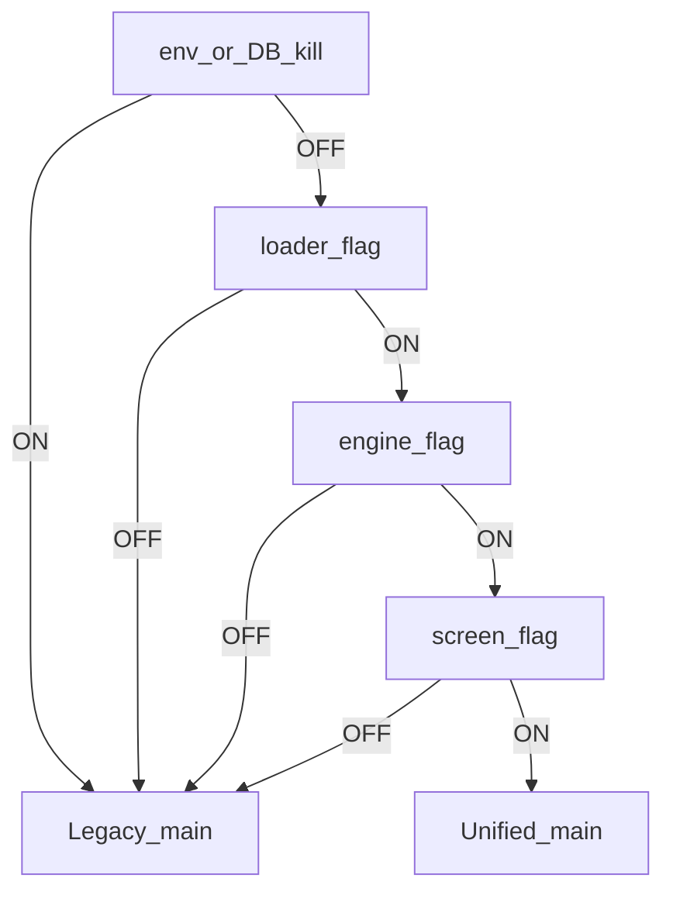

# Single Core Engine A-to-Z Audit — 2026-07-15

**Scope:** OLD ERP / DIN Collection ERP only (not FX / multi-currency exchange app)
**Repo HEAD at original A-to-Z audit:** `5cf65f4c` (later docs commit `26fb7086`)
**Evidence pack:** [`reports/single-core-engine-a-to-z-audit-20260715/`](../../reports/single-core-engine-a-to-z-audit-20260715/)
**Follow-up (same day):** [`SINGLE_CORE_ENGINE_EVIDENCE_RECOVERY_2026-07-15.md`](SINGLE_CORE_ENGINE_EVIDENCE_RECOVERY_2026-07-15.md) · [`AR_AP_BRIDAL_EFFECTIVE_PARTY_INVESTIGATION_2026-07-15.md`](AR_AP_BRIDAL_EFFECTIVE_PARTY_INVESTIGATION_2026-07-15.md)
**R8-R2 readiness (same day, no deletion):** [`R8_R2_FINAL_EXECUTION_READINESS_2026-07-15.md`](R8_R2_FINAL_EXECUTION_READINESS_2026-07-15.md) · [`reports/r8-r2-final-readiness-20260715/`](../../reports/r8-r2-final-readiness-20260715/) · [`R8_R2_EXECUTION_PROMPT_FOR_2026-08-09.md`](R8_R2_EXECUTION_PROMPT_FOR_2026-08-09.md)
**Prior closeout (superseded where conflicting):** [`SINGLE_CORE_ENGINE_CLOSEOUT_FINAL_2026-07-12.md`](SINGLE_CORE_ENGINE_CLOSEOUT_FINAL_2026-07-12.md)

> **Correction note (late 2026-07-15 readiness):** Kill-switch drill PASS remains **CLAIM RETRACTED**. Fresh operator-attended drill is required after soak. **No legacy deletion** performed on 2026-07-15. Soak = **5/30** elapsed; earliest deletion **2026-08-09**. AR/AP Phase 2b remains **production complete**.

---

## 1. Executive summary

The Single Core Engine **eight money-report loaders are operationally live** on DIN CHINA / DIN BRIDAL / DIN COUTURE: production flags show **54 ON**, kill switch **OFF**, unified RPCs **active**, VPS git/runtime HEAD matched GitHub at inspect, `erp-frontend` healthy, HTTPS **200**.

The program is **not technically closed** and **not fully retired**: R8-R2 deletion is deferred (soak from 2026-07-10, earliest **2026-08-09**). Readiness package for one future deletion session is complete. Play Store is **skipped** and is **not** a core blocker.

**Evidence recovery (2026-07-15):** JE-0028 and Sales Revenue Phase 2 non-reclass decision are **VERIFIED** live (original folders still **ORIGINAL EVIDENCE MISSING**). R8-R2 kill-switch drill PASS is **CLAIM RETRACTED** (no pack; fresh drill still required after soak).

**Bridal parity (2026-07-15):** `effective_party` FAIL Δ ~**79,850** company-sum fully explained (JE-0213 + JV-000203). Parity baseline switched to **`official_gl`** under `APPROVE_AR_AP_PHASE2B_PARITY_BASELINE_OFFICIAL_GL` (runtime `a5149971`, VPS deployed). AR/AP Phase 2b **PRODUCTION COMPLETE**.

---

## 2. Exact scope

See [`scope-matrix.md`](../../reports/single-core-engine-a-to-z-audit-20260715/scope-matrix.md).

**CORE:** Ledger V2, Account Statement, Trial Balance, Party Ledger, Roznamcha, Cash Flow, Balance Sheet, P&L + flags/kill/resolvers/monitoring.

**EXTENSION:** AR/AP Reconciliation Center Phase 2b.

**OUTSIDE:** Contacts page RPC, mobile/Play Store, FX app, Phase 8 broad retirement, import-gap WIP.

**AR/AP Phase 2b vs original SCE:** optional/scheduled **Phase 2b extension** — not required for core operational completion; incomplete for program technical closeout if extensions are included.

---

## 3. Full timeline

See [`commit-timeline.md`](../../reports/single-core-engine-a-to-z-audit-20260715/commit-timeline.md).

Spine: Phase 0–1.8 RPCs → Phase 2.x previews → 2.10–2.14 loader swaps → Phase 3B/3D CF/BS/P&L → calendar Days 7–15 → R8-R1 (2026-07-10) → Sales Revenue 4000 → Salesman QA → Phase 2.16 golden → AR/AP 2b (bridal FAIL) → deferred R8-R2.

---

## 4. Architecture

Triple-gate dual loader: **kill → loader → engine → screen → unified**, else legacy. Code defaults legacy; production three companies override ON.

RPC backbone: `get_unified_party_ledger`, `get_unified_account_ledger`, `get_unified_cash_bank_ledger`, `get_unified_trial_balance`, `get_unified_contact_party_gl_balances` (AR/AP only).

---

## 5. Loader matrix

See [`loader-matrix.md`](../../reports/single-core-engine-a-to-z-audit-20260715/loader-matrix.md).

| Screen | Classification |
|--------|----------------|
| Ledger V2 | UNIFIED CANONICAL |
| Account Statement | UNIFIED CANONICAL |
| Trial Balance | UNIFIED CANONICAL |
| Party Ledger | UNIFIED CANONICAL |
| Roznamcha | UNIFIED CANONICAL |
| Cash Flow | UNIFIED CANONICAL |
| Balance Sheet | UNIFIED CANONICAL |
| Profit & Loss | UNIFIED CANONICAL |
| AR/AP Center | HYBRID / PRODUCTION COMPLETE (ops=`effective_party`, parity=`official_gl`) |
| Contacts | LEGACY ACTIVE / OUT OF SCOPE |

No ops company silently defaults to legacy while flags remain as snapshotted. Contacts always legacy.

---

## 6. RPC / migration inventory

See [`rpc-migration-inventory.md`](../../reports/single-core-engine-a-to-z-audit-20260715/rpc-migration-inventory.md).

Live `pg_proc` confirms core unified RPCs + `get_unified_contact_party_gl_balances` + legacy `get_contact_party_gl_balances`. Committed ≠ applied assumption rejected — each core RPC verified live.

---

## 7. Production deployment state

See [`production-deployment-matrix.md`](../../reports/single-core-engine-a-to-z-audit-20260715/production-deployment-matrix.md).

| Item | Value |
|------|--------|
| GitHub HEAD | `5cf65f4c` |
| VPS HEAD | `5cf65f4c` |
| Runtime delta | **0** |
| HTTP | 200 |
| erp-frontend | healthy; `VITE_BUILD_COMMIT=5cf65f4c` |
| Pending SCE deploy | none |
| Pending SCE core migration | none known |

---

## 8. Test history

See [`test-history.md`](../../reports/single-core-engine-a-to-z-audit-20260715/test-history.md).

| Suite | Midday audit | Late readiness (same day) |
|-------|--------------|---------------------------|
| unified-ledger | 339/339 PASS | **343/343 PASS** |
| unit | 183/183 PASS | **183/183 PASS** |
| build | PASS | **PASS** |
| monitoring | credential gate (not run) | **CREDENTIAL_GATE** — last PASS 2026-07-12 (not FAIL) |
| AR/AP parity | bridal `effective_party` FAIL | **official_gl PASS ×3** (max Δ 0) |

Counts: suite grew to **343** unified after AR/AP parity closeout tests; unit stable at 183.

---

## 9. Monitoring status

See [`monitoring-audit.md`](../../reports/single-core-engine-a-to-z-audit-20260715/monitoring-audit.md).

Flags green live; last three-company PASS **2026-07-12** (`8bbb01f0`). Goldens are snapshot-based → future live GL can false-fail. JE-0028 / Phase2 reclass evidence packs missing.

---

## 10. Accounting decisions

See [`accounting-decisions.md`](../../reports/single-core-engine-a-to-z-audit-20260715/accounting-decisions.md).

Locked: future sales **4000**; China historical **4100** preserved; **no** blanket reclass; Supplier Discount **5210** / JE-0028 claimed; bases `effective_party` / `official_gl` / `audit_full_history`.

Open: Bridal Walk-in effective_party deltas; missing JE-0028 evidence pack.

---

## 11. AR/AP Phase 2b status

See [`ar-ap-phase2b-status.md`](../../reports/single-core-engine-a-to-z-audit-20260715/ar-ap-phase2b-status.md).

| Gate | YES/NO |
|------|--------|
| Development | YES |
| GitHub | YES |
| Migration / RPC | YES |
| Frontend deployed | YES |
| Production UI verified | YES |
| COUTURE / BRIDAL / CHINA official_gl parity | YES (max Δ 0) |
| Operational basis | `effective_party` |
| Parity baseline | `official_gl` |
| Production complete | **YES** |

Known intentional EP exclusions (not blockers): JE-0213 Rs. 80,000; JV-000203 Rs. 150. See bridal investigation + official_gl parity closeout packs.

---

## 12. Legacy inventory

See [`legacy-inventory.md`](../../reports/single-core-engine-a-to-z-audit-20260715/legacy-inventory.md).

Four `*LegacyMainService.ts` wrappers; page branches for L2/CF/BS/P&L; hybrid `getCustomerLedger`; Contacts legacy RPC; shadow compare retained. Authoritative future deletion inventory: [`reports/r8-r2-final-readiness-20260715/legacy-inventory.md`](../../reports/r8-r2-final-readiness-20260715/legacy-inventory.md).

---

## 13. R8 status

See [`r8-status.md`](../../reports/single-core-engine-a-to-z-audit-20260715/r8-status.md) and [`R8_R2_FINAL_EXECUTION_READINESS_2026-07-15.md`](R8_R2_FINAL_EXECUTION_READINESS_2026-07-15.md).

| Item | Status |
|------|--------|
| R8-R1 | OPERATIONAL COMPLETE 2026-07-10 |
| Kill-switch drill | **CLAIM RETRACTED**; fresh operator-attended drill **required after soak** (runbook ready; **not** executed 2026-07-15) |
| Soak (dynamic 2026-07-15) | **5/30** elapsed; **25** days remaining |
| Earliest deletion | **2026-08-09** |
| R8-R2 approval | NOT GRANTED |
| R8-R2 deletion | NOT STARTED — readiness pack complete; no code deleted 2026-07-15 |

---

## 14. Mobile status

See [`mobile-status.md`](../../reports/single-core-engine-a-to-z-audit-20260715/mobile-status.md).

MOBILE QA COMPLETE; PLAY STORE NOT RELEASED; **NOT CORE BLOCKER**.

---

## 15. Safety audit

See [`safety-audit.md`](../../reports/single-core-engine-a-to-z-audit-20260715/safety-audit.md).

This session: no migrations, GL repairs, JE posts, kill toggles, deletes, or deploys. Unrelated WIP (import-gap, cashbook, graphify) **excluded** from commit.

---

## 16. Completion scorecard

See [`completion-scorecard.md`](../../reports/single-core-engine-a-to-z-audit-20260715/completion-scorecard.md).

| Metric | % |
|--------|---|
| Core architecture | 95 |
| Unified loaders | 95 |
| Production deployment | 98 |
| Monitoring | 80 |
| Accounting correctness | 90 |
| Rollback/fallback | 95 |
| Legacy retirement | 40 |
| AR/AP Phase 2b | 95 |
| Mobile QA | 85 |
| Documentation/evidence | 88 (after recovery/bridal packs; drill still unrecovered) |
| Overall operational | **88** |
| Overall technical closeout | **62** |
| Overall program | **70** |

---

## 17. Remaining task register

See [`remaining-task-register.md`](../../reports/single-core-engine-a-to-z-audit-20260715/remaining-task-register.md).

Mandatory remaining: (1) operator-attended R8 drill after soak — prior PASS retracted; runbook in r8-r2-final-readiness pack; (2) R8-R2 deletion only on/after **2026-08-09** with `R8_R2_CODE_DELETION_APPROVAL_REQUIRED` — use [`R8_R2_EXECUTION_PROMPT_FOR_2026-08-09.md`](R8_R2_EXECUTION_PROMPT_FOR_2026-08-09.md). Optional: Play Store, Contacts wire-up. AR/AP Phase 2b closeout: `reports/ar-ap-phase-2b-official-gl-parity-closeout-20260715/`.

---

## 18. Evidence index

See [`evidence-index.md`](../../reports/single-core-engine-a-to-z-audit-20260715/evidence-index.md) plus recovery/bridal packs:

- [`reports/single-core-engine-evidence-recovery-20260715/`](../../reports/single-core-engine-evidence-recovery-20260715/)
- [`reports/ar-ap-phase-2b-bridal-effective-party-investigation-20260715/`](../../reports/ar-ap-phase-2b-bridal-effective-party-investigation-20260715/)

**Original folders still missing:** kill-switch drill, sales-revenue-phase2-closeout, supplier-party-discount (claims for first two **VERIFIED** via live reconstruction; drill **RETRACTED**).

---

## 19. Final verdict

| Question | Answer |
|----------|--------|
| Single Core Engine operationally complete? | **YES** |
| Single Core Engine technically closed? | **NO** |
| Single Core Engine fully retired? | **NO** |
| AR/AP Phase 2b production complete? | **YES** (official_gl parity + deploy 2026-07-15) |
| Play Store blocks core completion? | **NO** |

**How much work is done:** Core unified path live; JE-0028 + revenue Phase 2 decision verified; Bridal delta classified; AR/AP Phase 2b production complete; R8-R2 readiness pack final.
**How much remains:** Real R8 drill after soak; physical R8-R2 deletion on/after 2026-08-09; Play Store optional.
**Exact next safe action:** Wait for date gate; on/after 2026-08-09 run execution prompt with approval phrase. No mutations today.
**Must not be done yet:** R8-R2 deletion, kill toggle, 4100 reclass, claiming unearned COMPLETE for drill, staging unrelated WIP.
