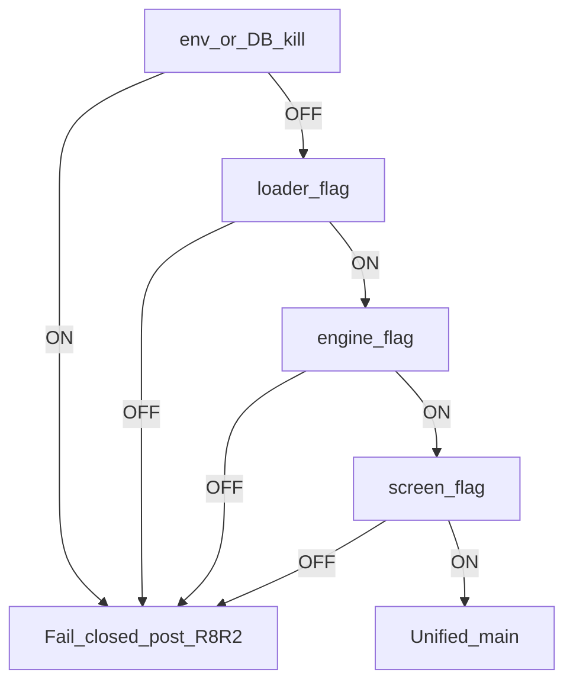

# Single Core Engine — Complete A-to-Z (2026-07-19)

**Scope:** OLD ERP / DIN Collection ERP only — **not** the FX / multi-currency exchange app  
**Status date:** 2026-07-19  
**Repo baseline at publish:** `6e89f285` (`main` / `origin/main`; VPS `erp-frontend` matched at verify)  
**Authoritative prior freeze:** [`SINGLE_CORE_ENGINE_A_TO_Z_AUDIT_2026-07-15.md`](SINGLE_CORE_ENGINE_A_TO_Z_AUDIT_2026-07-15.md) (historical; superseded for **current status**)  
**Technical closeout:** [`R8_R2_PRODUCTION_EXECUTION_CLOSEOUT_2026-07-17.md`](R8_R2_PRODUCTION_EXECUTION_CLOSEOUT_2026-07-17.md)

---

## 1. Verdict (current)

| State | Value |
|-------|--------|
| Single Core **operationally** complete (8 money-report loaders live) | **YES** |
| Approved main-loader legacy retired (R8-R2 A1+A2) | **YES** (2026-07-17) |
| `SINGLE_CORE_ENGINE_TECHNICALLY_CLOSED` (approved main-loader scope) | **YES** |
| Fully retired including BS/P&L error-fallback second wave | **NO** (deferred) |
| AR/AP Phase 2b production complete | **YES** (parity baseline `official_gl`, 2026-07-15) |
| Play Store | **SKIPPED** (not a core blocker) |
| Contacts page party GL | Still **legacy** RPC (optional follow-up) |

**Bottom line:** Core Single Core Engine work for the three DIN companies is **done and live**. Further work is small fixes, optional extensions, or separately gated tracks (Play Store, Contacts wire-up, BS/P&L fallback deletion, monitoring golden maintenance).

---

## 2. Exact scope

### In scope (CORE)

- Ledger V2, Account Statement, Trial Balance, Party Ledger, Roznamcha, Cash Flow, Balance Sheet, Profit & Loss
- Feature flags, kill switch, per-screen resolvers, unified main loaders
- Unified RPCs + additive migrations
- Operational monitoring / Phase 2.16 goldens
- R8-R1 operational retirement + R8-R2 main-loader legacy deletion

### Extension (COMPLETE for production)

- AR/AP Reconciliation Center Phase 2b (`get_unified_contact_party_gl_balances`, `official_gl` parity)

### Out of scope / deferred

- FX / multi-currency exchange app
- Play Store upload / AAB
- Contacts page swap off `get_contact_party_gl_balances`
- BS/P&L error-fallback second-wave deletion
- Product SKU / printing / calendar / unrelated mobile WIP
- Blanket DIN CHINA 4100 → 4000 historical reclass (explicitly **not** run)

---

## 3. Full timeline (spine)

| Era | What happened | Status |
|-----|---------------|--------|
| Phase 0–1.8 | Unified party/account/cash/TB RPCs + indexes | PRODUCTION COMPLETE |
| Phase 2.1–2.9 | Flags, Admin Compare, previews, cash/bank compare | SUPERSEDED → loaders |
| Phase 2.10–2.15 | Main loader swaps: LV2, AS, TB, Party, Roznamcha + recovery | OPERATIONAL COMPLETE |
| Phase 3B / 3D | Cash Flow + BS/P&L main loaders | OPERATIONAL COMPLETE |
| Calendar Days 7–15 | Official stability window | COMPLETE / PASS |
| R8-R1 (2026-07-10) | Unified loaders canonical; legacy code retained | OPERATIONAL COMPLETE |
| Sales Revenue 4000 | Future/native sales → **4000**; China **4100** historical preserved | PRODUCTION COMPLETE |
| Salesman QA | Login + extended rows 4–20 | PASS (Play Store not released) |
| AR/AP Phase 2b (2026-07-12) | Migration applied; bridal `effective_party` FAIL Δ ~79850 | PARTIAL → fixed |
| Bridal investigation + `official_gl` (2026-07-15) | Parity baseline switched; max Δ **0** | PRODUCTION COMPLETE |
| R8-R2 (2026-07-17) | Date gate waived; legacy main wrappers deleted; fail-closed | **TECHNICALLY CLOSED** |
| Mobile Single Core alignment (2026-07-17) | Mobile mirrors unified RPC/flags where applicable | DOCUMENTED |
| This pack (2026-07-19) | A-to-Z refresh + production verify | PUBLISHED |

Detailed historical timeline (frozen Jul 15 + addendum): [`reports/single-core-engine-a-to-z-audit-20260715/commit-timeline.md`](../../reports/single-core-engine-a-to-z-audit-20260715/commit-timeline.md).

---

## 4. Architecture

Production uses a **triple-gate dual loader**. After R8-R2, approved main screens **fail closed** if the resolver would select legacy (kill ON or flags OFF) — restore via L2 git tag rollback, not kill alone.

**Basis model (unified RPCs):**

| Basis | Role |
|-------|------|
| `official_gl` | Official GL / AR-AP Phase 2b **parity** baseline |
| `effective_party` | Effective party visibility (ops; can differ on walk-in / corrections) |
| `audit_full_history` | Full audit including rows excluded from effective |

---

## 5. RPC catalogue

| RPC | Role |
|-----|------|
| `get_unified_party_ledger` | Party statement rows |
| `get_unified_account_ledger` | Account statement rows |
| `get_unified_cash_bank_ledger` | Cash/bank liquidity ledger |
| `get_unified_trial_balance` | Trial balance |
| `get_unified_contact_party_gl_balances` | AR/AP Diagnostics per-contact AR/AP/worker nets |
| Helpers | `_unified_ledger_assert_caller_access`, `_unified_ledger_strict_branch_includes_row`, `_unified_ledger_basis_includes_row`, `_unified_ledger_is_liquidity_account` |

**Legacy retained (on purpose):** `get_contact_party_gl_balances` — Contacts page + AR/AP missing-RPC / kill fallback.

Service entry: [`src/app/services/unifiedLedgerService.ts`](../../src/app/services/unifiedLedgerService.ts) · AR/AP: [`src/app/services/arApUnifiedPartyBalanceService.ts`](../../src/app/services/arApUnifiedPartyBalanceService.ts).

---

## 6. Migration inventory (already applied — do not re-batch)

| Migration | Purpose |
|-----------|---------|
| `20260620140000_get_unified_party_ledger_shadow.sql` | Party + account unified RPCs |
| `20260621120000_single_core_ledger_systemwide_diagnostics.sql` | Diagnostics (service_role) |
| `20260621150000_unified_ledger_phase_15_rpcs.sql` | Cash/bank + trial balance RPCs |
| `20260621151000_unified_ledger_phase_15_indexes.sql` | Additive read indexes |
| `20260704120100_unified_ledger_roznamcha_party_tt.sql` | Exclude party T/T from roznamcha liquidity |
| `20260706150000_unified_account_ledger_reversed_voided_rows.sql` | Void/reversal rows on account ledger |
| `20260707140000_unified_ledger_party_tt_agent_wallet.sql` | Exclude TT agent FX wallets from liquidity |
| `20260708180000_unified_trial_balance_void_reversal_parity.sql` | TB void/reversal parity |
| `20260708190000_unified_strict_branch_null_journal_parity.sql` | Strict branch includes NULL-branch JEs |
| `20260712120000_get_unified_contact_party_gl_balances.sql` | AR/AP Phase 2b party GL rollup |

Adjacent (not core `get_unified_*` spine): `20260433_phase4_transaction_mutations_unified_feed.sql`.

---

## 7. Screen / loader matrix

| Screen | Production classification | Key resolver / main service |
|--------|---------------------------|-----------------------------|
| Ledger V2 | UNIFIED CANONICAL | `resolveLedgerV2MainLoaderSource` · `ledgerStatementCenterV2UnifiedMainService` |
| Account Statement | UNIFIED CANONICAL | `resolveAccountStatementMainLoaderSource` · `accountStatementUnifiedMainService` |
| Trial Balance | UNIFIED CANONICAL | `resolveTrialBalanceMainLoaderSource` · `trialBalanceUnifiedMainService` |
| Party Ledger | UNIFIED CANONICAL | `resolvePartyLedgerMainLoaderSource` · `partyLedgerUnifiedMainService` |
| Roznamcha | UNIFIED CANONICAL | `resolveRoznamchaMainLoaderSource` · `roznamchaUnifiedMainService` |
| Cash Flow | UNIFIED CANONICAL | `resolveCashFlowMainLoaderSource` · `cashFlowUnifiedMainService` |
| Balance Sheet | UNIFIED CANONICAL | `resolveBalanceSheetMainLoaderSource` · `bsPlUnifiedMainService` |
| Profit & Loss | UNIFIED CANONICAL | `resolveProfitLossMainLoaderSource` · `bsPlUnifiedMainService` |
| AR/AP Center | PRODUCTION COMPLETE | ops `effective_party` · parity `official_gl` |
| Contacts | LEGACY / OUT OF CORE | `get_contact_party_gl_balances` |

Jul 15 loader detail: [`reports/single-core-engine-a-to-z-audit-20260715/loader-matrix.md`](../../reports/single-core-engine-a-to-z-audit-20260715/loader-matrix.md).

---

## 8. Feature flags and kill switch

Constants: [`src/app/lib/unifiedLedgerFlagKeys.ts`](../../src/app/lib/unifiedLedgerFlagKeys.ts) · resolver: [`src/app/lib/unifiedLedgerEngineState.ts`](../../src/app/lib/unifiedLedgerEngineState.ts).

| Key family | Examples |
|------------|----------|
| Engine / pilot / kill | `unified_ledger_engine`, `unified_ledger_pilot`, `unified_ledger_kill_switch` |
| Loader (main swap) | `unified_ledger_loader_{ledger_v2,account_statement,trial_balance,party_ledger,roznamcha,cash_flow,balance_sheet,profit_loss}` |
| Screen | `unified_ledger_screen_*` (same eight screens) |
| Env kill | `VITE_UNIFIED_LEDGER_ENGINE_KILLED=true` |

**Production (three DIN companies):** engine + loaders + screens **ON**; kill **OFF**.  
**Post–R8-R2:** turning kill ON does **not** restore legacy UI — pages fail closed. Rollback = tag `r8-r2-pre-code-deletion-20260717` + frontend redeploy.

---

## 9. Optimizations and hardening (what we changed)

| Change | Why |
|--------|-----|
| Strict branch NULL journal parity | Branch filters must include NULL-branch journals consistently |
| TB void/reversal parity | Trial Balance matches account ledger void/reversal rules |
| Party T/T + agent wallet liquidity exclusions | Roznamcha/cash liquidity not polluted by FX T/T wallets |
| Account ledger reversed/voided row inclusion | Correct historical statement rows |
| Monitoring flake / credential hardening | Stable three-company Phase 2.16 runs |
| DIN CHINA Phase 2.16 golden refresh | Legitimate live GL (e.g. RCV-0317) reflected in fixtures |
| AR/AP parity baseline → `official_gl` | Bridal walk-in `effective_party` Δ explained; parity max Δ 0 |

---

## 10. AR/AP Phase 2b (extension)

| Milestone | Result |
|-----------|--------|
| Runtime + migration `75c12cd7` | Unified party GL for AR/AP Center |
| Prod apply (2026-07-11) | RPC live; legacy fallback retained |
| Bridal FAIL (2026-07-12) | `effective_party` max AR Δ **79850** (Walk-in Customer old −80000 + Walk-in +150) |
| Investigation (2026-07-15) | JE-0213 + JV-000203 class; `official_gl` matches legacy |
| Closeout | Approval `APPROVE_AR_AP_PHASE2B_PARITY_BASELINE_OFFICIAL_GL` · runtime `a5149971` · **PRODUCTION COMPLETE** |

Evidence:

- [`reports/ar-ap-phase-2b-production-rollout-20260712/`](../../reports/ar-ap-phase-2b-production-rollout-20260712/)
- [`reports/ar-ap-phase-2b-bridal-effective-party-investigation-20260715/`](../../reports/ar-ap-phase-2b-bridal-effective-party-investigation-20260715/)
- [`reports/ar-ap-phase-2b-official-gl-parity-closeout-20260715/`](../../reports/ar-ap-phase-2b-official-gl-parity-closeout-20260715/)
- [`AR_AP_BRIDAL_EFFECTIVE_PARTY_INVESTIGATION_2026-07-15.md`](AR_AP_BRIDAL_EFFECTIVE_PARTY_INVESTIGATION_2026-07-15.md)

---

## 11. R8-R2 production deletion (2026-07-17)

| Item | Value |
|------|--------|
| Date gate | **WAIVED** by operator |
| Runtime tip | `390f922c` |
| Docs closeout | `812c2871` |
| Pre-delete tag | `r8-r2-pre-code-deletion-20260717` → `17a6c131` |
| Deploy | `deploy/vps-build-erp-only.sh` via `ssh dincouture-vps` |
| Deleted | 4× `*LegacyMainService.ts` + page legacy main branches (AS, TB, Party, Roznamcha, LV2, Cash Flow) |
| Retained | Shadow compare, Contacts, mobile, resolvers, flags, kill, L1 SQL, BS/P&L error fallback |
| Tests at deletion | unified **350/350**, unit **188/188**, build PASS |

Docs: [`R8_R2_PRODUCTION_EXECUTION_CLOSEOUT_2026-07-17.md`](R8_R2_PRODUCTION_EXECUTION_CLOSEOUT_2026-07-17.md) · [`R8_R2_PRODUCTION_VERIFICATION_2026-07-17.md`](R8_R2_PRODUCTION_VERIFICATION_2026-07-17.md) · [`reports/r8-r2-production-execution-20260717/`](../../reports/r8-r2-production-execution-20260717/).

---

## 12. Mobile Single Core (pointer)

Web Single Core closeout does **not** require Play Store. Mobile alignment packs:

- [`reports/mobile-single-core-alignment-20260717/`](../../reports/mobile-single-core-alignment-20260717/)
- [`reports/mobile-single-core-phase2-wiring-20260717/`](../../reports/mobile-single-core-phase2-wiring-20260717/)
- Code mirrors: `erp-mobile-app/src/api/unifiedLedgerRpc.ts`, `erp-mobile-app/src/lib/unifiedLedgerEngineState.ts`

Play Store remains gated on `PLAY_STORE_FINAL_UPLOAD_APPROVAL_REQUIRED`.

---

## 13. Accounting decisions locked

- Future/native **Sales Revenue = 4000**
- Account **4100** = DIN CHINA imported historical / fallback only
- **No** historical 4100 → 4000 blanket reclass has been run
- Unified main loaders are the **canonical** production path for the eight money reports
- AR/AP Diagnostics party-GL **parity** uses **`official_gl`**

---

## 14. Evidence index

| Pack | Path |
|------|------|
| Jul 15 A-to-Z freeze | [`reports/single-core-engine-a-to-z-audit-20260715/`](../../reports/single-core-engine-a-to-z-audit-20260715/) |
| Evidence recovery | [`reports/single-core-engine-evidence-recovery-20260715/`](../../reports/single-core-engine-evidence-recovery-20260715/) |
| Calendar Days 7–15 | `reports/single-core-engine-calendar-stability-official-202607*` |
| R8-R1 | [`reports/r8-legacy-retirement-execution-20260710/`](../../reports/r8-legacy-retirement-execution-20260710/) |
| R8-R2 readiness / rehearsal / execution | `reports/r8-r2-*-20260715/`, `reports/r8-r2-production-*-20260717/` |
| AR/AP Phase 2b | `reports/ar-ap-phase-2b-*-20260712/`, `*-20260715/` |
| DIN CHINA golden refresh | [`reports/din-china-phase-216-golden-refresh-20260712/`](../../reports/din-china-phase-216-golden-refresh-20260712/) |
| This refresh verify | [`reports/single-core-engine-a-to-z-refresh-20260719/`](../../reports/single-core-engine-a-to-z-refresh-20260719/) |

Master / phase docs spine: `docs/accounting/SINGLE_CORE_LEDGER_*` and `SINGLE_CORE_LEDGER_PHASE_*`.

---

## 15. Remaining (non-core) gates

| Track | Status | Approval / note |
|-------|--------|-----------------|
| Play Store release | SKIPPED | `PLAY_STORE_FINAL_UPLOAD_APPROVAL_REQUIRED` |
| Contacts unified party GL | OPTIONAL | Still legacy RPC |
| BS/P&L error-fallback deletion | DEFERRED | Second wave after approved soak/approval |
| Monitoring golden drift | MAINTENANCE | Refresh fixtures when live GL legitimately moves (no silent GL mutation) |
| Kill-switch “drill PASS” Jul 12 claim | RETRACTED | Post-R8-R2 kill semantics changed (fail-closed); do not use kill as rollback |

Gate register: [`OLD_ERP_REMAINING_APPROVAL_GATES_2026-07-11.md`](OLD_ERP_REMAINING_APPROVAL_GATES_2026-07-11.md) (updated 2026-07-19 for R8-R2 COMPLETE).

---

## 16. How to fix forward (operator rules)

1. **Small UI / docs / print / mobile polish** — normal `main` PR/commit; keep Single Core contracts (RPC names, flag keys, resolvers) stable.
2. **Any new migration / GL repair / reclass / R8 residual deletion** — stop; require an **explicit approval phrase** in the same request.
3. **Production frontend** — established path: `deploy/vps-build-erp-only.sh` on `dincouture-vps` after clean `main` pull. Do not deploy unrelated WIP.
4. **Rollback of R8-R2** — checkout tag `r8-r2-pre-code-deletion-20260717` (or revert `390f922c`) + frontend-only redeploy. Do **not** rely on kill switch alone.
5. **Do not mix** FX multi-currency work into this ERP track.

---

## 17. VPS / GitHub alignment note (2026-07-19)

At document publish prep:

- GitHub `origin/main` and local `main` were at `6e89f285`
- VPS git HEAD and `VITE_BUILD_COMMIT` were `6e89f285`
- `erp-frontend` healthy; production HTTPS 200

This docs commit does **not** require a DB migration. Frontend redeploy is required **only if** VPS drifts behind the docs commit — see [`reports/single-core-engine-a-to-z-refresh-20260719/production-verify.txt`](../../reports/single-core-engine-a-to-z-refresh-20260719/production-verify.txt).

---

## 18. Stable one-liner

**Single Core Engine (approved main-loader scope) is technically closed and live on DIN CHINA / DIN BRIDAL / DIN COUTURE as of 2026-07-17; this 2026-07-19 pack is the current A-to-Z operator reference for what was done, what is locked, and what still needs separate approval.**
