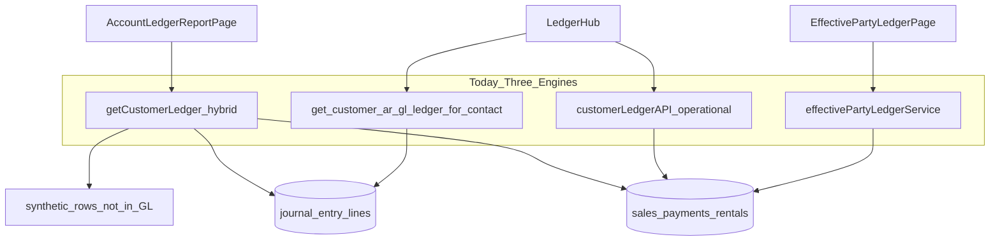
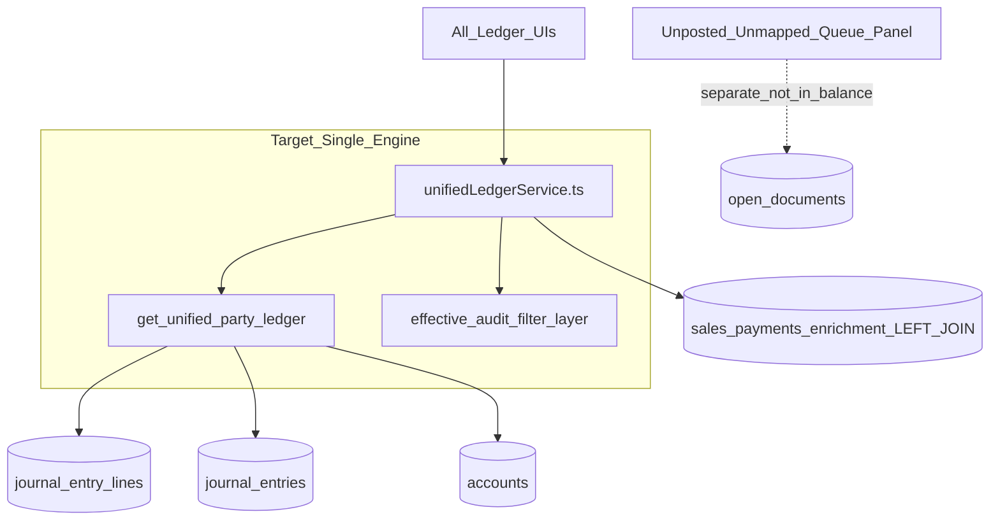

# Single Core Ledger Migration — Analysis & Plan

**Status:** Proposal only — no implementation in this document.  
**Audience:** Engineering + finance sign-off before deprecating fragmented ledger engines.  
**Related:** [`BALANCE_SOURCE_POLICY.md`](./BALANCE_SOURCE_POLICY.md), [`FINANCIAL_TRUTH_BASIS.md`](./FINANCIAL_TRUTH_BASIS.md), [`PHASE8_LEGACY_RETIREMENT_MAP.md`](./PHASE8_LEGACY_RETIREMENT_MAP.md), [`PARTY_LEDGER_DESYNC_ANALYSIS.md`](./PARTY_LEDGER_DESYNC_ANALYSIS.md) (companion desync diagnostics)

---

## 1. Executive summary

The ERP today runs **at least three independent ledger read engines** for the same party:

| Engine | Primary service | Row grain | Truth basis |
|--------|-----------------|-----------|-------------|
| **Account Statements** | `getCustomerLedger` / `getSupplierApGlJournalLedger` / `getWorkerPartyGlJournalLedger` / `getAccountLedger` in [`accountingService.ts`](../../src/app/services/accountingService.ts) | Hybrid: `journal_entry_lines` **plus synthetic** sales/payments/rentals | Blended GL + operational (violates single-source) |
| **LedgerHub / GenericLedgerView** | [`customerLedgerApi.ts`](../../src/app/services/customerLedgerApi.ts) (operational) + party GL RPCs (GL tab) + [`ledgerDataAdapters.ts`](../../src/app/services/ledgerDataAdapters.ts) | Documents (`sales`, `payments`, `purchases`) **or** journal lines | Operational vs GL split across tabs |
| **Effective Party Ledger** | [`effectivePartyLedgerService.ts`](../../src/app/services/effectivePartyLedgerService.ts) | `payments` + docs + PF-14 mutation collapse | Effective operational (not GL) |

Because testing-phase data still has **unposted documents**, **unmapped control-line JEs**, and **null `payments.contact_id`**, each engine applies different filters and produces different balances.

**Proposed target:** One **Unified Core Ledger Engine (UCLE)** where:

1. **Official ledger rows** come **only** from `journal_entry_lines` joined to `journal_entries` (and `accounts` for COA/party attribution).
2. **Party attribution** uses one server-side resolver: `accounts.linked_contact_id` OR `_gl_resolve_party_id_for_journal_entry` (already canonical in Postgres RPCs).
3. **Operational documents** (`sales`, `payments`, etc.) are **enrichment JOINs** for display (reference, party name, attachment) — never a second row source.
4. **Unposted / unmapped** items appear in a **separate queue panel** (AR/AP Reconciliation Center pattern), not merged into running balance as synthetic debits/credits.
5. **Effective vs Audit** presentation is a **filter layer** on the same JE row set ([`financialTruthBasis.ts`](../../src/app/lib/financialTruthBasis.ts)), not a separate fetch path.

This aligns with [`BALANCE_SOURCE_POLICY.md`](./BALANCE_SOURCE_POLICY.md): GL truth = journals only; operational due stays on document tables but **labeled and separated**.

---

## 2. Current state — why desync happens



### 2.1 Hybrid `getCustomerLedger` (largest divergence source)

[`getCustomerLedger`](../../src/app/services/accountingService.ts) (~2793–3673):

- Loads all AR-subtree `journal_entry_lines`.
- Filters with **client-side** `arJournalLineMatchesCustomer()` (~207–271) — sale/payment graph, not identical to SQL `_gl_resolve_party_id_for_journal_entry`.
- In `default` mode, **merges synthetic rows** when sales/payments/rentals lack journal attribution (~3447–3673), including rentals that “never hit AR.”
- Used by **Account Statements** and **Ledger Statement Center V2** for customer mode.

### 2.2 Strict GL RPC path (LedgerHub GL tab, mobile)

[`getCustomerArGlJournalLedger`](../../src/app/services/accountingService.ts) (~3802–3890) calls `get_customer_ar_gl_ledger_for_contact` ([`20260436_party_gl_rpc_effective_payment_id.sql`](../../migrations/20260436_party_gl_rpc_effective_payment_id.sql)):

- AR subtree only; party = `linked_contact_id` on line account OR resolver.
- **No synthetic merge** — stricter, often **fewer rows** than Account Statements.

### 2.3 Operational engines (no journal grain)

- [`customerLedgerAPI.getTransactions`](../../src/app/services/customerLedgerApi.ts) — RPCs `get_customer_ledger_sales`, `get_customer_ledger_payments`, direct `payments` queries.
- [`ledgerDataAdapters`](../../src/app/services/ledgerDataAdapters.ts) — supplier/user/worker document math.
- [`effectivePartyLedgerService`](../../src/app/services/effectivePartyLedgerService.ts) — `payments.contact_id` strict filter + PF-14 collapse.

### 2.4 `journal_party_contact_mapping` — not a read engine

Table from [`20260330_ar_ap_repair_workflows.sql`](../../migrations/20260330_ar_ap_repair_workflows.sql) is **repair metadata** ([`arApRepairWorkflowService.ts`](../../src/app/services/arApRepairWorkflowService.ts)). No ledger UI reads it today. Data cleanup in Phase 0 improves resolver inputs; JPCM alone does not fix statement parity.

---

## 3. Target architecture — Unified Core Ledger Engine (UCLE)



### 3.1 Design principles

| Principle | Rule |
|-----------|------|
| **Single row grain** | One displayed row per `journal_entry_line_id` (or collapsed JE for summary mode) |
| **Single party resolver** | Postgres only — extend `_gl_resolve_party_id_for_journal_entry` + `linked_contact_id` |
| **No synthetic balance rows** | Unposted sale/receipt → Reconciliation “Unposted” queue, not fake debit/credit |
| **Basis = filter** | `official_gl` / `effective_party` / `audit_full` from [`financialTruthBasis.ts`](../../src/app/lib/financialTruthBasis.ts) |
| **Operational due elsewhere** | Contacts list / Add Entry secondary line / collections — not mixed into GL statement |
| **Mobile parity** | Same RPC + thin TS mapper as web |

### 3.2 What replaces “synthetic documents”

Today, synthetic rows exist because **operational facts lack JEs**. UCLE does not duplicate them; instead:

| Today (synthetic) | UCLE approach |
|-------------------|---------------|
| Unposted final sale | Show in **Unposted documents** queue; optional “Post now” action |
| Payment without JE | **Payment JE linkage** repair ([`20260340_historical_payment_je_linkage_repair.sql`](../../migrations/20260340_historical_payment_je_linkage_repair.sql)) then appears as real JE |
| Rental charge without AR JE | Post rental to AR (or explicit non-AR policy) — one JE line |
| Advance on draft sale | Post receipt JE (manual_receipt / sale payment) — not operational-only row |
| PF-14 payment mutations | Collapse **journal-side** or show adjustment JEs from `transaction_mutations.adjustment_journal_entry_id` |

**Testing-phase advantage:** You can run bulk post/relink **before** cutting UI, because production users are not locked to hybrid balances.

---

## 4. Feasibility & time estimate

### 4.1 Difficulty: **High (7/10)**

| Factor | Assessment |
|--------|------------|
| **SQL foundation exists** | `get_customer_ar_gl_ledger_for_contact`, `get_supplier_ap_gl_ledger_for_contact`, `_gl_resolve_party_id_for_journal_entry` are mature |
| **Data debt** | ~217 unmapped JEs, null `payments.contact_id`, 1100 vs party subledger splits — must clean **before** UI cutover |
| **Consumer surface area** | 15+ web components, 4+ mobile APIs, reconciliation/trace tooling |
| **Worker / user ledgers** | Worker GL is client-filtered today; user ledger is operational-only — need RPC extensions |
| **Policy conflict** | `FINANCIAL_TRUTH_BASIS` already defines three **filters**, not three **engines** — migration is conceptually aligned |

### 4.2 Realistic timeline (1 engineer, testing-phase tenant focus)

| Phase | Scope | Duration | Dependency |
|-------|-------|----------|------------|
| **0 — Data cleanup & parity** | Unmapped queue drain, payment contact backfill, Phase 4/4b AR reclass, post unposted docs | **2–3 weeks** | None |
| **1 — Unified Postgres RPC** | `get_unified_party_ledger` (+ account/worker variants) | **1–2 weeks** | Phase 0 metrics stable |
| **2 — TypeScript service layer** | `unifiedLedgerService.ts` replaces five fetch paths | **1 week** | Phase 1 |
| **3 — UI rewire** | Account Statements, LedgerHub, V2 center, UnifiedLedgerView, Contact profile | **2–3 weeks** | Phase 2 |
| **4 — Mobile + deprecation** | `erp-mobile-app` parity, delete legacy services | **1–2 weeks** | Phase 3 sign-off |
| **5 — Validation & sign-off** | Tie-out scripts, Integrity Lab, party spotlight regression | **1–2 weeks** | All |

**Total: 8–13 weeks** (calendar), assuming DIN CHINA / test company data repair runs in parallel with RPC build.

**Compressed (2 engineers): 5–8 weeks.**

### 4.3 Go / no-go gates

Proceed only if after Phase 0:

- `count_unmapped_ar_ap_journal_entries_split` → **&lt; 5%** of pre-migration baseline (or explicit accepted backlog).
- Per-party: `get_customer_ar_gl_ledger_for_contact` closing balance = Trial Balance party subledger slice (± rounding).
- Zero P0 regressions on Integrity Lab payment/JE linkage checks.

---

## 5. Phase-by-phase plan

### Phase 0 — Data cleanup (prerequisite, not optional)

**Goal:** Make `journal_entry_lines` complete enough that journal-only statements are **acceptable**.

| Step | Action | Tools / files |
|------|--------|---------------|
| 0.1 | **Baseline audit** per company | [`scripts/sql/diag_party_ledger_desync_for_contact.sql`](../scripts/sql/diag_party_ledger_desync_for_contact.sql) (from desync analysis), [`diag_ar_ap_center_baseline_audit.sql`](../scripts/sql/diag_ar_ap_center_baseline_audit.sql) |
| 0.2 | **Backfill `payments.contact_id`** | [`partyTieOutBulkCleanupService.ts`](../../src/app/services/partyTieOutBulkCleanupService.ts), [`20260460_backfill_payments_contact_from_sales.sql`](../../migrations/20260460_backfill_payments_contact_from_sales.sql) → `party_repair_audit` |
| 0.3 | **AR control → party subledger reclass** | [`dinChinaArPaymentPartyReclass.js`](../../migration-tools/lib/dinChinaArPaymentPartyReclass.js) Phase 4/4b |
| 0.4 | **Payment ↔ JE linkage** | Phase 3/4 playbook ([`20260340`](../../migrations/20260340_historical_payment_je_linkage_repair.sql), [`20260341`](../../migrations/20260341_phase4_payment_je_linkage_repair_apply.sql)) |
| 0.5 | **Post unposted sales/purchases** | AR/AP Reconciliation Center → `documentPostingEngine` |
| 0.6 | **Ensure party subledgers** | `ensure_party_subledgers_for_contact`, [`partySubledgerAccountService.ts`](../../src/app/services/partySubledgerAccountService.ts) |
| 0.7 | **Resolver gap fix** | Consider restoring `_gl_party_id_from_payment_row` fallback in `_gl_resolve_party_id_for_journal_entry` for `reference_type = payment` ([`20260406`](../../migrations/20260406_gl_party_resolve_payment_via_sale_purchase.sql) vs [`20260444`](../../migrations/20260444_gl_resolve_party_return_documents.sql) regression) |
| 0.8 | **Rental AR posting policy** | Decide: all rental charges must post to AR subtree JEs (recommended) or explicit exclusion documented |

**Exit criteria:** For pilot contacts, hybrid `getCustomerLedger` and RPC `get_customer_ar_gl_ledger_for_contact` return **same JE set** (synthetic count → 0).

---

### Phase 1 — Unified backend API (Postgres-first)

**Goal:** One RPC family for all party/account ledger reads.

#### 1.1 New RPC: `get_unified_party_ledger`

Parameters:

```sql
p_company_id uuid,
p_party_type text,  -- 'customer' | 'supplier' | 'worker' | 'account'
p_party_id uuid,    -- contact_id, worker_id, or account_id
p_branch_id uuid DEFAULT NULL,
p_start_date date DEFAULT NULL,
p_end_date date DEFAULT NULL,
p_basis text DEFAULT 'official_gl'  -- 'official_gl' | 'effective_party' | 'audit_full'
```

Returns JSON: `{ period_opening_balance, rows[], meta: { unposted_count, unmapped_count } }`.

Implementation strategy:

- **Customer:** Extend [`get_customer_ar_gl_ledger_for_contact`](../../migrations/20260436_party_gl_rpc_effective_payment_id.sql) body.
- **Supplier:** Extend [`get_supplier_ap_gl_ledger_for_contact`](../../migrations/20260436_party_gl_rpc_effective_payment_id.sql).
- **Worker:** New SQL port of [`getWorkerPartyGlJournalLedger`](../../src/app/services/accountingService.ts) client filter (2010/1180 subtree + resolver).
- **Account (COA):** Port [`getAccountLedger`](../../src/app/services/accountingService.ts) query (single `account_id`, no party resolver).

#### 1.2 Basis filter in SQL (or shared TS)

Apply [`shouldIncludePartyEffectiveRow`](../../src/app/lib/reportVisibilityContract.ts) rules:

- `effective_party`: hide voided payment trails, cancelled sale reversals, orphan gl_correction chains.
- `audit_full`: all non-void JEs.
- `official_gl`: same as audit for TB parity (per `FINANCIAL_TRUTH_BASIS`).

#### 1.3 Enrichment view (optional)

`v_unified_ledger_row_enrichment` — LEFT JOIN `sales`, `purchases`, `payments`, `rentals` on `je.reference_id` / `je.payment_id` for display columns only.

#### 1.4 Balance RPC alignment

Ensure `get_contact_party_gl_balances` uses **identical** party attribution CTE as `get_unified_party_ledger` (single shared SQL function `_party_ledger_attributed_lines`).

---

### Phase 2 — TypeScript service layer

**Goal:** One module; all UIs call it.

Create [`src/app/services/unifiedLedgerService.ts`](../../src/app/services/unifiedLedgerService.ts):

```typescript
// Shape only — not implementation
export type UnifiedLedgerParams = {
  companyId: string;
  partyType: 'customer' | 'supplier' | 'worker' | 'account';
  partyId: string;
  branchId?: string | null;
  fromDate?: string;
  toDate?: string;
  basis?: FinancialTruthBasis;
};

export async function getUnifiedPartyLedger(params: UnifiedLedgerParams): Promise<UnifiedLedgerResult>;
export async function getUnifiedPartyLedgerSummary(params: UnifiedLedgerParams): Promise<UnifiedLedgerSummary>;
```

**Migration shim (temporary):**

- `getCustomerLedger` → delegates to `getUnifiedPartyLedger` with warning log.
- `getCustomerArGlJournalLedger` → same delegate.
- `customerLedgerAPI.getTransactions` → **deprecated**; redirect to unified + separate `getOpenItemsForParty()` for collections UI.

---

### Phase 3 — UI rewire

| Component | Current | Target |
|-----------|---------|--------|
| [`AccountLedgerReportPage.tsx`](../../src/app/components/reports/AccountLedgerReportPage.tsx) | `getCustomerLedger` hybrid | `unifiedLedgerService` + basis toggle (already has Effective/Audit) |
| [`LedgerStatementCenterV2Page.tsx`](../../src/app/features/ledger-statement-center-v2/LedgerStatementCenterV2Page.tsx) | `ledgerStatementCenterV2Service` → hybrid | `unifiedLedgerService` |
| [`CustomerLedgerPageOriginal.tsx`](../../src/app/components/customer-ledger-test/CustomerLedgerPageOriginal.tsx) | 3 tabs, 3 engines | **Single ledger tab** + optional “Open items” + “Reconciliation” link |
| [`GenericLedgerView.tsx`](../../src/app/components/accounting/GenericLedgerView.tsx) | operational + GL tabs | Unified ledger; remove operational tab or rename to “Open items (non-GL)” |
| [`EffectivePartyLedgerPage.tsx`](../../src/app/components/accounting/EffectivePartyLedgerPage.tsx) | separate engine | **Merge into** Account Statements with `basis=effective_party` OR retire route |
| [`LedgerHub.tsx`](../../src/app/components/accounting/LedgerHub.tsx) | routes to fragmented children | Routes to one `UnifiedPartyLedgerView` |
| [`UnifiedLedgerView.tsx`](../../src/app/components/shared/UnifiedLedgerView.tsx) | `getCustomerLedger` | `unifiedLedgerService` |
| [`ContactProfileActivityTabs.tsx`](../../src/app/components/contacts/ContactProfileActivityTabs.tsx) | embedded `CustomerLedgerPageOriginal` | embedded unified view |
| Reconciliation tab | compares two engines | compares **GL balance vs open items due** (labeled), not two ledger fetches |

**UX rule:** Every screen shows basis badge: *“Official GL — journal lines only”* / *“Effective — hides voided/cancelled”*.

---

### Phase 4 — Mobile parity & deprecation

| Mobile file | Current | Target |
|-------------|---------|--------|
| [`erp-mobile-app/src/api/partyGlLedger.ts`](../../erp-mobile-app/src/api/partyGlLedger.ts) | split RPCs | `get_unified_party_ledger` |
| [`erp-mobile-app/src/api/customerLedger.ts`](../../erp-mobile-app/src/api/customerLedger.ts) | operational RPCs | deprecate or thin open-items wrapper |
| [`PartyLedgerReport.tsx`](../../erp-mobile-app/src/components/accounts/reports/PartyLedgerReport.tsx) | mixed | unified only |

Delete legacy code only after grep shows zero imports (see Section 7).

---

### Phase 5 — Validation

| Check | Script / tool |
|-------|---------------|
| Per-party JE set parity | `diag_party_ledger_desync_for_contact.sql` |
| Balance tie-out | [`verifyArPartyTieout.js`](../../migration-tools/verifyArPartyTieout.js) |
| Integrity Lab | AR/AP Center snapshot RPCs |
| UI regression | Customer/supplier/worker statement screenshots + running balance |
| Mobile | Party ledger report vs web for same `contact_id` |

---

## 6. The “One True Query”

**Note:** This is draft SQL logic for review — not a migration to apply yet. Prisma is not used in this repo; canonical layer is **Supabase RPC (SQL)** + thin TS mapper.

### 6.1 Shared attribution CTE (core of UCLE)

```sql
-- _party_ledger_attributed_lines(company_id, control_code, party_id)
-- control_code: '1100' (AR), '2000' (AP), '2010'/'1180' (worker pair)

WITH RECURSIVE control_root AS (
  SELECT a.id AS root_id
  FROM accounts a
  WHERE a.company_id = p_company_id
    AND TRIM(COALESCE(a.code, '')) = p_control_code
    AND COALESCE(a.is_active, TRUE)
  LIMIT 1
),
subtree AS (
  SELECT root_id AS id FROM control_root WHERE root_id IS NOT NULL
  UNION ALL
  SELECT a.id
  FROM accounts a
  INNER JOIN subtree s ON a.parent_id = s.id
  WHERE a.company_id = p_company_id AND COALESCE(a.is_active, TRUE)
),
je_lines AS (
  SELECT
    jel.id AS journal_entry_line_id,
    jel.journal_entry_id,
    jel.account_id,
    jel.debit,
    jel.credit,
    jel.description AS line_description,
    je.entry_no,
    je.entry_date,
    je.created_at,
    je.reference_type,
    je.reference_id,
    je.payment_id,
    je.branch_id,
    je.is_void,
    je.description AS entry_description,
    acc.code AS account_code,
    acc.name AS account_name,
    acc.linked_contact_id AS account_linked_contact_id,
    CASE
      WHEN LOWER(TRIM(COALESCE(je.reference_type, ''))) = 'correction_reversal'
        AND je.reference_id IS NOT NULL
      THEN public._gl_resolve_party_id_for_journal_entry(p_company_id, je.reference_id)
      ELSE public._gl_resolve_party_id_for_journal_entry(p_company_id, je.id)
    END AS resolver_party_id
  FROM journal_entry_lines jel
  INNER JOIN journal_entries je ON je.id = jel.journal_entry_id
  INNER JOIN accounts acc ON acc.id = jel.account_id AND acc.company_id = p_company_id
  WHERE je.company_id = p_company_id
    AND COALESCE(je.is_void, FALSE) = FALSE
    AND jel.account_id IN (SELECT id FROM subtree)
    AND (p_branch_id IS NULL OR je.branch_id IS NULL OR je.branch_id = p_branch_id)
),
attributed AS (
  SELECT
    jl.*,
    COALESCE(jl.account_linked_contact_id, jl.resolver_party_id) AS party_id
  FROM je_lines jl
)
SELECT *
FROM attributed
WHERE party_id = p_party_id;
```

**Account (COA) mode** simplifies to `jel.account_id = p_account_id` with no `party_id` filter.

### 6.2 Basis filter (applied after attribution)

```sql
-- effective_party: exclude rows matching reportVisibilityContract rules
AND NOT (
  LOWER(TRIM(COALESCE(reference_type, ''))) IN ('correction_reversal')
  AND p_basis = 'effective_party'
  -- plus: voided payment trail detection via payments.voided_at join
  -- plus: cancelled sale chain via sales.status join
)
```

Port exact rules from [`reportVisibilityContract.ts`](../../src/app/lib/reportVisibilityContract.ts) — **must match** `FINANCIAL_TRUTH_BASIS` doc.

### 6.3 Deduplication (payment credit lines)

Today [`dedupeCustomerArPaymentCreditLines`](../../src/app/services/accountingService.ts) (~180–200) collapses duplicate AR credits for one payment. UCLE should implement in SQL:

```sql
-- For each payment_id, keep one AR credit line (max credit, prefer party subledger account over 1100)
ROW_NUMBER() OVER (
  PARTITION BY je.payment_id, party_id
  ORDER BY
    CASE WHEN account_code = '1100' THEN 1 ELSE 0 END,  -- prefer subledger
    credit DESC,
    journal_entry_line_id
) AS rn
-- WHERE rn = 1 OR payment_id IS NULL
```

### 6.4 Running balance

| Party type | Formula |
|------------|---------|
| Customer (AR) | `SUM(debit - credit) OVER (ORDER BY entry_date, created_at, entry_no, line_id)` |
| Supplier (AP) | `SUM(credit - debit) OVER (...)` |
| Worker (net WP−WA) | Net across 2010 + 1180 lines per worker |

Opening balance row: synthetic **display row** from `contacts.opening_balance` only when **no** `opening_balance_contact_*` JE exists (else use JE).

### 6.5 Enrichment (no extra rows)

```sql
LEFT JOIN payments pay ON pay.id = attributed.payment_id
LEFT JOIN sales s ON s.id = attributed.reference_id
  AND LOWER(TRIM(COALESCE(attributed.reference_type, ''))) IN ('sale', 'sale_adjustment', 'sale_reversal')
LEFT JOIN purchases p ON p.id = attributed.reference_id
  AND LOWER(TRIM(COALESCE(attributed.reference_type, ''))) LIKE 'purchase%'
-- Display: COALESCE(pay.reference_number, s.invoice_no, p.po_no, je.entry_no)
```

### 6.6 What this query explicitly does NOT do

- **No INSERT from `sales` / `payments`** into result set.
- **No `journal_party_contact_mapping`** read (repair table only).
- **No `worker_ledger_entries`** union (operational studio — separate open-items endpoint).
- **No rental synthetic debit** — rental must exist as JE or appear in unposted queue.

### 6.7 Companion query: open items (non-GL, separate API)

```sql
-- get_open_items_for_party(company_id, customer_id)
-- Final sales with no sale JE
SELECT s.id, s.invoice_no, s.total, 'unposted_sale' AS reason
FROM sales s
WHERE s.company_id = p_company_id AND s.customer_id = p_customer_id
  AND LOWER(COALESCE(s.status, '')) = 'final'
  AND NOT EXISTS (
    SELECT 1 FROM journal_entries je
    WHERE je.company_id = s.company_id
      AND COALESCE(je.is_void, FALSE) = FALSE
      AND LOWER(TRIM(COALESCE(je.reference_type, ''))) = 'sale'
      AND je.reference_id = s.id
  );
-- Similar for payments without payment_id on any non-void JE, etc.
```

This replaces synthetic merge **without** polluting GL running balance.

---

## 7. Risks — what may break

| Risk | Severity | Mitigation |
|------|----------|------------|
| **Balances drop** when synthetic rows removed | **High** | Phase 0 must post/backfill; show “open items” panel with pre-cutover diff |
| **Collections workflow** relied on operational ledger | **High** | Keep `get_open_items_for_party` + `sales.due_amount` on Contacts — labeled non-GL |
| **Rental statements** missing charges | **High** | Post rental JEs or accept explicit policy before cutover |
| **Advance on draft sale** invisible | **Medium** | Receipt JEs must exist; Add Entry path already creates them |
| **Aging report** (`customerLedgerAPI.getAgingReport`) | **Medium** | Rebuild from open items + GL, not hybrid ledger |
| **PF-14 effective collapse** | **Medium** | Port mutation collapse to adjustment JE rows or SQL window on payment_id |
| **Worker operational tab** (`worker_ledger_entries`) | **Medium** | Keep as studio open-items; not part of UCLE |
| **Supplier `ledger_entries` mirror** | **Medium** | [`PHASE8_LEGACY_RETIREMENT_MAP`](./PHASE8_LEGACY_RETIREMENT_MAP.md) — stop writes first |
| **Integrity Lab / Financial Trace** | **Low** | Update to compare UCLE vs open items, not hybrid vs RPC |
| **Mobile offline cache** | **Low** | RPC shape change — version bump |
| **Commission lines on AR** | **Low** | Hybrid excluded them; UCLE includes — document as correction |
| **Performance** | **Low** | AR subtree RPC already batched; add indexes on `journal_entry_lines(account_id)`, `payments.contact_id` |

### 7.1 Features that depend on dual engines today

- **Reconciliation tab** in `CustomerLedgerPageOriginal` — compares operational vs GL; must be redefined.
- **LedgerStatementCenterV2Diagnostic** — doc vs GL compare; becomes open-items vs GL.
- **arApTruthLabService** — side-by-side engine labels; update to UCLE + open items.
- **Add Entry “amount due”** secondary line — still operational; ensure not confused with statement balance.

---

## 8. Deprecation list (strict — delete after Phase 5 sign-off)

### 8.1 Services / modules (delete entirely)

| File | Reason |
|------|--------|
| [`src/app/services/customerLedgerApi.ts`](../../src/app/services/customerLedgerApi.ts) | Operational hybrid engine — replace with `unifiedLedgerService` + `openItemsService` |
| [`src/app/services/ledgerDataAdapters.ts`](../../src/app/services/ledgerDataAdapters.ts) | Supplier/user/worker operational adapters |
| [`src/app/services/effectivePartyLedgerService.ts`](../../src/app/services/effectivePartyLedgerService.ts) | Merged into UCLE `basis=effective_party` |
| [`src/app/services/ledgerStatementCenterV2Diagnostic.ts`](../../src/app/services/ledgerStatementCenterV2Diagnostic.ts) | Doc-vs-GL diagnostic for retired hybrid |
| [`src/app/lib/statementTraceDiagnostics.ts`](../../src/app/lib/statementTraceDiagnostics.ts) | Hybrid trace helpers (if grep confirms no other use) |

### 8.2 `accountingService.ts` — remove functions (not whole file)

| Function | Replacement |
|----------|-------------|
| `getCustomerLedger` | `getUnifiedPartyLedger({ partyType: 'customer' })` |
| `getCustomerArGlJournalLedger` | same |
| `getSupplierApGlJournalLedger` | `getUnifiedPartyLedger({ partyType: 'supplier' })` |
| `fetchSupplierApGlJournalLedgerLegacy` | delete |
| `getWorkerPartyGlJournalLedger` | `getUnifiedPartyLedger({ partyType: 'worker' })` |
| `arJournalLineMatchesCustomer` | delete (server resolver only) |
| Synthetic merge block (~3447–3673) | delete |
| `dedupeCustomerArPaymentCreditLines` | move to SQL or shared UCLE helper |

`getAccountLedger` → `getUnifiedPartyLedger({ partyType: 'account' })` or keep as thin alias.

### 8.3 UI components (delete or merge)

| File | Action |
|------|--------|
| [`src/app/components/customer-ledger-test/CustomerLedgerPageOriginal.tsx`](../../src/app/components/customer-ledger-test/CustomerLedgerPageOriginal.tsx) | Replace with `UnifiedPartyLedgerView` |
| [`src/app/components/customer-ledger-test/`](../../src/app/components/customer-ledger-test/) (modern-original tabs, print) | Merge into unified view or delete |
| [`src/app/components/accounting/EffectivePartyLedgerPage.tsx`](../../src/app/components/accounting/EffectivePartyLedgerPage.tsx) | Retire route; redirect to statements + basis |
| [`src/app/components/accounting/CustomerLedgerPage.tsx`](../../src/app/components/accounting/CustomerLedgerPage.tsx) | Thin wrapper only — point to unified |
| [`src/app/components/accounting/CustomerLedgerTestPage.tsx`](../../src/app/components/accounting/CustomerLedgerTestPage.tsx) | Delete (test) |
| [`src/app/components/customer-ledger-test/CustomerLedgerTestPage.tsx`](../../src/app/components/customer-ledger-test/CustomerLedgerTestPage.tsx) | Delete (test) |
| [`src/app/components/customer-ledger-test/CustomerLedgerInteractiveTest.tsx`](../../src/app/components/customer-ledger-test/CustomerLedgerInteractiveTest.tsx) | Delete (test) |
| [`src/app/components/test/LedgerDebugTestPage.tsx`](../../src/app/components/test/LedgerDebugTestPage.tsx) | Delete or repoint to UCLE debug |
| [`src/app/components/test/SimpleCanonicalStatementPage.tsx`](../../src/app/components/test/SimpleCanonicalStatementPage.tsx) | Delete (test) |
| [`src/app/TestLedger.tsx`](../../src/app/TestLedger.tsx) | Delete (dev) |

**Keep but rewire:** `AccountLedgerReportPage`, `LedgerStatementCenterV2Page`, `LedgerHub`, `GenericLedgerView`, `UnifiedLedgerView`, `AccountLedgerView`, `AccountLedgerPage`.

### 8.4 Mobile (`erp-mobile-app`)

| File | Action |
|------|--------|
| [`erp-mobile-app/src/api/customerLedger.ts`](../../erp-mobile-app/src/api/customerLedger.ts) | Delete operational fetch |
| [`erp-mobile-app/src/api/partyGlLedger.ts`](../../erp-mobile-app/src/api/partyGlLedger.ts) | Replace with unified RPC client |
| [`erp-mobile-app/src/api/workerPartyGlLedger.ts`](../../erp-mobile-app/src/api/workerPartyGlLedger.ts) | Merge into unified |

### 8.5 Postgres RPCs (deprecate, not drop immediately)

| RPC | Action |
|-----|--------|
| `get_customer_ledger_sales` | Keep for **open items / aging** only, not statement rows |
| `get_customer_ledger_payments` | Same |
| `get_customer_ledger_rentals` | Same |
| `get_customer_ar_gl_ledger_for_contact` | Superseded by `get_unified_party_ledger` — keep 1 release as wrapper |
| `get_supplier_ap_gl_ledger_for_contact` | Same |

### 8.6 Routes (App.tsx)

Remove lazy imports for `EffectivePartyLedgerPage`, test ledger pages; add redirect stubs for bookmarks.

### 8.7 Do NOT delete (still canonical)

| Asset | Role |
|-------|------|
| `get_contact_party_gl_balances` | Balance snapshots (must share attribution CTE with UCLE) |
| `_gl_resolve_party_id_for_journal_entry` | Party resolver core |
| `journal_party_contact_mapping` | Repair audit trail |
| `party_repair_audit` | Mutation audit |
| AR/AP Reconciliation Center | Unposted/unmapped queues |
| `sales` / `payments` / `purchases` tables | Open items + posting source |
| [`financialTruthBasis.ts`](../../src/app/lib/financialTruthBasis.ts) | Basis filter contract |

---

## 9. Decision matrix — should you proceed?

| Criterion | Favor migrate | Favor delay |
|-----------|---------------|-------------|
| Testing phase, can bulk-fix data | Yes | |
| Team capacity 8+ weeks | Yes | |
| Collections needs operational ledger as **official** | | Yes — keep labeled second line |
| Unmapped JEs &gt; 10% of AR lines | | Yes — Phase 0 first |
| Mobile must ship before RPC ready | | Yes |

**Recommendation:** Proceed **if** Phase 0 is scoped as a **hard gate** (2–3 weeks data repair on test company) before any UI deletion. The unified engine is **feasible** because SQL party GL RPCs already exist; the work is **data parity + consumer migration**, not inventing GL from scratch.

---

## 10. Next steps (if approved)

1. Sign off Phase 0 cleanup scope on DIN CHINA test company.
2. Add `diag_party_ledger_desync_for_contact.sql` baseline metrics (companion doc).
3. Implement `_party_ledger_attributed_lines` + `get_unified_party_ledger` in forward migration.
4. Build `unifiedLedgerService.ts` shim behind feature flag `UNIFIED_LEDGER_ENGINE`.
5. Rewire `AccountLedgerReportPage` first (highest visibility); compare balances for 10 pilot contacts.
6. Only then delete hybrid paths per Section 8.

---

*Document version: 2026-06-14 — analysis only, no code changes.*
