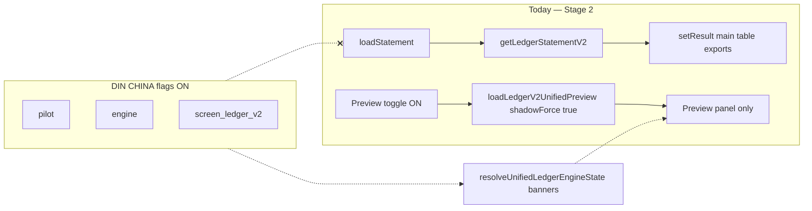
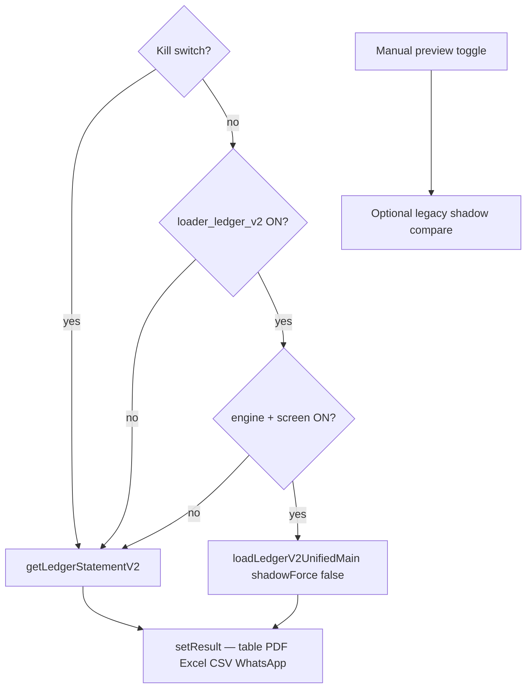

# Single Core Ledger Phase 2.10 — Ledger V2 Default Loader Swap Plan

**Status:** `PHASE 2.10G PRODUCTION LOADER ON PASS — Ledger V2 unified main live for DIN CHINA`  
**Closeout (2.12X):** Unchanged; Ledger V2 loader remains ON alongside Account Statement + Trial Balance. See closeout monitoring doc.  
**Mode:** Production `phase-212-prod`; loader **ON** for DIN CHINA  
**Prerequisite:** Phase 2.10B baseline QA PASS @ 2026-06-26  
**Company:** DIN CHINA (`30bd8592-3384-4f34-899a-f3907e336485`) only  
**Screen:** Ledger Statement V2 only  

---

## 1. Executive summary

Phase 2.9C enabled **engine + screen** flags for DIN CHINA. The Ledger V2 **main table still loads via legacy** `getLedgerStatementV2`. Unified data appears only when an admin manually enables the preview toggle (`loadLedgerV2UnifiedPreview` with `shadowForce: true`).

Phase 2.10 defines how to **safely switch the default main loader** to unified RPC for DIN CHINA Ledger V2 only, with:

- A **separate loader flag** (`unified_ledger_loader_ledger_v2`) — not reusing engine/screen flags
- **Instant L1 rollback** (loader flag OFF → legacy main table)
- **Export parity protection** (hard gate before execution)
- **Preview toggle retained** for side-by-side compare during rollout (semantics may invert to legacy shadow)

**Stage 3 execution is blocked** until implementation + ops approval + checklist gates PASS.

---

## 2. Current code reality (verified)



Source references:

- Main loader: ```293:311:src/app/features/ledger-statement-center-v2/LedgerStatementCenterV2Page.tsx```
- Preview loader: ```163:214:src/app/features/ledger-statement-center-v2/LedgerStatementCenterV2Page.tsx```
- Resolver (no loader routing): ```79:94:src/app/lib/unifiedLedgerEngineState.ts```
- Preview service isolation: ```1:4:src/app/services/ledgerStatementCenterV2UnifiedPreviewService.ts```

---

## 3. Target architecture (post–loader swap)



### Flag roles (unchanged vs new)

| Flag | Stage 2 role | Stage 3 (2.10) role |
|------|--------------|---------------------|
| `unified_ledger_pilot` | Informational badge | Unchanged |
| `unified_ledger_engine` | Company engine + RPC allowance | Required for unified main load |
| `unified_ledger_screen_ledger_v2` | Screen gate + banner eligibility | Required for unified main load |
| **`unified_ledger_loader_ledger_v2`** | **Absent (new)** | **Only flag that switches default main loader** |
| `unified_ledger_kill_switch` | Force legacy | Force legacy (overrides loader) |

**Design rule:** Engine + screen ON without loader flag = **today's Stage 2 behavior** (legacy main + unified resolver banners).

---

## 4. Loader resolution logic (spec)

Proposed function `resolveLedgerV2MainLoaderSource(companyId, engineState, loaderFlagEnabled)`:

| Priority | Condition | Main loader |
|----------|-----------|-------------|
| 1 | Kill switch (env or DB) | Legacy |
| 2 | `unified_ledger_loader_ledger_v2` OFF/absent | Legacy |
| 3 | Engine OFF OR screen_ledger_v2 OFF | Legacy |
| 4 | All above pass | Unified (`get_unified_party_ledger` / `get_unified_account_ledger`, `shadowForce: false`) |

Map unified rows via existing `mapUnifiedRowsToLedgerV2`; build `LedgerStatementV2Result` compatible with current `summarizeLedgerV2Rows` / exports.

**Optional enhancement:** Post-map enrichment for `createdBy` / attachments (see risk register R4–R6).

---

## 5. Consumers affected by `result.rows` swap

Full inventory: [`loader-swap-inventory.md`](../reports/single-core-ledger/phase-2-10-ledger-v2-loader-swap/loader-swap-inventory.md)

Critical paths:

| Path | Risk if unified rows differ |
|------|----------------------------|
| On-screen `LedgerTable` + running balance | High — user-visible |
| `LedgerSummaryCards` closing | High — MR JALIL gate |
| PDF / Excel / CSV | **Critical** — legal/ops exports |
| Full-statement WhatsApp | High — uses summary closing |
| Row WhatsApp / open detail / attachments | Medium — reference resolution |

Display filters (`transactionType`, `search`) remain client-side on loaded rows — no change to filter UX.

---

## 6. Preview toggle during loader swap

**Today:** Main = legacy; preview toggle loads unified compare panel.

**Proposed rollout options (pick one at implementation):**

| Option | Main | Preview toggle |
|--------|------|----------------|
| A (recommended) | Unified when loader ON | Loads **legacy shadow** compare (shadowForce via legacy service) |
| B | Unified | Disabled with banner "main is unified" |
| C | Unified | Keeps unified preview (redundant) — not recommended |

Option A preserves operator compare during early DIN CHINA pilot.

---

## 7. Rollback order

Detailed SQL: [`rollback-plan.md`](../reports/single-core-ledger/phase-2-10-ledger-v2-loader-swap/rollback-plan.md)

| Level | Action | Main table after reload |
|-------|--------|-------------------------|
| L1 | `unified_ledger_loader_ledger_v2` OFF | Legacy |
| L2 | `unified_ledger_screen_ledger_v2` OFF | Legacy |
| L3 | `unified_ledger_engine` OFF | Legacy (no unified RPC) |
| L4 | `unified_ledger_kill_switch` ON | Legacy (emergency) |

Reuse existing Stage 2 rollback scripts for L2/L3: `phase-29c-rollback-*.sql`.

---

## 8. Hard gates before execution

No loader flag SQL until **all** PASS:

| Gate | Requirement |
|------|-------------|
| Golden main table | MR JALIL closing **216,300** PKR on **main table** (not preview-only) |
| Pilot Batch | Admin Compare 9/9 PASS |
| Exports | PDF + Excel + CSV spot-check **signed** (not waived) |
| RPC health | No unexpected errors; unified calls only when loader ON |
| Staff | Preview toggle hidden for staff OR signed waiver **re-reviewed for loader exposure** |
| Rollback | L1 dry-run documented |
| Scope | DIN CHINA only; forbidden screen flags OFF |
| Code | Loader resolver + tests on preview build |

Checklist: [`execution-checklist.md`](../reports/single-core-ledger/phase-2-10-ledger-v2-loader-swap/execution-checklist.md)

---

## 9. Implementation phases (future — not this task)

| Phase | Deliverable |
|-------|-------------|
| 2.10A | Code: loader flag key, resolver, branched `loadStatement`, tests |
| 2.10B | SQL scripts: preflight / enable loader / post-verify / rollback L1 |
| 2.10C | Browser QA script `run-phase-210-loader-browser-qa.mjs` |
| 2.10D | Preview deploy + ops enable loader flag DIN CHINA |
| 2.10E | Soak / accelerated waiver (mirror 2.9C-Soak) |
| 2.10F | Production ERP deploy (separate approval; not merge-to-main by default) |

**Explicitly out of scope:** Other screens, other companies, migrations, GL mutations, Cash/Bank/Roznamcha flags.

---

## 10. Tests to plan (implement in 2.10A–C)

| Test | Expected |
|------|----------|
| Loader OFF, engine+screen ON | Legacy main; 0 unified RPC with preview OFF |
| Loader ON, engine+screen ON, kill OFF | Unified main; MR JALIL 216,300 |
| Kill switch ON | Legacy main even if loader ON |
| Loader ON, engine OFF | Legacy main |
| Loader ON, wrong company | Legacy main (flag absent) |
| Exports match on-screen totals | PDF/Excel/CSV closing = summary |
| Preview toggle | Manual; optional legacy shadow |
| Pilot Batch 9/9 | PASS |
| Staff session | No preview toggle |
| L1 rollback | Legacy main immediately after flag OFF |
| Other screens | Unchanged (no loader flag) |

---

## 11. Waiver language (for future accelerated soak)

> The Stage 2 soak is shortened by ops waiver because Stage 2 enables only DIN CHINA company engine + Ledger V2 screen resolver/banner flags. The Ledger V2 main table remains on the legacy loader, exports remain legacy, and preview RPC remains manually toggled. Post-Stage 2 browser QA and accelerated final checks passed. Stage 3 default loader swap remains blocked and requires a separate plan and ops approval.

*(Stage 2 soak used this text. Stage 3 post-loader soak will need updated wording referencing loader flag + export sign-off.)*

---

## 12. Risk summary

See [`risk-register.md`](../reports/single-core-ledger/phase-2-10-ledger-v2-loader-swap/risk-register.md). Top risks: export drift (R2), customer hybrid parity (R1), separate loader flag discipline (R7).

**Plan outcome:** Status **A** — ready for implementation approval. Export/staff items are **execution gates**, not plan blockers.

---

## 13. Related documents

| Document | Purpose |
|----------|---------|
| [Phase 2.9 pilot plan](SINGLE_CORE_LEDGER_PHASE_2_9_PILOT_ENABLEMENT_PLAN.md) | Stages 1–2 + soak |
| [Phase 2.3 Ledger V2 preview report](SINGLE_CORE_LEDGER_PHASE_2_3_LEDGER_V2_PREVIEW_REPORT.md) | Preview-only baseline |
| [Production ready](SINGLE_CORE_LEDGER_PRODUCTION_READY.md) | Program status |
| [Loader inventory](../reports/single-core-ledger/phase-2-10-ledger-v2-loader-swap/loader-swap-inventory.md) | Code touchpoints |
| [Rollback plan](../reports/single-core-ledger/phase-2-10-ledger-v2-loader-swap/rollback-plan.md) | L1–L4 |
| [Execution checklist](../reports/single-core-ledger/phase-2-10-ledger-v2-loader-swap/execution-checklist.md) | Ops gates |

---

## 14. Final status options

| Code | Status | This plan |
|------|--------|-----------|
| **A** | `PHASE 2.10 LEDGER V2 LOADER SWAP PLAN READY — awaiting implementation approval` | **Selected** |
| B | `PHASE 2.10 LOADER SWAP PLAN BLOCKED — unresolved export/staff/rollback risk` | Not selected — gates documented |
| C | `PHASE 2.10 LOADER SWAP REJECTED — keep Ledger V2 legacy main loader` | Not selected |

**Next step (ops):** Deploy Phase 2.10A code to preview; run baseline browser QA; signed export spot-check; then enable loader flag SQL in preview/staging only.

---

## 15. Phase 2.10A implementation (complete — flag not enabled)

| Deliverable | Path |
|-------------|------|
| Resolver | `src/app/lib/resolveLedgerV2MainLoaderSource.ts` |
| Main loader service | `src/app/services/ledgerStatementCenterV2UnifiedMainService.ts` |
| Page wiring | `LedgerStatementCenterV2Page.tsx` — `data-ledger-v2-main-loader` |
| Tests | `resolveLedgerV2MainLoaderSource.test.ts`, `ledgerV2MainLoaderExportParity.test.ts` |
| SQL artifacts | `scripts/single-core-ledger/phase-210-*.sql` (**NOT RUN**) |
| Browser QA | `scripts/single-core-ledger/run-phase-210-loader-browser-qa.mjs` |
| Evidence | `reports/single-core-ledger/phase-2-10-ledger-v2-loader-swap/` |

**Implementation status:** **A** — `PHASE 2.10B PREVIEW BASELINE QA PASS — ready for loader-flag candidate approval`

### Phase 2.10B preview baseline (2026-06-26)

| Evidence | Path |
|----------|------|
| Preview deploy | `reports/single-core-ledger/phase-2-10-ledger-v2-loader-swap/preview-deploy-notes.md` |
| Baseline QA | `reports/single-core-ledger/phase-2-10-ledger-v2-loader-swap/baseline-loader-qa.md` |
| Flags snapshot | `reports/single-core-ledger/phase-2-10-ledger-v2-loader-swap/baseline-flags.json` |
| Export spot-check | `reports/single-core-ledger/phase-2-10-ledger-v2-loader-swap/export-spot-check-baseline.md` |

**Next step (ops):** Approve candidate-mode loader flag ON in preview/staging only → run `phase-210-enable-loader-ledger-v2.sql` → `run-phase-210-loader-browser-qa.mjs candidate`.

### Phase 2.10C candidate loader-flag QA (2026-06-26)

| Evidence | Path |
|----------|------|
| Flags before enable | `reports/single-core-ledger/phase-2-10-ledger-v2-loader-swap/candidate-flags-before.json` |
| Flags after enable | `reports/single-core-ledger/phase-2-10-ledger-v2-loader-swap/candidate-flags-after.json` |
| Candidate browser QA | `reports/single-core-ledger/phase-2-10-ledger-v2-loader-swap/candidate-loader-qa.md` |
| Candidate export spot-check | `reports/single-core-ledger/phase-2-10-ledger-v2-loader-swap/candidate-export-spot-check.md` |
| L1 rollback QA | `reports/single-core-ledger/phase-2-10-ledger-v2-loader-swap/rollback-loader-qa.md` |

**Candidate QA:** PASS — `data-ledger-v2-main-loader="unified"`, MR JALIL PKR 216,300, unified main RPC on load, Pilot 9/9, party compare PASS, export spot-check **signed**.

**Waivers (review before soak):**
1. **Preview legacy shadow invert not shipped** — when main loader is unified, preview toggle still loads unified RPC for compare (unified vs unified golden PASS; not true legacy shadow).
2. **Staff session** — no staff credentials; staff toggle visibility waived (same as 2.10B).

**L1 rollback:** `phase-210-rollback-loader-ledger-v2.sql` executed @ 2026-06-26T10:43:40Z — `unified_ledger_loader_ledger_v2` **disabled** for DIN CHINA. Rollback browser QA PASS (legacy main restored).

**Not done:** Production frontend deploy, merge to main, loader soak (flag remains OFF until ops re-enables).

### Phase 2.10C-FIX legacy shadow invert (2026-06-26)

| Evidence | Path |
|----------|------|
| Fix notes | `reports/single-core-ledger/phase-2-10-ledger-v2-loader-swap/shadow-invert-fix-notes.md` |
| Candidate rerun QA | `reports/single-core-ledger/phase-2-10-ledger-v2-loader-swap/candidate-loader-qa-rerun.md` |
| Candidate export rerun | `reports/single-core-ledger/phase-2-10-ledger-v2-loader-swap/candidate-export-spot-check-rerun.md` |
| Rollback rerun QA | `reports/single-core-ledger/phase-2-10-ledger-v2-loader-swap/rollback-loader-qa-rerun.md` |

**2.10C-FIX:** When main loader is unified, preview toggle loads **legacy shadow** (`data-ledger-v2-preview-compare-source="legacy_shadow"`). Candidate rerun **PASS** — shadow invert waiver **closed**. Export spot-check **signed**. L1 rollback QA **PASS**.

**Remaining waiver:** Staff session (no credentials) — unchanged from 2.10B.

**Next step (ops):** Approve controlled loader soak — re-run `phase-210-enable-loader-ledger-v2.sql` with monitoring.

### Phase 2.10D controlled loader soak (2026-06-26)

| Evidence | Path |
|----------|------|
| Flags at soak start | `reports/single-core-ledger/phase-2-10-ledger-v2-loader-swap/controlled-soak-flags-start.json` |
| Soak T0 | `reports/single-core-ledger/phase-2-10-ledger-v2-loader-swap/controlled-soak-start.md` |
| Soak mid | `reports/single-core-ledger/phase-2-10-ledger-v2-loader-swap/controlled-soak-mid.md` |
| Soak final | `reports/single-core-ledger/phase-2-10-ledger-v2-loader-swap/controlled-soak-final.md` |
| Export check | `reports/single-core-ledger/phase-2-10-ledger-v2-loader-swap/controlled-soak-export-check.md` |
| Enable SQL | `scripts/single-core-ledger/phase-210d-enable-loader-soak.sql` |

**Soak option:** A — 2-hour controlled soak (accelerated start/mid/final QA checkpoints in-session).

**Result:** **PASS WITH WAIVERS** — MR JALIL PKR 216,300 stable; `legacy_shadow` preview; Pilot 9/9; exports signed. Loader flag **left ON** after soak (no rollback).

**Waivers:** Staff visibility (no credentials); non-golden party spot-check; accelerated checkpoint timeline vs full wall-clock 2h.

**Not done:** Production frontend deploy (`erp.dincouture.pk`), merge to main.

**Next step (ops):** Production frontend deploy planning with `phase-210c-fix` bundle; re-verify staff waiver; optional L1 rollback if extended monitoring fails.

### Phase 2.10E production deploy plan (2026-06-26)

| Evidence | Path |
|----------|------|
| Production deploy plan | `reports/single-core-ledger/phase-2-10-ledger-v2-loader-swap/production-deploy-plan.md` |
| Pre-deploy flags (loader OFF) | `reports/single-core-ledger/phase-2-10-ledger-v2-loader-swap/production-predeploy-flags.json` |
| Baseline QA template | `reports/single-core-ledger/phase-2-10-ledger-v2-loader-swap/production-baseline-qa.md` |
| Loader enable QA template | `reports/single-core-ledger/phase-2-10-ledger-v2-loader-swap/production-loader-enable-qa.md` |
| Production soak template | `reports/single-core-ledger/phase-2-10-ledger-v2-loader-swap/production-soak-notes.md` |

**Pre-deploy safety (executed):** L1 rollback @ 2026-06-26T13:24:53Z — loader **OFF** before production code deploy.

**Two-step rollout:** (1) deploy `phase-210c-fix` with loader OFF → baseline QA on `erp.dincouture.pk`; (2) separate ops approval → loader ON → candidate QA + soak.

**Code gate:** Commit/push full 2.10 bundle before VPS `deploy/deploy.sh`.

**Status:** **A** — `PHASE 2.10E PRODUCTION DEPLOY PLAN READY — awaiting deploy approval`

**Not done:** Merge to main, production loader re-enable (separate approval ticket).

### Phase 2.10F production frontend deploy + baseline (2026-06-26)

| Evidence | Path |
|----------|------|
| Deploy notes | `reports/single-core-ledger/phase-2-10-ledger-v2-loader-swap/production-deploy-notes.md` |
| Bundle verify | `reports/single-core-ledger/phase-2-10-ledger-v2-loader-swap/production-bundle-verify.md` |
| Flags before baseline | `reports/single-core-ledger/phase-2-10-ledger-v2-loader-swap/production-flags-before-baseline.json` |
| Baseline QA | `reports/single-core-ledger/phase-2-10-ledger-v2-loader-swap/production-baseline-qa.md` |
| Baseline export | `reports/single-core-ledger/phase-2-10-ledger-v2-loader-swap/production-baseline-export-check.md` |
| Staff waiver | `reports/single-core-ledger/phase-2-10-ledger-v2-loader-swap/production-staff-waiver.md` |
| Deploy script | `scripts/single-core-ledger/deploy-phase-210f-production-frontend-vps.sh` |

**Deploy:** `3e3f6190` / `phase-210c-fix-prod` on `erp.dincouture.pk`. Frontend-only (no migrations). Rollback tag: `erp-frontend:rollback-before-210f-20260626133735`.

**Baseline QA:** **PASS** — legacy main, MR JALIL PKR 216,300, `unified_compare` preview, exports signed, Pilot 9/9.

**Waiver:** Staff visibility (no credentials).

**Loader flag:** **OFF** — not enabled in this step.

**Next step (ops):** Separate production loader ON approval → `phase-210d-enable-loader-soak.sql` (production description) → candidate QA + soak on `erp.dincouture.pk`.

### Phase 2.10G production loader ON + QA + soak (2026-06-26)

| Evidence | Path |
|----------|------|
| Flags before loader ON | `reports/single-core-ledger/phase-2-10-ledger-v2-loader-swap/production-loader-on-flags-before.json` |
| Enable SQL | `scripts/single-core-ledger/phase-210g-enable-loader-production.sql` |
| Flags after loader ON | `reports/single-core-ledger/phase-2-10-ledger-v2-loader-swap/production-loader-on-flags-after.json` |
| Production loader ON QA | `reports/single-core-ledger/phase-2-10-ledger-v2-loader-swap/production-loader-on-qa.md` |
| Export verification | `reports/single-core-ledger/phase-2-10-ledger-v2-loader-swap/production-loader-on-export-check.md` |
| Non-golden spot-check | `reports/single-core-ledger/phase-2-10-ledger-v2-loader-swap/production-non-golden-spot-check.md` |
| Staff visibility | `reports/single-core-ledger/phase-2-10-ledger-v2-loader-swap/production-staff-visibility-check.md` |
| Soak T0 | `reports/single-core-ledger/phase-2-10-ledger-v2-loader-swap/production-loader-soak-t0.md` |
| Soak mid | `reports/single-core-ledger/phase-2-10-ledger-v2-loader-swap/production-loader-soak-mid.md` |
| Soak final | `reports/single-core-ledger/phase-2-10-ledger-v2-loader-swap/production-loader-soak-final.md` |
| Screenshots | `reports/single-core-ledger/phase-2-10-ledger-v2-loader-swap/screenshots/210g-production-loader-on-*` |

**Loader ON timestamp:** 2026-06-26T13:56:26.805825Z (DIN CHINA only).

**Current flag state (post-closeout verify):**

| Flag | State |
|------|-------|
| `unified_ledger_pilot` | ON |
| `unified_ledger_engine` | ON |
| `unified_ledger_screen_ledger_v2` | ON |
| `unified_ledger_loader_ledger_v2` | **ON** |
| All other `unified_ledger%` | OFF/absent |

**Production QA:** **PASS** @ `https://erp.dincouture.pk` — `data-ledger-v2-main-loader="unified"`, MR JALIL PKR 216,300, unified main-loader RPC on load, preview `legacy_shadow` when toggle ON, Admin Compare Party MR JALIL PASS, Pilot Batch 9/9.

**Export result:** **SIGNED** — on-screen / PDF / Excel / CSV all PKR 216,300 from unified main `result.rows`.

**Soak result:** **PASS** (accelerated waiver — T0 / mid / final @ ~90s intervals; ops-approved pattern from 2.10D). Loader flag remained ON; no rollback.

**Waivers:**

- Staff visibility — no DIN CHINA staff credentials ([`production-staff-visibility-check.md`](../reports/single-core-ledger/phase-2-10-ledger-v2-loader-swap/production-staff-visibility-check.md))
- Non-golden party spot-check — dropdown selection limitation ([`production-non-golden-spot-check.md`](../reports/single-core-ledger/phase-2-10-ledger-v2-loader-swap/production-non-golden-spot-check.md))
- Accelerated soak timeline vs full 2h wall-clock (pre-approved ops pattern)

**Rollback status:** **Not executed.** L1 rollback SQL remains ready: `scripts/single-core-ledger/phase-210-rollback-loader-ledger-v2.sql`.

**Next blocked items:**

- Do **not** enable Account Statement, Trial Balance, Roznamcha, Party Ledger, Cash/Bank, or other screen flags without separate scope.
- Do **not** expand loader ON to other companies without new ops ticket.
- Cash/Bank parity (Phase 2.9A-CB) remains future work — **not started**.

**Final status:** **A** — `PHASE 2.10G PRODUCTION LOADER ON PASS — Ledger V2 unified main live for DIN CHINA`
