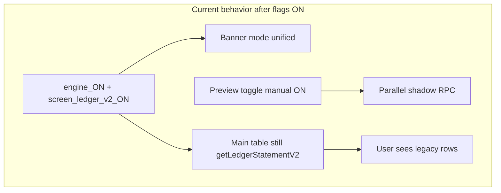

# Single Core Ledger Phase 2.9 — DIN CHINA Single-Screen Pilot Flag Enablement Plan

> **Historical note:** Header status below reflects **2026-06-25 pre-pilot** planning. DIN CHINA pilot, engine, and all five unified main loaders are **complete and closed on `main`** as of Phase 2.18. See [`SINGLE_CORE_LEDGER_PRODUCTION_READY.md`](SINGLE_CORE_LEDGER_PRODUCTION_READY.md).

**Status:** `HISTORICAL — DIN CHINA PILOT COMPLETE (see production ready pack)`  
**Mode:** Historical plan + evidence — flags were enabled in controlled stages 2026-06-25–2026-06-26  
**Branch:** `feature/single-core-ledger-phase-2-9a3-preview-deploy-plan` @ `cb4957c7`  
**Base:** `feature/single-core-ledger-phase-2-8-preview-qa-signoff` @ `807fdbcd`  
**Last updated:** 2026-06-25  

**Prerequisite:** Phase 2.8 complete — 112/112 `test:unified-ledger`, build PASS, signed off with waivers. See [`SINGLE_CORE_LEDGER_PHASE_2_8_PREVIEW_QA_SIGNOFF.md`](SINGLE_CORE_LEDGER_PHASE_2_8_PREVIEW_QA_SIGNOFF.md).

---

## Pilot screen recommendation

**Selected: Option A — Ledger Statement V2** (`ledger_v2` / `unified_ledger_screen_ledger_v2`).

| Option | Verdict | Rationale |
|--------|---------|-----------|
| **A — Ledger V2** | **Selected** | First preview shipped (2.3); MR JALIL shortcut; 112-test coverage; export safety verified in 2.8; single statement-type model vs Account Statement's customer/supplier/worker matrix |
| B — Account Statement | Defer | Higher QA surface (multiple GL loaders); same flag risk but more parity paths to watch |
| C — Admin Compare only | Reject as pilot | Already runs unified RPC via `shadowForce: true` without flags ([`unifiedLedgerEngineState.ts`](../../src/app/lib/unifiedLedgerEngineState.ts) `adminTieOut`); flag enablement does not exercise user-screen rollout |

**Critical code reality (limits blast radius today):** [`resolveUnifiedLedgerEngineState`](../../src/app/lib/unifiedLedgerEngineState.ts) can return `mode: 'unified'` when `unified_ledger_engine` + per-screen flag are ON, but **no screen swaps the main table loader** based on `engineState.mode`. Preview RPC on Ledger V2 only runs when the manual preview toggle is ON ([`LedgerStatementCenterV2Page.tsx`](../../src/app/features/ledger-statement-center-v2/LedgerStatementCenterV2Page.tsx)). Phase 2.9 flag enablement therefore changes **banners/badges and resolver state only** — not default data source.



---

## 1. Branch strategy

| Item | Value |
|------|-------|
| **Plan branch** | `feature/single-core-ledger-phase-2-9-pilot-enablement-plan` |
| **Base** | `feature/single-core-ledger-phase-2-8-preview-qa-signoff` @ `807fdbcd` |
| **PR title** | `Single Core Ledger Phase 2.9 — DIN CHINA Pilot Enablement Plan` |
| **PR base** | `feature/single-core-ledger-phase-2-8-preview-qa-signoff` |
| **Nature** | Plan doc + rollback SQL templates + checklists only — **no flag writes in PR** |

**Evidence folder (execution phase):** [`reports/single-core-ledger/phase-2-9-pilot-enablement/`](../../reports/single-core-ledger/phase-2-9-pilot-enablement/)

---

## 2. Pilot objective

Validate **production flag read paths** for DIN CHINA on **one screen** (Ledger V2) under **admin/developer-only** preview access, with **instant rollback** and **no loader default switch**, before any multi-screen or multi-company rollout.

Success = flags readable, banners correct, legacy table + exports unchanged, MR JALIL unified closing still **216,300** when preview toggle ON, staff unaffected.

---

## 3. Pilot scope

| Dimension | In scope | Out of scope |
|-----------|----------|--------------|
| Company | DIN CHINA `30bd8592-3384-4f34-899a-f3907e336485` | All other companies |
| Screen | Ledger V2 only | Account Statement, TB, Roznamcha, Party Ledger |
| Users | `admin`, `developer`, `accounting_auditor` (preview gate) | `staff` / `manager` (must see zero preview UI) |
| Behavior | Flag-driven banner/mode; manual preview toggle unchanged | Replace `getLedgerStatementV2` as default loader |
| Data | `feature_flags` upsert for DIN CHINA only (after separate ops approval) | GL amounts, journal lines, migrations |

---

## 4. Preconditions

- [ ] Phase 2.8 sign-off merged or referenced @ `807fdbcd`
- [ ] `npm run test:unified-ledger` — 112/112 PASS at execution commit
- [ ] `unified_ledger_engine` **OFF** for DIN CHINA before any step (verify via SQL or Settings UI)
- [ ] No open P0 on Ledger V2 preview from 2.8 waiver review
- [ ] Ops assigns **flag executor** + **rollback approver** (two-person rule recommended)
- [ ] DIN CHINA admin test account available for live walkthrough
- [ ] Backup reference documented: `/root/NEWPOSV3/backups/supabase_db_20260623_192408.dump` (not required for flag-only rollback)

**Pre-flag SQL read (read-only):**

```sql
SELECT feature_key, enabled, updated_at
FROM feature_flags
WHERE company_id = '30bd8592-3384-4f34-899a-f3907e336485'
  AND feature_key LIKE 'unified_ledger%'
ORDER BY feature_key;
```

Expect: no rows or all `enabled = false`.

---

## 5. Waiver handling (from Phase 2.8)

Clear these **before** any flag enablement (live session on DIN CHINA):

| 2.8 waiver | 2.9 clearance action |
|------------|---------------------|
| Live DIN CHINA walkthrough | Admin walks all 6 surfaces; record pass/fail in 2.9 evidence |
| Network HAR (no `get_unified_*` when toggle OFF) | DevTools filter on Ledger V2 with flags OFF and ON (toggle OFF) |
| Preview JSON download | Download `phase2-compare-*.json` from Ledger V2 panel |
| Kill-switch rebuild | Set `VITE_UNIFIED_LEDGER_ENGINE_KILLED=true`, rebuild, confirm toggle disabled |

Until waivers cleared: **do not execute flag steps**.

### Phase 2.9A-2 browser waiver closure (2026-06-25T12:55:00Z)

**Report:** [`browser-waiver-closure/browser-waiver-closure.md`](../../reports/single-core-ledger/phase-2-9-pilot-enablement/pre-flag/browser-waiver-closure/browser-waiver-closure.md)

| Finding | Result |
|---------|--------|
| Production ERP preview UI deployed | **NO** — Ledger V2 preview strings missing from `erp.dincouture.pk` bundle |
| Admin Compare route in bundle | **YES** (`unified-ledger-tieout`) |
| Authenticated browser session | **NOT RUN** |
| Live checks 1–11 on production | **BLOCKED** until preview deploy |

---

### Phase 2.9A ops check results (2026-06-25T12:47:00Z)

**Report:** [`reports/single-core-ledger/phase-2-9-pilot-enablement/pre-flag/live-waiver-checks.md`](../../reports/single-core-ledger/phase-2-9-pilot-enablement/pre-flag/live-waiver-checks.md)

| 2.8 waiver | 2.9A status |
|------------|-------------|
| Live DIN CHINA walkthrough | **Open** — browser session required |
| Network HAR (toggle OFF) | **Open** |
| Preview JSON download | **Open** |
| Kill-switch rebuild | **Open** (DB kill flag absent; env rebuild not run) |

**Completed without mutation:**

| Check | Result |
|-------|--------|
| DIN CHINA `feature_flags` all `unified_ledger%` OFF | **PASS** (0 rows) |
| MR JALIL unified closing via read-only RPC | **PASS** — PKR **216,300.00** |
| `npm run test:unified-ledger` | **PASS** 112/112 |
| Stage 1 / Stage 2 SQL | **NOT RUN** |

---

## 6. Feature flags required

Keys from [`unifiedLedgerFlagKeys.ts`](../../src/app/lib/unifiedLedgerFlagKeys.ts) / [`featureFlagsService.ts`](../../src/app/services/featureFlagsService.ts):

| Flag key | Scope | Default | Role in pilot |
|----------|-------|---------|---------------|
| `unified_ledger_pilot` | Company (DIN CHINA) | OFF | Shows pilot badge in preview panel; does **not** enable unified mode alone |
| `unified_ledger_engine` | Company (DIN CHINA) | OFF | Master gate; required for `mode: unified` |
| `unified_ledger_screen_ledger_v2` | Company (DIN CHINA) | OFF | Per-screen gate for Ledger V2 only |
| `unified_ledger_kill_switch` | Company (DIN CHINA) | OFF | DB emergency stop (company-scoped in resolver) |
| `VITE_UNIFIED_LEDGER_ENGINE_KILLED` | Build/env | unset | Global env kill (no DB); requires redeploy to activate |

**Resolver rules** ([`unifiedLedgerEngineState.ts`](../../src/app/lib/unifiedLedgerEngineState.ts)):

- **Kill switch** (env or DB): `mode → killed`; user preview RPC blocked; admin compare still allows `shadowForce`
- **Preview toggle ON**: `mode → preview` (overrides unified banner while comparing)
- **Engine OFF**: `mode → legacy` even if per-screen flag ON
- **Engine ON + screen OFF**: `mode → legacy` (screen gate)
- **Engine ON + screen ON + toggle OFF**: `mode → unified` (banner only today)
- **`rpcAllowed`**: `true` when engine ON (or `shadowForce`); user screens still gate RPC on **manual preview toggle**, not `rpcAllowed` alone

**`unified_ledger_pilot` is informational** in preview panels — recommended as **Stage 1** to validate DB write before engine enablement.

---

## 7. Exact flag enablement proposal (DO NOT RUN UNTIL OPS APPROVAL)

**Staged enablement — DIN CHINA only — separate ops approval per stage.**

### Stage 0 — Baseline capture

Record `feature_flags` snapshot + screenshot of Ledger V2 banner (`data-unified-ledger-mode="legacy"`).

### Stage 1 — Pilot flag only (lowest risk)

```sql
INSERT INTO feature_flags (company_id, feature_key, enabled, description)
VALUES (
  '30bd8592-3384-4f34-899a-f3907e336485',
  'unified_ledger_pilot',
  true,
  'Phase 2.9 DIN CHINA pilot — preview badge only'
)
ON CONFLICT (company_id, feature_key)
DO UPDATE SET enabled = true, updated_at = now();
```

**Expected:** Pilot badge visible in Ledger V2 preview panel when toggle ON; main table unchanged; `mode` still `legacy` with toggle OFF.

**Soak:** 24h — staff spot-check (no toggles), admin confirms no regressions.

### Stage 2 — Engine + single screen flag (pilot target)

Only after Stage 1 PASS + live QA §9–10:

```sql
-- Step 2a: company engine ON
INSERT INTO feature_flags (company_id, feature_key, enabled, description)
VALUES (
  '30bd8592-3384-4f34-899a-f3907e336485',
  'unified_ledger_engine',
  true,
  'Phase 2.9 DIN CHINA pilot — company engine (Ledger V2 screen gate still required)'
)
ON CONFLICT (company_id, feature_key)
DO UPDATE SET enabled = true, updated_at = now();

-- Step 2b: Ledger V2 screen only (no other unified_ledger_screen_* keys)
INSERT INTO feature_flags (company_id, feature_key, enabled, description)
VALUES (
  '30bd8592-3384-4f34-899a-f3907e336485',
  'unified_ledger_screen_ledger_v2',
  true,
  'Phase 2.9 DIN CHINA pilot — Ledger V2 screen gate'
)
ON CONFLICT (company_id, feature_key)
DO UPDATE SET enabled = true, updated_at = now();
```

**Expected:** Banner `data-unified-ledger-mode="unified"` on Ledger V2 when preview toggle OFF; legacy table + exports unchanged; preview toggle still required for parallel RPC.

**Explicitly do NOT enable:** `unified_ledger_screen_account_statement`, `trial_balance`, `roznamcha`, `party_ledger` for any company.

### Stage 3 — Not in 2.9

Default loader swap (replace `getLedgerStatementV2`) → future Phase 2.10+ with separate plan and ops approval.

---

## 8. Rollback runbook

**Order: fastest user impact first. No DB restore required for flag rollback.**

### Level 1 — Per-screen flag OFF (targeted)

```sql
UPDATE feature_flags
SET enabled = false, updated_at = now()
WHERE company_id = '30bd8592-3384-4f34-899a-f3907e336485'
  AND feature_key = 'unified_ledger_screen_ledger_v2';
```

### Level 2 — Pilot flag OFF

```sql
UPDATE feature_flags
SET enabled = false, updated_at = now()
WHERE company_id = '30bd8592-3384-4f34-899a-f3907e336485'
  AND feature_key = 'unified_ledger_pilot';
```

### Level 3 — Company engine OFF

```sql
UPDATE feature_flags
SET enabled = false, updated_at = now()
WHERE company_id = '30bd8592-3384-4f34-899a-f3907e336485'
  AND feature_key = 'unified_ledger_engine';
```

### Level 4 — DB kill switch ON (company emergency)

```sql
INSERT INTO feature_flags (company_id, feature_key, enabled, description)
VALUES (
  '30bd8592-3384-4f34-899a-f3907e336485',
  'unified_ledger_kill_switch',
  true,
  'Emergency — force legacy unified paths'
)
ON CONFLICT (company_id, feature_key)
DO UPDATE SET enabled = true, updated_at = now();
```

### Level 5 — Env kill (global, requires redeploy)

Set `VITE_UNIFIED_LEDGER_ENGINE_KILLED=true` in production env → rebuild/redeploy web bundle.

### Post-rollback verification

- [ ] Ledger V2 banner `data-unified-ledger-mode="legacy"` or `killed`
- [ ] Main statement table matches pre-pilot export spot-check
- [ ] PDF/Excel/CSV export totals unchanged
- [ ] Staff user: no preview toggles on any screen
- [ ] `/admin/unified-ledger-tieout` Party tab still loads (under kill: compare still works via `shadowForce`)
- [ ] Re-run `SELECT ... unified_ledger%` — confirm intended OFF states

---

## 9. Live QA checklist — before enablement

Run on **DIN CHINA** as **admin/developer** (clears 2.8 waivers):

- [x] All flags OFF — confirm SQL baseline (**PASS** 2026-06-25 — [`pre-flag-flags.json`](../../reports/single-core-ledger/phase-2-9-pilot-enablement/pre-flag/pre-flag-flags.json))
- [ ] Ledger V2: toggle visible, default OFF; banner legacy (**WAIVED** — live browser)
- [ ] Network: no `get_unified_party_ledger` / `get_unified_account_ledger` with toggle OFF (**WAIVED** — HAR)
- [x] Enable preview toggle → MR JALIL → unified closing **216,300** (±0.01) (**PASS** read-only RPC — [`mr-jalil-rpc-verification.json`](../../reports/single-core-ledger/phase-2-9-pilot-enablement/pre-flag/mr-jalil-rpc-verification.json))
- [ ] Preview JSON export downloads; labeled non-official (**WAIVED**)
- [ ] Export PDF/Excel with preview ON matches preview OFF totals (**WAIVED**)
- [ ] Kill env test OR document DB kill switch dry-run on staging (**PARTIAL** — kill flag absent)
- [ ] Staff account: zero preview toggles on all 5 screens (**WAIVED**)
- [x] Record evidence under `reports/single-core-ledger/phase-2-9-pilot-enablement/pre-flag/` (**DONE**)

---

## 10. Live QA checklist — after enablement

Repeat after **each stage** (1 and 2):

| Check | Stage 1 (pilot ON) | Stage 2 (engine + screen ON) |
|-------|-------------------|------------------------------|
| Banner mode on Ledger V2 (toggle OFF) | `legacy` | `unified` |
| Main table data vs pre-flag export | Identical | Identical |
| Preview toggle still manual | Yes | Yes |
| MR JALIL unified closing with toggle ON | 216,300 | 216,300 |
| Staff sees no toggles | Yes | Yes |
| Other companies unaffected | Yes | Yes |
| Other screens' flags still OFF | Yes | Yes |
| Admin Compare Pilot Batch 9/9 | PASS (regression) | PASS |

**Soak monitoring:** 24–72h with daily admin spot-check on MR JALIL + one non-golden party.

---

## 11. Monitoring plan

| Signal | Method | Alert threshold |
|--------|--------|-----------------|
| Flag state drift | Daily SQL read of `unified_ledger%` for DIN CHINA | Any unexpected key ON |
| User-reported statement mismatch | Support channel / ops Slack | Any report → Level 1 rollback |
| RPC errors | Browser console + Supabase logs for `get_unified_*` | Spike after flag enablement |
| Export complaints | Finance spot-check | Totals differ → rollback |
| Kill switch | Confirm OFF unless incident | ON without ticket → investigate |

No automated alerting required for 2.9 plan phase; ops manual checklist sufficient for single-company pilot.

---

## 12. User / role access plan

| Role | Ledger V2 during pilot |
|------|------------------------|
| `staff` / `manager` | Legacy only; **no preview toggle** (unchanged) |
| `admin` | Preview toggle visible; sees pilot/engine banners when flags ON |
| `developer` | Same as admin |
| `accounting_auditor` | Same (via Developer Center gate) |

**No role-based flag bypass** — flags are company-scoped; access to preview UI remains role-gated via [`ledgerV2UnifiedPreviewAccess.ts`](../../src/app/lib/ledgerV2UnifiedPreviewAccess.ts).

---

## 13. Success criteria

- [ ] Stage 1 + Stage 2 flag SQL executed only after ops approval and waiver clearance
- [ ] DIN CHINA only — no other `company_id` rows touched
- [ ] Only `unified_ledger_pilot`, `unified_ledger_engine`, `unified_ledger_screen_ledger_v2` enabled (plus kill switch only if testing rollback)
- [ ] Legacy main table + exports unchanged on Ledger V2
- [ ] MR JALIL unified closing **216,300** (±0.01) with preview toggle ON
- [ ] Staff unaffected on all screens
- [ ] Rollback drill completed once on staging or documented dry-run
- [ ] Evidence pack committed to `reports/single-core-ledger/phase-2-9-pilot-enablement/`

---

## 14. Failure criteria

Immediate rollback (Level 1–4) if any:

- Main Ledger V2 table totals differ from pre-flag baseline without preview toggle ON
- Export/print totals change vs pre-flag baseline
- Staff sees preview toggles
- MR JALIL unified closing outside ±0.01 with preview ON
- Unexpected `get_unified_*` calls with preview toggle OFF
- Flags enabled for wrong company or additional screens
- Finance or ops escalates statement trust issue

**Sign-off state on failure:** `PHASE 2.9 PILOT FAILED — flags reverted; do not expand rollout`

---

## 15. Evidence artifacts

| Artifact | Path |
|----------|------|
| Pre-flag `feature_flags` SQL output | [`pre-flag/pre-flag-flags.json`](../../reports/single-core-ledger/phase-2-9-pilot-enablement/pre-flag/pre-flag-flags.json) |
| Phase 2.9A live waiver report | [`pre-flag/live-waiver-checks.md`](../../reports/single-core-ledger/phase-2-9-pilot-enablement/pre-flag/live-waiver-checks.md) |
| MR JALIL RPC verification | [`pre-flag/mr-jalil-rpc-verification.json`](../../reports/single-core-ledger/phase-2-9-pilot-enablement/pre-flag/mr-jalil-rpc-verification.json) |
| Post-stage SQL output | `post-stage-1-flags.json`, `post-stage-2-flags.json` |
| Ledger V2 screenshots (banner mode) | `ledger-v2-banner-legacy.png`, `ledger-v2-banner-unified.png` |
| MR JALIL compare JSON | `phase2-compare-ledger-v2-mr-jalil-*.json` |
| Network HAR snippet | `ledger-v2-no-unified-rpc-toggle-off.har` |
| Export spot-check notes | `export-parity-ledger-v2.md` |
| Rollback execution log | `rollback-drill-*.md` |

Golden fixtures:

| Fixture | Value |
|---------|-------|
| DIN CHINA company | `30bd8592-3384-4f34-899a-f3907e336485` |
| MR JALIL contact | `fe7ec33d-fd6d-4aa6-8d21-416e383b4c93` |
| Expected balance | PKR **216,300** (±0.01) |

---

## 16. What remains blocked after 2.9

Even after successful pilot flags:

| Action | Status |
|--------|--------|
| Enable flags for DIN BRIDAL or other companies | Blocked |
| Enable additional per-screen flags | Blocked |
| Switch Ledger V2 default loader to unified RPC | Blocked (future phase) |
| `unified_ledger_engine` ON globally / all companies | Blocked |
| Merge preview stack to `main` / VPS deploy of new behavior | Ops decision |
| Remove legacy `getLedgerStatementV2` | Blocked |

---

## 17. Final status

**`PHASE 2.9A STILL BLOCKED — Party/Pilot/Ledger V2 gate not passed (Cash/Bank waived)`**

### Stage 1 may proceed only if (Cash/Bank **not** included)

| Gate | Required for Stage 1 | Status |
|------|----------------------|--------|
| Party / MR JALIL Admin Compare PASS | **Yes** | Operator sign-off pending on fixed preview |
| Pilot Batch 9/9 PASS | **Yes** | Operator sign-off pending on fixed preview |
| Ledger V2 browser QA PASS | **Yes** | Interactive checklist OPEN — see `browser-qa-notes.md` |
| DIN CHINA `unified_ledger%` flags OFF | **Yes** | **PASS** (0 rows / OFF) |
| Trial Balance compare | Use **`official_gl`** | Operator guidance — not a Stage 1 flag step |
| **Cash/Bank Admin Compare** | **No — documented waiver** | Fails on closing scope; row parity on fixed bundle; see §17.1 |
| Stage 1 SQL | After gates above | **NOT RUN** — enables **`unified_ledger_pilot` only** (§7) |
| Stage 2 SQL | After Stage 1 soak | **NOT RUN** — enables `unified_ledger_engine` + `unified_ledger_screen_ledger_v2` |

**Do not enable** Cash/Bank or Roznamcha pilot flags in Stage 1. **Stage 1 enables `unified_ledger_pilot` only** per §7 (preview badge validation — not engine or screen flags).

### 17.2 Phase 2.9A-6 / 2.9A-7 gate confirmation (2026-06-25)

**Latest evidence:** [`phase-2.9a-7-gate-signoff.json`](../reports/single-core-ledger/phase-2-9-pilot-enablement/post-deploy-browser-qa/phase-2.9a-7-gate-signoff.json)

| Gate | Required | Result (2.9A-7) |
|------|----------|-----------------|
| Party / MR JALIL PASS | Yes | **SKIP** — operator browser |
| Pilot Batch 9/9 PASS | Yes | **SKIP** — operator browser |
| Ledger V2 browser QA | Yes | **SKIP** — operator browser |
| Flags OFF | Yes | **PASS** (read-only SQL) |
| Cash/Bank compare | No | **WAIVED** |

**Operator script:** `node scripts/single-core-ledger/run-phase-29a7-operator-gate-signoff.mjs` (requires `QA_BROWSER_PASSWORD`)

**Sign-off:** `PHASE 2.9A STILL BLOCKED — Party/Pilot/Ledger V2 gate not passed`

When browser gates PASS → **`PHASE 2.9A LEDGER V2 GATE PASS WITH CASH/BANK WAIVER — ready for Stage 1 ops approval ticket`** → execute §7 Stage 1 SQL (`unified_ledger_pilot` only).

### 17.1 Cash/Bank waiver (not Stage 1 blocker)

- Admin Compare Cash/Bank tab is **not** the Stage 1 pilot screen.
- Production Cash/Bank and Roznamcha screens remain **legacy roznamcha** loaders.
- Observed old/new balance and row-count deltas reflect **roznamcha cashbook vs unified GL** semantics, not Ledger V2 loader parity.
- Remediation tracked separately: [`SINGLE_CORE_LEDGER_PHASE_2_9A_CB_CASH_BANK_PARITY_PLAN.md`](SINGLE_CORE_LEDGER_PHASE_2_9A_CB_CASH_BANK_PARITY_PLAN.md)
- Evidence: [`admin-compare-delta-investigation.md`](../reports/single-core-ledger/phase-2-9-pilot-enablement/post-deploy-browser-qa/admin-compare-delta-investigation.md) § Cash/Bank waiver

### Prior final status (2026-06-25 early)

**`PHASE 2.9A BROWSER WAIVERS PASS WITH LIMITED WAIVERS — review before Stage 1`**

| Gate | Result |
|------|--------|
| Production flags OFF (DIN CHINA) | **PASS** (post-QA read-only) |
| MR JALIL 216,300 (read-only RPC) | **PASS** |
| Preview container + bundle | **PASS** (`20f72a90`, all four strings) |
| Preview login page (tunnel) | **PASS** |
| Live admin browser checklist | **OPEN** — operator session + password |
| Staff visibility live | **WAIVED** — no DIN CHINA staff user; unit tests PASS |
| Stage 1 SQL | **NOT RUN** |
| Stage 2 SQL | **NOT RUN** |

**Recommendation:** Operator completes interactive checklist on http://localhost:3002 → re-sign full **PASS** → Stage 1 ticket (Cash/Bank excluded per §17.1).

### Phase 2.9A-3 preview deploy (executed 2026-06-25, redeployed compare fix)

**Status:** `PHASE 2.9A-3 PREVIEW REDEPLOYED @ 5b520cef`  
**Container:** `erp-frontend-preview` on VPS **:3003** (tunnel local :3002)  
**Evidence:** [`post-deploy-browser-qa/bundle-verify.txt`](../../reports/single-core-ledger/phase-2-9-pilot-enablement/post-deploy-browser-qa/bundle-verify.txt), [`compare-fix-redeploy-notes.md`](../../reports/single-core-ledger/phase-2-9-pilot-enablement/post-deploy-browser-qa/compare-fix-redeploy-notes.md)

### Phase 2.9A-4 browser waiver QA (2026-06-25)

**Evidence:** [`post-deploy-browser-qa/browser-waiver-closure.md`](../../reports/single-core-ledger/phase-2-9-pilot-enablement/post-deploy-browser-qa/browser-waiver-closure.md)  
**Automation:** [`run-phase-29a4-browser-qa.mjs`](../../scripts/single-core-ledger/run-phase-29a4-browser-qa.mjs) (requires `QA_BROWSER_PASSWORD`)

### Phase 2.9A-3 preview deploy plan (reference)

**Doc:** [`SINGLE_CORE_LEDGER_PHASE_2_9A3_PREVIEW_DEPLOY_PLAN.md`](SINGLE_CORE_LEDGER_PHASE_2_9A3_PREVIEW_DEPLOY_PLAN.md)  

| Item | Value |
|------|-------|
| Target | `erp-frontend-preview` port **3003** on VPS (tunnel local **3002**) |
| Production ERP | **Unchanged** |
| Flags | **OFF** — no DB writes in deploy |
| Script | [`deploy-phase-29a3-preview-frontend-vps.sh`](../../scripts/single-core-ledger/deploy-phase-29a3-preview-frontend-vps.sh) |

---

## Execution sequence (after plan approval)

1. ~~Preview deploy + bundle verify~~ **Done**
2. ~~2.9A-4 browser QA (automated smoke + DB)~~ **Done (limited waivers)**
3. Operator: full interactive admin + staff session → **2.9A PASS**
4. **Admin Compare delta fix (2026-06-25):** commits `4880a966` + `5b520cef` — see [`admin-compare-delta-investigation.md`](../../reports/single-core-ledger/phase-2-9-pilot-enablement/post-deploy-browser-qa/admin-compare-delta-investigation.md). **126/126** tests PASS. Preview **redeployed** @ `5b520cef` on :3003.
5. Operator: Party + Pilot Batch + Ledger V2 on fixed preview → **2.9A PASS** (Cash/Bank waived) → Stage 1 ticket
6. Ops approves Stage 1 SQL → execute → §10 soak
7. Ops approves Stage 2 SQL → execute → §10 soak
8. **Stop before Stage 1 SQL without explicit ops ticket**
9. Cash/Bank parity → **Phase 2.9A-CB** (future, post–Stage 1) — [`SINGLE_CORE_LEDGER_PHASE_2_9A_CB_CASH_BANK_PARITY_PLAN.md`](SINGLE_CORE_LEDGER_PHASE_2_9A_CB_CASH_BANK_PARITY_PLAN.md)
