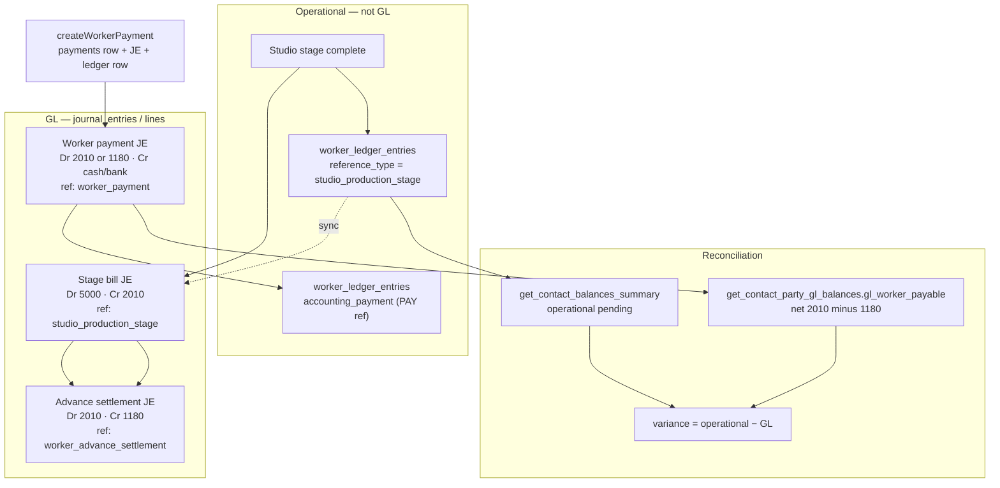

# Phase 7 — Worker accounting unification

## Worker flow (end-to-end)

## Separation: operational ≠ GL

| Layer | Source | Role |
|--------|--------|------|
| Operational | `worker_ledger_entries`, `payments` | Studio UI, FIFO pay display, Roznamcha via `payments` |
| GL | `journal_entries` on **5000 / 2010 / 1180** + cash/bank | Trial balance, party GL RPC, worker statement **GL** tab |

Do not treat operational running balance as TB truth, or vice versa. The **Reconciliation** tab on the worker statement compares the two explicitly.

## Issues addressed (this phase)

1. **Payment routing** — `shouldDebitWorkerPayableForPayment` could send cash to **1180** when the subledger had no unpaid job row but **GL still showed net worker payable** (e.g. missing or stale `worker_ledger_entries`). **Fix:** after scanning unpaid stage rows, fall back to `get_contact_party_gl_balances` → `gl_worker_payable` for the worker (branch-aware when provided).
2. **Pay Now / missing job row** — If a stage-bill **JE** exists but the matching **worker_ledger** row is missing, Pay Now could wrongly route to advance. **Fix:** when `stageId` is set, if no ledger row, treat an active `journal_entries` row with `reference_type = studio_production_stage` and that `reference_id` as “has a bill” → debit **2010**.
3. **Add Entry V2 worker payment** — After posting, contact / recon consumers were not always refreshed. **Fix:** call `dispatchContactBalancesRefresh(companyId)` after a successful worker payment entry (aligned with `workerPaymentService`).
4. **Integrity lab copy** — RULE_03 / RULE_06 text updated to describe the **ledger + stage JE + GL net** routing heuristic instead of “worker ledger only.”

## Final behavior

- **Stage bill:** Still **Dr 5000 / Cr 2010** with studio reference; **auto-apply advance** still **Dr 2010 / Cr 1180** when 1180 balance exists (`applyWorkerAdvanceAgainstNewBill`).
- **Worker payment:** Still one **`payments`** row, one **`worker_payment`** JE, and (unless Pay Now full settlement path) one **`worker_ledger_entries`** payment row. **Debit account:** **2010** if any unpaid stage job exists, **or** a stage-bill JE exists for the given `stageId`, **or** GL `gl_worker_payable` &gt; 0; otherwise **1180** (pre-bill advance).
- **Reconciliation:** **GenericLedgerView** → worker → **Reconciliation** uses `getSingleWorkerPartyReconciliation` (operational RPC vs `gl_worker_payable`). **GL** tab remains **2010 + 1180** journal lines only.

## Key files

- `src/app/services/workerAdvanceService.ts` — routing + advance settlement + 1180 balance from journals  
- `src/app/services/workerPaymentService.ts` — canonical pay worker path  
- `src/app/services/studioProductionService.ts` — stage bill JE + `worker_ledger_entries` lifecycle  
- `src/app/components/accounting/GenericLedgerView.tsx` — Operational / GL / Reconciliation  
- `src/app/services/contactBalanceReconciliationService.ts` — `getSingleWorkerPartyReconciliation`  
- `migrations/20260334_get_contact_party_gl_balances_party_parity.sql` — party resolution for worker/studio JEs  
