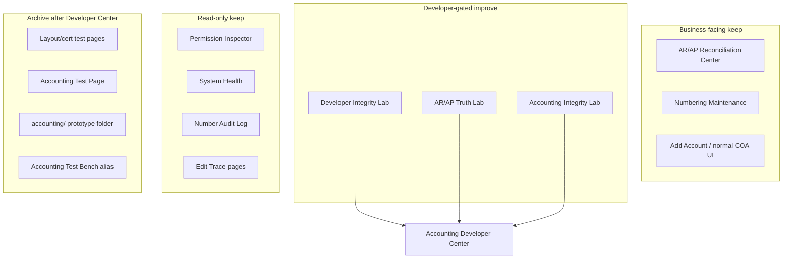

# Existing Accounting / Developer Tools Audit

**Phase:** A (inventory only)  
**Date:** 2026-06-03  
**Scope:** Full repo search — UI pages, services, SQL scripts, docs. **No files deleted or archived in this phase.**

---

## Purpose

Before building the unified **Accounting Developer Center**, document every existing diagnostic, repair, test, and maintenance surface. Each item is classified: **keep**, **improve**, **archive**, **replace**, or **remove-after-confirmation**.

---

## Access control (current state)

| Gate | File | Who can access today |
|------|------|---------------------|
| Integrity Lab / forensic GL | `src/app/lib/developerAccountingAccess.ts` | `developer` role **or** `VITE_ACCOUNTING_DIAGNOSTICS=1` |
| Technical Settings (API keys, dev panel) | same | `developer` role **or** env flag |
| Numbering Maintenance | `settingsNavigation.ts` | `requiresAdmin: true` |
| System Health | `settingsNavigation.ts` | `requiresAdmin: true` |
| AR/AP Reconciliation Center | Sidebar (normal accounting nav) | Permission-gated accounting users |

**Discrepancy:** `docs/accounting/DEVELOPER_INTEGRITY_LAB.md` documents broader roles (`owner`, `super admin`, `accounting_auditor`). Code is stricter. Developer Center spec will align to **admin + super-admin + developer + accounting_auditor** (confirmed in planning).

---

## 1. Major forensic / integrity UI pages

### Developer Integrity Lab

| Field | Value |
|-------|-------|
| **Path** | `src/app/components/admin/DeveloperIntegrityLabPage.tsx` |
| **Alias** | `src/app/components/admin/AccountingTestBenchPage.tsx` (re-export, same UI) |
| **Route** | `/admin/developer-integrity-lab`, `/admin/accounting-test-bench` |
| **Nav** | Sidebar → Developer Tools → Developer Integrity Lab |
| **Purpose** | Forensic GL lab: trace, anomaly feed, rule engine (RULE_01–RULE_15), journal explorer, fix queue, party tie-out, COA audit, opening-balance sync, GL audit, inventory, contact recon, void legacy adj JEs, studio/worker repair, posting-duplicate repair |
| **Tabs** | A Trace · B Anomaly feed · C Account health · D Rule violations · E Journal explorer · F Fix queue · G Party tie-out · H COA audit · I OB sync · J GL Audit · K Inventory · L Contact Recon · M Void Legacy Adj · N Studio Repair · O Worker Repair |
| **Writes data?** | **Yes** — COA seed/repair, OB sync, void JEs, posting repair, stock/contact fixes, fix-queue status, rebuild purchase JE |
| **Risk** | **High** (mixed read/write in one surface) |
| **Verdict** | **Improve → fold into Developer Center** — richest forensic UI but tab sprawl; split read-only trace from write repairs |

### Accounting Integrity Lab

| Field | Value |
|-------|-------|
| **Path** | `src/app/components/admin/AccountingIntegrityLabPage.tsx` |
| **Route** | `currentView: accounting-integrity-lab` |
| **Nav** | Sidebar → Developer Tools → Accounting Integrity Lab |
| **Purpose** | Document certification (sale/purchase), company reconciliation, module certification, QA action buttons (finalize, pay, edit, repair invoice/PO numbers, rental GL repair) |
| **Writes data?** | **Yes** — runs real sale/purchase/payment/expense flows and repair RPCs |
| **Risk** | **High** |
| **Verdict** | **Improve → Module Certification tab** in Developer Center; isolate write actions behind repair queue |

### AR/AP Reconciliation Center

| Field | Value |
|-------|-------|
| **Path** | `src/app/components/accounting/ArApReconciliationCenterPage.tsx` |
| **Dialogs** | `src/app/components/accounting/ArApRepairDialogs.tsx` |
| **Route** | `currentView: ar-ap-reconciliation-center` |
| **Nav** | Sidebar → AR/AP Reconciliation (business-facing, not developer-only) |
| **Purpose** | GL vs operational AR/AP variance dashboard, unposted docs, unmapped JEs, exception queues |
| **Writes data?** | **Yes** (via repair dialogs — post unposted, reverse/repost, party mapping) |
| **Risk** | **Medium–High** |
| **Verdict** | **Keep** — business cleanup tool; link from Developer Center, do not merge |

### Accounting Integrity Test Lab (embedded)

| Field | Value |
|-------|-------|
| **Path** | `src/app/components/accounting/AccountingIntegrityTestLab.tsx` |
| **Route** | Accounting Dashboard tab `integrity_lab` |
| **Purpose** | Duplicate/orphan JE diagnosis, void duplicates, unbalanced JE list, account-balance mismatch sync |
| **Writes data?** | **Yes** — void JEs, `syncAccountsBalanceFromJournal` |
| **Risk** | **High** |
| **Verdict** | **Improve → Journal Integrity tab**; remove inline void/sync buttons until repair queue |

### Party Tie-Out Repair Panel

| Field | Value |
|-------|-------|
| **Path** | `src/app/components/admin/PartyTieOutRepairPanel.tsx` |
| **Route** | Embedded in Developer Integrity Lab tab G |
| **Purpose** | Party balance tie-out scan, repair plan buckets, live cleanup scan, payment `contact_id` backfill |
| **Writes data?** | **Yes** — applies payment contact backfills with audit rows |
| **Risk** | **High** |
| **Verdict** | **Improve → Repair Queue** with preview + `party_repair_audit` |

### AR/AP Truth Lab

| Field | Value |
|-------|-------|
| **Path** | `src/app/components/test/ArApTruthLabPage.tsx` |
| **Route** | `/test/ar-ap-truth-lab`, `currentView: ar-ap-truth-lab` |
| **Purpose** | AR/AP truth workbench: table lineage, payment deep trace, reflection matrix, duplicate posting assessment |
| **Writes data?** | **Mostly no** — analysis + localStorage notes for confirmed-bad JEs |
| **Risk** | **Low** |
| **Verdict** | **Improve → Payment/Reference Trace + Statement Trace tabs** |

### Accounting Edit Trace pages

| Field | Value |
|-------|-------|
| **Paths** | `src/app/components/test/AccountingEditTracePage.tsx`, `ExpenseEditTraceTestPage.tsx` |
| **Routes** | `/test/accounting-edit-trace`, `/test/expense-edit-trace` |
| **Purpose** | Unified edit-classification trace viewer (sale/purchase/payment/expense scenarios) |
| **Writes data?** | **No** DB writes |
| **Risk** | **Low** |
| **Verdict** | **Keep → link from Transaction Trace tab** |

### Permission Inspector

| Field | Value |
|-------|-------|
| **Path** | `src/app/components/admin/PermissionInspectorPage.tsx` |
| **Route** | `/admin/permission-inspector` |
| **Purpose** | Live DB permission/branch inspector |
| **Writes data?** | **No** |
| **Risk** | **Low** |
| **Verdict** | **Keep** (orthogonal to accounting; not part of Developer Center) |

### Accounting Test Page

| Field | Value |
|-------|-------|
| **Path** | `src/app/components/test/AccountingTestPage.tsx` |
| **Route** | `currentView: test-account-entry` |
| **Purpose** | Manual harness for journal voucher, transfer, supplier/worker/expense/customer payments |
| **Writes data?** | **Yes** — creates real payments + JEs via `testAccountingService` |
| **Risk** | **High** |
| **Verdict** | **Archive** (hide from nav; keep file until replacement confirmed) |

### Simple Canonical Statement / Accounts Hierarchy Test

| Field | Value |
|-------|-------|
| **Paths** | `SimpleCanonicalStatementPage.tsx`, `AccountsHierarchyTestPage.tsx` |
| **Routes** | `/test/simple-canonical-statement`, `/test/accounting-accounts-hierarchy` |
| **Purpose** | Statement preview; COA hierarchy UI with mock data |
| **Writes data?** | **No** |
| **Risk** | **Low** |
| **Verdict** | **Archive** after Statement Trace tab exists |

### Accounting Integration Demo

| Field | Value |
|-------|-------|
| **Path** | `src/app/components/accounting/AccountingIntegrationDemo.tsx` |
| **Route** | `currentView: accounting-demo` (no sidebar link) |
| **Purpose** | Demo of module → GL integration |
| **Writes data?** | **Yes** if actions triggered |
| **Risk** | **Medium** |
| **Verdict** | **Archive** |

---

## 2. Settings / numbering / health tools

| File | Route / Nav | Purpose | Writes? | Risk | Verdict |
|------|-------------|---------|---------|------|---------|
| `NumberingMaintenanceTable.tsx` | Settings → Numbering — Maintenance | Sequence sync vs DB max; fix out-of-sync; merge legacy PAY | **Yes** | Medium | **Keep** — link from Developer Center |
| `NumberAuditTable.tsx` | Settings → Numbering — Audit Log | Read cancelled/deleted doc numbers | No | Low | **Keep** |
| `NumberingRulesTable.tsx` | Settings → Numbering — Rules | Configure prefixes/padding | **Yes** (config) | Low | **Keep** (ops config) |
| `DeveloperToolsPanel.tsx` | Settings → Developer Tools | Verbose API errors, clear local cache | No | Low | **Keep** |
| `AppVersionTapTarget.tsx` | Settings footer (7-tap) | Unlocks developer mode in localStorage | No | Low | **Keep** |
| `SystemHealthPanel` in `SettingsPageNew.tsx` | Settings → System Health | ERP health via `healthService`; copyable diagnostic SQL | No | Low | **Keep** — cross-link from Developer Center |
| `ErpPermissionArchitecturePage.tsx` | Settings → Roles & Permissions | RLS sub-tab (developer-gated) | No | Low | **Keep** |

---

## 3. Test / certification pages (Sidebar → Developer Tools)

All gated by `canAccessTechnicalDeveloperSettings` unless noted.

| File | `currentView` | Purpose | Writes? | Risk | Verdict |
|------|---------------|---------|---------|------|---------|
| `RLSValidationPage.tsx` | `rls-validation` | JWT, company isolation, optional policy tests | Optional | Medium | **Keep** (security, not COA) |
| `Day4FullFlowCertificationPage.tsx` | `day4-certification` | Manual go-live checklist | No | Low | **Archive** |
| `ERPIntegrationTestBlockPage.tsx` | `erp-integration-test` | Cross-module checklist | No | Low | **Archive** |
| `CutoverPrepPage.tsx` | `cutover-prep` | Pre-cutover checklist | No | Low | **Archive** |
| `LedgerDebugTestPage.tsx` | `ledger-debug-test` | RPC vs API vs direct query for ledger | No | Low | **Improve → Statement Trace** |
| `CustomerLedgerTestPage.tsx` | `customer-ledger-test` | Legacy customer ledger UI | No | Low | **Archive** |
| `CustomerLedgerInteractiveTest.tsx` | `customer-ledger-interactive-test` | Manual API exercise | No | Low | **Archive** |
| `TestLedger.tsx` | `test-ledger` | Automated read tests for ledger API | No | Low | **Keep** (CI-style) |
| `UserManagementTestPage.tsx` | `user-management-test` | User list + toggle active | **Yes** | Medium | **Archive** |
| `BranchManagementTestPage.tsx` | `branch-management-test` | Branch UI test | Likely yes | Medium | **Archive** |
| `SaleHeaderTestPage.tsx` | `sale-header-test` | Layout approval | No | Low | **Archive** |
| `PurchaseHeaderTestPage.tsx` | `purchase-header-test` | Layout approval | No | Low | **Archive** |
| `TransactionHeaderTestPage.tsx` | `transaction-header-test` | Header layout | May yes | Low | **Archive** |
| `ContactSearchTestPage.tsx` | `contact-search-test` | Contact search UI | No | Low | **Archive** |
| `SalesListDesignTestPage.tsx` | `sales-list-design-test` | Sales list design | No | Low | **Archive** |
| `InventoryDesignTestPage.tsx` | `inventory-design-test` | Inventory design | No | Low | **Archive** |
| `InventoryAnalyticsTestPage.tsx` | `inventory-analytics-test` | Analytics design | No | Low | **Archive** |
| `ResponsiveTestPage.tsx` | `responsive-test` | Responsive layout | No | Low | **Archive** |
| `AccountingChartTestPage.tsx` | `accounting-chart-test` | COA UI test | No | Low | **Archive** after COA Health tab |

**Customer ledger test subtree:** `src/app/components/customer-ledger-test/` — **archive** when Statement Trace ships.

---

## 4. Opening balance tools

| File | Where | Purpose | Writes? | Risk | Verdict |
|------|-------|---------|---------|------|---------|
| `openingBalanceJournalService.ts` | Add Account, contacts, Dev Lab tab I | Canonical contact/chart/inventory opening → GL JEs | **Yes** | High | **Improve → Opening Balance Tools tab** (preview-first) |
| `AddAccountDrawer.tsx` | Accounting → Add Account | Posts chart-account opening JE on save | **Yes** | Medium | **Keep** (normal ops) |
| `AddChartAccountDrawer.tsx` | `accounting/` prototype | Same pattern | **Yes** | Medium | **Archive** (unwired) |

---

## 5. COA-specific tools

| File | Route | Purpose | Writes? | Risk | Verdict |
|------|-------|---------|---------|------|---------|
| Dev Lab tab H · COA audit | In DeveloperIntegrityLabPage | `defaultAccountsService.ensureDefaultAccounts` + hierarchy audit | **Yes** (idempotent seed) | Medium | **Replace → COA Health tab** |
| `accountHierarchyAuditService.ts` | Callable from labs | Read-only hierarchy audit | No | Low | **Keep → reuse in COA Health** |
| `fullAccountingAuditService.ts` | Dev Lab tab J | Hierarchy + orphan parent, unexpected roots | No | Low | **Keep → reuse** |
| `accounting/ChartOfAccounts.tsx` | Not routed in App.tsx | Standalone COA prototype | Would write | Medium | **Archive** |
| `chartAccountService.ts` | Used by COA UI | Chart DTO mapping, legacy default create | **Yes** | Medium | **Keep** (production COA UI uses `src/`) |

---

## 6. Backing services (diagnostic / repair)

| Service | Path | Role | Writes? | Risk | Verdict |
|---------|------|------|---------|------|---------|
| `developerAccountingDiagnosticsService.ts` | `src/app/services/` | RULE_01–15, trace, scan pack | Mostly no | Low | **Keep → Transaction Trace** |
| `integrityLabService.ts` | same | Facade for dev lab | Mixed | Medium | **Improve** |
| `integrityRuleEngine.ts` | same | Rule registry | No | Low | **Keep** |
| `integrityIssueRepository.ts` | same | `integrity_lab_issues` fix queue CRUD | **Yes** | Medium | **Keep → Repair Queue** |
| `integrityRepairService.ts` | same | Stock trace/diagnose/fix, contact balance fixes | **Yes** | High | **Repair Queue only** |
| `integrityUnifiedService.ts` | same | Accounting Integrity Lab company checks | No | Low | **Keep** |
| `accountingIntegrityLabService.ts` | same | Document/company certification | **Yes** (stock sync) | Medium | **Keep** |
| `accountingIntegrityService.ts` | same | Duplicate/orphan detection + void | **Yes** | High | **Repair Queue only** |
| `liveDataRepairService.ts` | same | Unbalanced JEs, balance sync, rebuild purchase JE, void legacy adj, sequence audit | **Yes** | High | **Repair Queue only** |
| `postingDuplicateRepairService.ts` | same | Duplicate posting detection + `runFullPostingRepair` | **Yes** (void) | High | **Repair Queue only** |
| `partyTieOutRepairService.ts` | same | Build repair plans (pure) | No | Low | **Keep** |
| `partyTieOutBulkCleanupService.ts` | same | Live party tie-out cleanup scan | Scan no | Low | **Keep** |
| `arApReconciliationCenterService.ts` | same | AR/AP integrity snapshot RPC | No | Low | **Keep** |
| `arApRepairWorkflowService.ts` | same | Post unposted, reverse/repost, party mapping | **Yes** | Medium | **Keep** (AR/AP Center) |
| `arApTruthLabService.ts` | same | Truth lab snapshots | No | Low | **Keep → trace tabs** |
| `truthLabTraceWorkbenchService.ts` | same | Lineage / payment trace | No | Low | **Keep → trace tabs** |
| `fullAccountingAuditService.ts` | same | Full accounting audit | No | Low | **Keep** |
| `numberingMaintenanceService.ts` | same | Sequence analyze/fix/merge | **Yes** | Medium | **Keep** (linked) |
| `testAccountingService.ts` | same | Accounting Test Page entry creation | **Yes** | High | **Archive** |
| `accountHierarchyAuditService.ts` | same | COA hierarchy audit | No | Low | **Keep** |
| `healthService.ts` | same | System health dashboard | No | Low | **Keep** |
| `permissionInspectorService.ts` | same | Permission inspector | No | Low | **Keep** |
| `roznamchaDedupe.ts` | same | Pure roznamcha dedupe (+ test file) | No | Low | **Keep → Roznamcha Trace** |
| `roznamchaService.ts` | same | Cash book loader | No | Low | **Keep → Roznamcha Trace** |

**Libs:** `developerMode.ts`, `developerAccountingAccess.ts`, `integrityLabConstants.ts`, `freshCompanySignoffChecklist.ts`, `expenseListDiagnostics.ts`, `accountingEditTrace.ts`, `expenseEditTrace.ts` — **keep**, wire into Developer Center.

---

## 7. SQL repair scripts and migrations

### Read-only diagnostics (LOW risk — keep as reference)

| Path | Purpose |
|------|---------|
| `migrations/diagnostics/payment_reference_allocation_check.sql` | Duplicate PAY refs, sequence drift |
| `migrations/diagnostics/document_sequence_constraints_audit.sql` | Unique index audit |
| `migrations/diagnostics/worker_payments_trigger_audit.sql` | Legacy worker_payments triggers |
| `migrations/accounting_stabilization_phase1_diagnostic.sql` | Company-scoped SELECTs |
| `migrations/accounting_stabilization_phase1_repair_preview.sql` | Preview only |
| `scripts/verify_accounting_source_of_truth_integrity.sql` | Balanced JEs, TB, AR control |
| `scripts/verify_sales_engine_integrity.sql` | Sales engine |
| `scripts/verify_purchase_engine_integrity.sql` | Purchase engine |
| `scripts/verify-pf145-integrity.sql` | PF-14.5 fingerprint |
| `scripts/detect_duplicate_payment_posting.sql` | Duplicate payment posting |
| `scripts/sql/preview_roznamcha_missing_expense_payments.sql` | Roznamcha gap detection |
| `scripts/oneoff/diag_roznamcha_ren_0002_jun4.sql` | Rental Roznamcha diagnostic |
| `scripts/worker_ledger_repair/01_diagnosis_company.sql` | Worker ledger gap analysis |

### Write repairs (document only — never auto-UI in v1)

| Path | Purpose | Risk |
|------|---------|------|
| `ERP_DATA_REPAIR_SCRIPT.sql` | Legacy mega-repair for one company | **CRITICAL** |
| `migrations/20260610120000_company_reset_selective_domains.sql` | Company reset preview + RPCs | **CRITICAL** |
| `migrations/accounting_stabilization_phase1_repair_approved.sql` | INSERT balancing expense JE lines | **HIGH** |
| `migrations/20260312_canonical_sale_document_je_unique_and_repair.sql` | Void duplicate sale JEs | **HIGH** |
| `migrations/20260341_phase4_payment_je_linkage_repair_apply.sql` | Payment↔JE linkage apply | **MEDIUM** |
| `migrations/20260604160000_rental_payment_branch_and_link_repair.sql` | Rental payment ref/branch backfill | **MEDIUM** |
| `scripts/oneoff/fix_je_0012_entry_date.sql` | JE date correction | **MEDIUM** |
| `scripts/repair_all_sale_return_engine_live_cases.sql` | Sale-return repair playbook | **HIGH** |
| `supabase-extract/migrations/62_fix_ar_ap_contamination_move_sale_shipment_to_ar.sql` | GL account remap | **HIGH** |

**Verdict for SQL scripts:** Index in Developer Center docs tab; expose **read-only** query templates in UI; never run write scripts without backup + preview + confirm.

---

## 8. Legacy `accounting/` folder (repo root)

| File | Purpose | Routed? | Verdict |
|------|---------|---------|---------|
| `ChartOfAccounts.tsx` | COA prototype | No | **Archive** |
| `AccountingDashboard.tsx` | Dashboard prototype | No | **Archive** |
| `AddAccountDrawer.tsx` | Add account | No | **Archive** |
| `AddChartAccountDrawer.tsx` | Add chart account | No | **Archive** |
| `EnhancedJournalEntryDialog.tsx` | JE dialog | No | **Archive** |
| `FundsTransferModal.tsx` | Transfer modal | No | **Archive** |
| `ManualEntryDialog.tsx` | Manual entry | No | **Archive** |
| `AccountingIntegrationDemo.tsx` | Integration demo | No | **Archive** |

Canonical app lives under `src/app/components/accounting/`.

---

## 9. Existing documentation (reference, do not duplicate blindly)

| Doc | Topic | Use in Developer Center |
|-----|-------|-------------------------|
| `docs/accounting/DEVELOPER_INTEGRITY_LAB.md` | Dev Lab spec | Source for tab inventory |
| `docs/accounting/AR_AP_RECONCILIATION_CENTER.md` | AR/AP center | Keep separate |
| `docs/accounting/ROZNAMCHA_DATA_SOURCES_AND_DUPLICATES.md` | Roznamcha | → Roznamcha Trace spec |
| `docs/accounting/DAY_BOOK_DATA_SOURCES_AND_UNBALANCED.md` | Day Book | → Day Book Diagnostics spec |
| `docs/accounting/ACCOUNT_LEDGER_DATA_SOURCES_AND_REFERENCES.md` | Ledger/statement | → Statement Trace spec |
| `docs/accounting/COA_MAPPING_MATRIX.md` | Module → code map | → COA audit |
| `docs/accounting/DASHBOARD_BASIS_MAP.md` | KPI basis | → Flow map |
| `docs/accounting/JE_DUPLICATE_ENTRY_NO_FINGERPRINT_REPAIR_RUNBOOK.md` | JE duplicate repair | → Repair Queue |
| `docs/system-audit/35_POST_PATCH_VERIFICATION_AND_REPAIR_RUNBOOK.md` | Post-patch workflow | → Repair Queue run order |
| `docs/accounting/2026-06-04_RENTAL_PAYMENT_ROZNAMCHA_FIX.md` | Rental Roznamcha fix | Worked example |

---

## 10. Summary matrix

### Highest write-risk surfaces (require repair queue + confirmation)

1. `DeveloperIntegrityLabPage` tabs F, I, M, N, O
2. `AccountingIntegrityLabPage` QA repair buttons
3. `AccountingIntegrityTestLab` void/sync actions
4. `PartyTieOutRepairPanel` contact backfill
5. `ArApRepairDialogs` post/reverse/repost
6. `NumberingMaintenanceTable` sequence fix
7. `AccountingTestPage` real JE creation

### Items marked **do not touch** in v1

- `record_payment_with_accounting` RPC body
- GL posting triggers on finalize/pay
- Void/delete/reversal semantics
- RCV/PAY/EXP/JV/FT numbering generation
- `ERP_DATA_REPAIR_SCRIPT.sql` and company reset RPCs

---

## Next step

See `03_DEVELOPER_CENTER_SPEC.md` for the unified replacement design. No deletions until `99_LEGACY_TOOLS_CLEANUP_PLAN.md` is written after read-only tools are validated.
