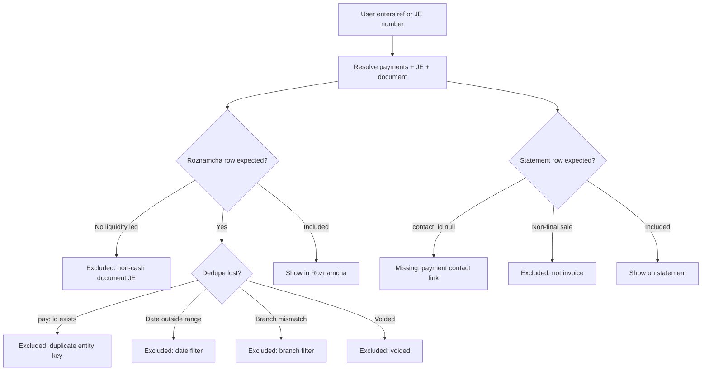

# Accounting Flow Map — UI to Database to Reports

**Phase:** A (documentation only)  
**Date:** 2026-06-03  
**Principle:** Journal entries + lines are GL source of truth. Operational tables (sales, payments) drive subledgers and reports.

---

## Critical split: two `reference_type` fields

| Table | Field | Meaning |
|-------|-------|---------|
| `payments` | `reference_type` | **Business document** — `sale`, `purchase`, `rental`, `expense`, `on_account`, `worker_payment`, etc. |
| `journal_entries` | `reference_type` | **Posting class** — often `payment` when created by `record_payment_with_accounting` RPC; document types (`sale`, `purchase`) for finalize JEs |

**Diagnostic implication:** Searching Roznamcha by JE `reference_type = sale` will miss payment receipts. Trace by payment ref (RCV-/PAY-) or `payments.id` first.

**Central write primitive:** `accountingService.createEntry()` in `src/app/services/accountingService.ts`  
**Unified payment RPC:** `recordPaymentWithAccountingRpc.ts` → Postgres `record_payment_with_accounting`

---

## Flow template

Each flow below documents:

- UI screen
- Service function(s)
- Tables written
- `payments.reference_type` (if applicable)
- `journal_entries.reference_type`
- Debit / credit accounts
- Liquidity account
- Party account
- Branch source
- Report visibility: Roznamcha · Account Statement · Day Book · Dashboard KPIs

---

## 1. Sale final

| Field | Value |
|-------|-------|
| **UI** | `SaleForm`, `POS`, `SalesContext` finalize |
| **Service** | `documentPostingEngine.postSaleDocumentAccounting` → `saleAccountingService.createSaleJournalEntry` |
| **Tables** | `journal_entries`, `journal_entry_lines`, `stock_movements` (COGS) |
| **payments.reference_type** | — |
| **journal_entries.reference_type** | `sale` (`reference_id` = sale uuid) |
| **Debit** | 1100 or party AR child; 5200 discount; 5010 COGS |
| **Credit** | 4000/4010 product; 4110 shipping; 4120 extras; 1200 inventory (COGS leg) |
| **Liquidity** | — |
| **Party** | Customer → AR child via `partySubledgerAccountService` |
| **Branch** | `sales.branch_id` → JE `branch_id` |
| **Roznamcha** | **Excluded** — document JE; cash not involved |
| **Account Statement** | **Included** — AR debit (invoice) when final |
| **Day Book** | **Included** — all JE lines |
| **Dashboard** | `today_sales` / `monthly_revenue` (operational `sales.status = final`) |

---

## 2. Sale add payment

| Field | Value |
|-------|-------|
| **UI** | `SaleForm`, `SmartPaymentWidget`, `saleService.recordPayment` |
| **Service** | `recordPaymentWithAccounting` RPC; fallback `saleAccountingService.ensureSalePaymentJournalIfMissing` |
| **Tables** | `payments`, `journal_entries`, `journal_entry_lines` |
| **payments.reference_type** | `sale` |
| **journal_entries.reference_type** | `payment` (RPC) or `sale` (backfill) |
| **Debit** | 1000 / 1010 / 1020 |
| **Credit** | 1100 / party AR child |
| **Liquidity** | Selected payment account |
| **Party** | Customer contact on payment |
| **Branch** | `sales.branch_id` → payment → JE |
| **Roznamcha** | **Included** via `payments` stream (`pay:{id}` dedupe key) |
| **Account Statement** | **Included** — credit (receipt); ref RCV-/PAY- |
| **Day Book** | **Included** |
| **Dashboard** | `receivables` via contact balances (reduces AR) |

**Worked pain example:** HQ-RCV-0006 / JE-0012 missing from Roznamcha — often `entry_date` vs filter date, or duplicate dedupe lost to another row. See `scripts/oneoff/fix_je_0012_entry_date.sql`, `docs/accounting/2026-06-04_RENTAL_PAYMENT_ROZNAMCHA_FIX.md`.

---

## 3. Sale return

| Field | Value |
|-------|-------|
| **UI** | Sale return flow / cancel |
| **Service** | `saleAccountingService` reversal/settlement paths |
| **Tables** | `sales` (return status), `journal_entries`, `journal_entry_lines`, `stock_movements` |
| **payments.reference_type** | `sale` (if refund payment) |
| **journal_entries.reference_type** | `sale_return`, `sale_reversal`, `refund`, `correction_reversal` |
| **Debit / Credit** | Reverses original sale pattern |
| **Roznamcha** | Refund payments included if liquidity movement |
| **Account Statement** | Return credits / reversal debits per party rules |
| **Day Book** | All reversal lines |
| **Dashboard** | Adjusts operational sales totals when return finalized |

---

## 4. Purchase final

| Field | Value |
|-------|-------|
| **UI** | `PurchaseForm`, `PurchaseContext` finalize |
| **Service** | `documentPostingEngine.postPurchaseDocumentAccounting` → `purchaseAccountingService.createPurchaseJournalEntry` |
| **Tables** | `journal_entries`, `journal_entry_lines`, `stock_movements` |
| **payments.reference_type** | — |
| **journal_entries.reference_type** | `purchase` |
| **Debit** | 1200 inventory |
| **Credit** | 2000 / party AP child |
| **Party** | Supplier |
| **Branch** | `purchases.branch_id` |
| **Roznamcha** | **Excluded** (no cash) |
| **Account Statement** | AP credit (supplier statement) |
| **Day Book** | **Included** |
| **Dashboard** | `period_purchases` |

---

## 5. Purchase add payment

| Field | Value |
|-------|-------|
| **UI** | Purchase payment UI, `supplierPaymentService` |
| **Service** | `recordPaymentWithAccounting` (`referenceType: 'purchase'`) |
| **Tables** | `payments`, `journal_entries`, `journal_entry_lines` |
| **payments.reference_type** | `purchase` |
| **journal_entries.reference_type** | `payment` |
| **Debit** | 2000 / party AP |
| **Credit** | liquidity |
| **Roznamcha** | **Included** (OUT) |
| **Account Statement** | Supplier statement debit (payment) |
| **Day Book** | **Included** |
| **Dashboard** | `payables` reduction |

---

## 6. Purchase return

| Field | Value |
|-------|-------|
| **UI** | Purchase return finalize |
| **Service** | `purchaseAccountingService` return settlement |
| **journal_entries.reference_type** | `purchase_return`, `purchase_reversal` |
| **Roznamcha** | Refund IN if liquidity |
| **Account Statement** | AP adjustment |
| **Day Book** | **Included** |

---

## 7. Rental booking (charge / AR)

| Field | Value |
|-------|-------|
| **UI** | Rental booking / pickup |
| **Service** | `rentalPartyArAccounting.postRentalPartyRevenueIfNeeded` |
| **Tables** | `rentals`, `journal_entries`, `journal_entry_lines` |
| **journal_entries.reference_type** | `rental` (`reference_id` = rental id) |
| **Debit** | Party AR |
| **Credit** | 4200 Rental Income |
| **Roznamcha** | **Excluded** (document JE type) |
| **Account Statement** | Rental charge debit on customer statement |
| **Day Book** | **Included** |
| **Dashboard** | Rental revenue in operational metrics if wired |

---

## 8. Rental advance

| Field | Value |
|-------|-------|
| **UI** | Rental advance payment |
| **Service** | `recordPaymentWithAccounting` or legacy advance path |
| **Tables** | `payments`, `rental_payments`, `journal_entries` |
| **payments.reference_type** | `rental` |
| **journal_entries.reference_type** | `payment` or rental-party fingerprint |
| **Debit** | liquidity |
| **Credit** | party AR or legacy 2020 Rental Advance |
| **Roznamcha** | **Included** via `payments` or `rental_payments` |
| **Account Statement** | Credit (advance receipt) |
| **Day Book** | **Included** |

---

## 9. Rental remaining payment

| Field | Value |
|-------|-------|
| **UI** | Rental payment drawer |
| **Service** | `recordPaymentWithAccounting` + `rental_payments` row |
| **Tables** | `payments`, `rental_payments`, `journal_entries` |
| **payments.reference_type** | `rental` |
| **journal_entries.reference_type** | `payment` |
| **Debit** | liquidity |
| **Credit** | party AR |
| **Roznamcha** | **Included** — ref REN-*-PAY or RCV-*; dedupe priority: payments > rental_payments > journal |
| **Account Statement** | Credit |
| **Day Book** | **Included** |

---

## 10. Rental return

| Field | Value |
|-------|-------|
| **UI** | Rental return confirm |
| **Service** | `rentalService` status + optional GL adjustments |
| **Tables** | `rentals`, possible `journal_entries` |
| **journal_entries.reference_type** | `rental`, `correction_reversal` if adjusted |
| **Roznamcha** | Only if liquidity movement on return |
| **Account Statement** | Final rental balance adjustments |
| **Day Book** | Adjustment lines if posted |

---

## 11. Rental damage / penalty

| Field | Value |
|-------|-------|
| **UI** | Rental damage charge |
| **Service** | `rentalPartyArAccounting` penalty path |
| **Debit** | party AR |
| **Credit** | 4200 and/or 5300 Extra Expense |
| **journal_entries.reference_type** | `rental` |
| **Roznamcha** | **Excluded** unless separate cash payment |
| **Account Statement** | Additional debit charge |

---

## 12. Studio payment / worker cost

| Field | Value |
|-------|-------|
| **UI** | Studio production stage complete |
| **Service** | `studioProductionService` stage bill |
| **journal_entries.reference_type** | `studio_production`, `studio_production_stage` |
| **Debit** | 5000 Cost of Production |
| **Credit** | 2010 Worker Payable |
| **Roznamcha** | **Excluded** |
| **Day Book** | **Included** |
| **Integrity** | RULE_04: must be Dr 5000 / Cr 2010 |

**Studio customer invoice:** Dr 1100 / Cr 4010 — `studioCustomerInvoiceService`

**Worker payment:** see flow 16.

---

## 13. Expense create / pay

| Field | Value |
|-------|-------|
| **UI** | `AddExpenseDrawer` (module), `AddEntryV2` expense tab (GL pay) |
| **Service** | Expense module + `addEntryV2Service.createExpensePaymentEntry` |
| **Tables** | `expenses`, `payments`, `journal_entries`, `journal_entry_lines` |
| **payments.reference_type** | `expense` |
| **journal_entries.reference_type** | `expense` (`reference_id` often payment id) |
| **Debit** | Category-mapped expense account (5400–5900) |
| **Credit** | liquidity |
| **Roznamcha** | **Included** via `payments`; gap if expense JE exists without `payments` row (see `preview_roznamcha_missing_expense_payments.sql`) |
| **Account Statement** | N/A (not party AR/AP unless linked) |
| **Day Book** | **Included** |
| **Dashboard** | `period_operating_expenses` (operational `expenses.status = paid`) |

---

## 14. Supplier payment (standalone)

| Field | Value |
|-------|-------|
| **UI** | `AddEntryV2` supplier payment, supplier ledger pay |
| **Service** | `supplierPaymentService`, `addEntryV2Service.createManualSupplierPayment` |
| **payments.reference_type** | `purchase` or manual path |
| **journal_entries.reference_type** | `payment`, `manual_payment` |
| **Debit** | 2000 / AP child |
| **Credit** | liquidity |
| **Roznamcha** | **Included** (OUT) |
| **Account Statement** | Supplier statement |

---

## 15. Customer receipt / on-account

| Field | Value |
|-------|-------|
| **UI** | `AddEntryV2` customer receipt, on-account widget |
| **Service** | `addEntryV2Service.createCustomerReceiptEntry`, `recordPaymentWithAccounting` |
| **payments.reference_type** | `on_account`, `manual_receipt` |
| **journal_entries.reference_type** | `payment`, `manual_receipt` |
| **Debit** | liquidity |
| **Credit** | 1100 / party AR |
| **Roznamcha** | **Included** (IN) — ref RCV-* |
| **Account Statement** | **Included** credit; advance receipts |
| **Day Book** | **Included** |

**Missing statement symptom:** `contact_id` null on payment, or synthetic row suppressed when `glJournalOnly` filter on.

---

## 16. Worker payment

| Field | Value |
|-------|-------|
| **UI** | Studio pay worker, `AddEntryV2` worker tab |
| **Service** | `workerPaymentService` → `recordPaymentWithAccounting` |
| **payments.reference_type** | `worker_payment` |
| **journal_entries.reference_type** | `payment` (RPC) or `worker_payment` (legacy) |
| **Debit** | 2010 Worker Payable |
| **Credit** | liquidity |
| **Roznamcha** | **Included** — ref WPY-* or PAY-* |
| **Day Book** | **Included** |
| **Integrity** | RULE_03/06 worker ledger heuristic |

---

## 17. Courier payment

| Field | Value |
|-------|-------|
| **UI** | `PayCourierModal` |
| **Service** | `courierPaymentService` |
| **payments.reference_type** | `courier_payment` |
| **journal_entries.reference_type** | `courier_payment` or `payment` |
| **Debit** | 203x courier payable |
| **Credit** | liquidity |
| **Roznamcha** | **Included** (OUT) |
| **Day Book** | **Included** |

**Shipment cost (accrual):** Dr 5100 / Cr 203x — `reference_type = shipment`

---

## 18. Internal transfer

| Field | Value |
|-------|-------|
| **UI** | `AddEntryV2` transfer tab |
| **Service** | `addEntryV2Service.createInternalTransferEntry` |
| **Tables** | `journal_entries`, `journal_entry_lines`; optional `payments` via `journalLiquidityPaymentService` |
| **journal_entries.reference_type** | `transfer` |
| **Debit** | destination liquidity account |
| **Credit** | source liquidity account |
| **Roznamcha** | **Included** — two movements or net via journal stream C |
| **Day Book** | **Included** |
| **Dashboard** | No operational KPI impact; GL cash/bank unchanged in total |

**Note:** `FundsTransferModal.tsx` in `accounting/` prototype is mock; real path is Add Entry V2.

---

## 19. Opening balance

| Field | Value |
|-------|-------|
| **UI** | Contact setup, Add Account, inventory opening stock |
| **Service** | `openingBalanceJournalService` |
| **journal_entries.reference_type** | `opening_balance_contact_ar`, `opening_balance_contact_ap`, `opening_balance_contact_worker`, `opening_balance_account`, `opening_balance_inventory` |
| **Debit / Credit** | Entity account vs 3000 Owner Capital |
| **Roznamcha** | **Excluded** (non-liquidity opening JE) |
| **Account Statement** | Opening row on party statement |
| **Day Book** | **Included** |
| **Dashboard** | Affects GL cash/bank only if opening on liquidity account |

**Wrong-date symptom:** `entry_date` on opening JE ≠ user expectation → Day Book period filter hides it.

---

## 20. Manual journal

| Field | Value |
|-------|-------|
| **UI** | `AddEntryV2` journal tab, `AccountingContext.createEntry` |
| **Service** | `addEntryV2Service.createPureJournalEntry` |
| **journal_entries.reference_type** | `journal` |
| **Accounts** | User-selected any accounts |
| **Roznamcha** | **Included** only if line hits liquidity account and `payment_id IS NULL` |
| **Day Book** | **Included** |
| **Integrity** | RULE_07 if posted to 1100/2000/2010/1180/1195 |

---

## Report inclusion rules (summary)

### Roznamcha (cash book)

**Sources:** `payments` + `rental_payments` + journal liquidity lines (`payment_id IS NULL`) + orphan rental-party recovery.

**Exclusions:**
- Document JEs in `ROZNAMCHA_DOCUMENT_JE_TYPES` when cash leg already in payments
- Voided (`voided_at` / `is_void`) unless `includeVoidedReversed`
- Non-liquidity accounts
- Date / branch filter mismatch

**Dedupe** (`roznamchaDedupe.ts`):
1. Entity keys: `pay:{id}`, `rp:{id}`, `je:{id}`
2. Source priority: payments (3) > rental_payments (2) > journal (1)
3. Strict movement key: `date|direction|amount|payment_account_id`
4. Ref quality: RCV/PAY/WPY/REN > EXP > JE

**Files:** `roznamchaService.ts`, `RoznamchaReport.tsx`, `docs/accounting/ROZNAMCHA_DATA_SOURCES_AND_DUPLICATES.md`

### Account Statement / Ledger

**GL mode:** `getAccountLedger` — one row per line on selected account; void excluded.

**Party mode:** `getCustomerLedger` — AR lines + synthetics from payments/sales/rentals.

**Exclusions:**
- Non-final sales as invoice debits (operational only)
- Voided / reversed rows per policy
- Duplicate AR credit when payment JE + manual_receipt both present

**Files:** `accountingService.ts`, `AccountLedgerReportPage.tsx`, `docs/accounting/ACCOUNT_LEDGER_DATA_SOURCES_AND_REFERENCES.md`

### Day Book

**Model:** One row per `journal_entry_lines` line; up to 500 JE headers per query.

**Balance checks:**
- Period total debit vs credit (tolerance 0.02)
- Per-voucher (`entry_no`) imbalance list
- Void excluded from balance math only

**Files:** `DayBookReport.tsx`, `docs/accounting/DAY_BOOK_DATA_SOURCES_AND_UNBALANCED.md`

### Dashboard KPIs

**RPC:** `get_dashboard_metrics` → `get_financial_dashboard_metrics` + contact balances.

| Metric | Basis | Branch-scoped? |
|--------|-------|----------------|
| Sales / purchases / expenses | Operational tables | Yes (20260606 migration) |
| Receivables / payables | `get_contact_balances_summary` | Yes |
| Cash / bank balance | GL journal sums on liquidity accounts | **Company-wide** |

**Known prod gap:** `function get_contact_balances_summary(uuid, uuid) does not exist` — migration `20260606120000_dashboard_metrics_branch_scope.sql` not applied.

**Files:** `financialDashboardService.ts`, `Dashboard.tsx`, `docs/accounting/DASHBOARD_BASIS_MAP.md`

---

## `journal_entries.reference_type` catalog

### Core operational

`sale`, `purchase`, `rental`, `payment`, `expense`, `journal`, `transfer`, `manual_receipt`, `manual_payment`

### Opening

`opening_balance_contact_ar`, `opening_balance_contact_ap`, `opening_balance_contact_worker`, `opening_balance_account`, `opening_balance_inventory`

### Adjustments / reversals

`sale_adjustment`, `sale_reversal`, `sale_return`, `sale_extra_expense`, `purchase_adjustment`, `purchase_reversal`, `purchase_return`, `payment_adjustment`, `correction_reversal`, `refund`, `credit_note`

### Studio / worker / logistics

`studio_production`, `studio_production_stage`, `studio_production_stage_reversal`, `worker_payment`, `worker_advance_settlement`, `courier_payment`, `shipment`, `shipment_reversal`, `commission_batch`, `salary`

### Other

`stock_adjustment`, `adjustment`, `opening_balance`, `bespoke_work_order`, `accounting_payment`

---

## Diagnostic decision tree (Transaction Trace)

---

## References

- `docs/accounting/PAYMENT_ENTRY_PATHS.md`
- `docs/accounting/SALE_ACCOUNTING_CONTRACT.md`
- `docs/accounting/ROZNAMCHA_DATA_SOURCES_AND_DUPLICATES.md`
- `docs/accounting/ACCOUNT_LEDGER_DATA_SOURCES_AND_REFERENCES.md`
- `docs/accounting/DAY_BOOK_DATA_SOURCES_AND_UNBALANCED.md`
- `docs/accounting/DASHBOARD_BASIS_MAP.md`
- `src/app/services/documentPostingEngine.ts`
- `src/app/services/recordPaymentWithAccountingRpc.ts`
