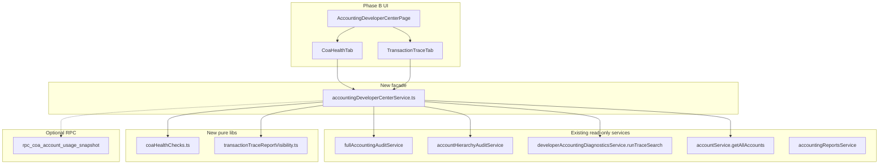

# Phase B — Read-Only Accounting Developer Center

**Status:** Plan only — not implemented  
**Date:** 2026-06-03  
**Baseline:** Phase A docs approved (`00`–`03`, `README.md`)

---

## Scope (strict)

| In scope | Out of scope |
|----------|--------------|
| Read-only shell with 2 active tabs | Repair Queue, apply actions, dry-run writes |
| COA Health (read-only) | COA field edits, seed/repair, archive |
| Transaction Trace (read-only) | Void, sync, OB sync, numbering fix |
| New route + nav entries | Remove/rename existing routes or tools |
| Additive read-only helpers/RPC (optional) | GL posting, `record_payment_with_accounting` changes |

**Existing tools remain untouched:** Developer Integrity Lab, Truth Lab, AR/AP Center, Numbering Maintenance, all test pages.

---

## 1. Exact changed files list

### New files (10)

| # | Path | Purpose |
|---|------|---------|
| 1 | `src/app/lib/accountingDeveloperCenterAccess.ts` | Role gate for Developer Center only (does not widen Integrity Lab) |
| 2 | `src/app/lib/coaHealthChecks.ts` | Pure helpers: duplicate codes/names, inactive-used, OB-gap detection inputs |
| 3 | `src/app/lib/transactionTraceReportVisibility.ts` | Pure read-only Roznamcha / Statement / Day Book inclusion reasons for a traced payment/JE |
| 4 | `src/app/services/accountingDeveloperCenterService.ts` | Thin read-only facade — no writes, no repair imports |
| 5 | `src/app/components/admin/AccountingDeveloperCenterPage.tsx` | Page shell: access gate, tab bar, company scope |
| 6 | `src/app/components/admin/developer-center/CoaHealthTab.tsx` | Tab 1 UI |
| 7 | `src/app/components/admin/developer-center/TransactionTraceTab.tsx` | Tab 2 UI |
| 8 | `src/test/coaHealthChecks.test.ts` | Unit tests for pure health helpers |
| 9 | `src/test/transactionTraceReportVisibility.test.ts` | Unit tests for inclusion-reason helpers |
| 10 | `migrations/20260607120000_coa_health_readonly_rpc.sql` | **Optional** — see §4; can defer to Phase B.1 if client-only is enough |

### Modified files (5)

| # | Path | Change |
|---|------|--------|
| 1 | `src/app/App.tsx` | Lazy import + pathname guard `/admin/accounting-developer-center` |
| 2 | `src/app/context/NavigationContext.tsx` | Add `accounting-developer-center` to `View` union |
| 3 | `src/app/components/layout/Sidebar.tsx` | Add nav child under Developer Tools (gated) |
| 4 | `src/app/components/settings/settingsNavigation.ts` | Add item under Accounting & Finance |
| 5 | `src/app/components/settings/SettingsPageNew.tsx` | Settings panel: link card → open Developer Center route |

### Documentation update (1)

| # | Path | Change |
|---|------|--------|
| 1 | `docs/accounting/coa-developer-center/README.md` | Link to this plan; note Phase B status |

### Explicitly NOT changed

- `src/app/lib/developerAccountingAccess.ts` — Integrity Lab gate unchanged
- `src/app/components/admin/DeveloperIntegrityLabPage.tsx`
- `src/app/services/developerAccountingDiagnosticsService.ts` — import only, no edits
- `record_payment_with_accounting` / any GL migration
- `integrityRepairService`, `liveDataRepairService`, `postingDuplicateRepairService`
- Any file under `accounting/` repo root
- Sidebar removal or test page hiding

**Total:** 10 new + 5 modified + 1 doc (16 touches)

---

## 2. Route / navigation plan

### Primary route

```
/admin/accounting-developer-center
```

**App.tsx pattern** (mirror Developer Integrity Lab):

```tsx
if (
  pathname === '/admin/accounting-developer-center' ||
  currentView === 'accounting-developer-center'
) {
  return (
    <Layout>
      <AccountingDeveloperCenterPage />
      <GlobalDrawer />
    </Layout>
  );
}
```

- Lazy-loaded component
- No `currentView` redirect that strips pathname on other admin routes

### Navigation entry points (additive only)

| Entry | Location | Gate | Behavior |
|-------|----------|------|----------|
| **A** | Settings → Accounting & Finance → **Developer Center** | `canAccessAccountingDeveloperCenter` | Card with description + "Open Developer Center" → `pushState` + `setCurrentView('accounting-developer-center')` |
| **B** | Sidebar → Developer Tools → **Accounting Developer Center** | same | `pushState('/admin/accounting-developer-center')` + setCurrentView |
| **C** | Deep link only | same | Direct URL bookmark |

### Future cross-links (Phase B: read-only text links, no redirects of old tools)

| From | Link text | Target |
|------|-----------|--------|
| Developer Integrity Lab header | "Open Developer Center (read-only)" | `/admin/accounting-developer-center` |
| AR/AP Reconciliation Center | "Trace in Developer Center" | same, optional query `?tab=trace&q=...` |

**Phase B does not modify** Integrity Lab or AR/AP pages unless a single read-only link is approved as optional stretch — default is **no edits** to existing forensic pages.

### Shell tabs (Phase B)

| Tab | State |
|-----|-------|
| Chart of Accounts Health | **Active** |
| Transaction Trace | **Active** |
| Journal Integrity | Disabled label "Phase C" |
| Payment / Reference Trace | Disabled |
| Roznamcha Trace | Disabled |
| Account Statement Trace | Disabled |
| Day Book Diagnostics | Disabled |
| Opening Balance Tools | Disabled |
| Repair Queue | Disabled |
| Audit Log | Disabled |

Disabled tabs are visible but not clickable (tooltip: "Coming in Phase C") — sets UX expectation without implying repairs exist.

### URL query params (optional, Phase B)

```
/admin/accounting-developer-center?tab=trace&q=HQ-RCV-0006
/admin/accounting-developer-center?tab=coa
```

Parsed on mount to pre-fill Transaction Trace search.

---

## 3. Access helper plan

### New file: `accountingDeveloperCenterAccess.ts`

**Separate from** `developerAccountingAccess.ts` so Integrity Lab write surface stays on the stricter `developer` + env gate.

```typescript
import { canonRole } from './developerAccountingAccess';

const DEVELOPER_CENTER_ROLES = new Set([
  'admin',
  'super admin',
  'superadmin',
  'super_admin',
  'developer',
  'accounting auditor',
  'accounting_auditor',
  'owner', // optional: treat owner like super-admin for read-only diagnostics
]);

export function canAccessAccountingDeveloperCenter(
  userRole: string | null | undefined
): boolean {
  const r = canonRole(userRole);
  if (DEVELOPER_CENTER_ROLES.has(r)) return true;
  // Staging/local only — same pattern as Integrity Lab
  if (import.meta.env?.VITE_ACCOUNTING_DIAGNOSTICS === '1') return true;
  return false;
}
```

### Gate behavior

| Surface | Function | Roles |
|---------|----------|-------|
| Developer Center page | `canAccessAccountingDeveloperCenter` | admin, super-admin, developer, accounting_auditor, owner |
| Developer Integrity Lab (unchanged) | `canAccessDeveloperIntegrityLab` | developer + env |
| Settings → Developer Center link | `canAccessAccountingDeveloperCenter` | wider than Integrity Lab |
| Sidebar Developer Tools group | `canAccessTechnicalDeveloperSettings` (unchanged) | developer + env |

**Important:** Admin users gain **read-only** Developer Center without gaining Integrity Lab write tabs. Sidebar "Developer Tools" group visibility stays on `canAccessTechnicalDeveloperSettings`; the new item inside it also checks `canAccessAccountingDeveloperCenter` (admin will need Settings path unless Sidebar group visibility is expanded — see decision below).

### Sidebar visibility decision

**Recommended (Phase B):** Add Settings path as **primary** for admin/accounting_auditor. Keep Sidebar entry under existing Developer Tools group (developer + env sees both). Admin reaches center via Settings → Accounting & Finance.

**Alternative (if admin must use Sidebar):** Add a second top-level or Accounting submenu link gated only by `canAccessAccountingDeveloperCenter`. Not recommended in Phase B — adds nav churn; Settings path is enough.

### Denied access UI

Mirror `DeveloperIntegrityLabPage`: full-page message "You do not have permission to access the Accounting Developer Center" with role hint; no data fetch.

---

## 4. Read-only service / RPC plan

### Architecture



### `accountingDeveloperCenterService.ts` API (read-only)

```typescript
// COA Health
export async function loadCoaHealthSnapshot(companyId: string): Promise<CoaHealthSnapshot>

// Per-account drill-down
export async function loadAccountUsage(companyId: string, accountId: string): Promise<AccountUsageDetail>

// Transaction Trace
export async function runTransactionTrace(
  companyId: string,
  query: string,
  mode?: TraceMode
): Promise<TransactionTraceResult>

// TransactionTraceResult = TraceSearchResult + reportVisibility + branchChain + paymentRows
```

**Hard rule:** Facade file must NOT import:
- `integrityRepairService`, `liveDataRepairService`, `postingDuplicateRepairService`
- `openingBalanceJournalService` (write paths)
- `defaultAccountsService.ensureDefaultAccounts`
- `numberingMaintenanceService.fix*`

### COA Health — data sources

| Check | Source | Phase B |
|-------|--------|---------|
| Hierarchy issues | `runFullAccountingAudit()` | Reuse |
| Duplicate codes | Client query on `accounts` + `coaHealthChecks.findDuplicateCodes()` | New pure helper |
| Duplicate names (same parent) | `coaHealthChecks.findDuplicateNamesUnderParent()` | New pure helper |
| Inactive but used | Client query: accounts + `journal_entry_lines` exists | New helper + Supabase select |
| `accounts.balance` vs GL | `accountingReportsService.getAccountBalancesFromJournal()` vs `accounts.balance` | Reuse pattern from Dev Lab tab C (read-only, no sync button) |
| Missing system accounts | Compare seed codes in `defaultCoASeed.ts` / `coaMapping.ts` vs DB | Pure helper |
| Opening balance without JE | Light check: contacts with opening_balance ≠ 0 and no `opening_balance_contact_*` JE | Read-only select; flag only |

**No** `ensureDefaultAccounts`, **no** edit drawer, **no** archive action in Phase B.

### Transaction Trace — data sources

| Section | Source |
|---------|--------|
| Operational document | Existing `runTraceSearch()` entity resolution |
| Payment / rental_payment rows | Extend facade: after trace, fetch `payments` / `rental_payments` by resolved ids |
| Journal + lines | Existing `TraceSearchResult.journals` |
| Accounts used | Line enrichment already in trace |
| Branch chain | Compare `sales.branch_id` / `purchases.branch_id` → `payments.branch_id` → `journal_entries.branch_id` |
| Roznamcha / Statement / Day Book status | **New** `transactionTraceReportVisibility.ts` — pure functions |
| Diagnosis text | Reuse `buildTraceGuidance()` from diagnostics service via exported result |

**Reuse:** `runTraceSearch(companyId, query, mode)` — no changes to diagnostics service in Phase B.

### Report visibility helpers (new pure lib)

`transactionTraceReportVisibility.ts` inputs: payment row, JE header, liquidity account ids, date range context (optional).

Outputs per spec § Tab 2:

```typescript
type ReportVisibility = {
  roznamcha: { included: boolean; reason: string };
  accountStatement: { included: boolean; reason: string };
  dayBook: { included: boolean; reason: string };
  dashboard: { impacted: string[]; note: string };
};
```

Logic mirrors (does not call loader):
- `roznamchaDedupe.ts` — document JE skip set, entity priority
- `ROZNAMCHA_DATA_SOURCES_AND_DUPLICATES.md`
- `accountingService.ts` party ledger inclusion heuristics (read-only copy of conditions, not full ledger build)

### Optional RPC: `rpc_coa_account_usage_snapshot`

**File:** `migrations/20260607120000_coa_health_readonly_rpc.sql`

```sql
-- Read-only: account line counts and totals (SECURITY DEFINER with company check)
CREATE OR REPLACE FUNCTION public.rpc_coa_account_usage_snapshot(p_company_id uuid)
RETURNS TABLE (
  account_id uuid,
  code text,
  name text,
  is_active boolean,
  line_count bigint,
  total_debit numeric,
  total_credit numeric,
  first_used date,
  last_used date
) ...
```

| Aspect | Detail |
|--------|--------|
| Writes | None — SELECT only |
| RLS | Same company membership check as `rpc_integrity_count_*` |
| Required? | **No for Phase B MVP** — client aggregation works for typical COA size (&lt;500 accounts) |
| When to add | If COA Health load &gt; 3s on production company |

**Defer default:** Phase B ships **client-only**; RPC is Phase B.1 optional follow-up.

### No new RPC for Transaction Trace in Phase B

`runTraceSearch` already performs client-side Supabase reads. Unified `rpc_trace_accounting_reference` remains **Phase C** target.

---

## 5. UI component plan

### `AccountingDeveloperCenterPage.tsx`

- Access check → denied screen
- Header: title, company name, doc link to `docs/accounting/coa-developer-center/`
- Tab strip (2 active + 8 disabled)
- Renders `CoaHealthTab` | `TransactionTraceTab`
- `useSearchParams` for `?tab=&q=`

### `CoaHealthTab.tsx`

**Layout:**
1. Summary cards: total accounts, issue count by severity, inactive-used count
2. Issues table (sortable): severity, check_id, code, name, detail, line_count
3. Account picker → usage panel: line count, debit/credit totals, first/last date, modules inferred from JE `reference_type` set, flags: `can_edit_name`, `can_archive`, `cannot_touch`

**Actions:** Refresh, Export JSON, Copy diagnostic summary  
**No buttons:** Seed COA, Sync balance, Edit account, Archive

### `TransactionTraceTab.tsx`

**Layout:**
1. Search input + mode dropdown (auto, entry_no, payment_ref, uuid, …) — same modes as Integrity Lab tab A
2. 12-section accordion (from spec) — collapsed sections empty until search
3. Copy trace JSON button

**Actions:** Search, Copy JSON, external link to open document in ERP (read-only navigation via `setCurrentView`)  
**No buttons:** Void, repair, add to queue

---

## 6. Testing plan (Phase B)

| Command | Expect |
|---------|--------|
| `npm run test:unit` | New tests pass; 15+ existing pass |
| `npm run build` | Clean bundle |
| Manual | Admin via Settings opens center; developer via Sidebar; staff denied |
| Manual | COA Health shows issues for known duplicate/inactive account |
| Manual | Trace `HQ-RCV-0006` or `JE-0012` shows payment + JE + visibility reasons |

---

## 7. Rollback plan

Phase B is **additive**. Rollback does not require data repair.

### Level 1 — Disable route (instant, no deploy)

- Comment out pathname block in `App.tsx` OR set feature flag `VITE_ACCOUNTING_DEVELOPER_CENTER=0` (if added) → page 404/denied

### Level 2 — Full revert (git)

```bash
git revert <phase-b-commit>   # single commit recommended
npm run build
```

Removes: new files, nav entries, settings link. Existing Integrity Lab unaffected.

### Level 3 — Optional RPC rollback

If `20260607120000_coa_health_readonly_rpc.sql` was applied:

```sql
DROP FUNCTION IF EXISTS public.rpc_coa_account_usage_snapshot(uuid);
```

Forward migration only; no table drops.

### Verification after rollback

- `/admin/accounting-developer-center` does not render
- Settings has no Developer Center item
- Developer Integrity Lab still at `/admin/developer-integrity-lab`
- No rows in any audit table (Phase B writes none)

---

## 8. Implementation sequence (when approved)

| Step | Task | Verify |
|------|------|--------|
| 1 | `accountingDeveloperCenterAccess.ts` + tests | Role matrix |
| 2 | `coaHealthChecks.ts` + `transactionTraceReportVisibility.ts` + tests | `npm run test:unit` |
| 3 | `accountingDeveloperCenterService.ts` facade | No write imports |
| 4 | `AccountingDeveloperCenterPage` + tab components | UI shell |
| 5 | `App.tsx` + `NavigationContext` route | Direct URL works |
| 6 | Settings nav + link card | Admin path |
| 7 | Sidebar entry (developer-gated group) | Developer path |
| 8 | `npm run build` + manual smoke | Done |
| 9 | (Optional) RPC migration + wire `loadAccountUsage` | Performance |

**Single PR/commit** recommended for clean rollback.

---

## 9. Risk register

| Risk | Mitigation |
|------|------------|
| Accidental import of repair service | ESLint comment + facade code review checklist |
| Widening Integrity Lab access by mistake | Separate access file; do not change `canAccessDeveloperIntegrityLab` |
| Admin expects write actions | Disabled tabs + no action buttons; banner "Read-only — Phase B" |
| Trace visibility reasons wrong | Unit tests with HQ-RCV-0006 / dedupe fixtures; label as heuristic |
| Performance on large COA | Optional RPC; pagination on issues table |
| RLS blocks journal reads | Same as Integrity Lab — uses authenticated client |

---

## 10. Approval checklist

Before coding, confirm:

- [ ] Settings → Accounting & Finance entry approved (primary admin path)
- [ ] Sidebar entry under Developer Tools approved (secondary)
- [ ] Disabled placeholder tabs for Phase C–E approved
- [ ] Client-only COA Health (no RPC) approved for MVP
- [ ] Integrity Lab access left unchanged approved
- [ ] No links added to old forensic pages (or optional single link approved)

---

## References

- [03_DEVELOPER_CENTER_SPEC.md](03_DEVELOPER_CENTER_SPEC.md) — Tab 1 & 2 full spec
- [02_ACCOUNTING_FLOW_MAP.md](02_ACCOUNTING_FLOW_MAP.md) — Report inclusion rules
- [00_EXISTING_TOOLS_AUDIT.md](00_EXISTING_TOOLS_AUDIT.md) — What stays untouched
