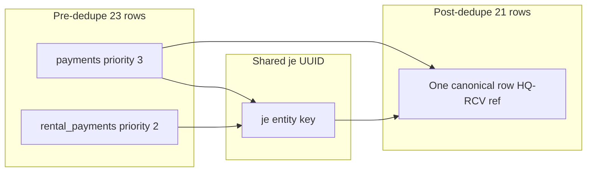

# Roznamcha Duplicate Trace Review — HQ-RCV-0001 / HQ-RCV-0005

**Date:** 2026-06-06  
**Environment:** Production (`erp.dincouture.pk`, VPS `dincouture-vps`)  
**Method:** Read-only SQL + code-path review. **No repairs applied.**  
**Script:** [`deploy/roznamcha-trace-hq-rcv-0001-0005-readonly.sql`](../../../deploy/roznamcha-trace-hq-rcv-0001-0005-readonly.sql)

---

## Executive summary

| Receipt | Trace `Included = no` row | Verdict |
|---------|---------------------------|---------|
| **HQ-RCV-0001** (Rs 3,000, CASH G140, JE-0010) | `rental_payments` source | **Safe expected dedupe** — not missing from Roznamcha |
| **HQ-RCV-0005** (Rs 10,000, CASH G140, JE-0008) | `rental_payments` source | **Safe expected dedupe** — not missing from Roznamcha |

**Financial repair required:** **No.**

Both receipts appear once in the live Roznamcha report with HQ-RCV refs, correct amounts, and correct running balance impact. Developer Center shows a second pre-dedupe candidate from `rental_payments` that is **intentionally excluded** so cash is not counted twice. The canonical row survives from the `payments` stream (priority 3) and merges the HQ-RCV display ref from the rental row.

**`roznamcha.report_duplicate_source`:** audit/report only (dry-run shows `reportOnly: true`, `applyAvailable: false`). Do not use expecting cash or GL fixes.

---

## HQ-RCV-0001 findings

### Source rows (production SQL)

| Table | ID | Ref | Date | Amount | Account | JE link |
|-------|-----|-----|------|--------|---------|---------|
| **rental_payments** (excluded in trace) | `bb9fbbb1-9f4d-4566-967e-e2a860b2a1bb` | HQ-RCV-0001 | 2026-05-31 | 3,000 | CASH G140 (`1c6ee483-…`) | `99d5843e-f51f-4d78-8edc-3112b8f7d9ff` |
| **payments** (canonical / winner) | `08dd4d09-fa38-40aa-b892-15e4931c2168` | **JE-0010** | 2026-05-31 | 3,000 | CASH G140 | same JE via `payment_id` |
| **journal_entries** | `99d5843e-f51f-4d78-8edc-3112b8f7d9ff` | JE-0010 | 2026-05-31 | — | rental / REN-0004 (Saqib) | `payment_id` → payments row |

**Rental document:** REN-0004 (Saqib), Main Branch.

### Canonical vs excluded

| Role | Source | Priority | Trace `Included` | Roznamcha ref shown |
|------|--------|----------|------------------|---------------------|
| **Winner** | `payments` | 3 | yes | HQ-RCV-0001 (merged from rental metadata) |
| **Excluded** | `rental_payments` | 2 | no | — |

**Shared entity key:** `je:99d5843e-f51f-4d78-8edc-3112b8f7d9ff`

**Why priority picked payments:** [`roznamchaDedupe.ts`](../../../src/app/services/roznamchaDedupe.ts) — `sourcePaymentId` → priority **3** beats `sourceRentalPaymentId` → priority **2**. Same rule as unit test *"prefers payment source over rental and journal duplicates"*.

### Why both rows appear in pre-dedupe (23 → 21)

Fetch-layer skip in [`roznamchaService.ts`](../../../src/app/services/roznamchaService.ts) only suppresses `rental_payments` when a **`payments` row with `reference_type = rental`** shares `rentalPaymentMatchKey(rental_id|date|amount|account)`.

For HQ-RCV-0001 the linked `payments` row is:

- `reference_type = manual_receipt` (not `rental`)
- `reference_number = JE-0010` (not `HQ-RCV-0001`)
- `reference_id` = journal entry UUID (not rental UUID)

So **fetch skip never runs**, but **entity dedupe still collapses** via shared `journal_entry_id`.

### JE-0010 (rental UUID `99d5843e-…`) — safety

| Line | Account | Debit | Credit |
|------|---------|-------|--------|
| Cash IN | 1002 CASH G140 | 3,000 | 0 |
| AR | AR-CUS0060 Receivable — Saqib | 0 | 3,000 |

- **Balanced:** debit = credit = 3,000 on this JE UUID  
- **Single liquidity debit:** 3,000 on CASH G140  
- **Backlinks:** `rental_payments.journal_entry_id` = `journal_entries.id`; `journal_entries.payment_id` = payments row  
- **Not voided**

*(Note: company also has a separate opening-balance JE numbered JE-0010 — different UUID `af3d636c-…`. Roznamcha rental trace uses the rental party payment JE only.)*

### Ledger impact

- **One** post-dedupe cash IN of Rs 3,000 on CASH G140  
- Roznamcha UI shows HQ-RCV-0001 / Saqib / rental booking advance — matches screenshot  
- **No double counting**

---

## HQ-RCV-0005 findings

### Source rows (production SQL)

| Table | ID | Ref | Date | Amount | Account | JE link |
|-------|-----|-----|------|--------|---------|---------|
| **rental_payments** (excluded) | `16552ce3-dc09-4b1b-b6b8-fa515c86696a` | HQ-RCV-0005 | 2026-06-04 | 10,000 | CASH G140 | `289c1b64-dd93-4913-847e-410886d2d1d8` |
| **payments** (winner) | `323ede10-81f2-4ec5-b3b3-9a5532a7be5d` | **JE-0008** | 2026-06-04 | 10,000 | CASH G140 | same JE |
| **journal_entries** | `289c1b64-dd93-4913-847e-410886d2d1d8` | JE-0008 | 2026-06-04 | — | rental / REN-0003 (Hamid N40) | `payment_id` → payments row |

**Rental document:** REN-0003 (Hamid N40), Main Branch.

### Canonical vs excluded

Same pattern as HQ-RCV-0001:

- **Winner:** `payments` (priority 3), shared key `je:289c1b64-dd93-4913-847e-410886d2d1d8`
- **Excluded:** `rental_payments` (priority 2)
- **Display ref in Roznamcha:** HQ-RCV-0005 (merged from rental row)

### JE-0008 (rental UUID `289c1b64-…`) — safety

| Line | Account | Debit | Credit |
|------|---------|-------|--------|
| Cash IN | 1002 CASH G140 | 10,000 | 0 |
| AR | AR-CUS0059 Receivable — Hamid N40 | 0 | 10,000 |

- **Balanced:** 10,000 / 10,000  
- **Single liquidity debit:** 10,000  
- **Backlinks intact**, not voided  

*(Separate opening-balance JE also numbered JE-0008 — UUID `ea28c8c1-…` — unrelated to this receipt.)*

### Ledger impact

- **One** post-dedupe cash IN of Rs 10,000 on CASH G140  
- Roznamcha UI shows HQ-RCV-0005 / Hamid N40 — matches screenshot  
- **No double counting**

---

## Dedupe mechanics (observed)



| Priority | Source | Identity field |
|----------|--------|----------------|
| 3 | `payments` | `sourcePaymentId` |
| 2 | `rental_payments` | `sourceRentalPaymentId` |
| 1 | journal liquidity | `sourceJournalEntryId` |

Trace explanation: [`roznamchaTraceDiagnostics.ts`](../../../src/app/lib/roznamchaTraceDiagnostics.ts) `explainRoznamchaInclusion` → *"Excluded — merged into higher-priority row (je:…)"*.

---

## Why `Included = no` is not “missing from Roznamcha”

1. Post-dedupe set contains **one** row per receipt (payments winner).  
2. Roznamcha report already lists HQ-RCV-0001 and HQ-RCV-0005 with correct cash amounts.  
3. Excluded rows are **duplicate sources** for the same JE-linked cash movement.  
4. Pre-dedupe count (23) > post-dedupe (21) = **2 expected collapses** for these two receipts.

---

## Metadata notes (cosmetic, not financial)

| Issue | Impact |
|-------|--------|
| `payments.reference_type = manual_receipt` instead of `rental` | Fetch skip does not hide rental row; trace shows both sources |
| `payments.reference_number = JE-00xx` instead of HQ-RCV | Match-key join in SQL fails on ref; dedupe still works via JE UUID |
| Duplicate `entry_no` (opening + rental both JE-0010 / JE-0008) | Journal list confusion only; Roznamcha uses UUID-linked rental JEs |

**None of these cause double cash posting or wrong Roznamcha balance.**

---

## `roznamcha.report_duplicate_source` dry-run (code review)

Action: [`roznamchaActions.ts`](../../../src/app/lib/developerRepairActions/roznamchaActions.ts)

Dry-run `afterPreview`:

```json
{
  "reportOnly": true,
  "applyAvailable": false,
  "recommendation": "Fix dedupe at code level or confirm DB duplicate link before any data repair"
}
```

Apply writes **audit note only** if explicitly confirmed — **never** changes payments, rental_payments, JE lines, or cash.

---

## Repair recommendation

| Action | Recommendation |
|--------|----------------|
| Financial repair (relink, void, delete, JE edit) | **Do not** — data is correct |
| `roznamcha.report_duplicate_source` apply | **Optional** audit trail only |
| User re-entry / delete history | Past manual fixes may have created parallel `payments` + `rental_payments` paths; current state is **deduped correctly** |

### Future optional improvement (not implemented)

Skip `rental_payments` in pre-fetch when a `payments` row shares the same `journal_entry_id`, even when `reference_type` ≠ `rental` or match-key dates differ. Would reduce trace noise only.

---

## Final recommendation

**Safe for production use.** Treat Roznamcha Trace `Included = no` on these `rental_payments` rows as **expected dedupe diagnostics**, not missing ledger entries. No Phase F apply repairs needed for HQ-RCV-0001 or HQ-RCV-0005.

---

## Related

- [`docs/infra/ROZNAMCHA_CASH_BOOK.md`](../../infra/ROZNAMCHA_CASH_BOOK.md)  
- [`docs/accounting/2026-06-04_RENTAL_PAYMENT_ROZNAMCHA_FIX.md`](../2026-06-04_RENTAL_PAYMENT_ROZNAMCHA_FIX.md)  
- [`09_CONTROLLED_REPAIR_ACTIONS.md`](09_CONTROLLED_REPAIR_ACTIONS.md) — `roznamcha.report_duplicate_source`  
- [`14_PHASE_F_SMOKE_TEST_RESULTS.md`](14_PHASE_F_SMOKE_TEST_RESULTS.md)
