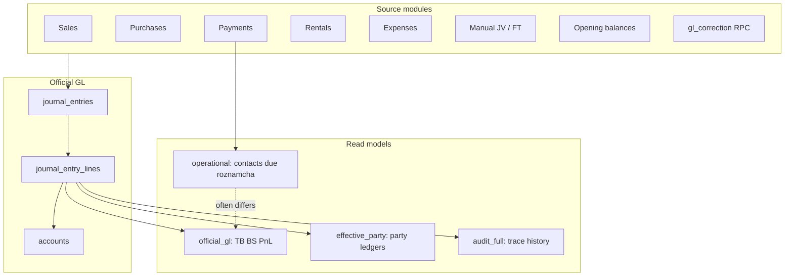
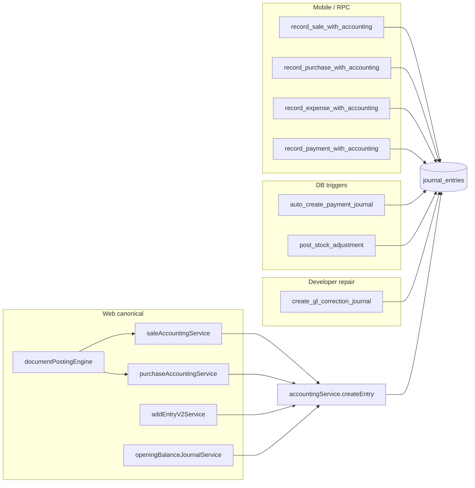
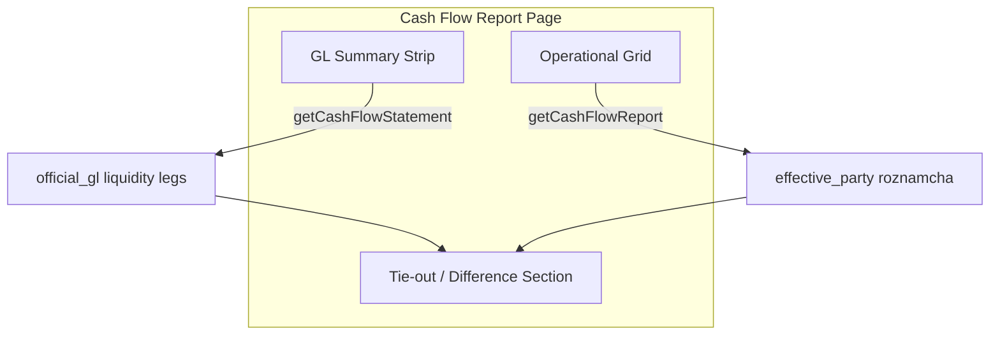

# Complete Accounting Workflow — Deep Analysis

**Date:** 2026-06-12  
**Scope:** Documentation only — no code, migration, or database changes  
**Company context:** DIN Collection ERP (DIN BRIDAL company id `597a5292-14c8-4cd8-96bd-c61b5a0d8c92` in Phase 1 diagnostics)  
**Canonical contracts:** [`FINANCIAL_TRUTH_BASIS.md`](./FINANCIAL_TRUTH_BASIS.md), [`src/app/lib/financialTruthBasis.ts`](../../src/app/lib/financialTruthBasis.ts), [`src/app/lib/reportVisibilityContract.ts`](../../src/app/lib/reportVisibilityContract.ts)

---

## Table of contents

1. [Executive summary](#1-executive-summary)
2. [Three-basis truth model](#2-three-basis-truth-model)
3. [Chart of Accounts workflow](#3-chart-of-accounts-workflow)
4. [Journal Entry workflow](#4-journal-entry-workflow)
5. [Account Statements workflow](#5-account-statements-workflow)
6. [Party Ledger workflow](#6-party-ledger-workflow)
7. [Roznamcha workflow](#7-roznamcha-workflow)
8. [Cash / Bank / Cash Flow workflow](#8-cash--bank--cash-flow-workflow)
9. [AR/AP Reconciliation Center](#9-arap-reconciliation-center)
10. [Financial Truth / Trace Center](#10-financial-truth--trace-center)
11. [Financial Reports catalog](#11-financial-reports-catalog)
12. [Known case studies](#12-known-case-studies)
13. [Final truth matrix](#13-final-truth-matrix)
14. [Problems, risks, recommendations](#14-problems-risks-recommendations)
15. [Appendix: key files and RPC index](#15-appendix-key-files-and-rpc-index)

---

## 1. Executive summary

The DIN Collection ERP stores **one official General Ledger** in PostgreSQL (`journal_entries` + `journal_entry_lines` on the `accounts` Chart of Accounts). Every sale, purchase, payment, expense, rental, transfer, opening balance, and developer repair posts through that GL.

**Why different screens show different numbers:** The ERP deliberately exposes **three accounting bases** plus a separate **operational due** layer. Screens choose different bases, filters, and source tables. That is by design — not always a bug — but it confuses users who expect one number everywhere.

| Layer | What it answers | Where to look |
|-------|-----------------|---------------|
| **Official Posted GL** | Legal/accounting closing position | Trial Balance, Balance Sheet, P&L |
| **Effective operational party** | Who owes what for follow-up today | Effective Party Ledger, Account Statements (Effective mode) |
| **Audit full history** | Full trail including cancelled/void/reversal | Audit toggles, Day Book audit, Financial Trace Center |
| **Operational due** | Open document balances (sales/purchases/rentals) | Contacts list, AR/AP variance cards |

**Canonical GL truth** is always `journal_entry_lines` joined to non-void `journal_entries`. The `accounts.balance` column is a **cache only** — never use it for official reports ([`BALANCE_SOURCE_POLICY.md`](./BALANCE_SOURCE_POLICY.md)).

### Recommendations (read this first)

> **For official financial position, use Trial Balance / Balance Sheet / P&L on Official Posted GL basis.**

> **For customer follow-up, use Effective Party Ledger.**

> **For history/debugging, use Audit / Financial Truth Center / AR/AP Reconciliation.**

### End-to-end data flow

### Caveats on live numbers

- Phase 1 diagnostic snapshot: **2026-06-11**, company DIN BRIDAL ([`FINANCIAL_TRACE_PHASE1_RESULTS.txt`](./FINANCIAL_TRACE_PHASE1_RESULTS.txt)).
- VPS production may lag local `main` — verify deploy SHA before comparing production SQL to this document.
- Rs amounts in case studies are **documented snapshots**, not guaranteed current.

---

## 2. Three-basis truth model

Contract: [`FINANCIAL_TRUTH_BASIS.md`](./FINANCIAL_TRUTH_BASIS.md). Code: [`financialTruthBasis.ts`](../../src/app/lib/financialTruthBasis.ts), visibility rules in [`reportVisibilityContract.ts`](../../src/app/lib/reportVisibilityContract.ts).

### 2.1 Official Posted GL (`official_gl`)

| Property | Value |
|----------|-------|
| **Source** | All non-void `journal_entry_lines` |
| **Includes** | Active business JEs, `gl_correction` (e.g. JV-000203), `correction_reversal` (e.g. JE-0168) |
| **Excludes** | Voided journal headers only |
| **Does NOT apply** | Effective party hiding, cancelled-sale filters |
| **Used for** | Trial Balance, Balance Sheet, P&L, COA balances, Cash Flow GL summary |
| **Must balance** | TB total Debit = total Credit when data is double-entry correct |

### 2.2 Effective operational party (`effective_party`)

| Property | Value |
|----------|-------|
| **Source** | Same journal lines, filtered by `shouldIncludePartyEffectiveRow()` |
| **May hide** | Cancelled sale / sale_reversal / sale_return trails; voided payment trails; orphan `-orphan-ar` gl_correction on cancelled sales; `correction_reversal` rows |
| **Label** | *"Effective operational basis — hides cancelled/voided/audit-only rows"* |
| **NOT for** | TB, BS, P&L totals, official closing |
| **Used for** | Customer/supplier effective statements, AR/AP effective variance cards, Cash Flow operational grid (Normal mode) |

**Core rule:** `isAuditOnlyPartyEffectiveRow()` returns true for void JEs, `correction_reversal`, voided payments, cancelled-sale document types, payments on cancelled sales, and cancelled-sale orphan gl_correction fingerprints (`developer_repair:gl_correction:*-orphan-ar`).

### 2.3 Audit full history (`audit_full`)

| Property | Value |
|----------|-------|
| **Source** | Full posted history (same lines as official GL for party accounts) |
| **Shows** | Original rows, cancellations, reversals, gl_correction, void trails with audit labels |
| **NOT for** | Business closing balance or TB/BS/P&L |
| **Used for** | Account Statements audit mode, Day Book audit, Financial Trace Center |

### 2.4 JE visibility split

| JE class | official_gl | effective_party | audit_full |
|----------|-------------|-----------------|------------|
| Active sale + active payment | Yes | Yes | Yes |
| Cancelled sale trail | Yes | **Hidden** | Yes |
| `correction_reversal` (JE-0168) | Yes | **Hidden** | Yes |
| Orphan `gl_correction` on cancelled sale (JV-000203) | Yes | **Hidden** | Yes |
| Void JE header | **No** | **No** | No |

### 2.5 Difference reason categories

When two surfaces differ, classify using `DifferenceReasonCategory` in code:

| Category | Meaning |
|----------|---------|
| `valid_timing_classification` | Expected scope/timing difference |
| `cancelled_audit_hidden_from_effective` | Effective hides audit/cancelled chains |
| `missing_contact_mapping` | Unmapped JE — Fix Link may help (metadata only) |
| `missing_branch` | Branch filter mismatch |
| `payment_source_mismatch` | `payments.amount` ≠ JE (EXP-0021 class) |
| `gl_correction_needed` | Orphan AR/AP requiring additive correction |
| `source_document_required` | Non-final or missing posting |
| `unknown` | Escalate to Financial Trace Center |

Financial Trace Center adds **D1–D7** taxonomy ([`financialTraceClassification.ts`](../../src/app/lib/financialTraceClassification.ts)) — see Section 10.

---

## 3. Chart of Accounts workflow

### 3.1 Where accounts are stored

| Artifact | Role |
|----------|------|
| **`accounts` table** | Live COA — company-scoped `(company_id, code)` unique |
| **`accounts.type`** | Enum: `asset`, `liability`, `equity`, `revenue`, `expense` |
| **`accounts.subtype`** | Operational: `cash`, `bank`, `mobile_wallet`, `accounts_receivable`, `accounts_payable`, etc. |
| **`accounts.linked_contact_id`** | Party subledger link (AR-CUS*, AP-SUP*) |
| **`accounts.parent_id`** | Hierarchy — control vs child |
| **`accounts.is_group`** | Non-posting header rows |
| Legacy `chart_accounts` | Historical reference only — **not** live app |

**Seed source:** [`defaultAccountsService.ts`](../../src/app/services/defaultAccountsService.ts)  
**Mapping matrix:** [`COA_MAPPING_MATRIX.md`](./COA_MAPPING_MATRIX.md)

### 3.2 Canonical account codes

| Code | Name | Role |
|------|------|------|
| **1000** | Cash | Liquidity — customer receipts, expense payments |
| **1010** | Bank | Liquidity |
| **1020** | Mobile Wallet | Liquidity |
| **1100** | Accounts Receivable | **AR control** — parent for AR-CUS* children |
| **1200** | Inventory | Stock asset (canonical; 1500 = legacy if both exist) |
| **1180** | Worker Advance | Worker asset |
| **2000** | Accounts Payable | **AP control** — parent for AP-SUP* children |
| **2010** | Worker Payable | Worker liability |
| **2030** | Courier Payable (Control) | Courier control |
| **3000** | Owner Capital | Equity / opening offset |
| **4000/4100** | Sales Revenue | Revenue on sale finalize |
| **4110** | Shipping Income | Revenue |
| **4120** | Extra Service Income | Revenue (stitching/lining/dying charges) |
| **5000/5010** | COGS / Cost of Production | Expense on sale |
| **5200** | Discount Allowed | Expense |
| **5300** | Rental Expense | Expense |
| **6100** | General operating expenses | Expense |

Group headers (non-posting): `1050`, `1060`, `1070`, `1080`, `1090`, `2090`, `3090`, `4050`, `6090` (`is_group: true`).

### 3.3 Control accounts vs party subledgers

**Control accounts (posting parents):**
- AR: code **1100** — [`partySubledgerAccountService.ts`](../../src/app/services/partySubledgerAccountService.ts)
- AP: code **2000**
- Worker: **2010** / **1180**
- Courier: **2030** + per-courier children

**Party subledger pattern:**
- Child account: `parent_id` = control, `linked_contact_id` = contact UUID
- Codes: `AR-{slug}` (e.g. `AR-CUS0000` Walk-in), `AP-{slug}` (e.g. `AP-SUP0001`)
- Auto-created by SQL `_ensure_ar_subaccount_for_contact` / `_ensure_ap_subaccount_for_contact` ([`20260422_party_subledger_rpcs_and_payment_routing.sql`](../../migrations/20260422_party_subledger_rpcs_and_payment_routing.sql))

**Posting resolution:** `resolveReceivablePostingAccountId` / `resolvePayablePostingAccountId` — used by sale, purchase, and payment engines.

**Control drilldown:** [`controlAccountBreakdownService.ts`](../../src/app/services/controlAccountBreakdownService.ts) — TB balance vs party-attributed sum vs unmapped residual.

**Known structural issue (D1/D7):** Phase 1 diagnostic showed 1100 control net **−166,650** vs sum of AR-CUS subledgers **+2,423,601** — detail lives on party children, not control header lines. This is expected when posting targets sub-accounts directly.

### 3.4 Cash / bank identification

| Mechanism | Location |
|-----------|----------|
| By code | `accountHelperService.getDefaultAccountByPaymentMethod` — cash→1000, bank→1010 |
| Payment pickers | `accountService.getPaymentAccountsOnly` — filters cash/bank/wallet; excludes AR/AP/revenue/expense, groups |
| Subtype | `accounts.subtype` = `cash` / `bank` / `mobile_wallet` |
| RPC routing | `record_payment_with_accounting` uses `payment_account_id` + method |

Additional liquidity accounts (e.g. **1002 CASH G140**) may exist as branch-specific cash sub-accounts.

### 3.5 Which modules post to which accounts

| Module | Debit | Credit | `reference_type` |
|--------|-------|--------|------------------|
| **Sale finalize** | AR child (1100 subtree) | 4000/4100/4110/4120 revenue; 5200 discount | `sale` |
| **Sale COGS** | 5010/5000 COGS | 1200 Inventory | `sale` |
| **Sale cancel/reversal** | Reverses above | Reverses above | `sale_reversal` |
| **Purchase receive** | 1200 Inventory | AP child (2000 subtree) | `purchase` |
| **Customer receipt** | 1000/1010 cash/bank | AR child | `payment` / via RPC |
| **Supplier payment** | AP child | 1000/1010 | `payment` |
| **Rental charge** | AR child | Rental revenue | `rental` |
| **Rental payment** | 1000/1010 | AR child | `rental` / `payment` |
| **Expense** | Expense account | 1000/1010 | `expense` |
| **Fund transfer** | Destination liquidity | Source liquidity | `transfer` |
| **Manual JV** | User-selected | User-selected | `journal` |
| **Opening balance** | Party/account | 3000 Capital | `opening_balance_*` |
| **GL correction** | User-specified (additive) | User-specified | `gl_correction` |
| **Correction reversal** | Audit residue | Audit residue | `correction_reversal` |

Contracts: [`SALE_ACCOUNTING_CONTRACT.md`](./SALE_ACCOUNTING_CONTRACT.md), [`PURCHASE_ACCOUNTING_CONTRACT.md`](./PURCHASE_ACCOUNTING_CONTRACT.md), [`PAYMENT_ENTRY_PATHS.md`](./PAYMENT_ENTRY_PATHS.md).

### 3.6 Reports reading COA directly

- Trial Balance, Balance Sheet, P&L (via journal aggregation)
- Accounting → Accounts hierarchy (`AccountsHierarchyList.tsx`)
- Balance Sheet control drilldown
- Account Statements → GL account mode (`getAccountLedger`)
- Ledger Center V2 → account mode

---

## 4. Journal Entry workflow

### 4.1 Core tables and write primitive

| Table | Role |
|-------|------|
| `journal_entries` | Header: `entry_no`, `entry_date`, `reference_type`, `reference_id`, `payment_id`, `is_void`, `action_fingerprint`, `economic_event_id`, `branch_id` |
| `journal_entry_lines` | Lines: `account_id`, `debit`, `credit`, `description` |

**Universal app writer:** `accountingService.createEntry` — validates Dr=Cr, inserts header + lines.

**Context orchestration:** `AccountingContext.createEntry` routes many operational flows.

### 4.2 Posting paths by event type

| Event | Primary path | Notes |
|-------|--------------|-------|
| **Manual journal** | `addEntryV2Service.createPureJournalEntry` | JV-* numbering; `reference_type='journal'` |
| **Fund transfer** | `addEntryV2Service.createInternalTransferEntry` | FT-* numbering; `reference_type='transfer'` |
| **Sale finalize** | `documentPostingEngine` → `saleAccountingService` | Document JE: `payment_id IS NULL`, fingerprint `sale_document:{company}:{saleId}` |
| **Sale cancel** | `saleAccountingService` reversal JEs | `sale_reversal`; effective view hides cancelled trails |
| **Purchase** | `purchaseAccountingService` / RPC | Dr Inventory, Cr AP child |
| **Purchase payment** | `record_payment_with_accounting` | Dr AP, Cr liquidity |
| **Customer receipt** | RPC / `addEntryV2Service` | Cr AR child |
| **Supplier payment** | RPC / `addEntryV2Service` | Dr AP child |
| **Rental charge** | `rentalPartyArAccounting` | Dr AR child |
| **Rental payment** | RPC + `rental_payments` dual-stream | May have `rental_payments` without `payments` mirror |
| **Expense** | `addEntryV2Service` / RPC | Dr expense, Cr liquidity |
| **Opening balance** | `openingBalanceJournalService` | Idempotent per `(reference_type, reference_id)` |
| **Stock adjustment** | Trigger on `stock_movements` | Dr/Cr 1200 vs adjustment expense |
| **GL correction** | `create_gl_correction_journal` RPC | Additive only — no line edits |
| **Correction reversal** | Developer repair audit trail | `correction_reversal` — audit-only in effective views |

### 4.3 Trigger policy (critical)

| Trigger | Status |
|---------|--------|
| `trigger_auto_post_sale_to_accounting` | **Disabled** — app/RPC posting is canonical |
| `trigger_auto_post_purchase_to_accounting` | **Disabled** |
| `trigger_auto_create_payment_journal` | Active **unless** RPC sets skip flag |
| `trg_journal_entry_lines_refresh_totals` | Active — syncs header totals |

Migrations: [`20260312_disable_legacy_auto_post_contact_triggers.sql`](../../migrations/20260312_disable_legacy_auto_post_contact_triggers.sql), [`20260521130000_payment_journal_skip_trigger_when_rpc_posts_gl.sql`](../../migrations/20260521130000_payment_journal_skip_trigger_when_rpc_posts_gl.sql).

### 4.4 Official GL vs effective-hidden vs audit-only rows

- **Official GL:** Every non-void posted line — including JE-0168 Rs 1 and JV-000203 Rs 150 credit on AR-CUS0000.
- **Effective-hidden:** Cancelled sale chains, void payment trails, orphan gl_correction on cancelled sales, correction_reversal.
- **Audit-only:** Same rows as effective-hidden, but **shown** in audit mode with labels like *"Cancelled sale trail — audit only"*, *"GL Correction / Audit"*, *"Reversal — audit only"*.

Liquidity side-effect: manual JEs touching cash/bank may create linked `payments` rows via `ensurePaymentsForLiquidityJournal`.

---

## 5. Account Statements workflow

**UI:** Accounting → Account Statements  
**Component:** [`AccountLedgerReportPage.tsx`](../../src/app/components/reports/AccountLedgerReportPage.tsx)

### 5.1 Statement modes

| Mode | Service | Data source |
|------|---------|-------------|
| **Customer** | `accountingService.getCustomerLedger` | AR journal lines + document enrichment |
| **Supplier** | `getSupplierApGlJournalLedger` | RPC `get_supplier_ap_gl_ledger_for_contact` |
| **Worker** | `getWorkerPartyGlJournalLedger` | WP/WA account lines |
| **GL account** | `getAccountLedger` | All lines on selected COA account |

Enrichment sources: `get_customer_ledger_sales/payments` RPCs, `rental_payments`, synthetic rows for missing JEs, `fetchCustomerReceivedPaymentsForRange` for advances.

### 5.2 Effective vs Audit behavior

| Toggle / mode | Basis | Behavior |
|---------------|-------|----------|
| **Effective (default)** | `effective_party` | `shouldIncludePartyEffectiveRow()` — hides audit-only chains |
| **Audit** | `audit_full` | Shows cancelled, void, correction, gl_correction with labels |
| **Include reversals** | Audit subset | Shows `correction_reversal` rows |
| **Include manual / adjustments** | Filter | Manual JVs and adjustment reference types |
| **`glJournalOnly`** | GL only | Suppresses synthetic operational enrichment |

### 5.3 Running balance

- Cumulative `(debit − credit)` on **visible** rows in date order.
- AR convention for customers: positive balance = customer owes (debit-heavy).
- Closing balance on Effective mode **must not** be compared to Trial Balance 1100 without understanding hidden audit nets.

### 5.4 Filters affecting totals

| Filter | Effect |
|--------|--------|
| Date range | Only lines in range (opening balance from prior period) |
| Branch | **All branches** — header branch selector ignored per spec |
| Search | Row filter only — does not change balance math |
| Presentation toggles | Show/hide row types |
| Effective vs Audit | **Changes closing balance** for parties with audit residue |

### 5.5 AR-CUS0000 example (Walk-in Customer)

| Basis | Closing balance | Why |
|-------|-----------------|-----|
| Raw GL (official) | **Rs 1.00** | JE-0168 `correction_reversal` Dr 1 — posted GL |
| Effective statement | **Rs 0.00** | Cancelled sale chains + JE-0168 + JV-000203 hidden |

Source: [`ar-ap-effective-visibility-and-fixlink-final-report.md`](./ar-ap-effective-visibility-and-fixlink-final-report.md).

### 5.6 Known display issues

- **REN-* on receipt rows:** When JE lacks `payment_id`, ref column may show booking number instead of RCV-* ([`ACCOUNT_LEDGER_DATA_SOURCES_AND_REFERENCES.md`](./ACCOUNT_LEDGER_DATA_SOURCES_AND_REFERENCES.md)).
- **Advance on non-final sale:** Fixed via explicit payment fetch; verify if old data predates fix.

---

## 6. Party Ledger workflow

### 6.1 Surface map

| Surface | UI path | Service | Basis | Source |
|---------|---------|---------|-------|--------|
| **Effective Party Ledger** | Accounting → Party Ledger | `effectivePartyLedgerService` | **Operational effective** | `payments` + `sales`/`purchases` + mutations — **NOT journal lines** |
| **Ledger Hub** | Accounting → Receivables/Payables | `LedgerHub` → child pages | Mixed — 3 engines | Operational / GL / Reconciliation tabs |
| **Ledger Center V2** | Reports → Ledger Center V2 | `ledgerStatementCenterV2Service` | **Official GL** | Same as Account Statements GL path |
| **Customer Ledger (Reports)** | Reports → Statements/Ledgers V2 | `getCustomerLedger` | GL + effective filters | Journal lines |

### 6.2 Effective Party Ledger (customer follow-up)

- One row per business event; PF-14 mutation chains collapsed.
- Filters: party type, contact, date, branch, transaction type, search, show voided/history.
- **Simple vs Audit toggle:** Audit tab still uses operational tables — not full JE audit.
- **Critical honesty:** Can show **zero balance** while official GL AR sub-account still has Rs 1 (JE-0168) or other audit residue.

### 6.3 Ledger Center V2 (official GL statements)

- Declared **`gl`** basis — all branches scope.
- Post **2026-06-09 alignment:** official closing balance matches Account Statements GL path.
- Still shows full GL including audit residues unlike Effective Account Statements.

### 6.4 Rental customers

**Inayat (REN-0002):**
- Rental fully paid operationally (`due_amount = 0`).
- AR-CUS0058 GL net **−30,000** (credit balance / overpayment pattern) — D7 deeper trace.
- `rental_payments`: HQ-RCV-0003 (50k active), REN-0002-PAY (10k **voided**), HQ-RCV-0006 (10k active).
- **No `payments` mirror rows** — roznamcha uses `rental_payments` stream only (D4).

**Saqib (REN-0004 / RCV-0008):**
- Financially nets to ~zero on AR-CUS0060.
- Appears in unmapped queue because JE `reference_type=payment` not on AR whitelist (D3 false positive).
- Payment row correctly has `reference_type=rental`.

**Walk-in (AR-CUS0000):**
- Effective ledger: **0** for follow-up.
- Official GL: **Rs 1** audit residue — do not chase customer for Rs 1.

---

## 7. Roznamcha workflow

**UI:** Accounting → Roznamcha  
**Service:** [`roznamchaService.getRoznamcha`](../../src/app/services/roznamchaService.ts)

### 7.1 What Roznamcha reads

Roznamcha is the **daily cash book** — one row per actual cash/bank/wallet movement. It is **not** full GL.

| Stream | Table(s) | Function |
|--------|----------|----------|
| A — Payments | `payments` | `fetchPaymentRows` |
| B — Rental payments | `rental_payments` + `rentals` | `fetchRentalPaymentRows` |
| C — Journal liquidity | `journal_entry_lines` where `payment_id IS NULL` | `fetchJournalLiquidityRows` |
| D — Orphan recovery | `journal_entries` (rental_party_payment fingerprint) | `recoverOrphanRentalPaymentJeRows` |

**Not in Roznamcha:** AR/AP invoice totals, non-liquidity GL lines, revenue/expense without cash leg.

### 7.2 Void / cancel / reversal handling

- Default: `includeVoidedReversed = false` — excludes `voided_at` on payments/rental_payments.
- Normal mode: `shouldIncludeInNormalCashMovement()` excludes `correction_reversal` (JE-0168) and void rows.
- Audit mode: includes all with suffix labels *(Reversal — audit)*, *(voided)*.

### 7.3 Deduplication (three passes)

1. **Entity key (strict):** Same `rental_payment_id` or `journal_entry_id` → collapse duplicates.
2. **Movement key (medium):** Same date + direction + amount + account.
3. **Loose movement key (risky):** Same date + direction + amount **even if accounts differ** — can hide legitimate second receipt same day.

Source: [`ROZNAMCHA_DATA_SOURCES_AND_DUPLICATES.md`](./ROZNAMCHA_DATA_SOURCES_AND_DUPLICATES.md).

### 7.4 Roznamcha vs Cash Flow vs Day Book

| Report | Scope | Basis |
|--------|-------|-------|
| **Roznamcha** | Liquidity movements only | Effective (Normal) / Audit |
| **Cash Flow operational grid** | Same roznamcha stream | Effective (Normal) / Audit |
| **Cash Flow GL summary strip** | Classified liquidity JE legs | Official GL |
| **Day Book** | **All** journal lines on **all** accounts | Effective (Normal) / Audit |

### 7.5 JE-0168 / correction_reversal

- **Excluded** from Normal Roznamcha and Normal Cash Flow operational grid.
- **Shown** in Audit mode with *(Reversal — audit)* suffix.
- Rs 1 — audit residue on AR-CUS0000; not a cash movement users should action.

---

## 8. Cash / Bank / Cash Flow workflow

**UI:** Accounting → Cash Flow  
**Component:** [`CashFlowReportPage.tsx`](../../src/app/components/reports/CashFlowReportPage.tsx)

### 8.1 Money movement sources

| Flow | Creates | Roznamcha row? | GL legs |
|------|---------|----------------|---------|
| Customer receipt | `payments` + JE | Yes (RCV-*) | Dr cash, Cr AR |
| Supplier payment | `payments` + JE | Yes (PAY-*) | Dr AP, Cr cash |
| Expense payment | `payments` + JE | Yes (EXP-*) | Dr expense, Cr cash |
| Rental payment | `rental_payments` (+ optional `payments`) | Yes (RCV-* / REN-*-PAY) | Dr cash, Cr AR |
| Fund transfer | JE only (FT-*) | Yes (liquidity JE path) | Dr dest, Cr source |
| Manual JV touching cash | JE (+ optional payment mirror) | Yes (JV-* path) | User-defined |
| Opening balance | JE | No (non-cash movement) | Dr account, Cr 3000 |

### 8.2 Dual-basis Cash Flow page

| Section | Service | Basis | Normal mode | Audit mode |
|---------|---------|-------|-------------|------------|
| **GL summary strip** | `getCashFlowStatement` | `official_gl` | Excludes `correction_reversal` | Includes all |
| **Operational grid** | `getCashFlowReport` → roznamcha | `effective_party` | Hides void/reversal | Shows all |

### 8.3 Why operational cash ≠ GL summary

| Reason | Example | Valid? |
|--------|---------|--------|
| Classification timing | JE dated outside filter, payment inside | Sometimes |
| Stale `payments.amount` | EXP-0021 / PAY-0207 | **Needs repair** |
| `correction_reversal` in GL not in operational | JE-0168 | Valid — audit residue |
| Orphan JE without payment mirror | Some rental paths | Diagnose |
| Branch filter mismatch | HQ vs Main Branch | Check D6 |
| Loose roznamcha dedupe hid row | Same-day same-amount | **Risk — investigate** |

Tie-out cards in Financial Truth Center compare Cash GL vs operational Cash Flow.

---

## 9. AR/AP Reconciliation Center

**UI:** Sidebar → AR/AP Reconciliation  
**Component:** [`ArApReconciliationCenterPage.tsx`](../../src/app/components/accounting/ArApReconciliationCenterPage.tsx)  
**Service:** [`arApReconciliationCenterService.ts`](../../src/app/services/arApReconciliationCenterService.ts)

### 9.1 Purpose

Diagnostic and **limited repair** hub for AR/AP integrity. **Not** an official financial statement. Shows queues, variance cards, and actionable repair buttons where safe.

### 9.2 Summary cards (three numbers)

| Card | Basis | Source |
|------|-------|--------|
| Raw GL AR/AP | `official_gl` | TB-derived / lab snapshot |
| Operational due | Operational | `get_contact_balances_summary` |
| Effective variance | `effective_party` | Raw GL minus audit-only hidden nets |

Phase 1 snapshot (2026-06-11): lab `gl_ar_net` **2,216,951** Dr; operational sales due sum **288,000**; 1100 control net **−166,650** vs AR-CUS sum **+2,423,601**.

### 9.3 Queue sections

| Section | Meaning | UI fixable? | GL changes? |
|---------|---------|-------------|-------------|
| **Non-final documents** | Sales/purchases in `order` status — no final JE by design | Open source doc only | No |
| **Final documents missing posting** | Final doc without matching JE | Diagnostic — post from source module | No from Accounting |
| **Customer/supplier AR/AP unmapped lines** | JE line not on expected party sub-account | **Fix Link** (metadata) | No amounts |
| **Likely mapped / heuristic false positives** | Whitelist gap — GL financially correct | Mark reviewed / trace | No |
| **Mapped financially / metadata review** | Correct GL, wrong header metadata (Saqib RCV-0008) | Fix Link for trace | No |
| **Worker payable** | WP/WA unmapped lines | Fix Link / review | No |
| **Manual suspense** | Manual adjustment JEs on control accounts | Review only | No |
| **GL correction candidates** | Orphan AR pattern (HQ-SL-0003) | Dry-run draft; apply if RPC deployed | **Additive JE only** |
| **Expense/payment mismatch** | `payments.amount` ≠ expense/JE | **Sync Payment Amount** when JE matches | No JE edit |

### 9.4 What is intentionally disabled

| Action | Why |
|--------|-----|
| Broad AR/AP GL post / reverse / repost | Money safety lockdown — [`GIT_WORKFLOW_RULES.txt`](../../GIT_WORKFLOW_RULES.txt) |
| Auto-cancel source documents from Accounting | Must use Sales/Purchases/Rentals modules |
| Direct edit of JE-0160, JE-0161, JE-0168, JV-000203 | Audit integrity — additive correction only |
| Second GL correction without approval | Requires explicit confirm phrase + migration RPC |
| Expense sync when JE ≠ expense amount | Payment-only repair blocked |

### 9.5 Fix Link workflow

1. Select unmapped or metadata-review row.
2. Open Fix Link wizard — search contacts by name, code, phone, account code.
3. **Save Link** — writes `journal_party_contact_mapping` + audit log. **GL unchanged.**
4. **Save Link for Trace** — same + enables Financial Trace Center party trace. **GL unchanged.**
5. Allowed on voided / `correction_reversal` rows (JE-0168 class) for trace metadata only.

### 9.6 GL correction draft workflow

- **KnownGlCorrectionSection** → **Create GL Correction Draft** (dry-run modal).
- Preview: HQ-SL-0003 orphan — additive Dr 1100 / Cr AR-CUS0000 Rs 150.
- Apply requires deployed `create_gl_correction_journal` RPC + confirm phrase `APPLY GL CORRECTION`.
- Migration exists: [`20260617120000_create_gl_correction_journal.sql`](../../migrations/20260617120000_create_gl_correction_journal.sql) — verify deployment on target DB.

### 9.7 Expense/payment mismatch repair

- **EXP-0021 / PAY-0207:** Expense amount edit updated JE but not `payments.amount`.
- Repair: Developer Repair Queue → **Sync Payment Amount** when `expense.amount === JE liquidity credit`.
- Roznamcha reads `payments.amount` — stale value causes cash book drift while GL is correct.

---

## 10. Financial Truth / Trace Center

**UI:** Sidebar → Financial Trace Center  
**Route:** `/admin/financial-trace-center`  
**Component:** [`FinancialTraceCenterPage.tsx`](../../src/app/components/accounting/FinancialTraceCenterPage.tsx)

### 10.1 Purpose

**Read-only diagnostic hub.** Compares all three bases side-by-side. **No apply/mutation buttons** on Tie-out tab. Use when AR/AP Reconciliation variance cards cannot explain a difference.

### 10.2 Tabs

| Tab | Purpose |
|-----|---------|
| **Tie-out** | Company-wide TB, BS, P&L, AR GL vs customer effective, AP GL vs supplier effective, Cash GL vs operational |
| **Overview** | Summary divergence counts |
| **Party Trace** | Per-contact chain across surfaces |
| **Rental Trace** | Dual-stream rental investigation |
| **Metadata Review** | D3 false positives (Saqib class) |
| **Non-final Docs** | D2 order-status sales |
| **D7 Deeper Trace** | True GL mismatch — manual accountant review |

### 10.3 D1–D7 divergence taxonomy

| Code | Label | When |
|------|-------|------|
| **D1** | Basis mix / control scope | Comparing 1100 control to AR-CUS sum or mixed bases |
| **D2** | Non-final document | Sale in `order` status — no JE expected |
| **D3** | Metadata whitelist / false positive | JE `reference_type=payment` not whitelisted; GL correct |
| **D4** | Dual-stream rental | `rental_payments` without `payments` mirror |
| **D5** | Void chain / superseded receipt | Voided rental payment replaced by active receipt |
| **D6** | Branch scope | Branch filter mismatch between surfaces |
| **D7** | True GL mismatch — deeper trace | Unexplained party GL vs operational (Inayat −30k) |

### 10.4 Tie-out cards — valid vs needs repair

| Difference | Classification | Action |
|------------|----------------|--------|
| Effective hides cancelled sale net | Valid — `cancelled_audit_hidden_from_effective` | None — use correct basis |
| JE-0168 Rs 1 on AR-CUS0000 | Valid audit residue | None — never mutate |
| RCV-0008 in unmapped queue, AR nets 0 | Valid false positive (D3) | Mark reviewed |
| SL-0005/6/12 in unposted, status=order | Valid (D2) | Finalize sale from Sales module |
| EXP-0021 roznamcha ≠ GL | **Needs repair** | Sync Payment Amount |
| HQ-SL-0003 orphan AR Rs 150 | **Needs repair** | GL correction draft (additive) |
| Inayat AR −30k vs rental paid | **D7 — manual review** | No auto repair |

---

## 11. Financial Reports catalog

### 11.1 Official GL reports (must tie together)

| Report | Component | Service | Void | Corrections | Ties to TB? |
|--------|-----------|---------|------|-------------|-------------|
| **Trial Balance** | `TrialBalancePage.tsx` | `getTrialBalance` | Excluded | Included | Self-balancing |
| **Profit & Loss** | `ProfitLossPage.tsx` | `getProfitLoss` | Excluded | Included | Derived from TB |
| **Balance Sheet** | `BalanceSheetPage.tsx` | `getBalanceSheet` | Excluded | Included | TB inception→as-of |
| **Chart of Accounts** | `AccountsHierarchyList` | journal-derived | Excluded | Included | Per-account = TB row |
| **Accounting Dashboard cards** | `AccountingDashboard.tsx` | GL journal legs | Excluded | Included | Should align TB |

**TB filters:** Date range, branch (NULL = company-wide), AR/AP mode (flat / summary rolled / expanded party children).

**Known non-tie:** BS inventory (1200) may diverge from Inventory Valuation report ([`REPORTING_RECONCILIATION.md`](./REPORTING_RECONCILIATION.md)).

### 11.2 Dual-basis / operational reports

| Report | Basis | Ties to TB? | Risk if assumed to tie |
|--------|-------|-------------|------------------------|
| **Cash Flow GL strip** | `official_gl` | Liquidity subset only | Missing non-cash entries — expected |
| **Cash Flow operational** | `effective_party` | **No** | Comparing to GL strip causes false alarm |
| **Roznamcha** | Liquidity flow | **No** | Not GL — cash movements only |
| **Account Statements Effective** | `effective_party` | **No** | Hidden audit nets |
| **Effective Party Ledger** | Operational | **No** | Different source table entirely |
| **Contacts due summary** | Operational | **No** | Non-final docs inflate due |
| **Reports Overview Net Profit** | **Operational** | **No** | **Never compare to P&L** |

### 11.3 Day Book and General Journal Entries

| Surface | Basis (Normal) | Basis (Audit) | Notes |
|---------|----------------|---------------|-------|
| **Day Book** | `effective_party` — hides `correction_reversal` | `audit_full` | All accounts; differs from Roznamcha |
| **Journal Entries list** | Shows all non-void JEs | Void filter available | Source document for GL truth inspection |

### 11.4 Developer Repair Queue

| Property | Value |
|----------|-------|
| **UI** | Admin → Developer Center → Repair Queue |
| **Purpose** | Actionable repair candidates with dry-run |
| **Basis** | Diagnostic — compares expense/JE/payment/roznamcha |
| **Fixable** | Expense payment sync, metadata Fix Link |
| **Blocked** | GL correction apply (until RPC confirmed deployed), broad repost |

---

## 12. Known case studies

### 12.1 AR-CUS0000 / Walk-in Customer

| Aspect | Detail |
|--------|--------|
| **What happened** | Multiple cancelled walk-in sales (HQ-SL-0003, HQ-SL-0004, SL-0001) left audit trails; orphan gl_correction JV-000203; JE-0168 correction_reversal Rs 1 from voided RCV-0001 |
| **Official GL** | **Rs 1.00** Dr (JE-0168) |
| **Effective-hidden** | JE-0160/0162/0163, reversals 0164/0165, JV-000203, JE-0168 |
| **Business balance** | **Rs 0** — no active customer follow-up |
| **Trial Balance** | Includes Rs 1 on AR-CUS0000 subtree |
| **Customer ledger effective** | **Rs 0** |
| **AR/AP queue** | GL correction candidate for HQ-SL-0003 orphan; JE-0168 trace-only Fix Link |
| **Repair** | JE-0168: **never mutate**. HQ-SL-0003: additive Dr 1100 Cr AR-CUS0000 Rs 150 via GL correction RPC when approved |

### 12.2 JE-0168 / RCV-0001

| Aspect | Detail |
|--------|--------|
| **What happened** | `correction_reversal` Rs 1 Dr on AR-CUS0000 linked to voided RCV-0001 |
| **Official GL** | Posted — included in TB |
| **Effective** | Hidden |
| **Audit** | Shown with *"Reversal — audit only"* |
| **Cash Flow Normal** | Excluded from operational grid and GL strip |
| **Repair** | **None** — audit-only by policy |

### 12.3 HQ-SL-0003 / JE-0160 / JE-0161 / JV-000203

| Aspect | Detail |
|--------|--------|
| **What happened** | Sale Rs 150 posted Dr AR-CUS0000 (JE-0160); sale cancelled; reversal JE-0161 credited **1100 control** instead of AR-CUS0000 — orphan pattern; JV-000203 gl_correction attempted Cr AR-CUS0000 Rs 150 |
| **Official GL** | Orphan residues on 1100 and AR-CUS0000 |
| **Effective** | JV-000203 hidden (cancelled-sale orphan fingerprint) |
| **Business balance** | **Rs 0** effective |
| **Repair** | Dry-run additive: Dr 1100 / Cr AR-CUS0000 Rs 150 — raw GL AR 151 → 1; effective stays 0 |

### 12.4 HQ-SL-0004

| JE | Type | Amount | Visibility |
|----|------|--------|------------|
| JE-0162 | sale Dr 150 | Cancelled | Effective hidden |
| JE-0165 | sale_reversal Cr 150 | Cancelled | Effective hidden |

Paired reversal — no orphan if JE-0165 credited correct account. Business balance **0** effective.

### 12.5 SL-0001

| JE | Type | Amount | Visibility |
|----|------|--------|------------|
| JE-0163 | sale Dr 400 | Cancelled | Effective hidden |
| JE-0164 | sale_reversal Cr 400 | Cancelled | Effective hidden |

Paired — business balance **0** effective. Active final sales on AR-CUS0000 (SL-0013, SL-0002, SL-0015, SL-0016) remain visible with matching receipts.

### 12.6 Inayat / REN-0002

| Aspect | Detail |
|--------|--------|
| **What happened** | Rental Rs 60,000 fully paid via HQ-RCV-0003 (50k) + HQ-RCV-0006 (10k); REN-0002-PAY/JE-0011 voided and superseded |
| **Operational** | `due_amount = 0` |
| **AR-CUS0058 GL** | **−30,000** (credit / overpayment pattern) — D7 |
| **payments mirror** | **None** — roznamcha from `rental_payments` only (D4) |
| **Repair** | **No auto repair** — Financial Trace D7 deeper trace; manual accountant review |

### 12.7 Saqib / REN-0004 / RCV-0008

| Aspect | Detail |
|--------|--------|
| **What happened** | Rs 17,000 rental remaining payment; AR posts correctly to AR-CUS0060 |
| **Official GL** | Nets ~**0** (AR-CUS0060 −10 minor residue) |
| **Unmapped queue** | JE `reference_type=payment` not whitelisted; payment `reference_type=rental` correct |
| **Classification** | **D3 false positive** — financially mapped |
| **Repair** | Mark reviewed; optional Fix Link for trace metadata |

### 12.8 EXP-0021 / PAY-0207

| Aspect | Detail |
|--------|--------|
| **What happened** | Paid expense amount edited — JE updated in place; `payments.amount` left stale |
| **Official GL** | **Correct** (JE liquidity leg authoritative) |
| **Roznamcha / Cash Flow operational** | **Wrong** — reads stale `payments.amount` |
| **Repair** | Developer Repair Queue → **Sync Payment Amount** when JE matches expense |

### 12.9 Rental duplicate/void cases

From [`2026-06-04_RENTAL_PAYMENT_ROZNAMCHA_FIX.md`](./2026-06-04_RENTAL_PAYMENT_ROZNAMCHA_FIX.md):
- **HQ-RCV-0005/0006 merge bug** — fixed 2026-06-04; duplicate roznamcha rows from ref priority.
- **REN-0002-PAY voided, HQ-RCV-0006 active** — D5 void chain; Normal mode shows active receipt only.
- **Dual-stream REN-0004 advance (HQ-RCV-0001 / JE-0010)** — reporting dedupe pattern, not GL error.

---

## 13. Final truth matrix

| Screen / Report | Data source | Basis | Includes correction journals? | Hides cancelled/voided? | Used for official accounts? | User meaning |
|-----------------|-------------|-------|--------------------------------|-------------------------|-------------------------------|--------------|
| **Trial Balance** | `journal_entry_lines` | `official_gl` | Yes (gl_correction, correction_reversal) | Void JE only | **Yes** | Official account balances |
| **Balance Sheet** | TB-derived + COA hierarchy | `official_gl` | Yes | Void JE only | **Yes** | Financial position as-of date |
| **Profit & Loss** | TB-derived revenue/expense | `official_gl` | Yes | Void JE only | **Yes** | Official period profit |
| **Cash Flow GL Summary** | Liquidity JE legs classified | `official_gl` | Normal: hides correction_reversal; Audit: all | Normal: yes reversal | **Yes** (liquidity only) | GL cash movement summary |
| **Cash Flow Operational Grid** | roznamcha (payments + rental_payments + JE liquidity) | `effective_party` | N/A (not JE report) | Normal: yes void/reversal | No | Actual cash in/out book |
| **Roznamcha** | Same as CF operational | `effective_party` | N/A | Normal: yes | No | Daily cash book |
| **Day Book** | All JE lines | Normal: `effective_party`; Audit: `audit_full` | Normal: hides correction_reversal | Normal: partial | No (all accounts) | Journal audit trail |
| **Account Statements — Effective** | JE lines + enrichment | `effective_party` | Hides orphan gl_correction | Yes cancelled/void/audit | No | Party balance for follow-up |
| **Account Statements — Audit** | JE lines + enrichment | `audit_full` | Shows all | Shows all posted | No | Full party history |
| **Customer Ledger (Effective Party Ledger)** | `payments` + sales/purchases | Operational effective | N/A | Yes by default | No | Who owes what today |
| **Supplier Ledger (Effective)** | Operational purchases/payments | Operational effective | N/A | Yes by default | No | Supplier follow-up |
| **Party Ledger (Ledger Hub GL tab)** | Journal lines | `official_gl` | Yes | Void JE only | No | GL party statement |
| **Ledger Center V2** | Same as Account Statements GL | `official_gl` | Yes | Void JE only | No | Printable official statement |
| **AR/AP Reconciliation** | Lab RPC + views + TB | Mixed: GL + operational + effective variance | N/A (diagnostic) | Effective variance strips audit | No | Find and fix integrity gaps |
| **Financial Truth Center** | All services read-only | All three side-by-side | Shows all in audit paths | Explains hiding | No | Explain why numbers differ |
| **Dashboard accounting cards** | GL journal legs | `official_gl` | Yes | Void JE only | **Yes** | GL income/expense/AR/AP snapshot |
| **Reports Overview cards** | Operational document feeds | Operational | N/A | N/A | **No** | Business activity metrics |
| **Chart of Accounts** | `accounts` + JE balances | `official_gl` | Yes | Void JE only | **Yes** | Account list with GL balance |
| **General Journal Entries** | `journal_entries` list | `official_gl` (raw) | Yes | Void filter optional | Reference | Inspect vouchers |
| **Developer Repair Queue** | Cross-table diagnostic | Diagnostic | N/A | N/A | No | Safe repair actions |

---

## 14. Problems, risks, recommendations

### 14.1 What is reliable now

- **Trial Balance / Balance Sheet / P&L** on official GL basis when void JEs excluded — these are the closing statements.
- **Effective party visibility rules** — unit-tested (`reportVisibilityContract.test.ts`, `arApEffectiveVariance.test.ts`).
- **Fix Link metadata repairs** — audit logged; GL amounts never changed.
- **Expense payment sync** — when JE liquidity matches expense amount.
- **Ledger Center V2 ↔ Account Statements GL alignment** (post 2026-06-09).

### 14.2 What is not fully reliable / confusing

| Issue | Impact |
|-------|--------|
| Mixing Reports Overview operational profit with GL P&L | False "profit mismatch" |
| Roznamcha loose dedupe | Can hide legitimate same-day same-amount receipts |
| AR/AP unmapped queue false positives | RCV-0008, RCV-0017/18/19 — GL correct, queue noisy |
| Effective Party Ledger vs GL statement closing | By design — different sources |
| Inayat AR −30k vs rental paid (D7) | Unresolved — manual review only |
| `accounts.balance` cache | Stale vs journal truth |
| 1100 control vs AR-CUS sum | Structural — detail on subledgers |
| REN-* ref on receipt rows in statements | Display bug when JE lacks payment_id |

### 14.3 Screen classification for users

| Category | Screens |
|----------|---------|
| **Official — use for decisions** | Trial Balance, Balance Sheet, P&L, Accounting Dashboard GL cards, Chart of Accounts |
| **Operational follow-up** | Effective Party Ledger, Contacts due, Account Statements Effective |
| **Cash operations** | Roznamcha, Cash Flow operational grid |
| **Diagnostic only** | AR/AP Reconciliation, Financial Trace Center, Developer Repair Queue |
| **Audit / history only** | Account Statements Audit, Day Book Audit, Journal Entries full history |

### 14.4 Reports to cross-check before trusting accounting

1. **Trial Balance** — must balance (Dr = Cr).
2. **AR/AP Reconciliation** — effective variance cards should be near zero for clean books.
3. **Financial Truth Center Tie-out** — investigate any D7 flags.
4. **Do not** compare Reports Overview Net Profit to P&L without reading basis banners.

### 14.5 Future fixes (document only — not in scope)

- Deploy and enable `create_gl_correction_journal` apply on production if not yet run.
- Expand AR whitelist for `reference_type=payment` on rental receipts (RCV-0008 class).
- Harden roznamcha loose dedupe — prefer entity key over movement key.
- Inayat D7 investigation — rental charge JE vs payment allocation review.
- Fix REN-* ref display on statement receipt rows.

---

## 15. Appendix: key files and RPC index

### 15.1 Code contracts

| File | Role |
|------|------|
| [`src/app/lib/financialTruthBasis.ts`](../../src/app/lib/financialTruthBasis.ts) | Three-basis enum and labels |
| [`src/app/lib/reportVisibilityContract.ts`](../../src/app/lib/reportVisibilityContract.ts) | Effective/audit row filters |
| [`src/app/lib/financialTraceClassification.ts`](../../src/app/lib/financialTraceClassification.ts) | D1–D7 taxonomy |
| [`src/app/services/accountingReportsService.ts`](../../src/app/services/accountingReportsService.ts) | TB, P&L, BS, GL Cash Flow |
| [`src/app/services/accountingService.ts`](../../src/app/services/accountingService.ts) | Statements, createEntry |
| [`src/app/services/roznamchaService.ts`](../../src/app/services/roznamchaService.ts) | Roznamcha |
| [`src/app/services/effectivePartyLedgerService.ts`](../../src/app/services/effectivePartyLedgerService.ts) | Effective party ledger |
| [`src/app/services/arApReconciliationCenterService.ts`](../../src/app/services/arApReconciliationCenterService.ts) | AR/AP center |
| [`src/app/services/financialTruthTieOutService.ts`](../../src/app/services/financialTruthTieOutService.ts) | Tie-out cards |

### 15.2 UI entry points

| Screen | Component path |
|--------|----------------|
| Accounting Dashboard | `src/app/components/accounting/AccountingDashboard.tsx` |
| Trial Balance | `src/app/components/reports/TrialBalancePage.tsx` |
| Account Statements | `src/app/components/reports/AccountLedgerReportPage.tsx` |
| Roznamcha | `src/app/components/reports/RoznamchaReport.tsx` |
| Cash Flow | `src/app/components/reports/CashFlowReportPage.tsx` |
| Day Book | `src/app/components/reports/DayBookReport.tsx` |
| AR/AP Reconciliation | `src/app/components/accounting/ArApReconciliationCenterPage.tsx` |
| Financial Trace Center | `src/app/components/accounting/FinancialTraceCenterPage.tsx` |
| Effective Party Ledger | `src/app/components/accounting/EffectivePartyLedgerPage.tsx` |
| Ledger Center V2 | `src/app/features/ledger-statement-center-v2/` |

### 15.3 RPC index

| RPC | Purpose |
|-----|---------|
| `record_sale_with_accounting` | Mobile sale JE |
| `record_purchase_with_accounting` | Mobile purchase JE |
| `record_expense_with_accounting` | Expense JE |
| `record_payment_with_accounting` | Payment + JE (sale/purchase/rental/expense/worker) |
| `get_contact_party_gl_balances` | Party GL slice |
| `get_customer_ar_gl_ledger_for_contact` | Customer AR statement SQL |
| `get_supplier_ap_gl_ledger_for_contact` | Supplier AP statement SQL |
| `get_contact_balances_summary` | Operational due |
| `_ensure_ar_subaccount_for_contact` | Bootstrap AR-CUS* account |
| `_ensure_ap_subaccount_for_contact` | Bootstrap AP-SUP* account |
| `create_gl_correction_journal` | Additive repair JE (verify deployed) |
| `ar_ap_integrity_lab_snapshot` | Reconciliation lab summary |

### 15.4 Key reference documents

| Document | Topic |
|----------|-------|
| [`FINANCIAL_TRUTH_BASIS.md`](./FINANCIAL_TRUTH_BASIS.md) | Basis contract |
| [`BALANCE_SOURCE_POLICY.md`](./BALANCE_SOURCE_POLICY.md) | GL vs cache vs operational |
| [`DASHBOARD_BASIS_MAP.md`](./DASHBOARD_BASIS_MAP.md) | Dashboard card bases |
| [`COA_MAPPING_MATRIX.md`](./COA_MAPPING_MATRIX.md) | Account code matrix |
| [`ACCOUNTING_REPORTS_INDEX.md`](./ACCOUNTING_REPORTS_INDEX.md) | Roznamcha/Day Book/Statements index |
| [`2026-06-12_FINANCIAL_TRACE_PHASE1_DIAGNOSTIC_PLAN.md`](./2026-06-12_FINANCIAL_TRACE_PHASE1_DIAGNOSTIC_PLAN.md) | Trace workflow |
| [`FINANCIAL_TRACE_PHASE1_RESULTS.txt`](./FINANCIAL_TRACE_PHASE1_RESULTS.txt) | Live diagnostic snapshot |

---

*This document synthesizes code contracts and existing accounting documentation as of 2026-06-12. It does not change application behavior. For official closing, always use Trial Balance / Balance Sheet / P&L on Official Posted GL basis.*
