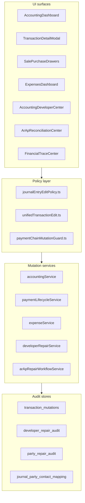

# Transaction Actions — Current State Analysis

**Date:** 2026-06-12  
**Product:** DIN Collection ERP (live accounting) — **not** the separate FX/multi-currency exchange app  
**Status:** Analysis only — no implementation in this document  
**Related:** [transaction-actions-plan.md](./transaction-actions-plan.md) · [cash-flow-plan.md](./cash-flow-plan.md)

---

## 1. Executive summary

The ERP already has **substantial void/reversal/edit infrastructure** (payment chains, PF-14 delta JEs, developer repair registry, AR/AP reconciliation queues). What is missing is a **unified user-facing action model**.

| Finding | Impact |
|---------|--------|
| **No `getTransactionActions()` registry** | Each screen invents its own buttons and labels |
| **Verb drift** | Delete vs Cancel vs Void vs Reverse vs Undo edit mean similar outcomes with different UX |
| **Source-document policy exists in code** but UI still exposes blocked actions (disabled Reverse, confusing journal header copy) | Users think Accounting can cancel sales/rentals from Journal Entries |
| **Fix Link is developer-only** | End users cannot fix payment↔JE or contact mapping without Developer Center |
| **Expense delete hard-deletes posted rows** | Inconsistent with payment void model elsewhere |
| **Report audit mode is per-report** | No global “normal vs audit” contract across Cash/Roznamcha/Statements |
| **Cash Flow GL service exists with zero UI** | `getCashFlowStatement` is unused; Roznamcha covers operational cash only |

**Recommendation:** Unify **labels and action panel** first (low risk), then align expense cancel behavior and Fix Link wizard (medium risk). See [transaction-actions-plan.md](./transaction-actions-plan.md).

---

## 2. Architecture overview

There is **no shared action component**. Closest centralized pieces:

- `resolveUnifiedJournalEdit` / `unifiedEditButtonLabel` — [`src/app/lib/unifiedTransactionEdit.ts`](../../src/app/lib/unifiedTransactionEdit.ts)
- `journalReversalBlockedReason` / `allowsJournalEntryReverse` — [`src/app/lib/journalEntryEditPolicy.ts`](../../src/app/lib/journalEntryEditPolicy.ts)
- `getPaymentChainMutationBlockReason` — [`src/app/lib/paymentChainMutationGuard.ts`](../../src/app/lib/paymentChainMutationGuard.ts)

---

## 3. File map

### 3.1 Accounting UI

| File | Role |
|------|------|
| [`src/app/components/accounting/AccountingDashboard.tsx`](../../src/app/components/accounting/AccountingDashboard.tsx) | Journal Entries tab, Day Book, Roznamcha, Account Statements embed, receivables/payables |
| [`src/app/components/accounting/TransactionDetailModal.tsx`](../../src/app/components/accounting/TransactionDetailModal.tsx) | Primary drill-down: Edit, Reverse, Void/Cancel, Edit Accounts, payment trace |
| [`src/app/components/accounting/AddEntryV2.tsx`](../../src/app/components/accounting/AddEntryV2.tsx) | Create-only manual entry wizard |
| [`src/app/components/accounting/AccountLedgerPage.tsx`](../../src/app/components/accounting/AccountLedgerPage.tsx) | Per-account GL drill-down |
| [`src/app/components/reports/AccountLedgerReportPage.tsx`](../../src/app/components/reports/AccountLedgerReportPage.tsx) | Account Statements tab (multi-mode ledger) |
| [`src/app/components/accounting/LedgerHub.tsx`](../../src/app/components/accounting/LedgerHub.tsx) | Party statement hub |
| [`src/app/components/accounting/GenericLedgerView.tsx`](../../src/app/components/accounting/GenericLedgerView.tsx) | Supplier/worker operational + GL + reconciliation |
| [`src/app/components/accounting/FinancialTraceCenterPage.tsx`](../../src/app/components/accounting/FinancialTraceCenterPage.tsx) | Read-only trace (no mutations) |

### 3.2 Source modules

| File | Role |
|------|------|
| [`src/app/components/sales/ViewSaleDetailsDrawer.tsx`](../../src/app/components/sales/ViewSaleDetailsDrawer.tsx) | **Delete Payment** on sale payments |
| [`src/app/components/purchases/ViewPurchaseDetailsDrawer.tsx`](../../src/app/components/purchases/ViewPurchaseDetailsDrawer.tsx) | **Delete Payment** on purchase payments |
| [`src/app/components/dashboard/ExpensesDashboard.tsx`](../../src/app/components/dashboard/ExpensesDashboard.tsx) | **Edit**, **Delete Expense** |
| [`src/app/components/dashboard/AddExpenseDrawer.tsx`](../../src/app/components/dashboard/AddExpenseDrawer.tsx) | Create/edit expense |
| [`src/app/components/dashboard/ExpenseDetailSheet.tsx`](../../src/app/components/dashboard/ExpenseDetailSheet.tsx) | Edit + trash icon |
| Rental payment flows | [`src/app/services/rentalService.ts`](../../src/app/services/rentalService.ts) — delete/void rental payments |

### 3.3 Shared payment / confirm UI

| File | Role |
|------|------|
| [`src/app/components/shared/UnifiedPaymentDialog.tsx`](../../src/app/components/shared/UnifiedPaymentDialog.tsx) | Edit payment amount/account (no cancel in dialog) |
| [`src/app/components/shared/PaymentDeleteConfirmationModal.tsx`](../../src/app/components/shared/PaymentDeleteConfirmationModal.tsx) | **Confirm Delete Payment** |

### 3.4 Services — mutations

| File | Key functions |
|------|---------------|
| [`src/app/services/accountingService.ts`](../../src/app/services/accountingService.ts) | `createReversalEntry`, `updateManualJournalEntry`, `getAccountLedger`, `getCustomerLedger` |
| [`src/app/services/paymentLifecycleService.ts`](../../src/app/services/paymentLifecycleService.ts) | `voidPaymentAfterJournalReversal`, `undoLastPaymentMutation`, `voidAllPaymentChainJournals` |
| [`src/app/services/paymentAdjustmentService.ts`](../../src/app/services/paymentAdjustmentService.ts) | PF-14 delta JEs on payment edit |
| [`src/app/services/paymentChainCompositeReversal.ts`](../../src/app/services/paymentChainCompositeReversal.ts) | Full chain reversal |
| [`src/app/services/transactionMutationService.ts`](../../src/app/services/transactionMutationService.ts) | `recordTransactionMutation`, append-only log |
| [`src/app/services/expenseService.ts`](../../src/app/services/expenseService.ts) | `deleteExpense` (void JEs + hard delete row) |
| [`src/app/services/cancellationService.ts`](../../src/app/services/cancellationService.ts) | `cancelExpense` — **unused in UI** |
| [`src/app/services/saleService.ts`](../../src/app/services/saleService.ts) | `deletePayment` |
| [`src/app/services/purchaseService.ts`](../../src/app/services/purchaseService.ts) | `deletePayment` |
| [`src/app/services/addEntryV2Service.ts`](../../src/app/services/addEntryV2Service.ts) | Manual entry creation paths |

### 3.5 Developer / repair / trace

| File | Role |
|------|------|
| [`src/app/components/admin/AccountingDeveloperCenterPage.tsx`](../../src/app/components/admin/AccountingDeveloperCenterPage.tsx) | Transaction trace, payment trace, repair queue |
| [`src/app/components/accounting/ArApReconciliationCenterPage.tsx`](../../src/app/components/accounting/ArApReconciliationCenterPage.tsx) | Queues + dry-run wizards (Phase 2 safe — apply blocked) |
| [`src/app/lib/developerRepairActions.ts`](../../src/app/lib/developerRepairActions.ts) | Repair action registry |
| [`src/app/services/developerRepairService.ts`](../../src/app/services/developerRepairService.ts) | Dry-run hash → apply → `developer_repair_audit` |
| [`src/app/services/arApRepairWorkflowService.ts`](../../src/app/services/arApRepairWorkflowService.ts) | Posting dry-run, relink mapping, reverse/repost (gated) |
| [`src/app/services/arApReconciliationTraceService.ts`](../../src/app/services/arApReconciliationTraceService.ts) | Read-only trace bundles |

### 3.6 Reports

| File | Role |
|------|------|
| [`src/app/components/reports/DayBookReport.tsx`](../../src/app/components/reports/DayBookReport.tsx) | Full JE list; audit mode toggle |
| [`src/app/components/reports/RoznamchaReport.tsx`](../../src/app/components/reports/RoznamchaReport.tsx) | Cash book; include voided toggle |
| [`src/app/services/roznamchaService.ts`](../../src/app/services/roznamchaService.ts) | Operational cash movements |
| [`src/app/services/accountingReportsService.ts`](../../src/app/services/accountingReportsService.ts) | TB, P&L, BS, **`getCashFlowStatement`** (no UI) |
| [`src/app/services/customerLedgerApi.ts`](../../src/app/services/customerLedgerApi.ts) | live vs audit payment scope |

### 3.7 Policy / visibility helpers

| File | Role |
|------|------|
| [`src/app/lib/journalEntryEditPolicy.ts`](../../src/app/lib/journalEntryEditPolicy.ts) | Block reverse/edit on source-controlled JEs |
| [`src/app/lib/unifiedTransactionEdit.ts`](../../src/app/lib/unifiedTransactionEdit.ts) | Route Edit to payment/manual/transfer/document |
| [`src/app/lib/paymentVoidVisibility.ts`](../../src/app/lib/paymentVoidVisibility.ts) | Hide payments when JE voided but payment row not |
| [`src/app/lib/transactionTraceReportVisibility.ts`](../../src/app/lib/transactionTraceReportVisibility.ts) | Which reports include a trace row |
| [`src/app/lib/arApReconciliationAccess.ts`](../../src/app/lib/arApReconciliationAccess.ts) | `canApplyRepair: false` always |

### 3.8 Database / migrations (audit & mapping)

| Migration / table | Purpose |
|-------------------|---------|
| [`migrations/20260606120000_developer_repair_audit.sql`](../../migrations/20260606120000_developer_repair_audit.sql) | `developer_repair_audit` |
| [`migrations/20260330_ar_ap_repair_workflows.sql`](../../migrations/20260330_ar_ap_repair_workflows.sql) | `journal_party_contact_mapping`, AR/AP views |
| `transaction_mutations` | PF-14 payment edit / undo log (referenced in services) |
| `party_repair_audit` | Bulk contact backfill audit (Developer Party Tie-Out) |

---

## 4. Action inventory by surface

### 4.1 Journal Entries tab (`AccountingDashboard`)

| Action | Label | When visible | Backend |
|--------|-------|--------------|---------|
| Open row | Click row | Always | Opens `TransactionDetailModal` |
| Edit | **Edit** | Unified edit not blocked | Routes via `resolveUnifiedJournalEdit` |
| Open source | **Open source** | Document-linked JE | Navigate to sale/purchase/rental |
| Undo edit | **Undo edit** | PF-14 chain, member count > 1 | `undoLastPaymentMutation` |
| Cancel payment | **Cancel payment** | Payment chain | `createReversalEntry` (full chain void) |
| Reverse | **Reverse** | Single JE, policy allows | `createReversalEntry` → `correction_reversal` JE |

**Header copy (problematic):** *"Manual correction: use Reverse to create a reversal entry"* — implies journal-level reversal is normal for all rows.

### 4.2 Transaction Detail Modal

| Action | Label | Notes |
|--------|-------|-------|
| Unified edit | **Edit payment** / **Edit journal** / **Edit transfer** | Via `unifiedEditButtonLabel` |
| Reverse | **Reverse** | Posts offsetting JE |
| Void | **Void / Cancel** | Urdu confirm in some paths |
| Edit accounts | **Edit Accounts** | Manual/payment line account swap |
| Trace | **Full payment trace** | Read-only sheet |

### 4.3 Sales / Purchases

| Action | Label | Backend |
|--------|-------|---------|
| Delete payment | **Delete Payment** / **Confirm Delete Payment** | `deletePayment` / RPC reverse+delete |

No **Undo edit** on sale/purchase drawers.

### 4.4 Expenses

| Action | Label | Backend |
|--------|-------|---------|
| Edit | **Edit** | `updateExpense` (may reverse/repost JE) |
| Delete | **Delete Expense** | `deleteExpense` — void + **hard delete** |
| Filter | **Show reversed in journal** | Hides expense IDs with reversal JEs |

### 4.5 Developer Center

| Action | Label | Apply? |
|--------|-------|--------|
| Send to repair queue | From trace | Dry-run required |
| Relink payment↔JE | **Fix Link** (internal) | Yes → `developer_repair_audit` |
| Sync branch | Metadata repair | Yes |
| Roznamcha duplicate report | Audit-only | No GL change |

### 4.6 AR/AP Reconciliation Center

| Action | Label | Apply? |
|--------|-------|--------|
| Row trace | Read-only | — |
| Posting dry-run | Illustrative | No post (Phase 2) |
| Relink dry-run | Preview mapping | Save disabled in Phase 2 mode |
| Status change | reviewed / ready_to_* | Workflow metadata only |

### 4.7 Financial Trace Center

Read-only: Refresh, CSV, Copy, Print, cross-links. **No mutation actions.**

---

## 5. Void / cancel / reversal matrix

| UI term | Typical service | DB / GL effect |
|---------|-----------------|----------------|
| **Delete Payment** (sale/purchase) | `saleService.deletePayment` | RPC or void JEs + delete payment row |
| **Cancel payment** (journal) | `createReversalEntry` | Void chain or post `correction_reversal` |
| **Void / Cancel** (detail modal) | `voidPaymentAfterJournalReversal` or `is_void=true` | `payments.voided_at`, `journal_entries.is_void` |
| **Reverse** | `createReversalEntry` | New JE `reference_type=correction_reversal` |
| **Undo edit** | `undoLastPaymentMutation` | Void tail PF-14 JE; restore payment from `transaction_mutations` |
| **Delete Expense** | `expenseService.deleteExpense` | Void expense JEs + **DELETE** from `expenses` |
| **cancelExpense** (unused) | `cancellationService.cancelExpense` | Soft `status=rejected` only — no GL |

**Normal report hiding:**

- GL reports: `journal_entries.is_void = true` excluded
- Roznamcha / payments: `payments.voided_at` excluded unless audit toggle
- Customer statement: `paymentScope=live` excludes voided payments

---

## 6. Source-document guardrails

[`journalEntryEditPolicy.ts`](../../src/app/lib/journalEntryEditPolicy.ts) blocks reverse for:

- Document-root `sale`, `purchase`, `rental` (without payment settlement)
- Returns, adjustments, opening balance, studio production refs

**Allowed from Accounting for document JEs:**

- **Open Source Document** only (plus read-only trace)

**Gap:** Reverse button may still render (disabled) with tooltip; journal header still mentions Reverse for manual correction globally.

---

## 7. Mapping / relink behavior

| Mechanism | Amounts change? | What changes | Audit |
|-----------|-----------------|--------------|-------|
| `payment.relink_payment_to_journal` | No | `journal_entries.payment_id` | `developer_repair_audit` |
| `rental.relink_rental_payment_to_journal` | No | `rental_payments.journal_entry_id` | `developer_repair_audit` |
| `payment.sync_branch_from_document` | No | `branch_id` on payment/JE/rental_payment | `developer_repair_audit` |
| `payment.fill_payment_account_from_je` | No | `payment_account_id` | `developer_repair_audit` |
| `journal_party_contact_mapping` | No | Mapping table; **GL line party_contact_id unchanged today** | Table + AR/AP workflow |
| Party tie-out bulk cleanup | No | `payments.contact_id` backfill | `party_repair_audit` |

End-user **Fix Link** wizard does not exist outside Developer Center / AR/AP dry-run previews.

---

## 8. Report filtering inventory

| Report / surface | Normal mode excludes | Audit toggle |
|------------------|----------------------|--------------|
| Trial Balance, P&L, Balance Sheet | `je.is_void` | None |
| Cash Flow service (`getCashFlowStatement`) | `je.is_void` | None (no UI) |
| Day Book | void JEs | **Audit mode** switch |
| Roznamcha | `voided_at`, void JEs | **Include voided payments (audit)** |
| Account ledger | void JEs | Effective vs audit **presentation** |
| Customer/supplier statement | voided payments | **live vs audit** scope |
| Accounting journal tab grouped/audit | N/A | **audit** = raw JE list (not void-related) |
| Dashboard cards (Accounting header) | void JEs in GL-derived totals | None |
| Financial Trace Center | read-only snapshots | N/A |

**Inconsistency:** Cancelled **sale status** (`order`, `cancelled`) is not uniformly filtered across all reports; handled per-module (e.g. unposted queue, studio filters).

---

## 9. Audit trail inventory

| Store | Written when | Read where |
|-------|--------------|------------|
| `transaction_mutations` | Payment edit, undo, reversal restore | Payment undo; effective ledger |
| `developer_repair_audit` | Developer Center apply (success/fail) | Developer Center Audit tab |
| `party_repair_audit` | Party tie-out bulk contact fix | Merged developer audit log |
| `journal_party_contact_mapping` | AR/AP relink save (when enabled) | Reconciliation relink UI |
| AR/AP item fix status | Status button changes | Reconciliation Center queues |
| `activityLogService` | Transaction detail activity | TransactionDetailModal |

No unified **View Audit** drawer across payment + expense + manual JE today.

---

## 10. Risk register

| # | Risk | Severity | Notes |
|---|------|----------|-------|
| R1 | Expense **hard delete** after void | **High** | Breaks audit trail consistency |
| R2 | **Delete Payment** vs **Cancel payment** wording | **Medium** | Same user intent, different modules |
| R3 | **Undo edit** only on AccountingDashboard | **Medium** | Not in TransactionDetailModal or sale drawers |
| R4 | Journal header **Reverse** guidance | **Low–Medium** | Misleading for source-controlled rows |
| R5 | Phase 2/3 / dry-run jargon in AR/AP UI | **Low** | Confuses normal accounting staff |
| R6 | Fix Link developer-only | **Medium** | Forces unsafe workarounds or manual SQL |
| R7 | No shared action panel | **Medium** | Regression risk on each new screen |
| R8 | Per-report audit toggles | **Low–Medium** | Cash Flow will need explicit normal/audit contract |

---

## 11. Affected screens checklist (regression scope for future work)

- [ ] Accounting → Journal Entries
- [ ] Accounting → Transaction Detail Modal
- [ ] Accounting → Day Book
- [ ] Accounting → Roznamcha
- [ ] Accounting → Account Statements
- [ ] Accounting → Party Ledger / LedgerHub
- [ ] Accounting → Financial Trace Center (read-only links only)
- [ ] Sales → View Sale Details → payments
- [ ] Purchases → View Purchase Details → payments
- [ ] Rentals → payment modals
- [ ] Expenses → Dashboard / Detail / Add drawer
- [ ] Reports → Ledger V2
- [ ] Developer Center → Trace / Repair
- [ ] AR/AP Reconciliation Center → all queues
- [ ] Future: Accounting → **Cash Flow** tab

---

## 12. Next steps

See [transaction-actions-plan.md](./transaction-actions-plan.md) for proposed UX, rules tables, shared component design, and phased implementation.  
See [cash-flow-plan.md](./cash-flow-plan.md) for Cash Flow tab design inside Accounting.

**No code or migrations are changed by this document.**
