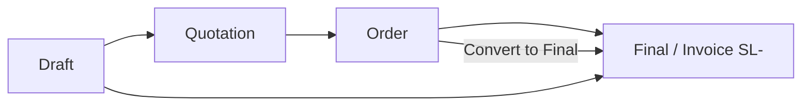

# Bespoke Customization & Convert to Final — Complete Guide

**Date:** May 2026 (updated for fabric injection + work orders)  
**Scope:** Web ERP (`src/`), mobile (`erp-mobile-app/`), Postgres migrations `202605311*`.  
**Implementation plan:** [`docs/plan.md`](plan.md)  
**May 2026 session log (DB + app, ON/OFF, ledger):** [`docs/bespoke_may_2026_session_log.md`](bespoke_may_2026_session_log.md)

---

## 1. Architecture (current)

| Concern | Mechanism |
|---------|-----------|
| Custom dress line on invoice | Generic SKUs (`CUSTOM-BRIDAL`, …) — visible when **Enable customization** is ON (`products.is_active`) |
| Fabric stock OUT | **Deferred** until **Bespoke work order → Complete** (child `sales_items` or legacy `fabric_materials` JSON). **Not** on sale Final. |
| Custom parent (CUSTOM-*) stock IN | **WO Complete** — **+order qty** on parent SKU (`stock_movements`, `track_stock` stays false). Ledger only (purchase Received style); fabric meters still **OUT (−)** on fabric product. |
| Customer stitching charge | **Extra Expenses** → `sale_charges` (`type: stitching`) — not in JSON |
| Measurements / notes / image | Parent `customization_details` — **metadata only** (no fabric list, no charges) |
| Tailor production cost (internal) | **Bespoke work order** → Complete → JE Dr **5000** / Cr tailor **AP** + fabric `stock_movements` (`reference_type: bespoke_work_order`) |

**Customer invoice**

- Parent generic line → instruction bullets (`BespokeInstructionBullets`) from metadata.
- Fabric → normal invoice rows (child lines).
- Stitching → `sales.expenses` / totals section from `sale_charges`.

**Internal**

- Work orders + job card print (`BespokeJobCardTemplate`) — production cost only, no customer retail.

Legacy sales that still have `fabric_materials` or `customization_charges` inside JSON continue to load; re-saving the bespoke modal migrates fabric to child lines when possible.

---

## 2. Settings (company level)

**Path:** Settings → Business → Bespoke / Custom Orders

| Setting | Field | Effect |
|---------|-------|--------|
| Enable customization | `enable_bespoke_orders` + RPC `set_company_customization_enabled` | Toggles generic custom SKUs `is_active` + modal on sale/POS lines |
| Form config | `bespoke_form_config` | Modal fields: measurements, fabric picker, color/shade, image, delivery date (no charge field) |

Stitching / modification amounts: **Extra Expenses → Stitching** on the sale (and POS payment panel), not the bespoke modal.

---

## 3. Sale lifecycle (status flow)



| Status | Document prefix (typical) | Stock / GL |
|--------|-------------------------|------------|
| Draft | DRAFT- / SDR- | Usually no final posting |
| Quotation | QT- / SQT- | No final posting |
| Order | SO- / SOR- | Order stage; bespoke work in progress |
| **Final** | **SL- / INV-** | Final invoice; stock & ledger as per existing rules |

---

## 4. Bespoke customize — step by step (Order par)

### 4.1 User actions

1. **Sales → New Sale** ya existing **Order** open karein.
2. Status **Order** select karein (bespoke orders usually Order stage par rehte hain).
3. Product line add karein (e.g. “Design 2000 (Maxi)”).
4. Line par **Customize** (bespoke icon) click karein → `BespokeDetailsModal` khulta hai.
5. Modal mein bharein:
   - **Measurements** (text ya field-wise)
   - **Fabric / materials** — inventory se loose fabric link (product, qty, unit)
   - **Color / shade card**
   - **Reference image**
   - **Expected delivery date**
6. **Save** — parent line keeps generic SKU price; **fabric** is injected as child cart lines; metadata only in JSON.
7. **Extra Expenses → Stitching** (e.g. Rs. 75,000) on the sale summary panel.
8. **Save Sale** — parents + fabric children persist (`bespoke_parent_item_id`); charges → `sale_charges`.

### 4.2 Form par kya dikhta hai

Sale form line item par typically:

- Product name  
- Base: Rs. X  
- Customization: Rs. Y  
- **Effective unit price:** Rs. (X + Y)

Yeh staff ke liye hai; customer ko final breakdown **invoice / View Sale** par milta hai (Section 7).

### 4.3 Pricing rules (code)

| Line type | `unit_price` | Notes |
|-----------|--------------|-------|
| Parent generic SKU | Generic product retail (often 0) | `customization_details` = metadata only |
| Fabric child | Fabric product retail × qty | `bespoke_parent_item_id` → parent row |
| Stitching | `sale_charges` row | Extra Expenses UI; rolls into `sales.expenses` / total |

Helpers: `src/app/types/bespoke.ts` (`buildBespokeMetadataForPersist`, `getBespokeInstructionBullets`), `src/app/lib/bespokeCartInjection.ts` (`syncFabricChildLines`, `orderSaleLinesForPersist`).

Legacy rows may still use `customization_charges` inside JSON; `deriveBaseUnitPriceFromStored` / `getBespokeLineCharges` remain for hydration only.

---

## 5. Data storage — `customization_details` (JSONB)

Har bespoke line `sales_items.customization_details` column mein JSON store karti hai.

**Table:** `sales_items`  
**Column:** `customization_details` (JSONB, nullable)

### 5.1 JSON shape (TypeScript: `CustomizationDetails`)

```json
{
  "fabric_materials": [
    {
      "product_id": "uuid",
      "variation_id": "uuid",
      "product_name": "Raw Silk",
      "sku": "FAB-001",
      "unit_code": "m",
      "quantity": 8
    }
  ],
  "fabric": "Raw Silk (8 m)",
  "color_name": "Maroon",
  "shade_card_code": "SC-442",
  "measurements": "Chest 38, Length 52",
  "expected_delivery_date": "2026-06-15",
  "customization_charges": 75000,
  "image_url": "https://...",
  "image_storage_path": "company/.../photo.jpg",
  "notes": "Heavy embroidery on dupatta"
}
```

### 5.2 Kab persist hota hai

- `hasBespokeContent(details)` true ho — charges, fabric, measurements, image, notes, etc. mein se kuch ho.
- Save / update par `customization_details` **null tabhi** jab sach mein koi bespoke field na ho.

---

## 6. Convert to Final — kaise kaam karta hai

### 6.1 UI flow

1. **Sales list** → non-final Order (ya draft/quotation jahan allowed ho) par menu.
2. **Convert to Final** click.
3. System sale ko **edit drawer** mein kholta hai with `convertToFinal: true` (`SalesPage.tsx`).
4. Form **Status = Final** dikhata hai; user review kar sakta hai (payments, shipping, etc.).
5. **Save** → same sale row update hoti hai (duplicate create nahi — **same-row conversion**):
   - `status` → `final`
   - `type` → `invoice`
   - Agar pehle SO-/SOR- number tha → naya **SL-** invoice number allocate (`getNextDocumentNumberGlobal(companyId, 'SL')`).
6. Toast: *“Order converted to invoice SL-XXXX”*
7. Stock: generic parent + fabric **not** deducted on Final; fabric OUT when work order is **Completed**. GL / revenue on Final unchanged.

### 6.2 Code path (high level)

```
SalesPage.handleSaleAction('convert_to_final')
  → saleService.getSaleById (items + customization_details load)
  → convertFromSupabaseSale
  → openDrawer('edit-sale', { sale, convertToFinal: true })

SaleForm (convertToFinal=true)
  → items hydrate (customizationDetails + baseUnitPrice)
  → user Save
  → saleItems with customizationDetails + unit_price
  → SalesContext.updateSale
       → delete old sales_items + insert new rows
       → customization_details preserved (see 6.3)
  → status final, new SL- number if needed
```

### 6.3 Persistence fix (Convert to Final bug)

**Problem:** `updateSale` har save par **saari lines delete karke dubara insert** karta hai. Agar form se `customization_details` payload mein na aaye (variation ID mismatch, camelCase/snake_case, etc.), insert **null** JSON ke sath hota tha.

**Fix (web):**

| Layer | File | Behaviour |
|-------|------|-----------|
| Form save | `SaleForm.tsx` | `buildCustomizationDetailsForPersist`; snake/camel fallback; `baseUnitPrice` on payload; dev logs |
| Context | `SalesContext.tsx` | Purani DB rows se preserve map: keys `productId:variationId`, `productId:`, `productId:null`; single-line sale fallback |
| Mobile RPC parity | `migrations/20260529120000_update_sale_with_items_customization_details.sql` | `update_sale_with_items` INSERT mein `customization_details` include |

**Preserve logic (concept):**

```
Before delete:
  Load existing sales_items.customization_details keyed by product_id + variation_id

On each new line:
  If form sent customization → use it
  Else try preserve keys from existing map
  Else if 1 line sale → copy sole existing row's JSON
```

Is se **Edit**, **Save**, aur **Convert to Final** sab paths par JSON survive karta hai.

---

## 7. Customer-facing invoice

| Surface | Component | Data |
|---------|-----------|------|
| **View Sale** | `BespokeInstructionBullets` under parent lines | Metadata JSON on parent |
| **A4 / Thermal** | Same bullets; fabric as normal rows | RPC items + `bespoke_parent_item_id` |
| **Totals** | Expenses line | `sales.expenses` (stitching from `sale_charges`) |

Print path: `generate_invoice_document` → `migrations/20260531160000_generate_invoice_document_bespoke_parent.sql` (includes `bespoke_parent_item_id` when column exists).

Work orders: `BespokeWorkOrdersPanel` in View Sale — internal only; job card via `BespokeJobCardTemplate`.

### Sale edit / Convert to Final with existing work orders

Saving a sale **replaces all `sales_items` rows** (delete + re-insert). Bespoke work orders point at the parent line via `parent_sales_item_id`. Without relink, Postgres blocks the delete (`23503` FK violation).

**Migration `20260602130000_bespoke_work_orders_parent_fk_set_null.sql`** (required on Supabase):

- `parent_sales_item_id` → `ON DELETE SET NULL` (nullable)
- Anchor columns `parent_product_id` / `parent_variation_id` on `bespoke_work_orders`
- RPCs `snapshot_bespoke_work_order_anchors` + `relink_bespoke_work_orders_for_sale`
- `update_sale_with_items` snapshots anchors before delete, relinks after insert

**Web:** `SalesContext.updateSale` calls `bespokeWorkOrderRelinkService` on the same path. Parent line UUIDs change on save; WOs are matched back by product + variation anchor.

**UI:** Status popover and row ⋮ menu close after picking a lifecycle action (e.g. Convert to Final).

---

## 8. Files changed (reference)

### 8.1 Core files

- `src/app/lib/bespokeCartInjection.ts` — fabric child injection + persist order
- `src/app/lib/saleStockLineEligibility.ts` — defer stock at Final; fabric on WO complete
- `src/app/types/bespoke.ts` — metadata types + instruction bullets
- `src/app/components/bespoke/BespokeInstructionBullets.tsx` — customer-facing bullets
- `src/app/services/bespokeWorkOrderService.ts` — work orders + complete RPC
- `src/app/services/bespokeWorkOrderRelinkService.ts` — snapshot/relink WOs after sale line replace
- `src/app/components/bespoke/BespokeWorkOrdersPanel.tsx`, `BespokeWorkOrderForm.tsx`, `BespokeJobCardTemplate.tsx`
- `src/app/components/sales/SaleForm.tsx`, `src/app/components/pos/POS.tsx` — sale/POS integration
- `erp-mobile-app/src/lib/bespokeCartInjection.ts`, `erp-mobile-app/src/api/sales.ts` — mobile RPC fields

### 8.2 Database migrations (`20260531120000` … `20260531160000`)

Apply on Supabase before using customization toggle, fabric children, work orders, or updated invoice RPC.

| Migration | Purpose |
|-----------|---------|
| `20260529120000_update_sale_with_items_customization_details.sql` | Mobile RPC `update_sale_with_items` — persist `customization_details` on line replace |
| `20260529130000_generate_invoice_document_bespoke_breakdown.sql` | Invoice RPC — include `customization_details` in printed document JSON |
| `20260602120000_bespoke_defer_stock_to_work_order_complete.sql` | Defer fabric/generic stock OUT until WO complete; update sale-final trigger |
| `20260602130000_bespoke_work_orders_parent_fk_set_null.sql` | WO FK SET NULL + anchor columns; relink after sale line replace (web + mobile RPC) |

Apply on production Postgres / VPS **before** relying on print breakdown in live.

---

## 9. End-to-end example (bridal order)

### Scenario

- Design: **Bridal Maxi 2000** — base Rs. 45,000  
- Fabric: **Raw Silk 8m** (from inventory)  
- Stitching / embroidery: **Rs. 75,000**  
- Qty: **1**

### Steps

1. Create sale, status **Order**, add line, **Customize**, fill fabric + charges, save sale.  
2. DB: `unit_price = 120000`, `customization_details` = full JSON.  
3. Production complete → **Convert to Final** from list.  
4. Review → Save → `status = final`, invoice `SL-01234`.  
5. Verify:
   - **View Sale:** sub-lines under product name.  
   - **Print A4:** same sub-lines on PDF.  
   - Total still Rs. 120,000 (+ tax/shipping if any).

---

## 10. Testing checklist

### Customize & save

- [ ] Settings mein bespoke enabled  
- [ ] Order par line customize → base + charges form par sahi  
- [ ] Save → DB row mein `customization_details` NOT NULL  
- [ ] Re-open edit → modal data wapas load  

### Convert to Final

- [ ] List → Convert to Final → form opens with items + customization  
- [ ] Status popover / ⋮ menu **closes** after Convert to Final  
- [ ] Save → status Final, SL- number  
- [ ] Sale with **existing work order** → Save succeeds (no `23503`); `parent_sales_item_id` points to new parent line  
- [ ] Complete work order after edit → fabric stock OUT still posts  
- [ ] DB: same sale id, `customization_details` still populated  
- [ ] `unit_price` still 120000 (not reset to base only)

### Invoice visibility

- [ ] View Sale → Base item, Materials, Customization charges lines  
- [ ] A4 print → same breakdown  
- [ ] Thermal print → same (compact layout)  
- [ ] Non-bespoke line → no extra sub-lines (normal product row only)

### Regression

- [ ] Normal retail sale (no customize) unchanged  
- [ ] Packing-enabled lines still work  
- [ ] Mobile app uses `update_sale_with_items` — test after migration 20260529120000

---

## 11. Troubleshooting

| Symptom | Likely cause | Action |
|---------|--------------|--------|
| Form par customize dikhe, save ke baad JSON null | Old code / preserve miss | Pull latest; check browser console `[SALES CONTEXT] has_customization` |
| View Sale par breakdown nahi | Item JSON empty | Fix save first; query `sales_items.customization_details` |
| View Sale OK, print par breakdown nahi | RPC migration not applied | Run `20260529130000_...sql` on DB |
| Base amount galat | Old rows stored base-only in `unit_price` | `deriveBaseUnitPriceFromStored` handles both; verify `customization_charges` in JSON |
| Convert to Final fails 409 / `23503` on `sales_items` | WO FK `RESTRICT` on `parent_sales_item_id` | Apply `20260602130000_bespoke_work_orders_parent_fk_set_null.sql` |
| Price/qty field empty or typing does nothing | Fabric child blocked or variation gate; parent bound to total not base | Fabric line price is editable; parent line price is **base only** (stitching in Extra Expenses) |
| Convert to Final par popover open rehta hai | Radix overlay not dismissed on button click | Fixed: controlled popover + `onAfterPick` on lifecycle menu |
| WO completed, fabric ledger empty | Migration `20260602120000` not applied; or fabric child not linked to parent (`bespoke_parent_item_id` NULL) | Apply deferred-stock migration on DB; re-save sale (preserves `parent_line_index`); use **Post fabric stock** on completed WO drawer |
| CUSTOM-BRIDAL ledger empty after WO complete | RPC `20260602140000` / `20260602150000` not applied; or sale re-save changed `parent_sales_item_id` | Apply migrations; run repair using live WO parent line; expect **+order qty IN** on CUSTOM ledger |
| Completed WO by mistake | — | Edit → **Cancel stock post**; or set status to **In progress** / **Pending** (reverses stock + voids production JE via `20260602160000`) |
| Full session log / ON-OFF matrix | — | See [`bespoke_may_2026_session_log.md`](bespoke_may_2026_session_log.md) |

### Dev console logs (web)

- `[SALE FORM] Converted item` → `hasCustomization: true`, `unitPrice`  
- `[SALES CONTEXT] Converted item` → `has_customization: true`

---

## 12. Out of scope (is phase mein change nahi)

- `BespokeDetailsModal` UI / fields layout  
- `enable_bespoke_orders` toggle behaviour  
- Mobile app invoice templates (`erp-mobile-app/`) — alag phase  
- Studio module production workflow (`docs/CustomStudio.md`)  
- GL / stock trigger logic  

---

## 13. Quick reference — price formula

```
effective_unit_price = base_unit_price + customization_charges

line_total = effective_unit_price × quantity

Invoice breakdown (display):
  Base item     = base_unit_price
  Materials     = from fabric_materials or fabric string
  Charges       = customization_charges
  (Grand total  = sum of lines + discounts + tax + shipping — existing sale totals)
```

---

**Document owner:** ERP sales / bespoke team  
**Related docs:** `docs/CustomStudio.md`, `docs/ERP_SALES_DRAFT_LIFECYCLE_FIX.md`, `docs/modules/Settings_System_Complete_Documentation.md` (bespoke settings section)
