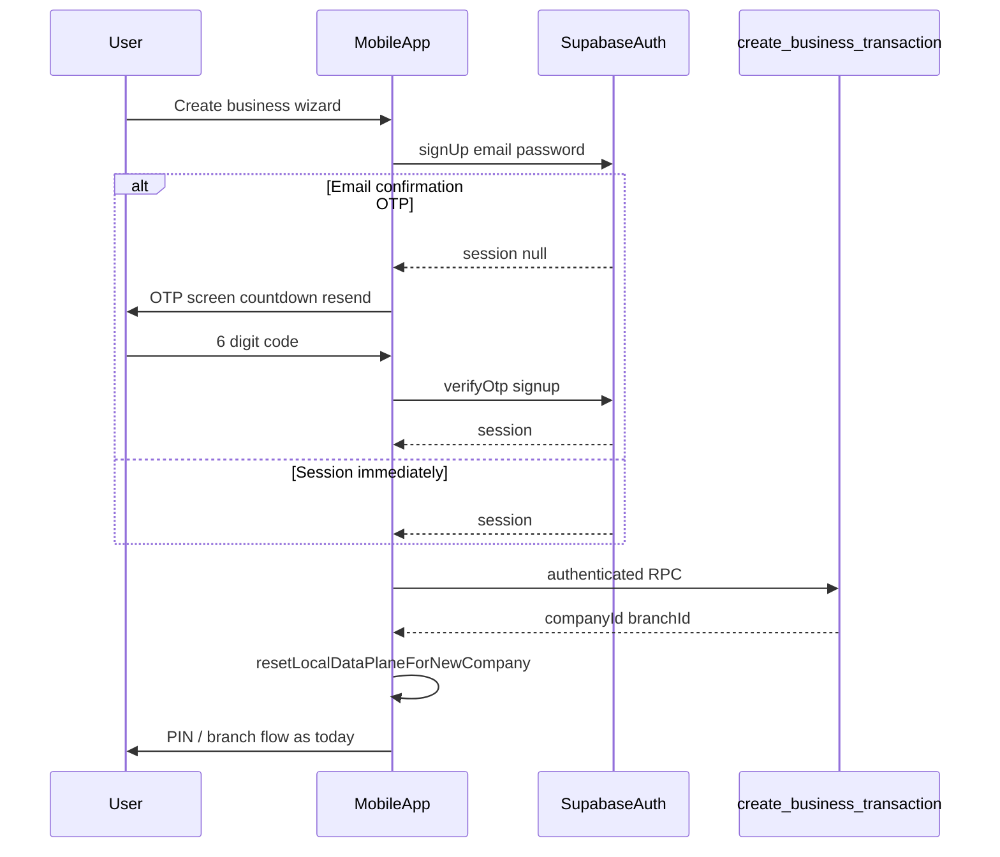

# Phase 2 — Mobile Create Business Wizard, Email OTP, Google Auth

**Scope:** `erp-mobile-app/` only. Uses existing Supabase Auth (`signUp`, `verifyOtp`, `resend`, `signInWithOAuth`) and existing RPC `create_business_transaction`. **No new Postgres migrations** in this repo slice.

## Implementation status (2026-05-19)

- [x] **Business Wizard** — [`CreateBusinessWizardScreen.tsx`](../erp-mobile-app/src/components/auth/CreateBusinessWizardScreen.tsx) + [`business.ts`](../erp-mobile-app/src/api/business.ts) RPC wrapper
- [x] **OTP step** — `otp` phase with verify/resend; session gate via [`ensureAuthenticatedSession`](../erp-mobile-app/src/api/auth.ts) (see [`macbook_handoff_auth_fixes.plan.md`](macbook_handoff_auth_fixes.plan.md))
- [x] **Google OAuth flow** — native deep link (`oauthRedirect` / `oauthCallback`), Android intent-filter, iOS URL scheme, [`LoginScreen`](../erp-mobile-app/src/components/LoginScreen.tsx) external-browser completion

## Deliverables (implementation)

| Item | Location |
|------|-----------|
| Business wizard UI | [`erp-mobile-app/src/components/auth/CreateBusinessWizardScreen.tsx`](../erp-mobile-app/src/components/auth/CreateBusinessWizardScreen.tsx) |
| OTP step (code + resend countdown) | Embedded in [`CreateBusinessWizardScreen.tsx`](../erp-mobile-app/src/components/auth/CreateBusinessWizardScreen.tsx) (`otp` phase) |
| Auth helpers | [`erp-mobile-app/src/api/auth.ts`](../erp-mobile-app/src/api/auth.ts) |
| RPC wrapper | [`erp-mobile-app/src/api/business.ts`](../erp-mobile-app/src/api/business.ts) |
| Session / local data isolation | [`erp-mobile-app/src/lib/sessionIsolation.ts`](../erp-mobile-app/src/lib/sessionIsolation.ts) |
| Business type → modules map | [`erp-mobile-app/src/config/businessTypeTemplates.ts`](../erp-mobile-app/src/config/businessTypeTemplates.ts) |
| App / login wiring | [`erp-mobile-app/src/App.tsx`](../erp-mobile-app/src/App.tsx), [`LoginScreen.tsx`](../erp-mobile-app/src/components/LoginScreen.tsx) |

## User flow

## Supabase Dashboard checklist (operator)

1. **Authentication → Providers → Email**
   - Ensure **Confirm email** is configured as required for new signups if you want OTP / verification before RPC.
   - For **6-digit email OTP** (recommended for this UX): use Supabase **Email** templates / Auth hooks that send OTP, or enable the built-in **Email OTP** path supported by your project version. Confirm in Dashboard under **Authentication → Providers → Email** whether OTP vs magic link is active.
   - **Site URL** must match where the app runs after redirects (e.g. `https://erp.dincouture.pk/m/` or dev `http://localhost:5173/`).

2. **Authentication → URL configuration**
   - **Redirect URLs:** add every URL the app can load after OAuth or email links, including:
     - Dev: `http://localhost:5173/**`, `http://127.0.0.1:5173/**`, LAN origins if used.
     - Prod / PWA: `https://erp.dincouture.pk/**` (and `/m/` path if applicable).
     - **Capacitor:** `capacitor://localhost`, `http://localhost` (WebView), and any custom scheme you add later for deep links.

3. **Authentication → Providers → Google**
   - Enable **Google**.
   - Paste **Web client ID** and **Client secret** from Google Cloud Console (OAuth 2.0 Web application).
   - Authorized redirect URI in Google Cloud must include your Supabase project’s callback URL (Supabase shows the exact URL in the Google provider settings).

4. **RLS / RPC (unchanged in this task)**
   - `create_business_transaction` must remain callable for the authenticated new user (same contract as web [`businessService`](../src/app/services/businessService.ts)).

5. **CORS / Kong (existing)**
   - Mobile WebView origins per [`docs/infra/MOBILE_APK_LOCKED_PATTERN.md`](MOBILE_APK_LOCKED_PATTERN.md).

## Data isolation rules

Before treating a **new** signup + business as the active tenant:

- Clear **PIN secure vault** (old refresh token must not apply).
- Clear **offline queue** (`clearAllPending`) so no pending writes target a previous `companyId`.
- Remove **branch selection** cache key `erp_mobile_branch` from `localStorage`.
- Do **not** change `VITE_SUPABASE_URL` / anon key selection (lockdown).

Call isolation **after** successful RPC and **before** `onLogin` / navigation to PIN or home.

## Risks / follow-ups

- If the project only sends **magic links** (not OTP), the OTP UI still works only after Dashboard is switched to OTP-style confirmation; document mismatch for operators.
- Google sign-in users without a `public.users` row still see “profile not found” until an admin links them or they complete business creation (web parity).
