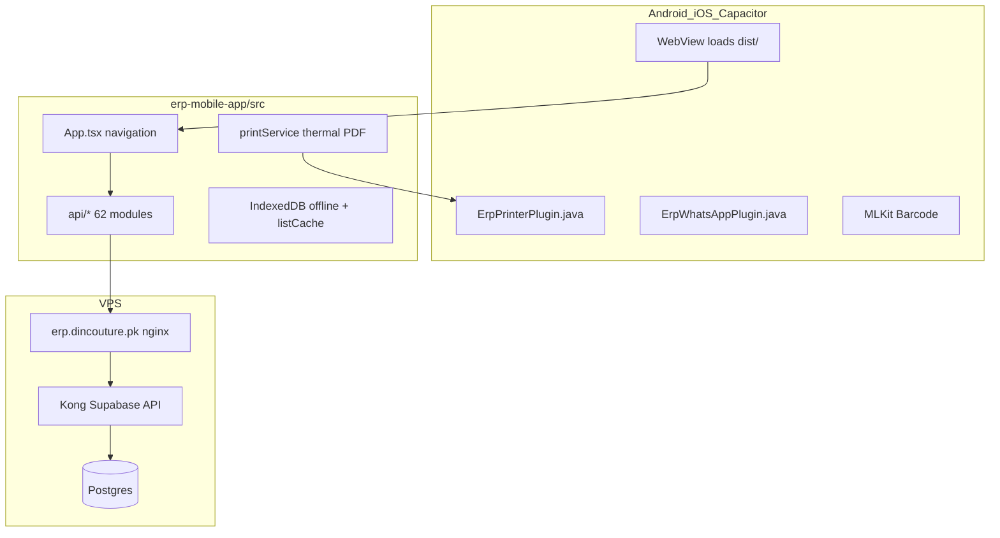

# 01 — Existing Mobile App Audit (Capacitor / WebView)

## Technology stack

| Layer | Technology | Source |
|-------|------------|--------|
| UI | React 18, TypeScript 5.6, Tailwind CSS 3 | [`erp-mobile-app/package.json`](../../erp-mobile-app/package.json) |
| Build | Vite 6 | [`erp-mobile-app/vite.config.ts`](../../erp-mobile-app/vite.config.ts) |
| Native shell | Capacitor 8 | [`erp-mobile-app/capacitor.config.ts`](../../erp-mobile-app/capacitor.config.ts) |
| App ID | `com.dincouture.erp` | `capacitor.config.ts`, `android/app/build.gradle` |
| Backend | `@supabase/supabase-js` 2.95 | [`erp-mobile-app/src/lib/supabase.ts`](../../erp-mobile-app/src/lib/supabase.ts) |
| Barcode | `@capacitor-mlkit/barcode-scanning` | native only; web stub |
| PDF | `jspdf`, `html2canvas` | [`utils/pdfGenerator.ts`](../../erp-mobile-app/src/utils/pdfGenerator.ts) |
| PWA | `public/sw.js` (shell cache only) | disabled on native in `main.tsx` |

**Version (Android):** `versionCode 39`, `versionName 1.0.5` — [`android/app/build.gradle`](../../erp-mobile-app/android/app/build.gradle).

## Architecture



**No shared code with web:** [`erp-mobile-app/README.md`](../../erp-mobile-app/README.md) explicitly states do not import from [`src/`](../../src/). API patterns are **parallel copies** under `erp-mobile-app/src/api/`.

## Folder structure

```
erp-mobile-app/
├── android/                 # Capacitor Android + ErpPrinter, ErpWhatsApp
├── ios/                     # Capacitor iOS + ML Kit pods
├── public/                  # PWA icons, sw.js
├── scripts/                 # env sync, release APK/IPA, verify dist
├── releases/                # IPA artifacts + build notes
├── src/
│   ├── api/                 # 62 Supabase API modules (PRIMARY Flutter contract)
│   ├── components/          # UI by module (sales, pos, accounts, …)
│   ├── context/             # PermissionContext, CounterWorker, Settings
│   ├── config/              # featureFlags, functionalRoles, inputConfig
│   ├── features/barcode/    # ML Kit scanner
│   ├── hooks/               # network, responsive, payments
│   ├── lib/                 # supabase, offline, auth, sync, caches
│   ├── services/            # printService, thermalPrint, barcodeLabelPrint
│   ├── utils/               # PDF, storage upload, branch helpers
│   ├── types.ts             # Screen enum, User, Branch
│   ├── App.tsx              # Root navigation, auth gate
│   └── main.tsx             # Boot, sync handler registration
├── mobile-design/           # Figma reference (repo root sibling)
└── capacitor.config.ts
```

## Important files

| File | Role |
|------|------|
| [`src/App.tsx`](../../erp-mobile-app/src/App.tsx) | Login → branch → home; lazy module imports; sync bar; PIN/counter lock |
| [`src/main.tsx`](../../erp-mobile-app/src/main.tsx) | `registerAllSyncHandlers()`, OAuth deep links, no SW on native |
| [`src/types.ts`](../../erp-mobile-app/src/types.ts) | `Screen` union, `User`, `Branch` |
| [`src/lib/supabase.ts`](../../erp-mobile-app/src/lib/supabase.ts) | Client, auth storage, realtime health |
| [`src/lib/resolveSupabaseApiUrl.ts`](../../erp-mobile-app/src/lib/resolveSupabaseApiUrl.ts) | Native → `erp.dincouture.pk` |
| [`src/api/auth.ts`](../../erp-mobile-app/src/api/auth.ts) | Sign-in, profile, OAuth, PIN |
| [`src/api/permissions.ts`](../../erp-mobile-app/src/api/permissions.ts) | `role_permissions`, `get_effective_user_branch` |
| [`src/context/PermissionContext.tsx`](../../erp-mobile-app/src/context/PermissionContext.tsx) | RBAC + module toggles |
| [`src/lib/offlineStore.ts`](../../erp-mobile-app/src/lib/offlineStore.ts) | Mutation queue IndexedDB |
| [`src/lib/listCache.ts`](../../erp-mobile-app/src/lib/listCache.ts) | Read-through list cache |
| [`src/lib/offlineWrite.ts`](../../erp-mobile-app/src/lib/offlineWrite.ts) | `enqueueOrRun()` |
| [`src/lib/syncEngine.ts`](../../erp-mobile-app/src/lib/syncEngine.ts) | `runSync()` |
| [`src/lib/registerSyncHandlers.ts`](../../erp-mobile-app/src/lib/registerSyncHandlers.ts) | Queue → API wiring |
| [`src/services/printService.ts`](../../erp-mobile-app/src/services/printService.ts) | Sunmi → Bluetooth → browser |
| [`src/features/barcode/barcodeService.ts`](../../erp-mobile-app/src/features/barcode/barcodeService.ts) | ML Kit scan |
| [`android/.../ErpPrinterPlugin.java`](../../erp-mobile-app/android/app/src/main/java/com/dincouture/erp/ErpPrinterPlugin.java) | Sunmi AIDL + Bluetooth SPP |
| [`android/.../ErpWhatsAppPlugin.java`](../../erp-mobile-app/android/app/src/main/java/com/dincouture/erp/ErpWhatsAppPlugin.java) | WhatsApp PDF intent |

## Navigation model

Screen enum (not React Router for modules):

```typescript
// erp-mobile-app/src/types.ts
'type Screen = login | branch-selection | home | dashboard | sales | purchase | rental | studio | accounts | expense | inventory | products | pos | contacts | reports | packing | ledger | settings'
```

Lazy-loaded modules in `App.tsx`: Sales, POS, Contacts, Products, Purchase, Rental, Studio, Accounts, Expense, Inventory, Dashboard, Packing, Settings.

Bottom nav tabs: `home | sales | pos | contacts | more` ([`types.ts`](../../erp-mobile-app/src/types.ts)).

## Auth / session flow

1. `supabase.auth.getSession()` with stale-token recovery ([`authSessionRecovery.ts`](../../erp-mobile-app/src/lib/authSessionRecovery.ts))
2. Load `public.users` by auth id → `company_id`, `role`, `is_active`
3. Inactive users → forced sign-out
4. `get_effective_user_branch` / `user_branches` → branch list ([`api/permissions.ts`](../../erp-mobile-app/src/api/permissions.ts))
5. Admin/owner → all branches; others → assigned branches
6. `PermissionContext.reload()` → `role_permissions` + `modules_config`
7. Optional: device PIN ([`pinLock.ts`](../../erp-mobile-app/src/lib/pinLock.ts)), counter worker ([`CounterWorkerContext.tsx`](../../erp-mobile-app/src/context/CounterWorkerContext.tsx))

OAuth native redirect: `com.dincouture.erp://oauth/callback` ([`oauthRedirect.ts`](../../erp-mobile-app/src/lib/oauthRedirect.ts)).

## Capacitor / WebView limitations

| Limitation | Impact on Flutter |
|------------|-----------------|
| WebView performance | Flutter native UI should improve scroll/lists |
| IndexedDB only for offline | Replace with Drift/SQLite |
| ML Kit via Capacitor plugin | Use `mobile_scanner` or platform channel |
| Dual URL rules (native vs PWA) | Hard-code native URL in Flutter config |
| OAuth in WebView | Use `supabase_flutter` deep links |
| PIN vault (AES + IndexedDB) | `flutter_secure_storage` |
| Service worker disabled on native | N/A for Flutter |
| Custom Java plugins | Reimplement ErpPrinter/ErpWhatsApp or platform channels |

## What can be reused (logic, not code)

- **RPC names and call order** from `src/api/*.ts`
- **Permission codes** (`sales.view`, `payments.receive`, visibility scopes)
- **Screen → module mapping** ([`permissionModules.ts`](../../erp-mobile-app/src/utils/permissionModules.ts))
- **Offline payload shapes** in [`registerSyncHandlers.ts`](../../erp-mobile-app/src/lib/registerSyncHandlers.ts)
- **Thermal receipt line layout** ([`saleThermalReceipt.ts`](../../erp-mobile-app/src/services/saleThermalReceipt.ts))
- **Sale finalize sequence** ([`sales.ts`](../../erp-mobile-app/src/api/sales.ts))
- **Web parity** for edge cases in [`src/app/services/`](../../src/app/services/)

## What must be rebuilt in Flutter

- All React components and Tailwind styling
- Capacitor plugins → Flutter packages / platform channels
- IndexedDB (`erp_mobile_offline`, `erp_mobile_list_cache`) → Drift
- Vite env (`VITE_TARGET=capacitor`) → Flutter `--dart-define` or flavor config
- Navigation (`currentScreen` state) → `go_router`

## README drift warning

[`erp-mobile-app/README.md`](../../erp-mobile-app/README.md) lists Purchase, Rental, Studio, Accounts, Expense, Products, Inventory, Reports as **"Coming soon"**. **`App.tsx` loads full modules** for all of these. Future agents must use `App.tsx` + `components/*Module.tsx` as truth.

## Design reference (UI only)

- [`mobile-design/`](../../mobile-design/) — Figma export
- [`Figma Mobile ERP App Design/`](../../Figma%20Mobile%20ERP%20App%20Design/) — alternate export
