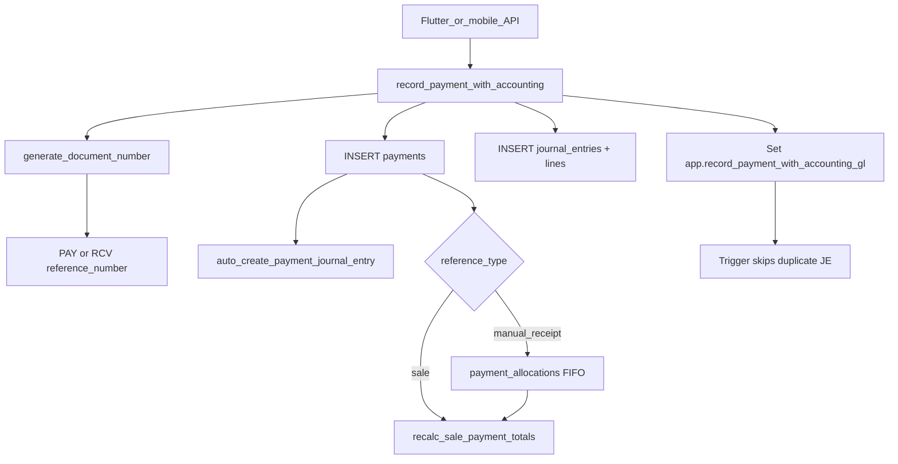

# 03 — Database Schema and RPCs

Canonical SQL: [`migrations/`](../../migrations/) (~450 files). **Newest migration wins** for duplicate function/policy names. Verify VPS apply order before Phase 3.

## Core tables (mobile ERP)

| Domain | Table(s) | Key columns | Mobile API |
|--------|----------|-------------|------------|
| Org | `companies`, `branches`, `users`, `user_branches` | `company_id`, branch assignment | `auth.ts`, `branches.ts`, `permissions.ts` |
| Permissions | `role_permissions` | `(role, module, action, allowed)` | `permissions.ts` |
| Module toggles | `modules_config` | `(company_id, module_name, is_enabled)` | `settings.ts` |
| Settings KV | `settings` | `company_id`, `key`, `value` | `settings.ts` |
| Sales | `sales` | `status`, `invoice_no`, `branch_id`, `created_by`, `customer_id`, `paid_amount`, `due_amount`, `studio_charges` | `sales.ts` |
| Sale lines | `sales_items` (preferred), `sale_items` (legacy fallback) | `sale_id`, `product_id`, `variation_id` | `sales.ts` inserts both paths |
| Returns | `sale_returns`, `sale_return_items` | `original_sale_id`, `status` | `sales.ts` → `finalize_sale_return` |
| Payments | `payments` | `payment_type`, `reference_type`, `reference_id`, `reference_number`, `voided_at` | `accounts.ts`, `sales.ts` |
| Allocations | `payment_allocations` | manual receipt → sales FIFO | migrations `20260356_*` |
| Contacts | `contacts` | `type`, `created_by`, `is_default`, `is_system_generated` | `contacts.ts` |
| Products | `products`, `product_variations`, `product_categories` | barcode, SKU, pricing | `products.ts` |
| Inventory | `stock_movements`, `inventory_balance` | `branch_id`, `reference_type` | `inventory.ts` |
| GL | `accounts`, `journal_entries`, `journal_entry_lines` | party sub-accounts under AR/AP | `accounts.ts` |
| Purchases | `purchases`, `purchase_items` | same pattern as sales | `purchases.ts` |
| Expenses | `expenses` | branch-scoped | `expenses.ts` |
| Rentals | `rentals`, `rental_items`, `rental_payments` | booking lifecycle | `rentals.ts` |
| Studio | `studio_productions`, `studio_orders`, stage tables | linked to `sales` | `studio.ts` |
| Numbering | `erp_document_sequences` | per company/branch/type/year | `documentNumber.ts` |

## RPC catalog (from mobile `api/*.ts`)

### Numbering

| RPC | File | Purpose |
|-----|------|---------|
| `generate_document_number` | `documentNumber.ts`, `sales.ts` | Atomic SL/PAY/RCV/etc. |
| `get_next_document_number_global` | `documentNumber.ts` | **Legacy — avoid for new posting** |
| `create_sale_document_header` | `sales.ts` | Sale header + number in one txn |

Prefixes (from `erp_numbering_engine.sql`): SALE→SL, PURCHASE→PUR, PAYMENT→PAY, CUSTOMER_RECEIPT→RCV, EXPENSE→EXP.

### Sales / stock / GL

| RPC | File | Purpose |
|-----|------|---------|
| `ensure_sale_stock_movements` | `sales.ts` | Idempotent sale OUT movements |
| `record_sale_with_accounting` | `sales.ts`, `studioFinalizeAfterInvoice.ts` | Sale document JE |
| `update_sale_with_items` | `sales.ts` | Replace lines; stock only when final |
| `cancel_sale_full_void` | `sales.ts` | Void sale + stock + JE |
| `finalize_sale_return` | `sales.ts` | Return finalize |
| `get_sale_studio_charges_batch` | `sales.ts` | Studio charge batch |
| `get_sale_studio_summary` | `sales.ts` | Studio summary |
| `log_share`, `log_print` | `sales.ts` | Activity audit |

**There is no `finalize_sale` RPC.** Finalization = `status = 'final'` + stock + accounting RPCs.

### Payments

| RPC | File | Purpose |
|-----|------|---------|
| `record_payment_with_accounting` | `sales.ts`, `accounts.ts`, `rentals.ts` | Canonical payment + JE + doc update |
| Trigger guard | DB | `app.record_payment_with_accounting_gl=1` skips duplicate JE from trigger |

Incoming receipts: `payment_type = 'received'` → **RCV-** (`CUSTOMER_RECEIPT`). Outgoing: **PAY-**.

### Purchases

| RPC | File | Purpose |
|-----|------|---------|
| `create_purchase_document_header` | `purchases.ts` | PUR header + number |
| `record_purchase_with_accounting` | `purchases.ts` | Purchase GL post |
| `update_purchase_with_items` | `purchases.ts` | Line replace |
| `cancel_purchase_full_void` | `purchases.ts` | Full void |

### Expenses

| RPC | File | Purpose |
|-----|------|---------|
| `create_expense_document` | `expenses.ts` | EXP number + row |
| `record_expense_with_accounting` | `expenses.ts` | Expense GL post |
| `extra_service_clearing_lines` | `expenses.ts` | Extra service GL lines |

### Rentals

| RPC | File | Purpose |
|-----|------|---------|
| `create_rental_booking` | `rentals.ts` | New booking |
| `record_rental_expense_devaluation_journal` | `rentalBookingAccounting.ts` | Devaluation JE |

### Studio

| RPC | File | Purpose |
|-----|------|---------|
| `rpc_assign_worker_to_stage` | `studio.ts` | Assign worker |
| `rpc_send_to_worker` | `studio.ts` | Send work out |
| `rpc_receive_work` | `studio.ts` | Receive from worker |
| `rpc_receive_stage_and_finalize` | `studio.ts` | Stage finalize |
| `rpc_confirm_stage_payment` | `studio.ts` | Stage payment |
| `rpc_complete_stage` | `studio.ts` | Complete stage |
| `rpc_reopen_stage` | `studio.ts` | Reopen |
| `rpc_append_receive_notes_fragment` | `studio.ts` | Notes |
| `get_studio_stages_for_sale` | `studio.ts` | Stage list |
| `complete_bespoke_work_order` | `bespokeWorkOrders.ts` | Bespoke completion |

### Contacts / ledger

| RPC | File | Purpose |
|-----|------|---------|
| `get_contact_party_gl_balances` | `contactBalancesRpc.ts` | Party GL balances |
| `get_contact_balances_summary` | `contactBalancesRpc.ts` | Summary balances |
| `ensure_party_subledgers_for_contact` | `partySubledger.ts` | AR/AP sub-account setup |
| `get_customer_ar_gl_ledger_for_contact` | `partyGlLedger.ts` | Customer GL ledger |
| `get_supplier_ap_gl_ledger_for_contact` | `partyGlLedger.ts` | Supplier GL ledger |
| `get_customer_ledger_sales` | `customerLedger.ts` | Customer ledger sales slice |
| `approve_public_contact_lead` | `contacts.ts` | Lead approval |

### Branch / user / business

| RPC | File | Purpose |
|-----|------|---------|
| `get_effective_user_branch` | `permissions.ts` | Branch resolution |
| `set_user_branches` | `employees.ts` | Assign branches |
| `create_business_transaction` | `business.ts` | New company bootstrap |

### Dashboard / settings

| RPC | File | Purpose |
|-----|------|---------|
| `get_dashboard_metrics` | `dashboardMetrics.ts` | Dashboard snapshot |
| `get_financial_dashboard_metrics` | `financialDashboard.ts` | Financial metrics |
| `get_company_negative_stock_allowed` | `settings.ts` | Negative stock flag |

### Shipment / logistics

| RPC | File | Purpose |
|-----|------|---------|
| `post_sale_shipment_journal` | `shipmentAccounting.ts` | Shipment JE |

## Sale finalize flow (mobile)

From [`erp-mobile-app/src/api/sales.ts`](../../erp-mobile-app/src/api/sales.ts) when `targetStatus === 'final'` (`postStockAndAccounting`):

1. Insert/update `sales` row with `status = 'final'`
2. Insert `sales_items` (fallback `sale_items`)
3. Persist sale charges / extra expenses if present
4. **`ensure_sale_stock_movements`** (skip for studio-only paths where applicable)
5. **`record_sale_with_accounting`**
6. If `paidAmount > 0`: **`record_payment_with_accounting`** via `recordSalePayment()`
7. If studio sale: create studio production records

Draft/quotation/order: stock and GL deferred until final.

## Payment reference flow



Common `reference_type` values: `sale`, `purchase`, `rental`, `expense`, `manual_receipt`, `on_account`, `worker_payment`.

Paid/due on sales:

```
grand = total + studio_charges
paid  = sale-linked payments + manual_receipt allocations
due   = grand - paid (returns subtracted per recalc RPC)
```

## Branch / company scoping

- **Company:** `company_id = get_user_company_id()` in RLS (almost all operational tables).
- **Branch:** `sales.branch_id`, `payments.branch_id`, `stock_movements.branch_id`, `journal_entries.branch_id`.
- **Assignment:** `user_branches(user_id, branch_id)`; RPC `get_effective_user_branch`.
- **Single-branch companies:** auto-pick lone branch when no `user_branches` rows.
- **Numbering:** `erp_document_sequences.branch_id` = real branch UUID or global sentinel UUID.

## Tables / RPCs needing verification on live DB

| Item | Why |
|------|-----|
| `record_payment_with_accounting` body | Multiple migrations through `20260609120000_*` |
| `record_sale_with_accounting` body | Through `20260602170000_*` |
| `get_next_document_number_global` | Legacy; mobile still calls in `documentNumber.ts` — Flutter should prefer `generate_document_number` |
| Coexisting salesman RLS policies | `fix_sales_rls_salesman_own_only.sql` vs `module_visibility_scope_rls.sql` |
| `sales_items` vs `sale_items` | Mobile inserts `sales_items` first, falls back to `sale_items` |

## Web canonical services (cross-reference)

Flutter agents should read web equivalents for edge cases:

- [`src/app/services/recordPaymentWithAccountingRpc.ts`](../../src/app/services/recordPaymentWithAccountingRpc.ts)
- [`src/app/services/documentNumberService.ts`](../../src/app/services/documentNumberService.ts)
- [`src/app/services/saleService.ts`](../../src/app/services/saleService.ts)
