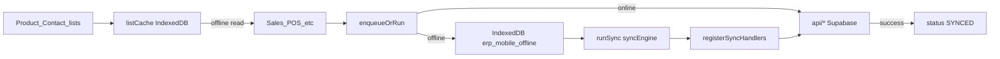

# 05 — Offline and Sync Rules

Current Capacitor app uses **queue + read-through cache**, not full offline-first ERP. Flutter should preserve the same **safety rules** while upgrading storage to Drift/SQLite.

## Current architecture (Capacitor)



### Mutation queue

| Property | Value |
|----------|-------|
| DB name | `erp_mobile_offline` |
| Store | `pending` |
| File | [`erp-mobile-app/src/lib/offlineStore.ts`](../../erp-mobile-app/src/lib/offlineStore.ts) |

**Pending types:** `sale`, `payment`, `expense`, `journal_entry`, `purchase`

**Status lifecycle:** `PENDING` → `SYNCING` → `SYNCED` | `ERROR`

- Legacy rows use `is_synced` + `sync_error` (migrated on read)
- Stale `SYNCING` recovered to `PENDING` on open

**Fields:** `id`, `type`, `payload`, `company_id`, `branch_id`, `created_at`, `server_id?`, `sync_error?`

### Enqueue vs run

[`offlineWrite.ts`](../../erp-mobile-app/src/lib/offlineWrite.ts):

```typescript
enqueueOrRun({ type, payload, companyId, branchId, onlineTask })
// offline → addPending(); online → await onlineTask()
```

Offline detection: `navigator.onLine` via [`listCache.ts`](../../erp-mobile-app/src/lib/listCache.ts) `isBrowserOffline()` and [`networkBridge.ts`](../../erp-mobile-app/src/lib/networkBridge.ts) (Capacitor Network plugin).

### Sync engine

| File | Role |
|------|------|
| [`syncEngine.ts`](../../erp-mobile-app/src/lib/syncEngine.ts) | `runSync()`, `getUnsyncedCount()` |
| [`registerSyncHandlers.ts`](../../erp-mobile-app/src/lib/registerSyncHandlers.ts) | Maps types to API calls |
| [`syncPurchase.ts`](../../erp-mobile-app/src/lib/syncPurchase.ts) | Purchase create/cancel payloads |

On success, `App.tsx` dispatches `erp-mobile:autosync-complete` for list cache refresh.

**Purchase payload discriminant:** `action: 'create' | 'cancel'` in [`offlineStore.ts`](../../erp-mobile-app/src/lib/offlineStore.ts).

### Read-through list cache

| Property | Value |
|----------|-------|
| DB name | `erp_mobile_list_cache` |
| File | [`listCache.ts`](../../erp-mobile-app/src/lib/listCache.ts) |

**Cache key patterns:**

| Key helper | Pattern |
|------------|---------|
| `paymentAccounts(companyId)` | `pa:{companyId}` |
| `branches(companyId)` | `br:{companyId}` |
| `products(companyId)` | `pr:{companyId}` |
| `contacts(company, type, branchId)` | `ct:{company}:{type}:{branch}` |
| `sales(company, branch, rangeKey)` | `sl:{company}:{branch}:{range}` |
| `purchases(...)` | `pu:...` |
| `expenses(...)` | `ex:...` |
| `studio(...)` | `st:...` |
| `workers(companyId)` | `wk:{companyId}` |
| `ledger(...)` | `lg:...` |

Populated on successful online API calls; served when offline. **Does not cache mutations.**

### Server-side sync metadata

[`api/settings.ts`](../../erp-mobile-app/src/api/settings.ts) stores `mobile_sync_status` in `settings` table (category `mobile`) — last sync time and counts for cross-session display.

### PWA service worker

[`public/sw.js`](../../erp-mobile-app/public/sw.js) caches app shell only. **Disabled on native** in [`main.tsx`](../../erp-mobile-app/src/main.tsx).

## Safety rules (must not violate)

1. **Server generates final document numbers** — never allocate SL/PAY/RCV locally for synced records
2. **Draft/offline entries must not affect stock or GL** until server RPCs succeed (`ensure_sale_stock_movements`, `record_*_with_accounting`)
3. **No duplicate sales/payments/journal entries** on queue replay
4. **Idempotent server RPCs** where available (`ensure_sale_stock_movements` is idempotent)
5. **On sync failure** — keep row in `ERROR` with `sync_error`; user retries via SyncStatusBar
6. **Conflict policy** — server wins; client shows error, does not silently merge totals
7. **Company switch** — [`sessionIsolation.ts`](../../erp-mobile-app/src/lib/sessionIsolation.ts) resets local data plane

## Flutter target design

| Concept | Capacitor today | Flutter target |
|---------|-----------------|----------------|
| Read cache | IndexedDB `erp_mobile_list_cache` | Drift table `list_cache` with TTL |
| Write queue | IndexedDB `erp_mobile_offline` | Drift table `outbox` |
| Idempotency | `server_id` after sync | Add **`idempotency_key`** (UUID per outbox row) sent to server where RPC supports it; else dedupe by payload hash + created_at window |
| Sync lifecycle | PENDING→SYNCING→SYNCED/ERROR | Same + background worker (`workmanager` optional) |
| Stale SYNCING | Reset to PENDING on app start | Same on `AppDatabase` open |
| Connectivity | `connectivity_plus` equivalent | `connectivity_plus` + manual sync button |
| Secure tokens | Supabase session + optional PIN vault | `supabase_flutter` + `flutter_secure_storage` |

### Proposed Drift schema (outline)

```sql
-- outbox
id TEXT PRIMARY KEY
idempotency_key TEXT UNIQUE
type TEXT  -- sale|payment|expense|journal_entry|purchase
payload_json TEXT
company_id TEXT
branch_id TEXT
status TEXT  -- PENDING|SYNCING|SYNCED|ERROR
server_id TEXT
sync_error TEXT
created_at INTEGER

-- list_cache
key TEXT PRIMARY KEY
json TEXT
updated_at INTEGER
```

### Sync worker behavior

1. On connectivity restored → `runSync()` (mirror [`syncEngine.ts`](../../erp-mobile-app/src/lib/syncEngine.ts))
2. Process **one row at a time** per type to reduce race on numbering
3. On success: mark SYNCED, store `server_id`, invalidate relevant list cache keys
4. On RPC error: mark ERROR, surface in UI banner
5. **Never** auto-delete ERROR rows without user acknowledgment

### Payload parity

Flutter outbox payloads must match shapes in [`registerSyncHandlers.ts`](../../erp-mobile-app/src/lib/registerSyncHandlers.ts) for:

- `sale` → `salesApi.createSale({ ... })`
- `payment` → accounts API
- `expense` → expenses API
- `journal_entry` → accounts API
- `purchase` → `syncPurchasePending`

## Realtime (online complement)

[`realtimeSubscriptions.ts`](../../erp-mobile-app/src/lib/realtimeSubscriptions.ts) — `postgres_changes` with polling fallback. Flutter: Supabase realtime channels for list invalidation (Phase 5+).

## What offline does NOT do today

- No offline read of arbitrary sales ledger history (only cached list slices)
- No offline product search beyond cached product list
- No offline accounting report generation
- Studio pipeline mutations require online (no queue handlers for studio RPCs)

Flutter should document same boundaries until Phase 5 expands scope.
