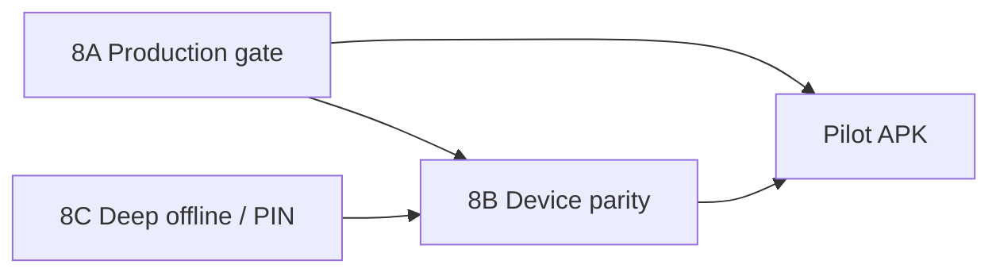

# 12 — Office remaining phase (handoff)

**Purpose:** Office par **next kaam** yahan se start karo. Code phases 0–7 **pilot scope** mein complete ho chuke hain; ab **production gate + optional hardening** baki hai.

**App:** [`erp-flutter-app/`](../../erp-flutter-app/)  
**Current version:** `1.0.4+5` (`pubspec.yaml`)  
**Backend (locked):** `https://erp.dincouture.pk`  
**Git:** `main` only — pehle `git pull origin main` ([`GIT_WORKFLOW_RULES.txt`](../../GIT_WORKFLOW_RULES.txt))

---

## Kya complete ho chuka hai (dobara na likho)

| Area | Status |
|------|--------|
| Auth, branch, permissions, home | Done |
| Contacts / products CRUD | Done |
| Sales, POS, purchases, expenses writes | Done |
| Rentals (create, pay, pickup, return) | Done |
| Studio (stages + invoice line + finalize attempt) | Done |
| Offline queue + contacts/products cache | Done |
| Share text/PDF, print **preview** (`printing` package) | Done |
| Release scripts (`build-release-apk.sh`, env from `.env.local`) | Done |

Detail: [`FLUTTER_MIGRATION_STATUS.md`](FLUTTER_MIGRATION_STATUS.md), [`PHASE_MIGRATION_COMPLETE.md`](PHASE_MIGRATION_COMPLETE.md)

---

## Ab baki — Phase 8 (office work)

Phase 8 = **teen tracks**. Track A **mandatory** production se pehle; B/C optional / later sprint.



### 8A — Production gate (MANDATORY — pehle yeh)

**Goal:** Test company par money flows verify + signed APK + sign-off.

| Step | Action | Doc / file |
|------|--------|------------|
| 1 | Machine par latest code | `git pull origin main` |
| 2 | Env smoke | `cd erp-flutter-app && ./scripts/smoke-api-check.sh` |
| 3 | Static check | `flutter analyze` |
| 4 | **QA checklist** (staging / test company — production data mat use karo) | [`08_TESTING_QA_CHECKLIST.md`](08_TESTING_QA_CHECKLIST.md) |
| 5 | Results likho | [`QA_SESSION_LOG.md`](QA_SESSION_LOG.md) |
| 6 | Capacitor se compare (same user/branch) | [`10_PRODUCTION_RELEASE_CHECKLIST.md`](10_PRODUCTION_RELEASE_CHECKLIST.md) |
| 7 | Release signing setup | `android/key.properties.example` → `android/key.properties` + keystore (gitignore) |
| 8 | Release APK build | `./scripts/build-release-apk.sh` |
| 9 | APK device par install + smoke login | Sunmi + generic phone |
| 10 | **Sign-off** QA log mein | Approver name/date |

**Env files (build script auto-pick):**

1. repo `.env.production`
2. repo `.env.local`
3. `erp-mobile-app/.env.production`

Key field: `VITE_SUPABASE_ANON_KEY` — production Kong JWT (~176 chars), demo key nahi. See [`MOBILE_APK_LOCKED_PATTERN.md`](../../docs/infra/MOBILE_APK_LOCKED_PATTERN.md).

**Acceptance (8A complete when):**

- [ ] `QA_SESSION_LOG.md` filled — money scenarios pass on **test** company
- [ ] Capacitor parity table documented (product count, one AR balance, sale paid/due)
- [ ] Signed APK in `erp-flutter-app/releases/`
- [ ] Explicit sign-off for pilot distribution

**Do NOT (without approval):**

- Production company par destructive tests
- `migrations/` ya VPS deploy changes
- Force push / branch switch

---

### 8B — Device parity (OPTIONAL — Sunmi shop devices)

**Goal:** Capacitor jaisa thermal print + barcode reliability on real hardware.

Flutter abhi: PDF **preview/print dialog** + `share_plus`. **Native Sunmi AIDL / Bluetooth ESC/POS nahi.**

| Task | Reference | Acceptance |
|------|-----------|------------|
| Port `ErpPrinterPlugin` ya Flutter platform channel | [`06_PRINTING_BARCODE_DEVICE_RULES.md`](06_PRINTING_BARCODE_DEVICE_RULES.md), `erp-mobile-app/android/.../ErpPrinterPlugin.java` | Sunmi V2 receipt prints after POS sale |
| Auto-print after POS (settings `mobile_printer`) | `erp-mobile-app/src/api/printingSettings.ts` | Matches Capacitor behavior when enabled |
| Barcode regression on Sunmi camera | POS screen | SKU lookup works |

**Risk:** Medium — device-specific; test on shop Sunmi before prod rollout.

---

### 8C — Deep offline + counter PIN (OPTIONAL — later sprint)

**Goal:** Full offline-first ya shared tablet PIN mode.

| Task | Reference | Notes |
|------|-----------|-------|
| Drift/SQLite outbox (replace SharedPreferences queue) | [`05_OFFLINE_SYNC_RULES.md`](05_OFFLINE_SYNC_RULES.md) | High risk — numbering/idempotency |
| Offline types: `payment`, `journal_entry` | Capacitor `offlineStore.ts` | Sync handlers needed |
| Counter/PIN enroll + worker switch | `erp-mobile-app/src/lib/counterWorkerRegistry.ts` | Flutter Settings abhi Capacitor ko point karta hai |
| Studio worker ledger backfill (GL parity) | `studioFinalizeAfterInvoice.ts` | Money-sensitive — staging only |

**Acceptance:** Only after 8A sign-off; separate PR + QA pass.

---

## Office day 1 — copy-paste commands

```bash
# Repo root
git checkout main
git pull origin main

cd erp-flutter-app
./scripts/smoke-api-check.sh
flutter analyze

# Dev run (key from .env.local)
source ../erp-flutter-app/scripts/lib/env-resolve.sh
resolve_flutter_env_file "$(cd .. && pwd)" && read_flutter_anon_key "$FLUTTER_ENV_FILE"
flutter run --dart-define=SUPABASE_ANON_KEY="$FLUTTER_ANON_KEY"

# Release (after key.properties for signing)
./scripts/build-release-apk.sh
# APK: build/app/outputs/flutter-apk/app-release.apk
# Copy: releases/erp-flutter-*.apk
```

---

## QA priority order (test company)

1. Login admin + salesman + branch picker  
2. Draft sale → finalize → receive payment  
3. POS + barcode one product  
4. Purchase draft → finalize → supplier payment  
5. Expense create  
6. Rental: create → pay → pickup → return (due zero)  
7. Studio: assign → send → receive → confirm cost → complete → invoice line  
8. Offline: draft sale offline → reconnect sync  
9. Side-by-side: product count + one contact AR vs Capacitor app  

Full list: [`08_TESTING_QA_CHECKLIST.md`](08_TESTING_QA_CHECKLIST.md)

---

## Known gaps (documented — not Phase 8A blockers)

| Gap | Workaround |
|-----|------------|
| No native Sunmi thermal | PDF share/print preview; Capacitor APK for print-heavy counters |
| No counter PIN on Flutter | Capacitor on shared tablets |
| No manual journal create on mobile | Web ERP |
| Studio GL edge cases | Web Final Complete if Flutter finalize error |

---

## Agent / dev prompt (office Cursor session)

Copy into new agent:

```
Read docs/flutter-migration/12_OFFICE_REMAINING_PHASE.md first.
We are on Phase 8A (production gate). Do NOT change migrations/ or deploy/.
Run QA on TEST company only. Complete QA_SESSION_LOG.md checklist items that fail.
If implementing 8B thermal print, follow 06_PRINTING_BARCODE_DEVICE_RULES.md.
App path: erp-flutter-app/. Backend locked: https://erp.dincouture.pk
```

---

## Related docs index

| Doc | Use |
|-----|-----|
| [`00_MASTER_CONTEXT.md`](00_MASTER_CONTEXT.md) | ERP scope |
| [`03_DATABASE_SCHEMA_AND_RPCS.md`](03_DATABASE_SCHEMA_AND_RPCS.md) | RPC names |
| [`04_PERMISSIONS_RLS_RULES.md`](04_PERMISSIONS_RLS_RULES.md) | Permission codes |
| [`PHASE_7_RELEASE_PREP.md`](PHASE_7_RELEASE_PREP.md) | Signing + scripts |
| [`11_AGENT_NEXT_STEPS.md`](11_AGENT_NEXT_STEPS.md) | Historical Phase 1 prompt |

---

**Last updated:** Phase 8 office handoff — after code completion `1.0.4+5`
