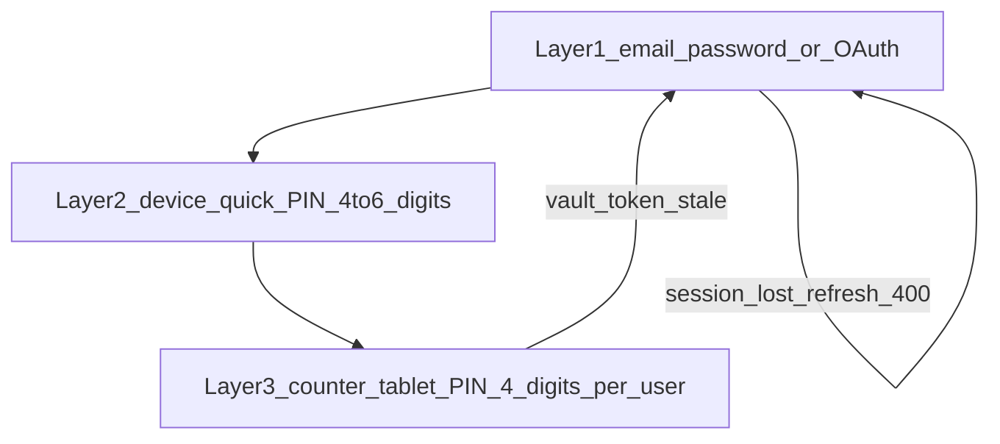
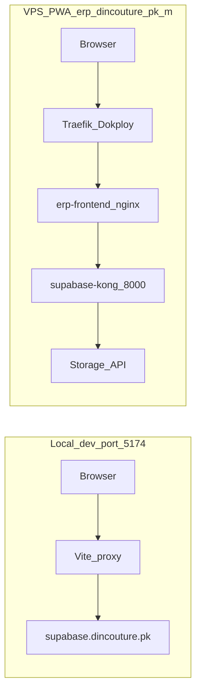

# Attachments + Counter Session Incident — Handoff Document

**Date:** 2026-05-24  
**Environment:** VPS PWA at `https://erp.dincouture.pk/m/` (no APK in scope unless user explicitly requests)  
**Latest user log:** `erp.dincouture.pk-1779624488608.log`  
**Deployed PWA bundle (post-fix deploy):** `index-DJRZFAe5.js` (commit `be1d099`)

> **How to use this doc:** Share this file **plus** the latest browser console log (and HAR if possible) with a new agent. It captures everything attempted today so analysis can continue without re-discovering context.

---

## 1. Executive summary

### Urdu (صارف کے الفاظ)

- **Attachments:** Compression UI چلتی ہے، payment save ہو جاتا ہے، لیکن VPS PWA پر attachment upload **اب بھی fail** ہو رہا ہے (log: `timed out after 60s`).
- **Counter / double login:** Tablet پر counter PIN کے بعد یا session restore پر دوبارہ **email login** مانگتا ہے — log میں `refresh_token` **400 Bad Request** آ رہا ہے۔
- **Local (`localhost:5174`)** پر یہ کام ہوتا ہے؛ **VPS PWA** پر نہیں — کیونکہ local اور production میں Supabase تک **الگ network path** ہے (نیچے architecture دیکھیں).

### English (technical)

| Symptom | Status after today's fixes | Evidence |
|---------|---------------------------|----------|
| Payment attachment upload on VPS PWA | **Still failing** | Log L241: `[uploadPaymentAttachments] ... timed out after 60s` |
| Counter tablet "double login" | **Still failing** | Log L246–353: `POST .../auth/v1/token?grant_type=refresh_token` → **400** |
| Product image thumbnails 404 | **Separate issue** (display/sign, not upload) | Log L17, L129: `POST .../object/sign/product-images/...` → **404** |
| "signal is aborted without reason" on counter PIN | **Possibly improved** (mutex deployed) | Not present in latest log; 400 refresh is the dominant auth error now |
| Local dev attachments | **Works** | Vite proxies `/storage` directly to `supabase.dincouture.pk` |

**Bottom line for next agent:** Client-side compression, 60s timeout, nginx storage hardening, and auth refresh mutex were deployed but **did not resolve** VPS upload timeout or refresh-token 400. Root cause is likely **infrastructure path** (Traefik/Kong/storage upstream) and/or **GoTrue refresh token rotation desync** with counter vault — not merely missing UI error messages.

---

## 2. Three-layer login model ("double login" explained)

Users on a counter tablet may see up to **three** distinct auth steps. Confusion often comes from hitting layer 1 again after layer 3 fails.



| Layer | What user sees | Code entry | Token stored |
|-------|----------------|------------|--------------|
| **1 — Email/password** | Login form | [`erp-mobile-app/src/components/LoginScreen.tsx`](../../erp-mobile-app/src/components/LoginScreen.tsx) | Supabase session in browser storage |
| **2 — Device quick PIN** | 4–6 digit PIN after email login | Same `LoginScreen` with `pinUnlockUser` prop | [`erp-mobile-app/src/lib/secureStorage.ts`](../../erp-mobile-app/src/lib/secureStorage.ts) encrypted vault |
| **3 — Counter tablet PIN** | "Who is using this counter?" + 4-digit PIN per user | [`erp-mobile-app/src/components/auth/POSLockScreen.tsx`](../../erp-mobile-app/src/components/auth/POSLockScreen.tsx) | [`erp-mobile-app/src/lib/counterUserVault.ts`](../../erp-mobile-app/src/lib/counterUserVault.ts) per-user vault row (refresh token each) |

**App routing** ([`erp-mobile-app/src/App.tsx`](../../erp-mobile-app/src/App.tsx)):

- `isCounterLocked && user` → `POSLockScreen` (~line 796)
- `isPinLocked && user` → `LoginScreen` with `pinUnlockUser` (~line 831)
- `!user` → full email login (~line 820)

**"Double login" in user reports** most likely means:

1. GoTrue rejects stored refresh token (**400** in network tab)
2. App clears or loses session → user must **email login again** (layer 1)
3. After email login, counter lock screen appears again (layer 3)

This is **not** (primarily) duplicate UI buttons — duplicate "Use email/password instead" on counter screen was removed in commit `876b805`.

**Counter lock triggers:** On tab visibility return, if `shouldRelock()` and counter mode enabled → `setIsCounterLocked(true)` ([`App.tsx`](../../erp-mobile-app/src/App.tsx) ~321–347). Also calls `maintainCounterVaultTokens()` on visibility, which can trigger refresh while user is unlocking.

---

## 3. Architecture — why local works but VPS PWA does not

### Attachment upload paths



| Setting | Local dev | VPS PWA |
|---------|-----------|---------|
| Supabase client URL | `window.location.origin` (localhost) | `https://erp.dincouture.pk` (same-origin) |
| `/storage` route | Vite → **direct** `https://supabase.dincouture.pk` | nginx `/storage/` → Kong → Storage |
| Config files | [`erp-mobile-app/vite.config.ts`](../../erp-mobile-app/vite.config.ts) L87–90 | [`erp-mobile-app/src/lib/supabase.ts`](../../erp-mobile-app/src/lib/supabase.ts) L51–54, [`deploy/nginx.conf`](../../deploy/nginx.conf) |

**Critical implication:** Fixes tested only on `npm run dev` **never exercise** the erp nginx `/storage/` proxy hop. Production-only failures are expected until that path is validated end-to-end.

### Auth / refresh paths

Both local (via Vite proxy) and PWA use same-origin `/auth/v1/` on the browser side, but PWA hits `erp.dincouture.pk/auth/` → nginx → Kong → GoTrue. Refresh token rotation + counter vault sync must stay consistent across all enrolled users on a shared tablet.

---

## 4. Chronological timeline — commits (2026-05-24 session)

| Commit | Message (short) | What it tried to fix |
|--------|-----------------|----------------------|
| `876b805` | attachment 45s timeout + duplicate login button | Hung uploads; remove confusing duplicate email button on login |
| `df62486` | canvas compression + 60s timeout + supplier warning | Smaller files before upload; surface partial upload failures |
| `be1d099` | nginx storage hardening + auth mutex + upload errors + counter PIN flow | VPS proxy reliability; abort race on PIN unlock; specific error toasts |

**Earlier related commits (context):**

| Commit | Relevance |
|--------|-----------|
| `fd700e7` | Break refresh-token loop; cache signed URLs; JPEG for PDF previews |
| `eeb32fa` | Stale Supabase refresh token recovery on iOS launch |
| `621c8ea` / APK builds | Native APK — **out of scope** unless user requests |

---

## 5. VPS infrastructure changes (applied & verified)

### 5.1 GoTrue refresh token reuse interval

- **Variable:** `GOTRUE_SECURITY_REFRESH_TOKEN_REUSE_INTERVAL=2592000` (30 days)
- **Location:** `/root/supabase/docker/.env` **and** must be in auth **container** env (docker-compose wiring — `.env` alone is insufficient)
- **Purpose:** Reduce "already used" refresh failures when counter vault holds slightly stale token during rotation
- **Verify:**
  ```bash
  ssh dincouture-vps "docker exec \$(docker ps --filter name=auth --format '{{.Names}}' | head -1) printenv GOTRUE_SECURITY_REFRESH_TOKEN_REUSE_INTERVAL"
  ```

### 5.2 nginx `/storage/` block (erp-frontend container)

Deployed in `be1d099`. Running container should show:

```nginx
location /storage/ {
    proxy_buffering off;
    proxy_request_buffering off;
    proxy_read_timeout 300s;
    proxy_send_timeout 300s;
    client_body_buffer_size 128k;
    proxy_set_header Authorization $http_authorization;
    # ... proxy_pass to supabase-kong:8000 ...
}
```

**Verify:**
```bash
ssh dincouture-vps "docker exec erp-frontend grep -A18 'location /storage/' /etc/nginx/conf.d/default.conf"
```

**Note:** Client timeout is still **60s** ([`uploadWithTimeout.ts`](../../erp-mobile-app/src/utils/uploadWithTimeout.ts)). nginx 300s helps only if nginx was the bottleneck — user log shows client gave up at 60s first.

### 5.3 Storage RLS + buckets

Applied on every deploy via [`deploy/deploy.sh`](../../deploy/deploy.sh) `apply_rls()`:

- Bucket `payment-attachments` exists
- 5 policies: `payment_attachments_insert/select/update` + journal variants
- Similar buckets: `sale-attachments`, `purchase-attachments`, `expense-receipts`, `product-images`

**Verify:**
```bash
ssh dincouture-vps "cd /root/NEWPOSV3 && bash deploy/diagnose-storage-upload-vps.sh"
```

### 5.4 Deploy friction (Dokploy)

`deploy/deploy.sh` often fails at final step:

```
Error: container name "/erp-frontend" is already in use
```

**Manual workaround (used successfully 2026-05-24):**
```bash
ssh dincouture-vps "docker rm -f erp-frontend; cd /root/NEWPOSV3; docker compose -f deploy/docker-compose.prod.yml --env-file .env.production up -d --force-recreate erp; docker network connect dokploy-network erp-frontend 2>/dev/null || true"
```

### 5.5 Kong / storage DNS warning (from diagnosis)

On direct `OPTIONS https://supabase.dincouture.pk/storage/v1/`:

```
DNS resolution failed: storage ... empty record received → 503
```

erp nginx proxies to `supabase-kong:8000` by Docker network name (not hostname `storage`), so PWA path may still work while **direct** supabase host storage health check fails. Worth investigating Supabase docker compose service naming/DNS.

---

## 6. Client code changes (file-by-file)

### 6.1 Counter session / PIN

| File | Change |
|------|--------|
| [`erp-mobile-app/src/lib/authRefreshMutex.ts`](../../erp-mobile-app/src/lib/authRefreshMutex.ts) | **New.** Single-flight mutex around `refreshSession`; retry once on abort |
| [`erp-mobile-app/src/api/auth.ts`](../../erp-mobile-app/src/api/auth.ts) | `refreshSessionFromRefreshToken`, `refreshPersistedSessionIfPossible` use mutex + abort retry |
| [`erp-mobile-app/src/lib/counterPinUnlock.ts`](../../erp-mobile-app/src/lib/counterPinUnlock.ts) | Removed `maintainCounterVaultTokens` from failure retry chain; fast path via `getSession()` not `getSessionWithRefresh` |
| [`erp-mobile-app/src/components/auth/POSLockScreen.tsx`](../../erp-mobile-app/src/components/auth/POSLockScreen.tsx) | Removed `maintainCounterVaultTokens()` from submit (still on mount) |
| [`erp-mobile-app/src/lib/counterUserVault.ts`](../../erp-mobile-app/src/lib/counterUserVault.ts) | `formatCounterPinAuthError`: abort → "Sign-in was interrupted. Tap Unlock again." |
| [`erp-mobile-app/src/lib/counterVaultMaintenance.ts`](../../erp-mobile-app/src/lib/counterVaultMaintenance.ts) | Background sync every 20 min + on visibility (still active — can race with PIN unlock) |
| [`erp-mobile-app/src/lib/authSessionRecovery.ts`](../../erp-mobile-app/src/lib/authSessionRecovery.ts) | Stale token detection; `recoverStaleAuthSession` on repeated failures |

**Gap:** Mutex does **not** wrap Supabase client's internal `autoRefreshToken` / `_refreshAccessToken` (see log stack trace L268+). Internal GoTrue client refresh can still run concurrently with explicit vault refresh.

### 6.2 Attachments — upload

| File | Change |
|------|--------|
| [`erp-mobile-app/src/utils/imageCompression.ts`](../../erp-mobile-app/src/utils/imageCompression.ts) | Canvas compress ~500KB target, max 1920px, JPEG quality loop |
| [`erp-mobile-app/src/utils/uploadWithTimeout.ts`](../../erp-mobile-app/src/utils/uploadWithTimeout.ts) | `UPLOAD_TIMEOUT_MS = 60_000` |
| [`erp-mobile-app/src/utils/storageUploadErrors.ts`](../../erp-mobile-app/src/utils/storageUploadErrors.ts) | **New.** Classify RLS / timeout / auth / size / bucket errors |
| [`erp-mobile-app/src/api/paymentAttachments.ts`](../../erp-mobile-app/src/api/paymentAttachments.ts) | Returns `{ results, failures }`; logs failures |
| [`erp-mobile-app/src/components/shared/MobilePaymentSheet.tsx`](../../erp-mobile-app/src/components/shared/MobilePaymentSheet.tsx) | `prepareAttachmentFilesForUpload` on file pick (compression before upload) |
| [`erp-mobile-app/src/components/shared/UnifiedPaymentSheet.tsx`](../../erp-mobile-app/src/components/shared/UnifiedPaymentSheet.tsx) | Specific `attachmentWarning` from failures |
| [`erp-mobile-app/src/components/purchase/MobilePaySupplier.tsx`](../../erp-mobile-app/src/components/purchase/MobilePaySupplier.tsx) | Same attachment warning pattern |
| [`erp-mobile-app/src/api/sales.ts`](../../erp-mobile-app/src/api/sales.ts), [`purchases.ts`](../../erp-mobile-app/src/api/purchases.ts), [`expenses.ts`](../../erp-mobile-app/src/api/expenses.ts), [`journalAttachments.ts`](../../erp-mobile-app/src/api/journalAttachments.ts) | Error classification wired |

**Web parity:** [`src/app/utils/uploadTransactionAttachments.ts`](../../src/app/utils/uploadTransactionAttachments.ts) has richer toasts (RLS apply button on localhost). Mobile now has classification but user may still only see timeout if upload hangs 60s.

### 6.3 Attachments — display (signed URLs)

| File | Change |
|------|--------|
| [`erp-mobile-app/src/utils/storageDisplayUrl.ts`](../../erp-mobile-app/src/utils/storageDisplayUrl.ts) | Module cache for signed URLs; 5 min negative TTL on 404 to reduce hammering |
| [`erp-mobile-app/src/utils/productImageUpload.ts`](../../erp-mobile-app/src/utils/productImageUpload.ts) | Product image display helper |

404 on `createSignedUrl` means **object missing in bucket** — DB row still references path. Not the same as upload failure.

### 6.4 DB migrations (URL shape backfill — not upload transport)

| Migration | Purpose |
|-----------|---------|
| [`migrations/20260530120000_backfill_attachment_urls_to_path.sql`](../../migrations/20260530120000_backfill_attachment_urls_to_path.sql) | Convert localhost/full URLs to `bucket/path` refs |
| [`migrations/20260528120000_backfill_product_image_urls_localhost.sql`](../../migrations/20260528120000_backfill_product_image_urls_localhost.sql) | Product image localhost URL cleanup |

VPS check (2026-05-24): migration applied, **0 localhost attachment rows**.

---

## 7. Latest log forensics

**Source:** `erp.dincouture.pk-1779624488608.log` (user-provided, browser console)

### 7.1 Key excerpts

**Product image sign 404 (display only):**
```
POST https://erp.dincouture.pk/storage/v1/object/sign/product-images/595c08c2-.../640dbe6a-....jpg 404 (Not Found)
POST https://erp.dincouture.pk/storage/v1/object/sign/product-images/375fa03b-.../1779463056577-in3uqac8.jpg 404 (Not Found)
```
Stack: `getStorageDisplayUrl` → `productImageUpload.ts` → `ProductImage.tsx` → `ProductsModule`

**Payment attachment upload timeout:**
```
[uploadPaymentAttachments] Upload 20251229_OHR.EtretatBeach_ROW0829020848_UHD_bing.jpg: timed out after 60s
```
Stack: `paymentAttachments.ts:72` → `MobilePaymentSheet` → payment submit flow

**Auth refresh failure (double login driver):**
```
POST https://erp.dincouture.pk/auth/v1/token?grant_type=refresh_token 400 (Bad Request)
```
(repeated twice; stack through `GoTrueClient._refreshAccessToken`, `locks.js`)

**User / account switch in same session:**
```
[BRANCH ACCESS] authUserId: f6e11a8b-5ef0-47c1-a70d-2c44fe5e8a72 ...
[BRANCH ACCESS] authUserId: c8b42699-e9c6-4ea1-8b46-5781a01518ba ...
```

### 7.2 Interpretation table

| Log | Meaning | Likely root cause |
|-----|---------|-------------------|
| product-images sign **404** | File not in storage bucket | Orphan DB paths; upload may have never succeeded historically, or wrong path persisted |
| upload **timed out after 60s** | No HTTP response within client deadline | Slow/hung POST on `erp.dincouture.pk/storage/` chain; OR file still too large; OR upstream storage service hang |
| refresh_token **400** | GoTrue rejected token | Rotation desync, revoked session, reuse window still insufficient, or concurrent refresh invalidating token |
| Two authUserIds | Session user changed mid-log | Counter PIN swap or re-login after first user's refresh failed |

### 7.3 Not observed in this log

- Storage RLS **403** (would indicate policy issue — less likely primary cause today)
- **"signal is aborted without reason"** (addressed by mutex in `be1d099`; may be fixed or masked by 400)
- Successful `POST .../object/payment-attachments/...` **200**

---

## 8. Open hypotheses for next agent (prioritized)

1. **Traefik (Dokploy) limits** — May impose body size or timeout **before** erp nginx 300s. Test: authenticated `curl -X POST` with ~200KB JPEG to `https://erp.dincouture.pk/storage/v1/object/payment-attachments/test/...` through full public URL; compare latency vs direct internal Kong.

2. **Compression ran but file still large** — Log filename contains `_UHD_` suggesting high-res source. Verify post-compression size in Network tab (request body size). Check `prepareAttachmentFilesForUpload` actually ran (toast "Compressing…" / size saved).

3. **Storage upstream hang** — Kong logs during failed upload; check `supabase-storage` container CPU/memory; Kong DNS issue for `storage` service name on direct host.

4. **Refresh token 400 + vault desync** — Compare counter vault `lastTokenSyncAt` (Settings UI) with GoTrue auth logs for `invalid_grant` / `refresh_token_not_found`. Mutex fixes abort races **not** invalid tokens. May need: single refresh owner (disable `autoRefreshToken` during counter unlock), or server-side longer reuse, or one-time full re-enrollment of all counter users after email login.

5. **Internal autoRefresh vs vault refresh race** — Log stack shows GoTrueClient internal `_refreshAccessToken` outside our mutex. Consider patching all refresh entry points or `supabase.auth.stopAutoRefresh()` during `unlockWithCounterPin`.

6. **Client 60s timeout too aggressive for VPS path** — Even with nginx 300s, if upload needs 70–90s on slow link, bump client timeout **after** proving nginx/Traefik are not the bottleneck.

---

## 9. Reproduction checklist

1. Hard refresh `https://erp.dincouture.pk/m/` — DevTools → Sources: confirm `index-DJRZFAe5.js` (or newer hash after redeploy).
2. **Email login once** with account that has counter PIN enrolled (Settings → Counter tablet PIN).
3. Hard refresh or close tab → should see counter lock (`POSLockScreen`). Enter PIN. Watch Network:
   - `POST /auth/v1/token?grant_type=refresh_token` — expect **200**, not 400.
4. Sales → Receive payment → attach **small** PNG (<200KB after compression) → save. Watch Network:
   - `POST /storage/v1/object/payment-attachments/...` — expect **200** within 60s.
5. If fail: export **HAR** + save console log; note toast message (timeout vs auth vs RLS).

---

## 10. Diagnostic commands (VPS)

```bash
# Full storage + nginx + RLS + GoTrue reuse check
ssh dincouture-vps "cd /root/NEWPOSV3 && bash deploy/diagnose-storage-upload-vps.sh"

# GoTrue session env audit
ssh dincouture-vps "cd /root/NEWPOSV3 && bash deploy/audit-gotrue-session-env.sh"

# PWA live check
curl -sS -o /dev/null -w '%{http_code}\n' https://erp.dincouture.pk/m/index.html

# nginx storage block in running container
ssh dincouture-vps "docker exec erp-frontend grep -A18 'location /storage/' /etc/nginx/conf.d/default.conf"
```

Script location: [`deploy/diagnose-storage-upload-vps.sh`](../../deploy/diagnose-storage-upload-vps.sh) (added in `be1d099`).

---

## 11. Scope guard — do not change without explicit user approval

| Area | Rule |
|------|------|
| APK / native build | **No** unless user explicitly requests |
| DB / GL / sales triggers | **No** destructive migrations — see [`GIT_WORKFLOW_RULES.txt`](../../GIT_WORKFLOW_RULES.txt) |
| Supabase URL for Capacitor | **Locked** — [`docs/infra/MOBILE_APK_LOCKED_PATTERN.md`](MOBILE_APK_LOCKED_PATTERN.md) |
| Auth env on VPS | **Locked** — [`docs/infra/AUTH_PRODUCTION_LOCKED.md`](AUTH_PRODUCTION_LOCKED.md) |
| Storage RLS | Re-apply via `deploy/deploy.sh` only if diagnosis shows 403 |

---

## 12. Related documentation

- [`docs/infra/COUNTER_SESSION_VPS_AUDIT.md`](COUNTER_SESSION_VPS_AUDIT.md) — GoTrue variables checklist
- [`docs/infra/AUTH_FIX_HISTORY_LOG.md`](AUTH_FIX_HISTORY_LOG.md) — prior auth incident history
- [`docs/infra/AUTH_PRODUCTION_LOCKED.md`](AUTH_PRODUCTION_LOCKED.md) — production auth change policy
- Internal plan (reference): `.cursor/plans/vps_attachments_+_pin_fix_e7fd2810.plan.md`

---

## 13. Handoff checklist for new agent

- [ ] Read this doc + user's latest console log
- [ ] Confirm deployed bundle hash on `/m/index.html`
- [ ] Run `diagnose-storage-upload-vps.sh` and paste output
- [ ] Capture one failed upload HAR: timing breakdown (Traefik vs nginx vs Kong)
- [ ] Capture one failed refresh 400: response body from GoTrue (not just status)
- [ ] Verify compression output size on payment path before upload
- [ ] Check whether `autoRefreshToken` concurrent with counter PIN unlock
- [ ] Do **not** rebuild APK unless user asks
- [ ] Prefer minimal, measurable fix (one hypothesis at a time)

---

## 14. Session attempt summary (for user)

| # | Attempt | Result |
|---|---------|--------|
| 1 | 45s upload timeout | Still timed out on VPS |
| 2 | Image compression + 60s timeout | Compression UI works; VPS upload still times out |
| 3 | GoTrue reuse interval 30d | 400 refresh still in latest log |
| 4 | nginx storage proxy hardening | Deployed; upload still 60s timeout in log |
| 5 | Auth refresh mutex + counter PIN flow | Abort message possibly gone; 400 refresh + double login remain |

**User expectation:** Attachments save on VPS PWA same as localhost; counter tablet stays logged in without repeated email login.

**Current gap:** Production storage POST path and/or refresh token lifecycle still broken despite client and nginx changes.
