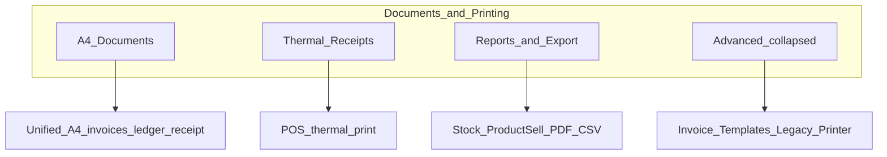

# Documents & Printing — Settings Guide

> Last updated: 2026-06-04  
> Related audit doc: [`docs/system-audit/16_SETTINGS_PRINTING_OPENING_BALANCE_ENGINE.md`](../system-audit/16_SETTINGS_PRINTING_OPENING_BALANCE_ENGINE.md)  
> **Two-engine comparison:** [`REPORT_PRINT_SYSTEMS_COMPARISON.md`](REPORT_PRINT_SYSTEMS_COMPARISON.md) — ClassicPrintBase vs Tabular/PdfPreviewModal

Yeh document **Settings → Documents & Printing** section ko explain karta hai: backend se kaise link hai, changes apply hoti hain ya nahi, aur kahan verify karein.

---

## Overview

Web ERP mein print/PDF layout **do parallel systems** use karta hai:

1. **Unified engine (primary)** — `companies.printing_settings` JSONB column  
   - Settings UI: [`PrintingSettingsPanel.tsx`](../../src/app/components/settings/PrintingSettingsPanel.tsx)  
   - Service: [`printingSettingsService.ts`](../../src/app/services/printingSettingsService.ts)  
   - Runtime loader: [`useUnifiedDocumentSettings.ts`](../../src/app/documents/useUnifiedDocumentSettings.ts)

2. **Legacy invoice templates** — `invoice_documents` table rows  
   - Settings UI: Invoice Templates tab in [`SettingsPageNew.tsx`](../../src/app/components/settings/SettingsPageNew.tsx)  
   - Service: [`invoiceDocumentService.ts`](../../src/app/services/invoiceDocumentService.ts)

3. **Tabular reports (Product Sell, Stock, …)** — shared [`useReportExport`](../../src/app/components/reports/shared/useReportExport.ts)  
   - **Strict separation:** always A4; only report header field toggles + company profile; UI column visibility drives print columns  
   - **Never** uses thermal, pageSetup, layout, or invoice PDF export settings

Navigation source of truth: [`settingsNavigation.ts`](../../src/app/components/settings/settingsNavigation.ts) → category `documentsPrinting`.

**Roman Urdu quick guide:** Pehle **A4 Documents** ya **Thermal Receipts** choose karein — **Reports & Export** alag tab hai. Save ke baad hi live print/PDF par apply hota hai.

---

## Sidebar — 4 tabs (simplified)

| Nav item | Hash route | Applies to |
|----------|------------|------------|
| **A4 Documents** | `#settings/documentsPrinting/printingA4` | Sales/Purchase Invoice, Ledger, Receipt, Quotation, Proforma, Packing, Courier — [`useUnifiedDocumentSettings`](../../src/app/documents/useUnifiedDocumentSettings.ts) |
| **Thermal Receipts** | `#settings/documentsPrinting/printingThermal` | POS receipt, thermal sale print — [`ThermalInvoiceTemplate`](../../src/app/components/shared/invoice/ThermalInvoiceTemplate.tsx). **Not** tabular reports. |
| **Reports & Export** | `#settings/documentsPrinting/printingReports` | Stock Report, Product Sell Report — PDF/CSV/Excel via [`useReportExport`](../../src/app/components/reports/shared/useReportExport.ts) |
| **Advanced** (accordion, default collapsed) | `#settings/documentsPrinting/printingAdvanced` | Document Templates checkboxes, Invoice Templates (`invoice_documents`), Legacy Printer |

Legacy hash routes (`general`, `pageSetup`, `fields`, …) still resolve to the closest new tab inside [`PrintingSettingsPanel`](../../src/app/components/settings/PrintingSettingsPanel.tsx).



---

## Strict separation: reports vs invoices

| Concern | Invoices & orders | Tabular reports |
|---------|-------------------|-----------------|
| Page size | A4, Legal, Letter, Thermal (via `pageSetup`) | **Always A4** ([`reportPrintConfig.ts`](../../src/app/components/reports/shared/reportPrintConfig.ts)); **Portrait/Landscape** toggle in [`PdfPreviewModal`](../../src/app/components/shared/PdfPreviewModal.tsx) (Stock Report default: landscape) |
| Thermal settings | [`ThermalInvoiceTemplate`](../../src/app/components/shared/invoice/ThermalInvoiceTemplate.tsx) | **Ignored** |
| Layout editor | Header/table/footer positions | **Ignored** |
| PDF export tab (`pdf.fontSize`, watermark) | Unified documents | **Ignored** — fixed report font size (11px) |
| Field toggles | Full `fields.*` (SKU, tax, discount, …) | **Subset only:** `showLogo`, `showCompanyAddress`, `showPhone`, `showEmail` |
| Company branding | Unified views + layout | [`getCompanyBrand()`](../../src/app/services/companyBrandService.ts) → [`ReportBrandHeader`](../../src/app/components/reports/shared/ReportBrandHeader.tsx) + [`ReportBrandFooter`](../../src/app/components/reports/shared/ReportBrandFooter.tsx) |
| Table columns | Layout editor / template | **UI `visibleColumns` state** via [`buildTabularPrintSnapshot`](../../src/app/components/reports/shared/buildTabularPrintSnapshot.ts) |

Invoice code (`Unified*View`, thermal templates) must **not** import `reports/shared/reportPrintConfig.ts`.

---

## Backend storage

| Storage | Column / table | Read | Write |
|---------|----------------|------|-------|
| Unified printing | `companies.printing_settings` (JSONB) | `printingSettingsService.get()` / `getMerged()` | `printingSettingsService.update()` |
| Legacy templates | `invoice_documents` | `invoiceDocumentService` | Same |
| Company profile (logo, address) | `companies` row | `SettingsContext`, `getCompanyBrand()` | Settings → Company |

Save flow (Printing tab):

```
SettingsPageNew.savePrintingSettings()
  → mergeWithDefaults(printingSettings)
  → printingSettingsService.update(companyId, toSave)
  → Supabase UPDATE companies SET printing_settings = ...
  → (Thermal tab only) sync companies.printer_mode + paper_size via usePrinterConfig
```

### Save apply matrix

| Tab | JSONB paths written | Also updates | Live consumers |
|-----|---------------------|--------------|----------------|
| **A4 Documents** | `pageSetup` (A4/Legal/Letter only), `fields`, `layout`, `pdf`, `defaultInvoiceType`, `documentTemplates` | — | Unified `Unified*View`, invoice PDF download |
| **Thermal Receipts** | `thermal.*`, `thermal.paperSize` | `companies.printer_mode`, `paper_size` | `ThermalInvoiceTemplate`, POS thermal |
| **Reports & Export** | `fields` (4 header toggles), `reportExport.stockReportOrientation`, `reportExport.productSellOrientation` | — | `useReportExport` → Stock Report, Product Sell Report |
| **Advanced** | `documentTemplates[]` (checkboxes); Invoice Templates → `invoice_documents` table; Legacy Printer → `printer_mode` | Legacy paths only | Older invoice hooks; ClassicPrintBase partial |

**Important:** A4 tab **never** writes thermal page sizes into `pageSetup.pageSize`. Thermal width lives in `thermal.paperSize`.

---

## Sub-tab matrix — kya apply hota hai?

| Settings section | UI location | JSONB key / path | Primary consumers | Apply status |
|------------------|-------------|------------------|-------------------|--------------|
| **A4 — Page setup** | A4 Documents tab | `pageSetup.pageSize`, `orientation`, `margins` | Unified A4 views via `resolveDocumentOptions` | **Yes** — A4/Legal/Letter only (no thermal sizes) |
| **A4 — Fields** | A4 Documents tab | `fields.*` (full set) | A4 invoice templates, ledger, receipt, packing | **Yes** for unified documents |
| **A4 — Layout** | A4 Documents tab | `layout.header`, `layout.table`, `layout.footer` | Template components | **Partial** — positions; not every pixel on mobile |
| **A4 — PDF export** | A4 Documents tab | `pdf.fontSize`, `pdf.fontFamily`, `pdf.includeWatermark` | Unified PDF via `pdfExportService` | **Yes** — invoice PDF download only |
| **A4 — Defaults** | A4 Documents tab | `defaultInvoiceType`, `documentTemplates[]` | Preview + enabled doc kinds | **Yes** |
| **Thermal** | Thermal Receipts tab | `thermal.*`, `thermal.paperSize` | `ThermalInvoiceTemplate`, POS | **Yes** — save also syncs `printer_mode` |
| **Reports** | Reports & Export tab | `fields` (logo/address/phone/email), `reportExport.*` | `useReportExport`, tabular reports | **Yes** — orientation defaults + header toggles |
| **Invoice Templates** | Advanced accordion | `invoice_documents` table | Legacy invoice preview paths | **Separate** backend |
| **Legacy Printer** | Advanced accordion | `companies.printer_mode` | ClassicPrintBase, old POS paths | **Deprecated** — prefer Thermal tab |

### Fully wired (change → visible effect)

- Sales invoice print/PDF: [`UnifiedSalesInvoiceView.tsx`](../../src/app/documents/UnifiedSalesInvoiceView.tsx)
- Purchase invoice: [`UnifiedPurchaseInvoiceView.tsx`](../../src/app/documents/UnifiedPurchaseInvoiceView.tsx)
- Ledger statement: [`UnifiedLedgerView.tsx`](../../src/app/documents/UnifiedLedgerView.tsx)
- Payment receipt: [`UnifiedReceiptView.tsx`](../../src/app/documents/UnifiedReceiptView.tsx)
- Quotation / Proforma / Packing / Courier: respective `Unified*View.tsx` under [`src/app/documents/`](../../src/app/documents/)

Live preview while editing: [`PrintingPreviewPanel.tsx`](../../src/app/components/settings/PrintingPreviewPanel.tsx) uses same `mergeWithDefaults` + mock document.

### Tabular reports (strict apply)

- **Tabular web reports** (Product Sell Report, Stock Report):  
  - `fields.showLogo`, `showCompanyAddress`, `showPhone`, `showEmail` → [`ReportBrandHeader.tsx`](../../src/app/components/reports/shared/ReportBrandHeader.tsx) + [`ReportBrandFooter.tsx`](../../src/app/components/reports/shared/ReportBrandFooter.tsx)  
  - Company logo, address, phone, email from **Company Profile** (`companies` row via `getCompanyBrand()`)  
  - Fixed report font size (11px) — does **not** read `pdf.fontSize`  
  - Default orientation from `reportExport` in settings (Stock = landscape, Product Sell = portrait); modal toggle overrides session-only  
  - UI column picker → [`buildTabularPrintSnapshot`](../../src/app/components/reports/shared/buildTabularPrintSnapshot.ts) — hidden columns excluded from PDF/CSV/Excel  
  - Always A4 (`REPORT_PRINT_FORMAT`) — thermal/pageSetup/layout/watermark **ignored by design**  
  - PDF/Print capture uses inner [`.pdf-document`](../../src/app/components/reports/shared/TabularReportPreview.tsx) via [`resolvePrintableElement`](../../src/app/services/pdfExportService.ts)  
  - Field toggles refresh on each preview open ([`useReportExport.openPreview`](../../src/app/components/reports/shared/useReportExport.ts))

- **Mobile ERP account PDF reports** — branded header from company profile; **ignore** most `printing_settings.fields` (see mobile `ReportBrandHeader` in `erp-mobile-app/`).

- **Legacy SettingsPage "Reports Configuration"** ([`SettingsPage.tsx`](../../src/app/components/settings/SettingsPage.tsx)) — **not loaded** by active app (`SettingsPageNew` is used). Dead UI.

### Not wired / do not expect changes

- Changing **Invoice Templates** tab does **not** automatically override unified `printing_settings` invoice layout — two systems.
- **Legacy Printer / Documents** tab — minimal maintenance; do not rely for new features.

---

## Thermal vs A4 print engines

| Engine | Component | When used |
|--------|-----------|-----------|
| **Thermal receipt** | [`ThermalReceiptLayout.tsx`](../../src/app/components/shared/invoice/ThermalReceiptLayout.tsx) | Sale thermal print, Settings preview, Test Print sample |
| **A4 / Classic** | [`ClassicPrintBase.tsx`](../../src/app/components/shared/ClassicPrintBase.tsx) | A4 invoices, ledger, Stock Ledger |

Thermal receipts **do not** use `ClassicPrintBase` or A4 `@page` rules. Print flow:

1. Settings → **Thermal Receipts** saves `printing_settings.thermal` (+ syncs `companies.printer_mode` / `paper_size` on Save).
2. [`UnifiedSalesInvoiceView`](../../src/app/documents/UnifiedSalesInvoiceView.tsx) loads `merged.thermal` and calls [`useThermalPrint`](../../src/app/hooks/useThermalPrint.ts) — injects roll `@page` size (58mm or 80mm) and `body.print-thermal-receipt` CSS.
3. Browser print shows only `.thermal-receipt-root` — no blank A4 second page for short receipts.
4. PDF/Preview: [`PdfPreviewModal`](../../src/app/components/shared/PdfPreviewModal.tsx) with `format: 'thermal'` captures `.thermal-receipt-root`.

Paper width source: `printing_settings.thermal.paperSize` → fallback `companies.paper_size` via [`usePrinterConfig`](../../src/app/hooks/usePrinterConfig.ts). **Default: 58mm** (POS58 / XP-58).

58mm layout constants: [`thermalPrintDimensions.ts`](../../src/app/constants/thermalPrintDimensions.ts) — 210px screen, 52/14/34 columns, 1mm print margin. Full guide: [`THERMAL_POS58_PRINTING.md`](THERMAL_POS58_PRINTING.md).

### 58mm vs A4 boundary

| Path | Format | Must NOT use |
|------|--------|--------------|
| Sales thermal / POS receipt | 58mm or 80mm roll | `reportPrintConfig`, `.pdf-document` A4 rules |
| Tabular reports (Stock, Product Sell, …) | A4 portrait/landscape | `ThermalReceiptLayout`, `useThermalPrint`, `printing_settings.thermal` |

POS silent print hint: Settings → Thermal Receipts → **POS automation** panel; service constants in `printingSettingsService.ts`.

---

## `CompanyPrintingSettings` structure (reference)

Defined in [`src/app/types/printingSettings.ts`](../../src/app/types/printingSettings.ts).

Key groups:

- `pageSetup` — A4/Legal/Letter only in settings UI (thermal width is `thermal.paperSize`)  
- `fields` — show/hide logo, address, SKU, tax, discount, signature, notes, …  
- `layout` — header/table/footer positions  
- `thermal` — compact mode, QR, cashier line, `paperSize` (58mm default / 80mm), `posPrinterDeviceName`, kiosk hint  
- `pdf` — fontSize, fontFamily, watermark (invoice PDF download only)  
- `reportExport` — `stockReportOrientation`, `productSellOrientation` for tabular reports  
- `documentTemplates` — enabled document kinds  
- `defaultInvoiceType` — standard / packing / pieces / summary / detailed  

Defaults applied on read via `mergeWithDefaults()`.

---

## Verify karein — settings change apply ho rahi hai?

### A) Sales invoice (unified — full apply)

1. Settings → Documents & Printing → **A4 Documents** → Fields section  
2. Turn off **Show logo** → Save  
3. Open any finalized sale → Print / PDF preview  
4. Logo hidden hona chahiye in [`A4InvoiceTemplate`](../../src/app/components/shared/invoice/A4InvoiceTemplate.tsx) / unified view

### B) Tabular report (strict separation)

1. Settings → **Reports & Export** → logo off → Save  
2. Reports → Product Sell Report → PDF  
3. Logo hidden in report header **and** footer  
4. Hide a column in the report table → column absent from PDF, CSV, and Excel  
5. Change **Thermal Receipts** settings → invoice thermal changes; report PDF **unchanged**  
6. Change **A4 Documents → PDF font** → invoice PDF changes; report PDF **unchanged**  
7. Set Stock Report default to Portrait in **Reports & Export** → Save → Stock Report PDF opens in portrait

### C) Thermal

1. Settings → **Thermal Receipts** → toggle compact / QR / paper width  
2. POS or sale thermal print  
3. [`ThermalInvoiceTemplate`](../../src/app/components/shared/invoice/ThermalInvoiceTemplate.tsx) reflects toggles; `printer_mode` + `paper_size` synced on Save

### D) Save confirmation

After Save, network tab mein:

```
PATCH/UPDATE companies?id=eq.<company_id>
  body: { printing_settings: { ... } }
```

Agar error aaye to settings persist nahi hoti — UI preview sirf local state hai jab tak Save na ho.

---

## Mobile vs Web

| Feature | Web | Mobile (`erp-mobile-app`) |
|---------|-----|---------------------------|
| Settings UI | Full Documents & Printing | Printer & barcode + receipt field toggles only |
| Storage | `companies.printing_settings` | Same column (synced for printer prefs) |
| Invoice PDF | Unified views + `pdfExportService` | DOM capture + `PdfPreviewModal` |
| Account PDF reports | Web tabular reports (partial settings) | Full brand header; ignores most field toggles |
| Thermal receipt | Web thermal template | `saleThermalReceipt.ts` uses `printing_settings.fields` subset |

---

## File index (quick links)

| Role | Path |
|------|------|
| Settings shell | `src/app/components/settings/SettingsPageNew.tsx` |
| Nav | `src/app/components/settings/settingsNavigation.ts` |
| Printing panel | `src/app/components/settings/PrintingSettingsPanel.tsx` |
| Applies-to banners | `src/app/components/settings/printing/AppliesToBanner.tsx` |
| Thermal receipt layout | `src/app/components/shared/invoice/ThermalReceiptLayout.tsx` |
| Thermal dimension constants | `src/app/constants/thermalPrintDimensions.ts` |
| 58mm POS guide | `docs/infra/THERMAL_POS58_PRINTING.md` |
| Thermal print hook | `src/app/hooks/useThermalPrint.ts` |
| Report settings preview | `src/app/components/settings/printing/ReportExportPreviewPanel.tsx` |
| Advanced sections | `src/app/components/settings/printing/InvoiceTemplatesSettingsSection.tsx`, `LegacyPrinterSettingsSection.tsx` |
| Live preview | `src/app/components/settings/PrintingPreviewPanel.tsx` |
| CRUD service | `src/app/services/printingSettingsService.ts` |
| Types + defaults | `src/app/types/printingSettings.ts` |
| Document resolver | `src/app/documents/resolveOptions.ts` |
| Runtime hook | `src/app/documents/useUnifiedDocumentSettings.ts` |
| PDF capture | `src/app/services/pdfExportService.ts` |
| Report export hook | `src/app/components/reports/shared/useReportExport.ts` |
| Report print boundary | `src/app/components/reports/shared/reportPrintConfig.ts` |
| Report column snapshot | `src/app/components/reports/shared/buildTabularPrintSnapshot.ts` |
| Report header / footer | `src/app/components/reports/shared/ReportBrandHeader.tsx`, `ReportBrandFooter.tsx` |

---

## Known gaps (future work)

1. Migrate remaining web reports to `useReportExport` + `buildTabularPrintSnapshot`  
2. ~~Single reporting settings section~~ — done: **Reports & Export** tab  
3. Consolidate `invoice_documents` legacy table into unified `printing_settings` only  
4. Align mobile account PDF reports to respect `fields` toggles like web reports  

---

## Troubleshooting

| Symptom | Likely cause |
|---------|--------------|
| Settings save but invoice unchanged | Viewing legacy invoice path, not `Unified*View` |
| Logo still on report after hide | Hard refresh; confirm Save succeeded; check header **and** footer |
| Hidden column still in PDF | Confirm column picker saved state; export uses `buildTabularPrintSnapshot` |
| Preview OK but Print/PDF blank | Fixed: capture `.pdf-document` not wrapper — update app if old build |
| Stock Ledger print blank | Fixed: `.classic-print-base` print visibility in [`index.css`](../../src/styles/index.css) |
| Invoice Templates change ≠ Printing change | Two backends — update the correct tab |
| PDF report 2 blank pages | Fixed via `pdf-document-compact` class — update app if old build |
| Bill no wrong in Product Sell Report | Sales uses `select *`; report uses tiered select — see `productSellReportService` fallbacks |
