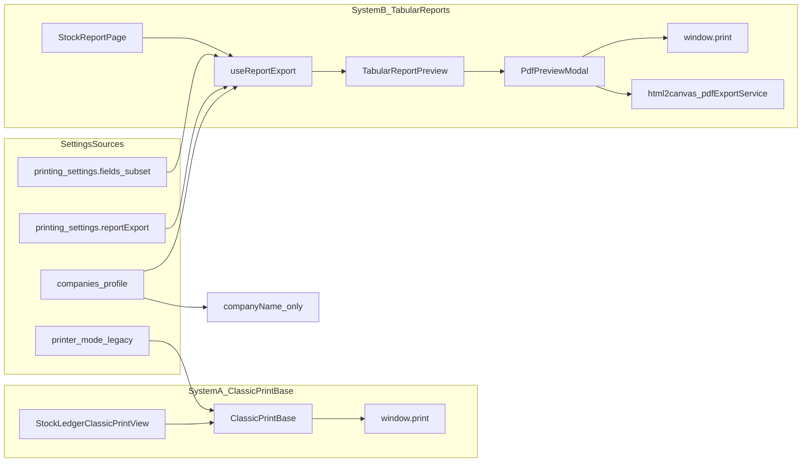

# Report Print Systems — Comparison Guide

> Last updated: 2026-06-13  
> Related: [`DOCUMENTS_AND_PRINTING.md`](DOCUMENTS_AND_PRINTING.md) (Settings apply matrix)

Yeh document **do alag print engines** ko compare karta hai jo abhi web ERP mein parallel chal rahe hain. Aap khud analyze kar sakte hain ke kis screen par kya apply hota hai aur next step kya hona chahiye.

---

## Roman Urdu summary

Web app mein reports/print ke **do alag systems** hain:

1. **System A — ClassicPrintBase** — purana engine; Stock Ledger (per product), invoices, ledger statements. Portrait/Landscape dropdown hai. Settings → Documents & Printing ka zyada tar effect **nahi** lagta.

2. **System B — Tabular Reports** — naya engine; Stock Report, Product Sell Report. `PdfPreviewModal` + branded header/footer. Sirf **4 field toggles** (logo, address, phone, email) + Company Profile se branding. Design pattern yeh wala **standard** hai wide tabular reports ke liye.

Agar Settings change karne ke baad report header same dikhe → pehle check karein ke aap **kis system** wali screen par hain. Dono alag code paths hain — yeh bug nahi, intentional separation hai (invoices/thermal alag, tabular reports alag).

**Settings (2026-06):** Tabular reports ab **Settings → Documents & Printing → Reports & Export** se configure hote hain — header toggles + default orientation (`reportExport` JSONB). Invoice/thermal settings is tab ko affect **nahi** karte.

**Tier C — Accounting reports (2026-06-13):** Roznamcha, Cash Flow, Day Book, Trial Balance, P&amp;L, Balance Sheet, Sales Profit, Inventory Valuation, and Rental Reports now use **System B** (`useReportExport` + `PdfPreviewModal` + `.pdf-document` / `CashBookReportPreview` / `FinancialReportPrintShell`). Print and PDF both open the WYSIWYG preview modal first (landscape toggle in modal). Legacy `exportToPDF` window path removed for these screens. Remaining Balance / Customers &amp; Suppliers / Balance Basis / Reports dashboard ops tabs still use **ClassicPrintBase** with improved offscreen capture width (820px) for Preview/PDF clone.

---

## Architecture diagram

---

## Side-by-side comparison

| Aspect | **System A — ClassicPrintBase** | **System B — Tabular Reports** |
|--------|----------------------------------|----------------------------------|
| **Examples** | Stock Ledger (per product), Sales Invoice, Ledger statement | Stock Report, Product Sell Report |
| **Entry component** | [`ClassicPrintBase.tsx`](../../src/app/components/shared/ClassicPrintBase.tsx) | [`TabularReportPreview.tsx`](../../src/app/components/reports/shared/TabularReportPreview.tsx) |
| **Preview shell** | Full-screen white overlay (`z-[9999]`) | [`PdfPreviewModal.tsx`](../../src/app/components/shared/PdfPreviewModal.tsx) portal |
| **Orientation** | Portrait/Landscape in [`StockLedgerClassicPrintView.tsx`](../../src/app/components/products/StockLedgerClassicPrintView.tsx) | Default from **Reports & Export** tab (`reportExport`); session override in modal |
| **Company branding** | `companyName` prop; logo often **not passed** | [`getCompanyBrand()`](../../src/app/services/companyBrandService.ts) — full profile |
| **Settings → Documents & Printing** | Mostly **NOT wired** — legacy `printer_mode` (Advanced accordion) | **Reports & Export** tab: 4 field toggles + `reportExport` orientations |
| **Column visibility** | Fixed columns per view | UI `visibleColumns` → [`buildTabularPrintSnapshot`](../../src/app/components/reports/shared/buildTabularPrintSnapshot.ts) |
| **PDF generation** | Browser print → "Save as PDF" | `html2canvas` + jsPDF in [`pdfExportService.ts`](../../src/app/services/pdfExportService.ts) |
| **Print CSS** | `.classic-print-base` visibility | `.pdf-print-root` + `.pdf-document` in [`index.css`](../../src/styles/index.css) |

---

## Settings apply matrix (per screen)

| Setting | Stock Ledger (Classic) | Stock Report (Tabular) | Sales Invoice (Unified) |
|---------|------------------------|------------------------|-------------------------|
| Fields: showLogo | No | **Yes** (header + footer) | Yes |
| Fields: showCompanyAddress | No | **Yes** | Yes |
| Fields: showPhone / showEmail | No | **Yes** | Yes |
| Fields: showSku, showTax, … | No | No (invoice only) | Yes |
| Page Setup (A4/Legal/Thermal) | No (own `@page`) | A4 only; orientation from **Reports & Export** + modal override | Yes (A4 tab) |
| Layout Editor | No | No | Partial (A4 tab) |
| Thermal Print | `printer_mode` legacy column (Advanced) | **Ignored** | Yes (Thermal tab) |
| PDF Export (fontSize, watermark) | No | Fixed 11px | Yes (A4 tab) |
| `reportExport` orientations | No | **Yes** — Stock landscape, Product Sell portrait defaults | No |
| Company Profile (Settings → Company) | Name only | **Full** brand | Via unified loader |

---

## File index

| Role | Path |
|------|------|
| Classic print base | `src/app/components/shared/ClassicPrintBase.tsx` |
| Stock Ledger print view | `src/app/components/products/StockLedgerClassicPrintView.tsx` |
| PDF preview modal | `src/app/components/shared/PdfPreviewModal.tsx` |
| Report export hook | `src/app/components/reports/shared/useReportExport.ts` |
| Report print config | `src/app/components/reports/shared/reportPrintConfig.ts` |
| Tabular preview | `src/app/components/reports/shared/TabularReportPreview.tsx` |
| Column snapshot | `src/app/components/reports/shared/buildTabularPrintSnapshot.ts` |
| PDF capture service | `src/app/services/pdfExportService.ts` |
| Print CSS | `src/styles/index.css` |
| Stock Report page | `src/app/components/reports/StockReportPage.tsx` |
| Product Sell page | `src/app/components/reports/ProductSellReportPage.tsx` |
| Reports settings UI | `src/app/components/settings/printing/ReportExportPreviewPanel.tsx` |
| Report export types | `src/app/types/printingSettings.ts` → `ReportExportSettings` |

---

## After simplification (2026-06)

Documents & Printing sidebar ab **4 items** hai:

1. **A4 Documents** — invoices, ledger, receipt (page, fields, layout, PDF font)
2. **Thermal Receipts** — POS thermal only; save syncs `printer_mode` + `paper_size`
3. **Reports & Export** — tabular report header toggles + default orientation per report
4. **Advanced** (collapsed) — document template checkboxes, legacy invoice templates, legacy printer

Tabular reports **kabhi bhi** A4 Documents ke page setup ya thermal settings read nahi karte. Orientation ab hardcoded constants ki jagah `printing_settings.reportExport` se aati hai ([`useReportExport`](../../src/app/components/reports/shared/useReportExport.ts)); modal toggle sirf current session ke liye hai.

Full settings guide: [`DOCUMENTS_AND_PRINTING.md`](DOCUMENTS_AND_PRINTING.md)

---

## Known issues (fixed / open)

| Issue | Severity | Status |
|-------|----------|--------|
| Preview OK but Print + Download PDF blank (tabular) | Critical | **Fixed** — capture `.pdf-document` not empty wrapper |
| ClassicPrintBase print blank when `index.css` loaded | High | **Fixed** — `.classic-print-base` with `!important` in print CSS |
| Settings toggles not refreshing after Save | Medium | **Fixed** — reload fields on each `openPreview()` |
| No landscape for tabular reports | Medium | **Fixed** — orientation toggle in modal; Stock default landscape |
| Stock Ledger missing logo / field toggles | Low | Open — migrate to System B or wire toggles into ClassicPrintBase |
| Two parallel engines (maintenance) | Low | Open — future unification decision |

---

## Decision checklist (aapke liye)

Jab next step decide karna ho, yeh questions use karein:

1. **Kya Stock Ledger ko bhi System B (TabularReportPreview + PdfPreviewModal) par migrate karna hai?**  
   - Pro: ek design, Settings same apply, landscape built-in  
   - Con: movement ledger layout alag hai — custom template chahiye

2. **Kya ClassicPrintBase ko retire karna hai ya sirf invoices ke liye rakhna hai?**  
   - Invoices/thermal abhi ClassicPrintBase / Unified views use karte hain

3. **Kya tabular reports ke liye Settings mein alag "Report orientation default" chahiye?**  
   - Abhi per-session toggle modal mein hai; Stock Report default landscape

4. **Kya mobile ERP reports ko web tabular engine se align karna hai?**  
   - Mobile abhi alag `ReportBrandHeader` use karta hai

---

## Verify karein

### Tabular (Stock Report)

1. Reports → Stock Report → Export PDF → preview modal  
2. Data screen par dikhe; **Download PDF** mein header + table ho  
3. **Print** → browser print preview blank na ho  
4. Landscape default; Portrait toggle kaam kare  
5. Settings → **Reports & Export** → logo off → Save → PDF dubara kholo → logo header/footer dono se gayab  
6. Settings → **Reports & Export** → Stock Report default Portrait → Save → PDF opens portrait

### Classic (Stock Ledger)

1. Product → Full Stock Ledger → Print view  
2. Portrait/Landscape switch → Print preview sahi orientation  
3. Print output blank na ho

---

## Related docs

- [`DOCUMENTS_AND_PRINTING.md`](DOCUMENTS_AND_PRINTING.md) — Settings tabs aur backend storage
- [`reportPrintConfig.ts`](../../src/app/components/reports/shared/reportPrintConfig.ts) — tabular-only constants (A4, field subset)
