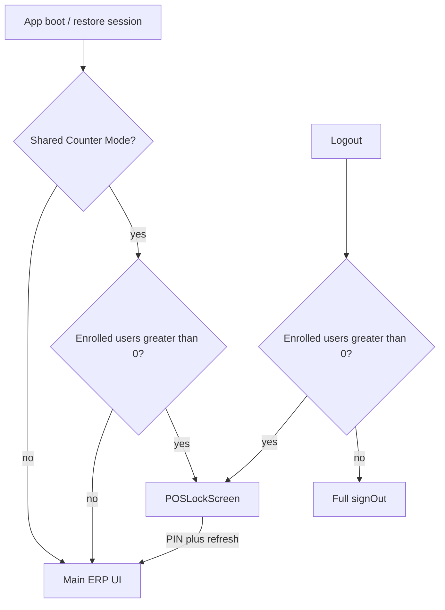

# Phase 6 — Shared Counter / POS Lock Screen (`erp-mobile-app`)

**Scope:** Client-only under [`erp-mobile-app/`](../erp-mobile-app/). No [`migrations/`](../migrations/), no Supabase URL/key changes ([`MOBILE_APK_LOCKED_PATTERN.md`](infra/MOBILE_APK_LOCKED_PATTERN.md), [`system-lockdown-safety.mdc`](../.cursor/rules/system-lockdown-safety.mdc)).

Related: [Phase 3 PIN/offline](mobile_phase3_pin_offline.plan.md), [Phase 4 polish](mobile_phase4_polish.plan.md).

## Goal

One trusted counter tablet lists **enrolled** staff (name, role, avatar initials). Tap a user → 4-digit PIN → switch Supabase session via encrypted vault refresh tokens. **Shared Counter Mode** shows this full-screen lock on boot and on Switch User / Logout instead of a full sign-out.

## Security model

| Stored | Where | Notes |
|--------|--------|--------|
| Refresh tokens | IndexedDB ciphertext (`counterUserVault`) | Decrypted only after correct 4-digit PIN |
| Display metadata | Plaintext on vault row | `displayName`, `email`, `role`, `userId` — **no tokens** in list APIs |
| Device-bound refresh copy | `tokenIv` / `tokenCiphertext` on vault row (IDB v2) | Lets the app **update** the stored refresh token after email login without re-entering the counter PIN |
| Shared Counter Mode flag | `localStorage` | UX preference only; **first** counter PIN save auto-enables it |

## Logout and refresh-token lifecycle (post-fix)

- **Logout** with at least one enrolled counter user shows the POS lock screen and does **not** call global `signOut` (so server refresh tokens in the vault stay valid).
- **Sign out completely** (lock screen link) calls `signOutGlobal()` — revokes tokens; users must sign in with email/password once; `syncCounterRefreshTokenForUserId` then refreshes vault rows for that auth user.
- After **sign-in**, **token refresh**, **counter PIN unlock**, or **`TOKEN_REFRESHED`**, the current session’s refresh token is copied into all matching vault rows so counter PIN keeps working.

## Task checklist

| ID | Item | Status |
|----|------|--------|
| `plan-doc` | This roadmap file | Done |
| `vault-list-api` | `listEnrolledCounterProfiles()` — name, email, role, userId; no tokens | Done |
| `vault-save-meta` | Persist `role` + `email` on enroll (`saveCounterUserForPin`) | Done |
| `vault-device-token` | IDB v2 + device-key encrypted refresh + `syncCounterRefreshTokenForUserId` | Done |
| `shared-counter-mode` | `sharedCounterMode.ts` toggle + boot lock helper | Done |
| `pos-lock-screen` | `POSLockScreen.tsx` — user grid + PIN pad | Done |
| `settings-toggle` | Shared Counter Mode toggle in Settings | Done |
| `logout-lock-enrolled` | Logout → lock when any counter user enrolled (not only shared mode) | Done |
| `app-wiring` | Boot / logout / switch → lock screen in `App.tsx` | Done |
| `pos-expense-switch` | POS & Expense use app-level lock when mode on | Done |
| `typecheck` | `npm run typecheck` in `erp-mobile-app` | Done |
| `graphify` | `graphify update .` from repo root | Done |

## Architecture



## Files

| File | Role |
|------|------|
| [`erp-mobile-app/src/lib/counterUserVault.ts`](../erp-mobile-app/src/lib/counterUserVault.ts) | Vault v2, device-key token, `syncCounterRefreshTokenForUserId` |
| [`erp-mobile-app/src/api/auth.ts`](../erp-mobile-app/src/api/auth.ts) | `signOutGlobal` / `signOutLocal`, `syncCurrentSessionToCounterVault`, sign-in sync |
| [`erp-mobile-app/src/lib/supabase.ts`](../erp-mobile-app/src/lib/supabase.ts) | Debounced vault sync on `SIGNED_IN` / `TOKEN_REFRESHED` |
| [`erp-mobile-app/src/lib/sharedCounterMode.ts`](../erp-mobile-app/src/lib/sharedCounterMode.ts) | Mode flag + `shouldActivateCounterLockScreen` |
| [`erp-mobile-app/src/components/auth/POSLockScreen.tsx`](../erp-mobile-app/src/components/auth/POSLockScreen.tsx) | Full-page lock UI |
| [`erp-mobile-app/src/App.tsx`](../erp-mobile-app/src/App.tsx) | `isCounterLocked`, boot effect, logout branch |
| [`erp-mobile-app/src/components/settings/SettingsModule.tsx`](../erp-mobile-app/src/components/settings/SettingsModule.tsx) | Toggle + enroll saves `role` |

## Operator setup

1. Admin/owner: **Settings → Counter tablet PIN** — enroll each cashier (4-digit PIN per user). Saving the **first** user auto-enables **Shared Counter Mode** (you can turn it off in Settings).
2. Optional: adjust **Shared Counter Mode** — when on, cold boot also shows the lock screen if users are enrolled.
3. **Logout** shows the lock screen whenever any counter user is enrolled; use **Sign out completely** only when the tablet should forget everyone.

## Verification

```bash
cd erp-mobile-app && npm run typecheck
cd .. && graphify update .
```

Manual: enroll 2 users, enable mode, cold start → lock screen; switch user from POS; logout → lock (not email login).
