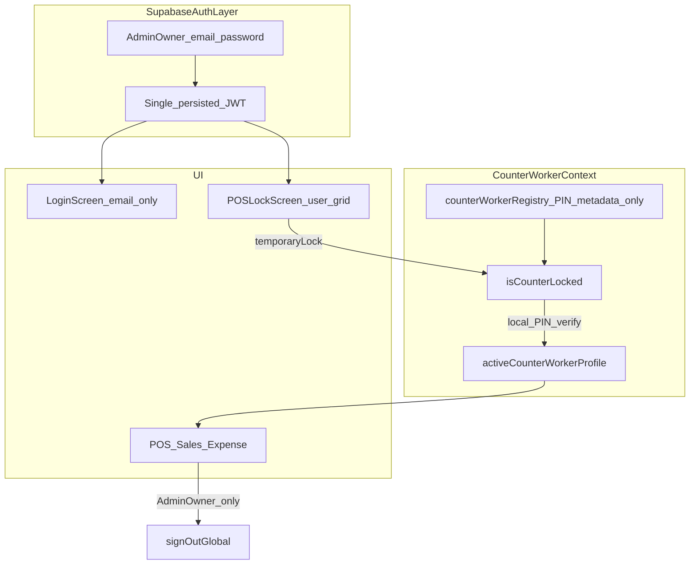

# Phase 8 — Enterprise POS State Architecture (`erp-mobile-app`)

**Scope:** Client-only under [`erp-mobile-app/`](../erp-mobile-app/). No [`migrations/`](../migrations/), no Supabase URL/key changes ([`MOBILE_APK_LOCKED_PATTERN.md`](infra/MOBILE_APK_LOCKED_PATTERN.md), [`system-lockdown-safety.mdc`](../.cursor/rules/system-lockdown-safety.mdc)).

**Replaces:** Phase 6 per-user refresh-token vault model ([`mobile_phase6_pos_lockscreen.plan.md`](mobile_phase6_pos_lockscreen.plan.md)).

Related: [Phase 3 PIN/offline](mobile_phase3_pin_offline.plan.md) · [Phase 5 inventory](mobile_phase5_core_inventory.plan.md)

---

## Goal

Ek shared counter tablet par **ek hi Supabase auth session** (Admin/Owner email login). Staff switch sirf **local React state** se — bina `signOut`, bina refresh-token rotation. Temporary Lock alag; Permanent Sign-Out sirf Admin/Owner.

---

## The Teardown (legacy vault + token hacks)

### Files to delete (Phase 8B)

| File | Reason |
|------|--------|
| [`erp-mobile-app/src/lib/counterUserVault.ts`](../erp-mobile-app/src/lib/counterUserVault.ts) | Per-user refresh tokens in IndexedDB |
| [`erp-mobile-app/src/lib/counterVaultMaintenance.ts`](../erp-mobile-app/src/lib/counterVaultMaintenance.ts) | 20-min background vault sync |
| [`erp-mobile-app/src/lib/counterPinUnlock.ts`](../erp-mobile-app/src/lib/counterPinUnlock.ts) | PIN → `signOutLocal` + `refreshSessionFromRefreshToken` |

### Hacks removed in Phase 8A

| Location | Removed |
|----------|---------|
| [`App.tsx`](../erp-mobile-app/src/App.tsx) | `maintainCounterVaultTokens` import, interval, visibility/appState vault refresh |
| [`App.tsx`](../erp-mobile-app/src/App.tsx) | All `syncCurrentSessionToCounterVault()` on login/branch/session paths |
| [`App.tsx`](../erp-mobile-app/src/App.tsx) | `pauseAuthAutoRefresh` / `resumeAuthAutoRefresh` for counter-boot-lock, counter-handoff, counter-lock-requested |
| [`App.tsx`](../erp-mobile-app/src/App.tsx) | Logout → `signOutLocal()` replaced with `temporaryLock()` (local screen lock only) |
| [`supabase.ts`](../erp-mobile-app/src/lib/supabase.ts) | `scheduleCounterVaultTokenSync` on `SIGNED_IN` / `TOKEN_REFRESHED` |
| [`supabase.ts`](../erp-mobile-app/src/lib/supabase.ts) | Visibility listener calling `maintainCounterVaultTokens` |

### Kept (unchanged in Phase 8A)

- **Device quick PIN** — [`secureStorage.ts`](../erp-mobile-app/src/lib/secureStorage.ts) (personal unlock after email login)
- **Legacy vault files** — still referenced by POSLockScreen/Settings until Phase 8B registry migration

---

## Target state architecture



### Dual identity model

| Layer | State | Changes when |
|-------|-------|--------------|
| **`sessionUser`** | Supabase JWT holder (Admin/Owner) — `App.tsx` `user` | Email login, Permanent Sign-Out |
| **`activeCounterWorkerProfile`** | Local counter identity — `CounterWorkerContext` | Lock screen PIN (local verify only) |

**Effective user** for modules (Phase 8B): `activeCounterWorkerProfile ?? sessionUser`

### Logout separation

| Action | Who | Behavior |
|--------|-----|----------|
| **Temporary Lock / Switch User** | All enrolled staff | `temporaryLock()` — clear worker, show POS lock grid; **JWT alive** |
| **Permanent Sign-Out** | Admin/Owner only | `signOutGlobal()` — full revoke + login screen |

---

## Task checklist

| ID | Item | Status |
|----|------|--------|
| `phase8-doc` | This roadmap file | Done |
| `phase8a-app-teardown` | Remove vault maintenance + sync + auth pause from `App.tsx` | Done |
| `phase8a-supabase-cut` | Remove vault token sync from `supabase.ts` | Done |
| `phase8a-context-shell` | `CounterWorkerContext.tsx` + `main.tsx` provider | Done |
| `phase8a-temp-lock` | Logout → `temporaryLock()` when shared counter active | Done |
| `phase8a-typecheck` | `npm run typecheck:mobile` | Done |
| `phase8b-registry` | `counterWorkerRegistry.ts` — PIN + metadata, no tokens | Done |
| `phase8b-lock-ui` | Refactor POSLockScreen / Settings enroll | Done |
| `phase8b-effective-user` | POS/Expense use effective worker for attribution | Done |
| `phase8b-delete-legacy` | Delete vault files | Done |
| `phase8b-usage-guide` | [`mobile_phase8B_usage_guide.md`](mobile_phase8B_usage_guide.md) | Done |

---

## Phase 8A files touched

| File | Role |
|------|------|
| [`docs/mobile_phase8_pos_state_rebuild.plan.md`](mobile_phase8_pos_state_rebuild.plan.md) | This plan |
| [`erp-mobile-app/src/context/CounterWorkerContext.tsx`](../erp-mobile-app/src/context/CounterWorkerContext.tsx) | `activeCounterWorkerProfile`, `isCounterLocked`, `temporaryLock` |
| [`erp-mobile-app/src/main.tsx`](../erp-mobile-app/src/main.tsx) | Provider inside `PermissionProvider` |
| [`erp-mobile-app/src/App.tsx`](../erp-mobile-app/src/App.tsx) | Vault teardown + context wiring |
| [`erp-mobile-app/src/lib/supabase.ts`](../erp-mobile-app/src/lib/supabase.ts) | Vault sync removal |

---

## Verification

```bash
npm run typecheck:mobile
cd erp-mobile-app && npm run build:mobile
graphify update .
```

Manual (after 8B):
1. Admin email login → enroll 2 workers in Settings
2. Shared Counter Mode ON → restart → lock grid, no "Refreshing tablet session"
3. Worker A PIN → sale attributed to A
4. Logout → lock screen, network still works (session alive)
5. Permanent sign-out visible only to Admin/Owner
