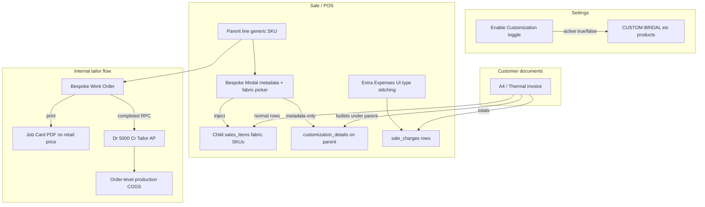

# Bespoke Customization & Tailor Production — Technical Implementation Plan

**Deliverable file:** Copy this plan to [`docs/plan.md`](docs/plan.md) on execution.  
**Stack:** React (Vite) + TypeScript, Supabase Postgres, RLS, existing GL via `accountingService` / RPC patterns.  
**Out of scope for v1:** Per-order SKU generation; stitching as a `sales_items` service line; legacy `job_cards` / `studio_orders` reuse (new `bespoke_work_orders` table instead).

---

## Architecture overview



| Concern | Mechanism |
|---------|-----------|
| Custom dress “product” on invoice | 3–4 **generic** products (`CUSTOM-BRIDAL`, …), visibility via `products.is_active` |
| Fabric stock OUT | **Child** `sales_items` linked by `bespoke_parent_item_id` → standard [`handle_sale_final_stock_movement`](migrations/20260321_handle_sale_final_stock_movement_supabase_admin.sql) |
| Customer stitching charge | [`sale_charges`](migrations/purchase_sale_charges_audit_ready.sql) via existing **Extra Expenses** (`type: 'stitching'`) in [`SaleForm.tsx`](src/app/components/sales/SaleForm.tsx) |
| Measurements / images / notes | Parent `customization_details` **metadata only** |
| Tailor production cost (hidden) | **Work Order** → on Complete: JE to Tailor AP + Cost of Production (5000) |

---

## Phase 1 — Database migrations

### 1.1 Generic custom products (seed, not per order)

**Migration:** `migrations/20260531120000_bespoke_generic_products.sql`

- Add to `business_settings` (additive):
  - `custom_generic_product_ids uuid[] DEFAULT '{}'` — FK targets in `products`
  - Optional: rename UI label only; keep column `enable_bespoke_orders` or add alias `enable_customization` in app layer
- **Seed function** `seed_bespoke_generic_products(p_company_id)`:
  - Insert 4 products if missing (same `company_id`):

| SKU | Name | `track_stock` | `is_sellable` | `is_active` |
|-----|------|---------------|---------------|-------------|
| `CUSTOM-BRIDAL` | Custom Order — Bridal | false | true | false |
| `CUSTOM-PARTYWEAR` | Custom Order — Party Wear | false | true | false |
| `CUSTOM-FORMAL` | Custom Order — Formal | false | true | false |
| `CUSTOM-CASUAL` | Custom Order — Casual | false | true | false |

  - Retail price = 0 or configurable default; **no stock tracking** on parent generics
  - Store returned IDs in `business_settings.custom_generic_product_ids`
- Run seed for all existing companies (backfill) + hook on new company (extend [`seed_business_settings_for_company`](migrations/20260528120000_business_settings_bespoke.sql))

### 1.2 Parent–child fabric lines

**Migration:** `migrations/20260531130000_sales_items_bespoke_parent.sql`

```sql
ALTER TABLE sales_items
  ADD COLUMN IF NOT EXISTS bespoke_parent_item_id UUID NULL
    REFERENCES sales_items(id) ON DELETE CASCADE;

CREATE INDEX IF NOT EXISTS idx_sales_items_bespoke_parent
  ON sales_items(sale_id, bespoke_parent_item_id)
  WHERE bespoke_parent_item_id IS NOT NULL;
```

- Extend `update_sale_with_items` (new forward migration, do not rewrite `20260529120000_*`):
  - Accept `bespoke_parent_item_id` per item in JSON array
  - Insert order: parents first, then children (or two-pass insert in RPC)

### 1.3 Bespoke Work Orders

**Migration:** `migrations/20260531140000_bespoke_work_orders.sql`

```sql
CREATE TYPE bespoke_work_order_status AS ENUM (
  'draft', 'in_progress', 'completed', 'cancelled'
);

CREATE TABLE bespoke_work_orders (
  id UUID PRIMARY KEY DEFAULT gen_random_uuid(),
  company_id UUID NOT NULL REFERENCES companies(id) ON DELETE CASCADE,
  branch_id UUID NOT NULL REFERENCES branches(id) ON DELETE RESTRICT,
  sale_id UUID NOT NULL REFERENCES sales(id) ON DELETE RESTRICT,
  parent_sales_item_id UUID NOT NULL REFERENCES sales_items(id) ON DELETE RESTRICT,
  work_order_no TEXT NOT NULL,
  tailor_contact_id UUID NOT NULL REFERENCES contacts(id) ON DELETE RESTRICT,
  production_cost NUMERIC(15,2) NOT NULL CHECK (production_cost >= 0),
  status bespoke_work_order_status NOT NULL DEFAULT 'draft',
  instructions_snapshot JSONB NOT NULL DEFAULT '{}',
  notes TEXT,
  completed_at TIMESTAMPTZ,
  journal_entry_id UUID REFERENCES journal_entries(id) ON DELETE SET NULL,
  created_by UUID REFERENCES users(id) ON DELETE SET NULL,
  created_at TIMESTAMPTZ NOT NULL DEFAULT now(),
  updated_at TIMESTAMPTZ NOT NULL DEFAULT now(),
  UNIQUE (company_id, work_order_no)
);
```

- RLS: company-scoped via `company_id` (mirror `studio_productions` policies)
- Sequence: `document_sequences` entry `BWO` or use existing numbering service pattern (`BWO-0001`)
- **One WO per parent line per sale** (UNIQUE optional: `(sale_id, parent_sales_item_id)` where status != cancelled)

### 1.4 RPC — Complete work order (GL)

**Migration:** `migrations/20260531150000_complete_bespoke_work_order_rpc.sql`

**Function:** `complete_bespoke_work_order(p_work_order_id UUID, p_user_id UUID DEFAULT NULL) RETURNS JSONB`

** Preconditions:**
- WO `status` in (`draft`, `in_progress`)
- `production_cost > 0`
- `tailor_contact_id` is supplier/worker contact with AP sub-ledger (reuse [`_ensure_ap_subaccount_for_contact`](migrations/20260423_document_posting_rpcs.sql))
- Sale exists; optional gate: sale `status = 'final'` only if business requires finalized order before paying tailor

**Posting (mirror studio stage labor, account **5000** not 5010 inventory COGS):**

| Line | Account | Debit | Credit |
|------|---------|-------|--------|
| Production cost | 5000 Cost of Production | `production_cost` | |
| Tailor payable | AP sub-account (tailor contact) | | `production_cost` |

- `reference_type = 'bespoke_work_order'`, `reference_id = work_order.id`
- Set `bespoke_work_orders.status = 'completed'`, `completed_at`, `journal_entry_id`
- **Idempotent:** if `journal_entry_id` already set, return success without duplicate JE
- **Do not** post customer AR/Revenue (internal cost only)

**Reporting / “COGS for this order”:**
- Link JE `reference_id` + `sale_id` on WO for order-level COGS reports
- Sale finalize still posts **inventory COGS (5010)** from fabric lines via existing [`getSaleCogs`](src/app/services/saleAccountingService.ts); tailor cost is **5000** production labor (same split as studio)

**Optional follow-up RPC:** `cancel_bespoke_work_order` — reversal JE if completed in error (Dr AP Cr 5000), guarded idempotent.

---

## Phase 2 — Settings & generic SKU toggle

### 2.1 Backend

**File:** [`businessSettingsService.ts`](src/app/services/businessSettingsService.ts)

- Load/save `custom_generic_product_ids`
- **`setCustomizationEnabled(companyId, enabled)`**:
  1. Update `business_settings.enable_bespoke_orders`
  2. `UPDATE products SET is_active = enabled WHERE id = ANY(custom_generic_product_ids)`

**RPC alternative (preferred for atomicity):** `set_company_customization_enabled(p_company_id, p_enabled boolean)` in migration — single transaction for settings + product flags.

### 2.2 Frontend

**File:** [`SettingsPageNew.tsx`](src/app/components/settings/SettingsPageNew.tsx)

- Rename label: **“Enable Customization”** (keep DB column name for compatibility)
- On toggle change → call `setCustomizationEnabled`
- Show read-only list of 4 generic SKUs + active state
- Remove or hide **“Customization charges”** from `bespoke_form_config` checklist (charges move to Extra Expenses)

### 2.3 Product search

**Files:** [`productService.ts`](src/app/services/productService.ts), SaleForm product search

- Already filters `is_active = true` — generic SKUs appear only when toggle ON
- Optional badge in search: “Custom” for SKUs in `custom_generic_product_ids`

---

## Phase 3 — Bespoke modal & fabric cart injection

### 3.1 Types

**File:** [`bespoke.ts`](src/app/types/bespoke.ts)

- **`BespokeMetadata`:** `measurements`, `color_name`, `shade_card_code`, `expected_delivery_date`, `image_url`, `image_storage_path`, `notes` only
- **`buildBespokeMetadataForPersist()`** — strips `fabric_materials`, `fabric`, `customization_charges`
- **Deprecate** for persist: `getBespokeUnitPrice`, merged parent pricing (keep `deriveBaseUnitPriceFromStored` for **legacy row hydration** only)
- Transient type `BespokeFabricDraft[]` for modal → injection input

### 3.2 Injection library

**New file:** [`src/app/lib/bespokeCartInjection.ts`](src/app/lib/bespokeCartInjection.ts)

| Function | Behavior |
|----------|----------|
| `syncFabricChildLines(items, parentCartId, fabrics[])` | Remove items where `bespokeParentCartId === parentCartId`; add new lines from [`LooseFabricProductOption`](src/app/services/bespokeFabricProductService.ts) with `retail_price`, qty, `variationId` |
| `resolveParentDbId(cartId, insertedItems)` | Map numeric cart id → `sales_items.id` after save |
| `hydrateFabricDraftsFromChildren(parentDbId, allItems)` | Rebuild fabric editor state from child lines |

**Child line flags (client):** `bespokeParentCartId`, `bespokeRole: 'fabric'`, `isBespokeInjected: true`

**Do not inject** stitching/service lines.

### 3.3 Modal

**File:** [`BespokeDetailsModal.tsx`](src/app/components/bespoke/BespokeDetailsModal.tsx)

- Remove charges field and price preview that merges charges into parent
- `onSave({ metadata, fabrics })` — no financial fields in metadata
- Helper text: *“Stitching / modification charges: add under Extra Expenses → Stitching on the sale.”*

### 3.4 SaleForm integration

**File:** [`SaleForm.tsx`](src/app/components/sales/SaleForm.tsx)

- Replace [`handleSaveBespoke`](src/app/components/sales/SaleForm.tsx) (~2092):
  - Parent: `customizationDetails = metadata`, `price` = generic SKU retail only (no charge merge)
  - Call `syncFabricChildLines`
- Remove `updateItem` logic that writes deltas into `customization_charges`
- Save payload: children include `bespoke_parent_item_id` (resolve after parent insert in [`SalesContext.tsx`](src/app/context/SalesContext.tsx))
- **SalesContext** insert order:
  1. Insert parent items (no parent ref)
  2. Insert fabric children with `bespoke_parent_item_id`
- **Disable** [`postBespokeFabricStockOnFinalize`](src/app/services/bespokeFabricStockService.ts) when child fabric lines exist; keep legacy path for old JSON-only sales

### 3.5 POS

**File:** [`POS.tsx`](src/app/components/pos/POS.tsx)

- Mirror fabric injection on bespoke save
- **Add Extra Expenses block** (parity with SaleForm): types include `stitching`, persist via `extraExpenses` → `sale_charges` on checkout (currently missing in POS grep)

### 3.6 SaleItemsSection UX

- Badge injected fabric lines; block bespoke modal on injected rows
- Parent row: “Custom order” + link to open metadata modal

---

## Phase 4 — Stitching via Extra Expenses (no modal charges)

### 4.1 SaleForm (existing)

- [`ExtraExpense`](src/app/components/sales/SaleForm.tsx) already supports `type: 'stitching'`
- Persisted to `sale_charges` with `charge_type: 'stitching'` ([`SalesContext`](src/app/context/SalesContext.tsx) ~792–796)
- Grand total: `items + extraExpenses + shipping - discount` (unchanged)

### 4.2 Customer invoice display

- Stitching appears in invoice **totals / charges section** (verify [`A4InvoiceTemplate`](src/app/components/shared/invoice/A4InvoiceTemplate.tsx) reads `sale_charges` / document JSON charges array)
- **Not** under parent line JSON

### 4.3 Optional UX helper

- After bespoke modal save, if user entered stitching amount in a **dismissed** field, do not store it; optional toast: “Add stitching amount in Extra Expenses”

### 4.4 Accounting note

- [`createExtraExpenseJournalEntry`](src/app/services/saleAccountingService.ts) is **deprecated** for customer invoices (charges roll into main sale JE). Document that customer stitching is **revenue** via sale total, while tailor **production_cost** on WO is **5000/AP** internal cost.

---

## Phase 5 — Invoice & View Sale (metadata bullets)

### 5.1 Replace breakdown component

**Retire** fabric/charges rows in [`BespokeInvoiceBreakdown.tsx`](src/app/components/bespoke/BespokeInvoiceBreakdown.tsx).

**New:** `BespokeInstructionBullets.tsx`

- Input: `customization_details` metadata only
- Render bullet list under parent product name:
  - Measurements
  - Color / shade
  - Expected delivery
  - Notes
  - (No fabric list here — fabric is separate line items)

### 5.2 Templates

| File | Change |
|------|--------|
| [`A4InvoiceTemplate.tsx`](src/app/components/shared/invoice/A4InvoiceTemplate.tsx) | Parent generic line → bullets; fabric lines as normal rows |
| [`ThermalInvoiceTemplate.tsx`](src/app/components/shared/invoice/ThermalInvoiceTemplate.tsx) | Compact bullets |
| [`ViewSaleDetailsDrawer.tsx`](src/app/components/sales/ViewSaleDetailsDrawer.tsx) | Same; group children under parent optionally |

### 5.3 RPC document

[`generate_invoice_document`](migrations/20260529130000_generate_invoice_document_bespoke_breakdown.sql):

- Keep `customization_details` on parent items for bullet renderer
- Include `bespoke_parent_item_id` on items (optional grouping)
- Ensure `charges[]` includes stitching from `sale_charges`

### 5.4 Undo previous JSON pricing display

- Update [`getBespokeInvoiceBreakdown`](src/app/types/bespoke.ts) → metadata-only helper or remove
- Revise [`docs/bespoke_customization_and_convert_to_final.md`](docs/bespoke_customization_and_convert_to_final.md)

---

## Phase 6 — Work Order / Job Card module

### 6.1 API service

**New:** [`src/app/services/bespokeWorkOrderService.ts`](src/app/services/bespokeWorkOrderService.ts)

| Method | Description |
|--------|-------------|
| `createWorkOrder({ saleId, parentItemId, tailorContactId, productionCost, notes })` | Copy `customization_details` → `instructions_snapshot` |
| `listBySale(saleId)` | For drawer / sale detail |
| `updateStatus(id, status)` | draft → in_progress |
| `complete(id)` | Call RPC `complete_bespoke_work_order` |
| `getNextWorkOrderNo(companyId)` | BWO sequence |

### 6.2 UI entry points

| Location | Action |
|----------|--------|
| [`ViewSaleDetailsDrawer.tsx`](src/app/components/sales/ViewSaleDetailsDrawer.tsx) | Button **“Create Work Order”** on lines where product SKU ∈ generic set AND metadata exists |
| **New** [`BespokeWorkOrderForm.tsx`](src/app/components/bespoke/BespokeWorkOrderForm.tsx) | Tailor = supplier [`contacts`](contacts) picker; production cost; notes |
| **New** [`BespokeWorkOrderList.tsx`](src/app/components/bespoke/BespokeWorkOrderList.tsx) | Status filters; Complete action |
| **New route** | `/production/bespoke-work-orders` or tab under Production module |

### 6.3 Job Card print template

**New:** [`BespokeJobCardTemplate.tsx`](src/app/components/bespoke/BespokeJobCardTemplate.tsx)

**Print contents (strict):**
- Work order no, date, tailor name
- Design instructions from `instructions_snapshot` (bullets)
- **Production cost** (tailor agreed amount)
- **Exclude:** customer retail, sale grand total, fabric line prices (optional: show fabric **names/qty** without prices for tailor reference)

**Exclude:** customer retail, sale grand total; fabric names/qty allowed without prices.

### 6.4 Permissions

- Add module permission keys e.g. `bespoke_work_orders.view`, `bespoke_work_orders.complete` in [`erp_permission_architecture`](migrations/erp_permission_architecture_replica/) (additive seed)

---

## Phase 7 — Mobile (`erp-mobile-app`)

| Item | Action |
|------|--------|
| Fabric injection | Port [`bespokeCartInjection.ts`](src/app/lib/bespokeCartInjection.ts) → `erp-mobile-app/src/lib/` |
| RPC payloads | [`sales.ts`](erp-mobile-app/src/api/sales.ts) pass `bespoke_parent_item_id` |
| Extra expenses | If mobile sale edit supports charges, map `stitching` to `sale_charges` |
| Work orders | API client for list/create/complete; UI phase 2 |
| Settings toggle | Read-only or full toggle when mobile settings exist |

---

## Phase 8 — Data migration & backward compatibility

### 8.1 Legacy sales (JSON fabric + charges in parent)

| Pattern | Handling |
|---------|----------|
| `fabric_materials` in JSON, no child lines | On next edit + modal save → inject children; strip JSON fabric |
| `customization_charges` in JSON | On load → suggest moving to Extra Expense stitching row (one-time migration script optional) |
| `bespokeFabricStockService` | Run only if no fabric child lines |

### 8.2 Optional one-off SQL (admin)

- Report: sales with `customization_details->>'customization_charges'` not null
- Manual or scripted: insert `sale_charges` stitching row + clear JSON key

---

## Implementation sequence (recommended)

1. Migrations: generic products seed, `bespoke_parent_item_id`, `bespoke_work_orders`, complete RPC  
2. Settings toggle + product `is_active` sync  
3. `bespokeCartInjection` + modal + SaleForm + SalesContext  
4. Remove JSON pricing; POS extra expenses + fabric injection  
5. Invoice metadata bullets + document RPC charges  
6. Work Order UI + Job Card print + complete RPC wiring  
7. Mobile lib + API fields  
8. Docs + QA checklist  

---

## QA checklist

1. Toggle OFF → generic SKUs hidden from search; ON → visible  
2. Sale: parent `CUSTOM-BRIDAL` + modal fabrics → 2 child fabric lines; parent JSON has measurements only  
3. Add Extra Expense stitching Rs 75,000 → `sale_charges` row; grand total includes it  
4. Convert to Final → fabric stock OUT per child line (no duplicate bespoke fabric service OUT)  
5. Invoice: bullets under parent; fabric as rows; stitching in charges/total  
6. Create Work Order → Job Card prints instructions + Rs 25,000 production cost only  
7. Complete WO → JE Dr 5000 Cr tailor AP; no customer price on JE  
8. Legacy JSON-only sale still opens and can be re-saved to new model  

---

## Files touched (summary)

| Area | Primary files |
|------|----------------|
| Migrations | `20260531120000_*` … `20260531150000_*` |
| Settings | `businessSettingsService.ts`, `SettingsPageNew.tsx` |
| Cart injection | `bespokeCartInjection.ts`, `bespoke.ts`, `BespokeDetailsModal.tsx`, `SaleForm.tsx`, `SalesContext.tsx`, `POS.tsx` |
| Stock | `bespokeFabricStockService.ts` (guard) |
| Invoice | `BespokeInstructionBullets.tsx`, A4/Thermal templates, `ViewSaleDetailsDrawer.tsx` |
| Work orders | `bespokeWorkOrderService.ts`, `BespokeWorkOrderForm.tsx`, `BespokeJobCardTemplate.tsx` |
| Docs | `docs/plan.md`, update `docs/bespoke_customization_and_convert_to_final.md` |

---

## Risks & lockdown compliance

- **Allowed:** additive tables/columns, new RPCs, new UI modules, `CREATE POLICY`  
- **Avoid:** changing sale status enums, weakening final-only posting, `DROP` on money tables  
- **Clarify before trigger change:** `track_stock` is not enforced on sale OUT today; generic parent SKUs use `track_stock = false` to avoid bogus OUT on finalize  
