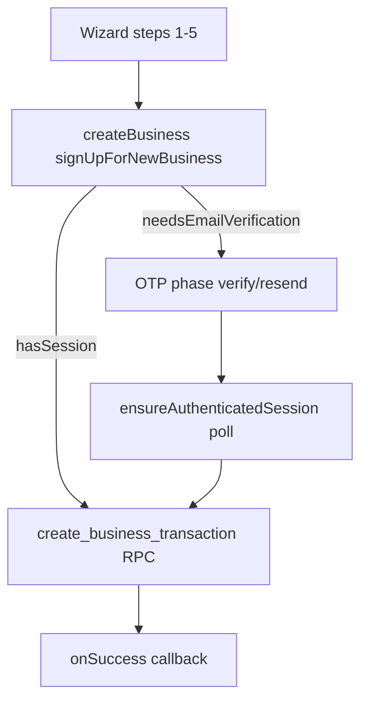

# Create Business email OTP integration review

**Commit:** `ae6c69d0`  
**Generated:** 2026-06-29

---

## Files inspected

| File | Role |
|------|------|
| `src/app/services/authSignupService.ts` | signUp, OTP verify/resend, session poll |
| `src/app/components/auth/CreateBusinessWizard.tsx` | Multi-phase wizard UI |
| `src/app/services/businessService.ts` | createBusiness + completeBusinessCreationAfterAuth |

---

## Flow coherence

| Step | Implementation | Status |
|------|----------------|--------|
| Signup | `signUpForNewBusiness` via Supabase auth | PASS |
| OTP required gate | `needsEmailVerification` → wizard `phase: otp` | PASS |
| OTP verify | `verifySignupEmailOtp` tries `signup` then `email` type | PASS |
| Session poll | `ensureAuthenticatedSession` up to 8s after verify | PASS |
| Business creation | `completeBusinessCreationAfterAuth` → RPC | PASS |
| Resend | `resendSignupEmailOtp` + 60s cooldown | PASS |

---

## Security & safety

| Check | Result |
|-------|--------|
| `service_role` in frontend | **NONE** |
| Credentials in repo | **NONE** in ae6c69d0 diff |
| Reserved system email blocked | `isReservedSystemEmail` in signup + businessService | PASS |
| Duplicate business guard | `assertUserHasNoLinkedBusiness` before RPC | PASS |
| Auth bypass | OTP + session required before RPC; no skip path | PASS |
| Existing user fallback | sign-in fallback when signup returns “already registered” | PASS — same as prior pattern |
| Password in RPC args | `p_password` passed to RPC (existing contract) | Unchanged from origin |

---

## UX / error handling

| Check | Result |
|-------|--------|
| Loading states | `loading` disables buttons; `creating` full-screen spinner | PASS |
| OTP min length | Verify disabled until `otp.length >= 4` | PASS |
| Error display | Alert banner on OTP and step errors | PASS |
| Expired OTP | Supabase error message surfaced to user | PASS — no custom expiry copy |
| Resend cooldown | 60 seconds | PASS |

---

## RPC contract preserved

`runCreateBusinessTransaction` retains origin args: business name, owner, email, password, user id, currency, fiscal dates, branch, modules, accounting/inventory bootstrap fields.

---

## Gaps / follow-up (non-blocking for push)

- **Browser QA not run** — full signup with email confirmation in Supabase project
- **Expired OTP UX** — relies on Supabase message; could add friendlier copy later
- **No regression test** for OTP wizard phases

---

## Verdict

**CODE_REVIEW_PASS** — Flow is coherent, session-gated, duplicate-business guarded, no service_role. Browser QA recommended before deploy.
