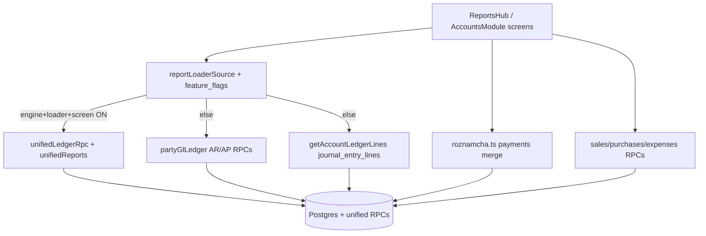

# MOBILE_ARCHITECTURE — Capacitor ERP → Single Core

## Client

`erp-mobile-app` = Capacitor WebView hosting a Vite/React SPA. Same Supabase project as web ERP.

## Data flow pattern (reports)

1. Screen state (`companyId`, `branchId`, date range)
2. `resolveReportMainLoaderSource(companyId, screenId)`
3. If unified: `rpcGetUnified*` / `loadMobile*`
4. Else: legacy GL RPC or direct table reads
5. Presentation: running balance, PDF share

## Write flow pattern

Mobile does **not** invent a separate posting engine for primary sales/purchases/payments. Canonical writes go through shared Supabase RPCs such as:

- `record_sale_with_accounting`
- `record_purchase_with_accounting`
- `record_payment_with_accounting`
- `cancel_sale_full_void` / `cancel_purchase_full_void`
- `finalize_sale_return`
- `create_expense_document`

Client-side “edit accounting” helpers (`saleEditAccounting.ts`, `purchaseEditAccounting.ts`) are residual risk surfaces (hard-coded 1100/2000) and must stay aligned with web contracts — not expanded.

## Auth / scope

- Login: Supabase session
- Company: profile / active company
- Branch: permission RPC + header filter; ledger RPCs use `safeRpcBranchId` (UUID or null = company-wide)
- Salesman: PermissionContext module gates; UI hide is not sufficient — RLS/RPC remain authoritative

## Caching

- `listCache` IndexedDB: contacts, accounts, sales/purchase lists — **not** ledger pages (`ledger` key unused)
- Offline write queue for drafts (sales/purchases), not JE fabrication
- Accounting truth must be re-fetched after writes; company/branch switch must invalidate scoped state
