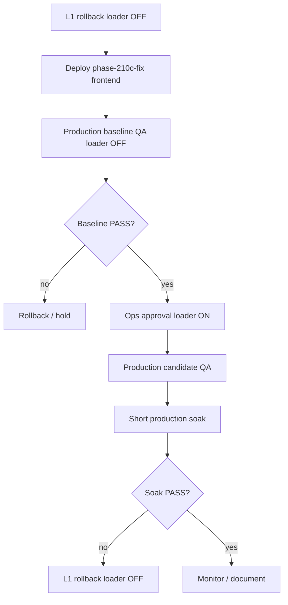

# Phase 2.10E — Production frontend deploy plan (Ledger V2 loader swap)

**Status:** `PHASE 2.10E PRODUCTION DEPLOY PLAN READY — awaiting deploy approval`  
**Timestamp (UTC):** 2026-06-26  
**Target:** `https://erp.dincouture.pk` (`erp-frontend` container)  
**Company impact:** DIN CHINA only (`30bd8592-3384-4f34-899a-f3907e336485`)  
**Screen impact:** Ledger Statement Center V2 only  
**Bundle label:** `phase-210c-fix` (preview-validated)

**NOT EXECUTED:** Production deploy, merge to main, loader re-enable, migrations, GL mutations.

---

## Executive summary — two-step safe rollout

Because `unified_ledger_loader_ledger_v2` was ON after Phase 2.10D soak, deploying loader-swap code to production **without** turning the flag OFF first would immediately switch DIN CHINA Ledger V2 main table to unified RPC.

**Mandatory sequence:**



**Pre-deploy safety (completed @ 2026-06-26T13:24:53Z):** L1 rollback applied — loader **OFF**. See [`production-predeploy-flags.json`](production-predeploy-flags.json).

---

## 1. Pre-deploy checks

| Gate | Status | Notes |
|------|--------|-------|
| Current branch | `feature/single-core-ledger-phase-2-9a3-preview-deploy-plan` @ `14cf08b3` | **Gate:** commit + push full 2.10A–C-FIX bundle before VPS deploy |
| 2.10 code in working tree | Present (partially uncommitted) | `resolveLedgerV2MainLoaderSource`, shadow invert, QA script updates |
| `npm run test:unified-ledger` | **155/155 PASS** @ 2026-06-26 | Re-run immediately before deploy |
| `npm run build` | **PASS** @ 2.10C-FIX session | Re-run before deploy |
| Production loader flag OFF | **PASS** @ 13:24:53Z | `unified_ledger_loader_ledger_v2 = false` |
| Pilot / engine / screen_ledger_v2 | ON (DIN CHINA only) | Expected Stage 2 state |
| Other screen flags | OFF | No Account Statement, TB, Roznamcha, Party Ledger, Cash/Bank |
| Other companies | Untouched | Cross-company loader guard: DIN CHINA row only, disabled |
| Migrations | **NOT RUN** | Flag-only rollout |
| GL mutations | **NONE** | |
| Staff waiver | **Documented** | See § Staff waiver below |
| Preview validation | **PASS** | 2.10B baseline, 2.10C-FIX candidate, 2.10D soak |

### Staff waiver (must re-sign before loader ON on production)

> Staff visibility remains waived because no DIN CHINA staff credentials are available. Loader flag is company-scoped and preview UI remains role-gated by existing access controls. This waiver must be reviewed again before production frontend deploy **and** before production loader enable.

### Code commit gate (before deploy)

Commit and push at minimum:

- `src/app/lib/resolveLedgerV2MainLoaderSource.ts`
- `src/app/lib/resolveLedgerV2PreviewCompareSource.ts`
- `src/app/services/ledgerStatementCenterV2UnifiedMainService.ts`
- `src/app/services/ledgerStatementCenterV2LegacyShadowPreviewService.ts`
- `src/app/features/ledger-statement-center-v2/LedgerStatementCenterV2Page.tsx`
- `src/app/features/ledger-statement-center-v2/LedgerV2UnifiedPreviewPanel.tsx`
- Tests + `package.json` test script
- `scripts/single-core-ledger/run-phase-210-loader-browser-qa.mjs`
- `scripts/single-core-ledger/phase-210*.sql`, `phase-210d-enable-loader-soak.sql`

---

## 2. Production frontend deploy (plan only — do not run until approved)

### Target

| Item | Value |
|------|-------|
| Host | `erp.dincouture.pk` |
| Container | `erp-frontend` |
| VPS path | `/root/NEWPOSV3` |
| Script | `deploy/deploy.sh` (full frontend rebuild) |
| Build label | `VITE_BUILD_COMMIT=phase-210c-fix-prod` |

### Pre-deploy on VPS

```bash
ssh dincouture-vps
cd /root/NEWPOSV3
git fetch origin <branch-with-210-code>
git checkout <branch>
git pull

# Confirm loader OFF (should already be OFF from 2.10E pre-deploy)
docker exec -i supabase-db psql -U postgres -d postgres -c \
  "SELECT feature_key, enabled FROM feature_flags
   WHERE company_id = '30bd8592-3384-4f34-899a-f3907e336485'
     AND feature_key = 'unified_ledger_loader_ledger_v2;"

# Tag rollback image BEFORE build
docker tag erp-frontend:latest erp-frontend:rollback-before-210e-$(date +%Y%m%d%H%M%S)

export VITE_BUILD_COMMIT=phase-210c-fix-prod
bash deploy/deploy.sh
```

**Do NOT** run migrations. **Do NOT** enable loader flag during deploy.

### Bundle verification (post-deploy, on VPS)

```bash
docker exec erp-frontend sh -c '
  cd /usr/share/nginx/html/assets &&
  for s in data-ledger-v2-main-loader data-ledger-v2-preview-compare-source \
           unified_ledger_loader_ledger_v2 Legacy shadow compare \
           resolveLedgerV2MainLoaderSource; do
    grep -rl "$s" . >/dev/null && echo FOUND:$s || echo MISSING:$s
  done
'
```

### Production frontend rollback (no flag change)

```bash
docker tag erp-frontend:rollback-before-210e-<timestamp> erp-frontend:latest
docker rm -f erp-frontend && docker compose up -d erp-frontend  # or equivalent from deploy compose
```

---

## 3. Post-deploy baseline QA (loader OFF)

**Execute after production deploy approval.** Target: `https://erp.dincouture.pk`

```powershell
$env:QA_BROWSER_BASE_URL = 'https://erp.dincouture.pk'
$env:QA_BROWSER_PASSWORD = '<admin password>'
node scripts/single-core-ledger/run-phase-210-loader-browser-qa.mjs baseline
```

Record results in [`production-baseline-qa.md`](production-baseline-qa.md).

| Check | Expected |
|-------|----------|
| DIN CHINA admin login | PASS |
| Ledger V2 opens | PASS |
| `data-ledger-v2-main-loader="legacy"` | PASS |
| MR JALIL closing | PKR 216,300 |
| Unified main RPC (toggle OFF) | 0 |
| Preview toggle | Manual; loads **unified_compare** |
| Export PDF/Excel/CSV | PKR 216,300 |
| Admin Compare Party MR JALIL | PASS |
| Pilot Batch | 9/9 PASS |
| Wrong screen/company flags | None |

**Gate:** Baseline QA **PASS** required before loader enable.

---

## 4. Production loader enable approval (separate ops gate)

**Only after baseline QA PASS.**

```sql
-- scripts/single-core-ledger/phase-210d-enable-loader-soak.sql
-- (update description to "Phase 2.10E production loader enable")
INSERT INTO feature_flags (company_id, feature_key, enabled, description)
VALUES (
  '30bd8592-3384-4f34-899a-f3907e336485',
  'unified_ledger_loader_ledger_v2',
  true,
  'Phase 2.10E production — Ledger V2 unified main loader DIN CHINA only'
)
ON CONFLICT (company_id, feature_key)
DO UPDATE SET enabled = true, description = EXCLUDED.description, updated_at = now();
```

Post-verify: only DIN CHINA row enabled; no other `unified_ledger%` keys beyond pilot/engine/screen/loader.

---

## 5. Production candidate QA (loader ON)

```powershell
$env:QA_BROWSER_BASE_URL = 'https://erp.dincouture.pk'
$env:QA_BROWSER_PASSWORD = '<admin password>'
node scripts/single-core-ledger/run-phase-210-loader-browser-qa.mjs candidate
```

Record in [`production-loader-enable-qa.md`](production-loader-enable-qa.md).

| Check | Expected |
|-------|----------|
| `data-ledger-v2-main-loader="unified"` | PASS |
| MR JALIL main closing | PKR 216,300 |
| Unified main-loader RPC on load | ≥ 1 (toggle OFF) |
| Preview toggle ON | `legacy_shadow` |
| `data-ledger-v2-preview-compare-source="legacy_shadow"` | PASS |
| Export PDF/Excel/CSV | PKR 216,300 |
| Admin Compare / Pilot 9/9 | PASS |

---

## 6. Production soak plan

Short monitored window (recommend **Option A: 2-hour** or business-day window).

| Checkpoint | Actions |
|------------|---------|
| T0 | Candidate QA + export sign-off |
| Mid | Flag SQL readback; MR JALIL spot-check; Admin Compare |
| Final | Full candidate QA repeat; staff waiver re-sign or staff login test |

Checks each checkpoint:

- Flags unchanged (loader ON, no extra flags)
- MR JALIL PKR 216,300
- Exports OK
- No console/RPC error spike
- No user complaint
- Non-golden party spot-check (retry entity picker)

Document in [`production-soak-notes.md`](production-soak-notes.md).

---

## 7. Rollback plan

### L1 — Loader OFF (preferred; instant legacy main)

```sql
-- scripts/single-core-ledger/phase-210-rollback-loader-ledger-v2.sql
UPDATE feature_flags
SET enabled = false, updated_at = now()
WHERE company_id = '30bd8592-3384-4f34-899a-f3907e336485'
  AND feature_key = 'unified_ledger_loader_ledger_v2';
```

**Expected:** Production main loader → legacy on next page load; MR JALIL still PKR 216,300; exports use legacy `result.rows`.

Verify:

```powershell
node scripts/single-core-ledger/run-phase-210-loader-browser-qa.mjs rollback
```

### L2 — Screen OFF

`scripts/single-core-ledger/phase-29c-rollback-screen-ledger-v2.sql`

### L3 — Engine OFF

`scripts/single-core-ledger/phase-29c-rollback-engine.sql`

### L4 — Emergency kill switch

Insert `unified_ledger_kill_switch = true` for DIN CHINA. See [`rollback-plan.md`](rollback-plan.md).

If rollback executed during production incident, create [`production-rollback-notes.md`](production-rollback-notes.md).

---

## 8. Evidence index

| Artifact | Status |
|----------|--------|
| [`production-deploy-plan.md`](production-deploy-plan.md) | **READY** (this file) |
| [`production-predeploy-flags.json`](production-predeploy-flags.json) | **DONE** — loader OFF |
| [`production-baseline-qa.md`](production-baseline-qa.md) | **PENDING** — after deploy |
| [`production-loader-enable-qa.md`](production-loader-enable-qa.md) | **PENDING** — after loader ON |
| [`production-soak-notes.md`](production-soak-notes.md) | **PENDING** — after loader ON |
| [`production-rollback-notes.md`](production-rollback-notes.md) | N/A unless rollback used |

Preview reference evidence: `baseline-loader-qa.md`, `candidate-loader-qa-rerun.md`, `controlled-soak-final.md`, `shadow-invert-fix-notes.md`.

---

## Approval checklist (ops sign-off)

- [ ] 2.10 code committed and pushed to deploy branch
- [ ] Loader flag confirmed OFF (`production-predeploy-flags.json`)
- [ ] `npm run test:unified-ledger` + `npm run build` PASS on deploy commit
- [ ] Production frontend deploy approved
- [ ] Baseline QA PASS on `erp.dincouture.pk`
- [ ] Loader enable approved (separate gate)
- [ ] Candidate QA + soak PASS
- [ ] Staff waiver reviewed or staff test completed

**Final planning status:** **A** — `PHASE 2.10E PRODUCTION DEPLOY PLAN READY — awaiting deploy approval`
