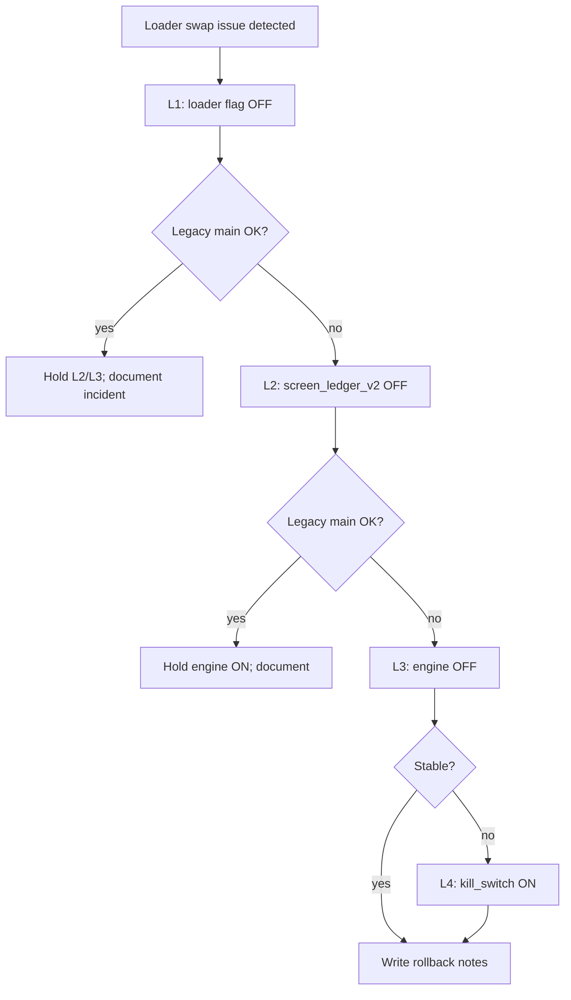

# Phase 2.10 — Ledger V2 loader swap rollback plan

**Scope:** DIN CHINA only — `30bd8592-3384-4f34-899a-f3907e336485`  
**Principle:** Rollback is **flag-only** (no deploy revert required for L1–L3). Kill switch (L4) overrides all.  
**Not executed in planning phase.**

---

## Rollback levels (apply in order)

### Level 1 — Loader swap OFF (preferred first response)

**Effect:** Main table returns to legacy `getLedgerStatementV2` immediately on next statement load. Engine + screen flags unchanged (banners/resolver stay Stage 2).

```sql
-- phase-210-rollback-loader-ledger-v2.sql (to be created at implementation)
UPDATE feature_flags
SET enabled = false, updated_at = now()
WHERE company_id = '30bd8592-3384-4f34-899a-f3907e336485'
  AND feature_key = 'unified_ledger_loader_ledger_v2';
```

**Verify:**

```sql
SELECT feature_key, enabled, updated_at
FROM feature_flags
WHERE company_id = '30bd8592-3384-4f34-899a-f3907e336485'
  AND feature_key LIKE 'unified_ledger%'
ORDER BY feature_key;
```

Expected: loader flag OFF or absent; pilot + engine + screen_ledger_v2 still ON.

**Browser:** MR JALIL closing 216,300 on legacy main table; no unified RPC with preview toggle OFF.

---

### Level 2 — Screen gate OFF

**When:** L1 rolled back but resolver/banner still causes confusion, or screen-level issue suspected.

```sql
-- Reuse: scripts/single-core-ledger/phase-29c-rollback-screen-ledger-v2.sql
UPDATE feature_flags
SET enabled = false, updated_at = now()
WHERE company_id = '30bd8592-3384-4f34-899a-f3907e336485'
  AND feature_key = 'unified_ledger_screen_ledger_v2';
```

**Effect:** `resolveUnifiedLedgerEngineState` → `legacy` mode (no unified banner eligibility).

---

### Level 3 — Company engine OFF

**When:** Unified RPC must stop entirely for DIN CHINA (preview + main).

```sql
-- Reuse: scripts/single-core-ledger/phase-29c-rollback-engine.sql
UPDATE feature_flags
SET enabled = false, updated_at = now()
WHERE company_id = '30bd8592-3384-4f34-899a-f3907e336485'
  AND feature_key = 'unified_ledger_engine';
```

**Effect:** No unified RPC (except Admin Compare shadow paths). Pilot badge may still show if pilot ON.

---

### Level 4 — DB kill switch ON

**When:** Emergency — force legacy across all unified surfaces.

```sql
INSERT INTO feature_flags (company_id, feature_key, enabled, description)
VALUES (
  '30bd8592-3384-4f34-899a-f3907e336485',
  'unified_ledger_kill_switch',
  true,
  'Emergency rollback — force legacy unified paths'
)
ON CONFLICT (company_id, feature_key)
DO UPDATE SET enabled = true, updated_at = now();
```

**Also available:** `VITE_UNIFIED_LEDGER_ENGINE_KILLED=true` build-time kill (requires redeploy — slower).

**Clear kill switch** only after root-cause review and ops approval.

---

## Keep pilot ON unless full pilot rollback ordered

Full pilot removal (Stage 1 rollback):

`scripts/single-core-ledger/phase-29b-rollback-pilot.sql`

Use only when retiring entire single-core ledger pilot for DIN CHINA.

---

## Decision tree



---

## Rollback dry-run (required before first loader enable)

| Step | Action |
|------|--------|
| 1 | Document current 3-flag state (Stage 2) |
| 2 | **Do not** enable loader in production during dry-run |
| 3 | Walk through L1 SQL on paper / staging DB clone if available |
| 4 | Confirm `phase-29c-post-stage2-flags.sql` readback template |
| 5 | Confirm browser QA script can run post-rollback |
| 6 | Record ops contact + timestamp in execution checklist |

---

## Evidence on rollback

If rollback executed, create:

`reports/single-core-ledger/phase-2-10-ledger-v2-loader-swap/stage-3-rollback-notes.md`

Include: level applied, SQL timestamps, post-rollback flag rows, browser QA result.
